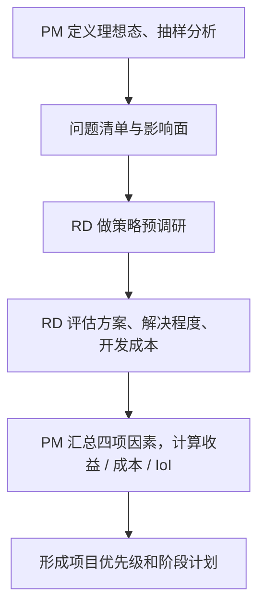
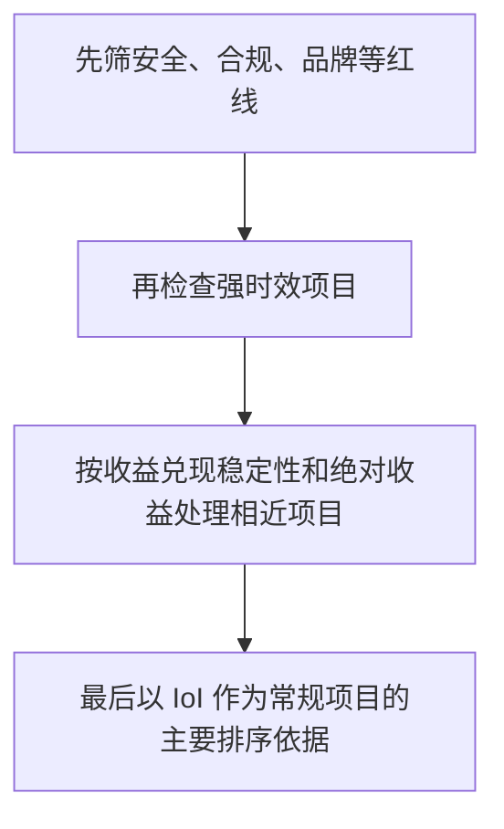

## 优先级与项目计划

[阶段性调研](05-periodic-research.md)分析完问题后，不能只交一份「当前问题列表」。完整调研应当有分析、有结论、有后续：判断优先级，确定接下来要做的项目。优先级解决的是资源有限时的选择：哪个先做、哪个暂缓、哪些要联合多个团队、哪些虽然影响面不大却因风险必须立即处理。

影响面来自[抽样分析](06-sampling.md)。例如抽样 1000 个样本、某问题有 10 个 Case，则影响面为 1%。影响面必须带着样本量、时间窗口和抽样口径，否则不同问题不能直接比较。它是发现阶段的统计描述，还不是项目收益。文中数字是教学示意。

课程给出的原则是按「单位成本下的收益」从大到小排序，排在前面的优先级高，并称之为 IoI（投入产出比）：

```text
IoI = 项目收益 ÷ 项目成本
```

IoI 是比较项目的基础。对相对独立的纯互联网项目，课程通常把研发成本作为主要成本；若结合硬件或线下团队，还要计入相应协作和落地成本。成本应由 RD 预研，不是 PM 拍脑袋。公式是教学示意，不能直接当作可上线参数。

可以把优先级理解成两层：第一层用公式把问题变成可比较的项目；第二层用红线、时效和周期稳定性做校正。缺第一层会变成谁声音大谁先做；缺第二层会变成表格暴政，把安全问题排到季度末。

### 收益的三个因子

```text
项目收益 = 待解决问题的影响面
         × 解决后的体验提升程度
         × 预期解决比例
```

| 因素 | 主要来源 | 核心问题 |
| --- | --- | --- |
| 影响面 | PM 抽样调研 | 多少用户 / 订单受影响？ |
| 体验提升程度 | 理想态与实际差距 | 解决后理论上能改善多少？ |
| 预期解决比例 | RD 策略预研 | 这个项目实际能解决多少？ |

三项来源不同，不能由 PM 一个人拍齐。影响面大但几乎无法解决的项目，不一定优先；能解决很多但只影响极少数人的项目，IoI 也未必高。体验提升对应[理想态](04-ideal-state.md)与现状的差距：调研一开始就要定义理想态，否则「提升多少」没有尺子。

量纲必须统一。若影响面是 0.10、提升程度是 0.20、解决比例是 0.50，则项目收益为 `0.10 × 0.20 × 0.50 = 0.01`。不要把百分数和小数混用。项目收益是决策估算，不是对业务指标提升的直接承诺，必须在上线后用[效果回归](../03-spec-and-validation/05-effect-review.md)验证。

```text
问题影响面 = 问题 Case 数 ÷ 有效样本数
项目收益 = 影响面 × 体验提升程度 × 预期解决比例
IoI = 项目收益 ÷ 项目成本
```

### 从问题清单到项目计划：六步

1.  **锁定问题影响面**（带口径）。
2.  **估算解决后的体验提升程度**（对照理想态）。
3.  **让 RD 评估预期解决比例**（算法、数据、系统约束）。
4.  **估算项目成本**（研发为主，必要时含硬件 / 线下）。
5.  **计算 IoI，按三条规则校正后排序**。
6.  **形成阶段计划**：负责人、协作团队、预计开始 / 完成、验证指标、依赖项。只有一个优先级字母、没有时间和验证指标，就还没有行动意义。

发现用的问题树和落地用的项目结构可以不同。交易场景可能按乘客端、策略端、跨部门、运营端重组；搜索场景可能按需求分析、排序、资源收录重组。发现框架便于识别，落地框架便于分工。排完序后进入[简单策略需求文档](../03-spec-and-validation/01-simple-prd.md)或[复杂策略需求文档](../03-spec-and-validation/02-complex-prd.md)。

### PM 调研 + RD 预研



核心关系是：PM 锁影响面、体验差距和红线；RD 锁解决比例、成本和依赖。双方用同一批问题和证据讨论。

PM 不应自行猜开发成本，也不应要求 RD 在没有清晰 Case 的情况下直接承诺解决比例。预研会议结束时，至少应拿到：可行方案方向、预期解决比例及假设、成本与依赖、主要风险和副作用。

### 三条校正规则

**IoI 相同时，看绝对收益。** 课程举例：一个 10 天产生 10 点收益的项目，和一个 2 天产生 2 点收益的项目，IoI 都是 1；通常前者绝对收益更高，优先级更高。投入产出效率相同时，优先考虑对整体结果贡献更大的项目。这不意味着后者永远不做，而是资源只能选其一时先做前者。示意数字不是真实业务测算单位。

**周期过长会降低收益兑现的稳定性。** 课程进一步假设一个 200 天产生 200 点收益的项目，并认为 20 天完成的项目优先级更高。理由是外部环境不断变化，难以保证 200 天后仍能拿到预期收益；从收益期望看，短周期项目更稳定。评估时还要看：何时开始产生收益、需求和业务环境在周期内是否可能变化、收益兑现的概率。应把这种不确定性显式记为风险，而不是把远期名义收益当作已经实现的收益。

**严重风险可以跳过 IoI 比较。** 课程用大会相关搜索词出现黄色图片作例子：内容安全 / 品牌风险极高，应高于常规项目，直接排在前面，不参加普通投入产出比 PK。即使影响面或 IoI 不高，也不能以「收益低」作为延迟理由。这是风险优先于常规效率排序，与[风控策略](../07-growth-risk-data/02-risk-control.md)的红线逻辑一致。

实际排序：



核心关系是：红线置顶，时效次之，相近项目比绝对收益和周期，其余才按 IoI。

出行成交率案例里，影响面大不代表一定最优先。排队提示改善的是等待确定性，预期解决比例可以高于「发单后提示接驾时长」：后者用户看到提示仍可能发单，真正等待时焦虑不一定被降低。匹配特征排序由算法 RD 估计解决比例；加价能补司机价值，但接驾过远仍可能引发乘客取消；抢单改指派控制力更强、预期解决程度更高，却是产品、运营和司机管理的大型联合项目。城市侧几乎没有司机，实质是供需，应走运营拉新。只改匹配解决不了供给侧缺口。

搜索案例里，「最佳结果没排第一」影响面可以很大，项目落在排序权重；无结果要分辨理解问题还是资源未收录；用户改词要分开解析错误和扩展不足。这些判断都按「影响面 × 能否解决 × 由谁解决」来做，不要按百分比从高到低机械排期。

### 评估表与计划表

| 项目 | 问题影响面 | 体验提升程度 | 预期解决比例 | 项目收益 | 开发成本 | IoI | 周期 | 风险 / 时效 | 优先级 |
| --- | ---: | ---: | ---: | ---: | ---: | ---: | --- | --- | --- |
| P-01 |  |  |  |  |  |  |  |  |  |

| 优先级 | 项目目标 | 解决问题 | 预期收益 | RD 方案 / 成本 | 负责人 | 协作方 | 开始 / 完成 | 验证指标 | 依赖与风险 |
| --- | --- | --- | ---: | --- | --- | --- | --- | --- | --- |
| P0 |  |  |  |  |  |  |  |  |  |

评估表用来排序，计划表用来执行。只有评估表没有计划表，优先级会停在一张数字表；只有计划表没有评估表，排期会回到谁声音大谁先做。预研会议上可以把评估表投到屏幕上，逐项让 RD 填解决比例和成本，PM 只锁影响面、体验差距和红线。

预研会议最小议程：

1.  共同过一遍问题清单：每个问题的理想态差距、代表 Case、影响面口径。
2.  RD 对每个问题给出：是否有可行方向、预期解决比例及假设、主要依赖。
3.  RD 给出粗成本：人天或周期，以及是否涉及硬件 / 线下 / 多团队。
4.  PM 当场计算收益与 IoI，标出红线项和强时效项。
5.  讨论 IoI 接近的项目：比绝对收益、周期稳定性、副作用。
6.  会后把评估表锁成计划表，写上负责人与验证指标。

没有第 1 步就开会，RD 只能空谈「大概能做」；开完会不落到计划表，IoI 会变成一次头脑风暴。

填表前先统一：影响面用小数还是百分数；体验提升是相对理想态的缺口，还是某个代理指标的预期涨幅；成本用「人天」还是「日历天」。三种口径混用时，IoI 会失去比较意义。课程里「10 天 10 点」「2 天 2 点」「200 天 200 点」是为了讲规则的示意数字。

三个示意数字只用来记住三句话：效率相同选贡献更大的；周期过长要打折；数字再好看也压不过红线。真实项目里「点」应替换成与理想态同一口径的缺口，例如可解决影响面，而不是另造一套无法回归的分数。

### 误区与边界

-   **只看影响面，不看能解决多少。** 影响面大但几乎无法解决的项目，不一定优先。
-   **只看 IoI，不看红线风险。** 安全、合规和品牌问题可以直接跳出常规排序。
-   **把长期名义收益当确定收益。** 周期越长，收益兑现越受外部变化影响。
-   **把研发成本当拍脑袋数字。** 成本应由 RD 预研，硬件 / 线下项目还要纳入跨部门成本。
-   **把项目收益当业务指标提升的直接承诺。** 公式是决策估算，必须在上线后回归。
-   **PM 单方面决定解决比例。** 预期解决比例需要结合算法、数据和系统约束共同评估。
-   **排序完没有执行计划。** 优先级只有在负责人、时间和验证指标明确后才有行动意义。
-   **探索项目也强行套 IoI。** 还要补充战略价值、学习价值和风险。

适合多个问题竞争有限研发资源的阶段性规划。对收益难以量化的探索项目，IoI 只能作为参考。对不可接受的安全 / 合规问题，不应等待精确收益估算。对高度依赖外部政策、市场或线下执行的项目，成本和收益不确定性要单独标明。课程公式是第一版估算，不替代财务、实验或容量规划模型。课程里用于讲解规则的示意数字不要写进真实项目的收益栏。

排完优先级后，应用一句话向团队复述每个 P0 项目：它解决哪类未达理想态、影响面口径是什么、RD 认为能解决多少、成本是什么、上线后看哪个回归指标。说不全，说明评估表还没有变成计划。PM 负责把调研证据说清，RD 负责把可解决性和成本说清，两边都到场，IoI 才有资格参与资源分配。

资源不够做完评估表上的全部项目时，按校正后的顺序往下切，直到人天用完，并明确写出「本阶段不做」的问题及其原因（IoI 低、周期过长、依赖未就绪，或红线已占用带宽）。不做清单和要做清单应一起进阶段计划，避免被临时插入的需求冲掉已经算过的优先级。

一个阶段计划最少应让研发排期、让测试知道回归看什么、让业务知道本阶段明确不做哪些事。三方看完仍在争「为什么做这个不做那个」，就回到评估表把 IoI、红线和周期再讲一遍。

锁计划前再过五问：红线是否已单独置顶？IoI 相同的项目是否比过绝对收益？超长周期是否已按兑现稳定性降权？影响面、提升、解决比例、成本是否同一量纲？每个要做和不做的项目是否都有负责人或明确搁置原因？五问都过，才把表交给排期。

### 延伸阅读

-   [理想态](04-ideal-state.md)：体验提升程度量的是与理想态的差距
-   [阶段性调研](05-periodic-research.md)：优先级判断是调研的最后一步
-   [抽样分析](06-sampling.md)：影响面从抽样 Case 中来
-   [简单策略需求文档](../03-spec-and-validation/01-simple-prd.md)：排完序之后如何写可实现规则
-   [效果回归](../03-spec-and-validation/05-effect-review.md)：估算必须用上线结果校准
-   [风控策略](../07-growth-risk-data/02-risk-control.md)：红线问题可以跳过 IoI 比较

## 来源说明

???+ note "来源说明"
    本文根据公开课程《策略产品经理》（B 站 [BV1YE411g717](https://www.bilibili.com/video/BV1YE411g717/)）整理为知识点，不是逐课笔记。

    课程中的数字、阈值和公式是教学示意，不能直接当作可上线参数。

    对应原课第 13 集。整理日期：2026-09-04。
