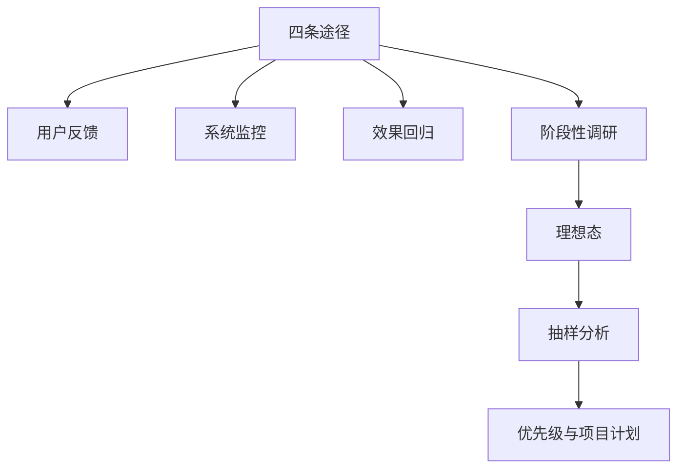

## 发现问题

策略项目的原动力是问题，方案跟在问题后面。本模块解决：问题从哪来、怎样定义「好」、怎样用样本看清原因、怎样排成下一阶段计划。

四条途径要配合：反馈给线索，监控给异常，回归检验上一版，调研看当前全貌。理想态没立住，后面的抽样和优先级都会漂。

核心关系是：先从结果走进问题，再立住可衡量的理想态，用有代表性的 Case 估计影响面，最后按单位成本下的收益排序。

### 本模块要建立的判断

结果层只看到转化率低、点击率掉了；问题层要写出哪类用户在哪一步离开、为何离开、解决后改善什么。没有问题层，监控看板再多也只是在重复播报结果。

策略问题往往一开始只表现为一个难看的数字。第一件事是判断：这个数字已经能解释原因，还是只是结果层的警报。解释不清时，优先补证据。

理想态是产品方案确实解决了用户问题，必须可衡量并服务当前阶段。简单产品可找单一指标；复杂产品不能把点击当成满足。

抽样用有代表性的 Case 近似认识群体。影响面是发现阶段的统计描述，还不是项目收益。优先级按单位成本下的收益排序，红线可以跳过比较。

### 文章列表

-   [发现问题的四条途径](01-four-channels.md)：反馈、监控、回归、调研如何分工，怎样把结果写成问题层表述
-   [用户反馈处理](02-user-feedback.md)：收集、清洗标注、形成需求、推动改进，并警惕幸存者偏差
-   [效果监控与策略监控](03-monitoring.md)：白盒看效果，黑盒看策略是否按预期运转
-   [理想态](04-ideal-state.md)：方案确实解决了用户问题；简单产品可单指标，复杂产品不能把点击当满足
-   [阶段性调研](05-periodic-research.md)：理想态、未达情况、项目计划
-   [抽样分析](06-sampling.md)：用有代表性的 Case 近似认识群体
-   [优先级与项目计划](07-prioritization.md)：按单位成本下的收益排序，红线可以跳过比较

### 四条途径如何配合

| 途径 | 特点 | 局限 | 适合回答的问题 |
| --- | --- | --- | --- |
| 用户反馈 | 随机、具体、贴近个体感受 | 不是随机抽样，难直接估计全体发生率 | 用户遇到了什么具体问题？感受如何？ |
| 系统监控 | 持续、自动、及时 | 发现异常但不能直接定位原因 | 哪个指标或环节现在异常？ |
| 效果回归 | 针对上一版本或项目 | 视野受项目范围限制 | 这次方案是否有效？有没有副作用？ |
| 阶段性调研 | 全面、系统、覆盖当前全貌 | 成本高、耗时长 | 当前产品主要问题是什么，下阶段做什么？ |

一个重要问题通常需要多个证据互相印证：反馈提供用户语境，监控发现波动，回归验证版本，阶段性调研负责全局盘点。

核心关系是：日常入口负责及时发现，版本节点检验上一方案，阶段节点形成下一计划，计划落地后再进入发现。

### 读完应判断

1.  手里是结果层警报，还是已经落到人群、环节、场景的问题？
2.  四条途径里已经有哪些证据、缺哪一类？
3.  理想态能否指导抽样和标注，点击或停留是否被误当成满足？
4.  抽样总体、实体和时间窗口是否与目标匹配？
5.  优先级是否同时看了影响面、体验提升、预期解决比例、成本和红线？

三项都含糊时，先补证据，不要直接写需求。进入项目前应收敛成一个问题层表述，表述里至少有人群、环节、场景和「解决后改善什么」。

### 和前后模块怎么接

上一模块[概念基础](../01-concepts/index.md)回答「这是不是策略、怎样写成四要素」。本模块把循环的第一阶段展开。下一模块[需求与验证](../03-spec-and-validation/index.md)把排完序的问题写成可开发需求，并用[效果回归](../03-spec-and-validation/05-effect-review.md)检验上一版本。

定义理想态到验证的通用闭环，见[策略通用方法论](../03-spec-and-validation/06-methodology.md)。评测指标与实验设计，见[评测](../../../ai/evaluation.md)。

### 何时优先启动哪一条

| 情境 | 优先途径 | 还要补什么 |
| --- | --- | --- |
| 客服集中来电、商店差评突然增多 | 用户反馈 | 用监控确认是否大盘异常 |
| 核心指标短时大幅波动 | 系统监控 | 排除埋点和口径后，再抽样定位 |
| 某版本刚上线 | 效果回归 | 同时看反馈里有没有新的副作用 |
| PM 刚接手、季度规划、旧报告已过时 | 阶段性调研 | 用监控和反馈校验结论是否仍热 |
| 低频但涉及支付、安全、误杀 | 反馈 + 专项排查 | 不能等它在监控里变成大盘波动 |

进入项目前，问题层表述至少有人群、环节、场景和「解决后改善什么」。缺一项，就还在结果层。安全、合规、资金类即使样本极少，也不能等它长成大盘再处理。

理想态写完后立刻用两个真实 Case 试标。两个人标不一致，先改定义卡，再大规模抽样。抽样先定目标再选对象；只抽已展示结果会漏掉覆盖。优先级用 IoI 作常规排序，红线置顶。课程里的样本量、阈值和「10 天 10 点」都是教学示意。

### 贯穿检查

-   **途径齐不齐**：反馈有稳定入口，监控有指标和报警，每个版本有回归，每个阶段有调研。缺任何一条，都会在某类问题上失明。
-   **尺子立不立**：理想态没写清分母和「不能等同满足的行为」，抽样和回归会一起漂。
-   **样本代不代表**：只抽已展示结果会漏掉覆盖；只抽一天会漏掉周末或月底效应。
-   **排序有没有红线**：安全、合规、资金和品牌问题可以跳过常规投入产出比比较。

### 阅读建议

按列表顺序读七篇。赶工时先读[四条途径](01-four-channels.md)和[理想态](04-ideal-state.md)，再按手头证据补[用户反馈](02-user-feedback.md)或[监控](03-monitoring.md)；做阶段规划时把[阶段性调研](05-periodic-research.md)、[抽样](06-sampling.md)和[优先级](07-prioritization.md)连起来读。

课程案例中的数字、阈值和公式是教学示意，不能直接当作可上线参数。出行成交率和搜索满足度只作方法对照。

### 延伸阅读

-   [策略产品经理专题](../index.md)：七个模块的阅读顺序
-   [策略产品经理的工作循环](../01-concepts/04-workflow.md)：发现问题是四阶段循环的第一阶段
-   [效果回归](../03-spec-and-validation/05-effect-review.md)：检验上一版本是否有效
-   [策略通用方法论](../03-spec-and-validation/06-methodology.md)：定义理想态到验证的闭环
-   [评测](../../../ai/evaluation.md)：指标与实验设计

## 来源说明

???+ note "来源说明"
    本文根据公开课程《策略产品经理》（B 站 [BV1YE411g717](https://www.bilibili.com/video/BV1YE411g717/)）整理为知识点，不是逐课笔记。

    课程中的数字、阈值和公式是教学示意，不能直接当作可上线参数。

    对应原课第 5 至 13 集。整理日期：2026-09-04。
