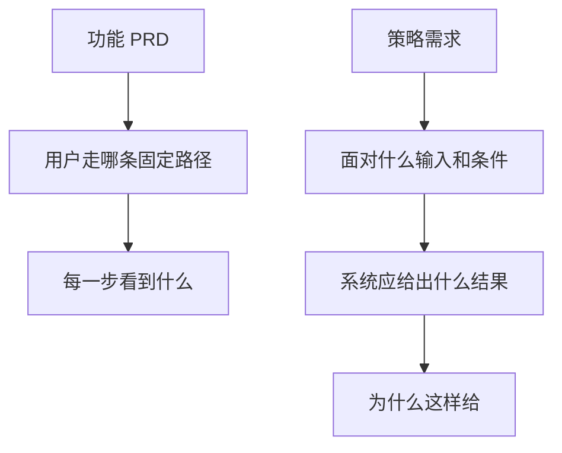

## 简单策略需求文档

需求文档让研发、测试、运营和后续回归的人对同一件事形成一致认识。读者读完应能回答：为什么现在做、要解决什么问题、什么结果才算解决、策略怎样工作、上线后要记什么和看什么。

完整文档通常包含五块：项目背景、项目目标、需求概述、需求详述、统计与监控。早期或极简项目可以把监控写轻，不能因为开发做完了就习惯性漏掉。

### 功能 PRD 与策略需求

功能产品的解决方案是收敛的：用流程、原型、页面把确定路径细化到交互。策略产品的解决方案是发散的：同一策略在不同条件下走不同分支，要靠逻辑、规则和效果示例表达。



只画页面不够。策略必须把判断链路写完整，对应[策略四要素](../01-concepts/02-four-elements.md)。

| 要素 | 文档里要回答 |
| --- | --- |
| 待解决问题 | 当前哪里没达到[理想态](../02-discovering-problems/04-ideal-state.md) |
| 输入 | 判断时能拿到哪些数据、状态、上下文 |
| 影响因素 | 哪些输入会改变输出 |
| 规则 | 如何根据输入决定结果 |
| 输出 | 给用户或下游系统的具体方案 |

分类看逻辑复杂度。几句话能说清、分支少，是简单策略，文档通常半天到一天；因素多、场景多、需要大量 Case，转入[复杂策略需求文档](02-complex-prd.md)。简单规则也可能因工程改造很重而开发很久。先看逻辑，再看成本。

### 简单策略怎么写

把问题到监控串成闭环，再写规则。


图上每一步都要能回答一个写作问题。缺任何一格，研发能实现，团队却无法后续调整。

-   **问题和目标**：当前什么问题没被解决、理想态是什么、上线后希望改变哪个结果。密码超时课例的目标是同时保障安全性和一次完整使用不被打断。
-   **能否直接写规则**：若「当满足条件 A 时，输出结果 B；否则保持原行为」已经能让研发理解主干，就可以用规则做需求详述。规则写得很短，仍要补数值来源和边界。
-   **拆成可实现字段**：输入、触发、规则、输出、边界、依据，逐项写成系统能拿到、能判断、能执行的内容。
-   **说明数字从哪来**：规则阈值很少越大越好。常见结构是两个目标对拉：安全、效率、收益希望更严，体验、转化、接受度希望更松。文档要写出平衡点。
-   **补监控**：触发次数、本应触发却未触发、用户手动绕过、目标指标、体验负向指标、阈值上线后是否回看。字段在需求阶段写进文档，见[效果监控与策略监控](../02-discovering-problems/03-monitoring.md)。

两类取数方法：

-   **已有历史数据**：分析正常使用中的间隔、结果和体验，找既不影响大多数正常流程、又满足业务底线的参数。
-   **从 0 到 1、没有自身数据**：参考已上线、有积累的成熟产品作起点，写明参考了什么、自身业务差在哪、何时用自己的数据重校准。参考不等于照抄。

### 短例：密码超时

课例是金融 / 银行类 App：超过一段时间无活动，再次使用要重新输入密码。过频会打断操作，过松增加安全风险。目标应写成：在不伤害大多数正常使用的前提下，尽量缩短安全间隔。这句话比「设成 3 分钟」更重要，它决定怎么取数、怎么评价。

机器只看到动作序列，不知道哪些动作属于同一次使用。必须先定义完整使用流程（Session），再统计间隔。课例做法：

1.  抽 100 个用户几天的行为，人工判断如何切割。任意两动作间隔大于 30 分钟时，通常已开始另一目的，于是把相邻动作间隔小于 30 分钟的一系列动作定义为一次完整使用。30 分钟是本案例的分析规则，不是所有产品通用的 Session 阈值。不能把「跨天」「没有动作」简单当流程边界。
2.  再抽 1000 个用户的使用片段，计算相邻动作间隔，画分布。课例观察：大多数间隔在 30 秒内；30 秒后明显下降；180 秒后只剩零星长尾。于是把 180 秒（3 分钟）当作较大拐点。
3.  写成规则：连续无活动超过 180 秒，再次继续使用时要求重输密码；否则保持当前验证状态。

```text
相邻动作间隔 = 后一个动作时间 - 前一个动作时间
```

判断逻辑是覆盖大多数连续使用，同时把安全等待设得尽可能短。取数看分布和拐点。不同 PM 基于同一分布也可能选 30 秒、40 秒或 180 秒。初始阈值没有唯一答案，关键是上线后看体验伤害再收紧或放宽。

文档还要与研发、测试对齐「活动」定义、计时起点、前后台、跨页、异常退出、已完成验证等边界。课例重点是数字怎么来的。没有自身历史数据时：先参考成熟产品作起点，积累足够数据后再按自身用户习惯校准。

### 文档大纲

```markdown
# 需求名称

## 1. 项目背景
- 当前问题、为什么现在解决、数据 / 反馈 / 参考来源

## 2. 项目目标
- 用户理想态、核心目标指标、体验约束或负向指标

## 3. 需求概述
- 策略做什么、触发条件、输出结果

## 4. 需求详述
### 4.1 输入
### 4.2 条件与规则
### 4.3 输出
### 4.4 边界和兜底
### 4.5 规则数值来源

## 5. 统计与监控
- 触发量、目标指标、负向指标、关键日志字段、上线后回归时间
```

| 参数 | 候选值 | 目标收益 | 可能损失 | 证据来源 | 课例选择 |
| --- | --- | --- | --- | --- | --- |
| 无操作重验间隔 | 30 秒 / 40 秒 / 180 秒 | 更快重验、更安全 | 可能打断连续使用 | 间隔分布、人工 Session 分析 | 180 秒 |

```text
重验触发率 = 触发重新验证的使用流程数 ÷ 有效使用流程数
连续流程被打断率 = 被重验打断且随后继续使用的流程数 ÷ 触发重验流程数
安全目标覆盖率 = 达到安全要求的高风险会话数 ÷ 高风险会话总数
```

以上是把方法落成表格的示例。具体口径要结合产品安全定义确认，不要把课例数字直接当线上基线。

### 常见误区

1.  用功能 PRD 的页面原型写策略。核心是条件、规则、因素和输出。
2.  只写「设置为 3 分钟」，不写目标和依据。
3.  把简单策略理解成可以不写文档。简单的是逻辑，沟通仍然重要。
4.  用开发成本给策略分类。先看逻辑复杂度。
5.  直接把「无操作」当成一次使用结束。必须先定义 Session。
6.  用平均间隔代替阈值。课例看的是分布和拐点。
7.  忽略安全与体验的冲突。规则通常是两个目标的平衡点。
8.  没有数据时假装规则很精确。可以参考成熟产品，但要标注参考性质并约定校准。
9.  只写主路径，不写边界。前后台、跨午夜、多次打开、异常退出都会改计时口径。
10. 把监控当成开发完成后的补丁。统计字段应在需求阶段约定。

适合规则直接、条件少、PM 能清晰表达的策略。分支、因素、特例很多时，转入[复杂策略需求文档](02-complex-prd.md)。安全类策略还要满足安全 / 业务最低要求。竞品参考只适合 0 到 1 的起步。课例的 30 分钟 Session、100 / 1000 样本和 3 分钟阈值只属于该案例。

写完需求后进入开发，用[开发评估](03-dev-evaluation.md)和[效果回归](05-effect-review.md)检查规则是否真的落在当初写的平衡点上。

### 延伸阅读

-   [策略四要素](../01-concepts/02-four-elements.md)
-   [理想态](../02-discovering-problems/04-ideal-state.md)
-   [效果监控与策略监控](../02-discovering-problems/03-monitoring.md)
-   [复杂策略需求文档](02-complex-prd.md)
-   [开发评估](03-dev-evaluation.md)
-   [策略通用方法论](06-methodology.md)

## 来源说明

???+ note "来源说明"
    本文根据公开课程《策略产品经理》（B 站 [BV1YE411g717](https://www.bilibili.com/video/BV1YE411g717/)）整理为知识点，不是逐课笔记。

    课程中的数字、阈值和公式是教学示意，不能直接当作可上线参数。

    对应原课第 16 集。整理日期：2026-09-04。
