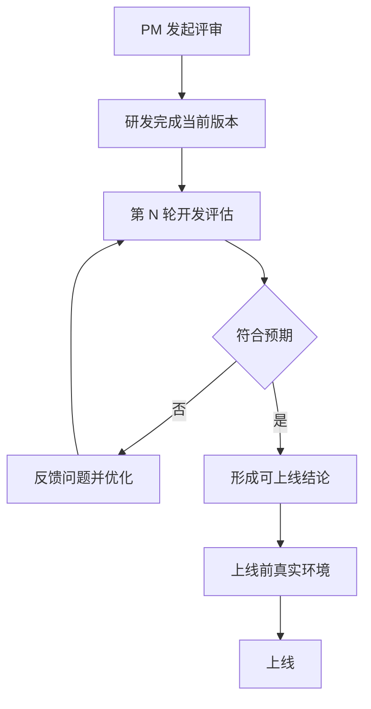
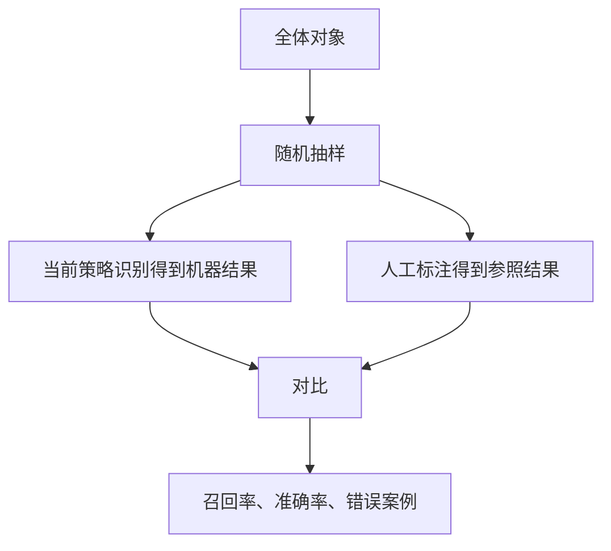

## 开发评估

策略评估判断当前版本是否达到上线标准。功能测试多问按设计能否工作、严重缺陷修了没有。策略还要看大量案例的判断质量、对系统的影响、用户体验是否变化。评估过程可能比正式开发还长。少量案例好看，不代表放进完整系统一定有效。

复杂策略开始时往往不知道最终该长成什么样。多轮评估把不可一次确定的问题，拆成连续的假设、验证、修正。每轮减少一部分不确定性。这与[策略通用方法论](06-methodology.md)同一套循环，粒度落到版本和案例。评测集、线上指标和实验设计的工程细节，见[评测](../../../ai/evaluation.md)。



### 每轮必须有结论

评估至少产出三类结论：是否符合预期；不符合时错在哪些案例或环节；下一步是改策略、补样本、优化性能，还是继续观察。

```text
版本 / 评估轮次 / 评估范围 / 评估目标
评估方法：质量评估 / 效果评估 / 两者都有
评估结论：符合预期 / 部分符合 / 不符合
主要问题、问题案例或样本、问题影响
需要研发修改的内容、下一轮评估标准、是否达到上线标准
```

一轮没过不等于项目失败。复杂策略本来就可能需要多轮；第一版不完美是常态。

### 质量评估与效果评估

策略处在多元、复杂的系统里：输入对象不同、规则 / 模型不同、与其他策略相互作用、用户反应不同、整体流程会放大或抵消结果。局部质量好，整体效果不一定好。课例：某策略扩大覆盖，但新增的恰好是时效性需求，而产品其他环节对这类内容的处理并不理想，用户最终感受到的整体效果可能变差。

| 类型 | 核心问题 | 典型方法 | 典型结论 |
| --- | --- | --- | --- |
| 质量评估 | 每个个案判断得对不对 | 策略结果与人工标注对比 | 召回率、准确率、错误案例 |
| 效果评估 | 放进真实系统后整体变好了吗 | 上下线对比、体验和系统指标 | 整体收益、局部损害、协同问题 |

质量评估看策略本身。课例用军事类新闻识别：该找的军事新闻有没有找全，有没有把其他类别错标成军事。效果评估看策略在系统中的位置、上线前后真正发生了什么、用户看到的结果是否更符合需求。搜索、推荐都是多策略共同作用。

两者都要做。只有质量好但效果差，仍然要继续分析：是上下游没接上，还是新增对象根本不该被覆盖。效果层的 Diff 写法见[Diff 评估](04-diff-evaluation.md)；上线后的系统指标见[效果回归](05-effect-review.md)。

### 召回率与准确率

适用于有明确目标标签的识别、分类、召回类策略。目标本身无法定义时，先解决标注口径，不能直接套公式。

```text
召回率 = 实际被策略覆盖的目标对象数 ÷ 全部应被覆盖的目标对象数
准确率 = 策略覆盖对象中真正属于目标的对象数 ÷ 策略覆盖对象总数
召回率 = TP ÷ (TP + FN)
准确率 = TP ÷ (TP + FP)
```

召回率回答：该找回来的，漏了多少。课例：希望识别出的军事新闻中策略只识别出 80%，仍有 20% 漏掉。准确率回答：找出来的里有多少是对的。课例：识别出 100 条「军事」，准确率 90%，则 10 条不是，拿去推荐会伤体验。

两个指标通常对拉：放宽条件，漏得少但误召回多；收紧条件，结果更干净但漏掉边界对象。平衡点由项目目标决定：本次主要提覆盖，还是主要减错误覆盖。

|  | 人工为目标 | 人工非目标 |
| --- | --- | --- |
| 策略判为目标 | 真阳性 TP | 假阳性 FP |
| 策略判为非目标 | 假阴性 FN | 真阴性 TN |

课例用 20 人识别男生帮助建立直觉：全部男生 10 个，策略框到其中 6 个，召回率 6/10 = 60%；一共框出 9 人，其中真男生 6 个，准确率 6/9 约 66.7%。分母不同，不能混用。课例没有展开混淆矩阵术语，但反复区分「漏掉目标」和「误覆盖非目标」。

### 从小样本到大规模

20 人可以逐个数；线上往往几十万、上千万，无法逐个检查。用随机抽样估计总体。



四步：从全体随机抽，避免只挑好判断的；把样本交给当前版本得到机器判断；对同一批做人工作为参照；对比计算指标。人工标注费力，样本量不能无限扩大。抽样只能估计总体，不能替代全量监控。

电商用户性别识别课例：从全部用户随机抽 1,000 人；跑策略；结合订单、浏览、消费等行为人工判断；对比后算召回率和准确率。人工参照不是绝对真值。一部分用户行为非常模糊，即使看过订单、浏览、注册也无法判断性别。

灰色样本不能强行当正例或负例：不能因为策略召回了就当男性，也不能因为没召回就当女性。单独标记「无法判断」，并在指标里写清处理方式。课例结尾在排除 / 单独处理后，示例召回率约 81.6%、准确率约 91.3%。这些数字是说明计算路径的示例，不是线上通用基准。

| 样本状态 | 机器判断 | 人工判断 | 处理建议 |
| --- | --- | --- | --- |
| 明确目标对象 | 召回 / 未召回 | 是目标 | 可用于召回率 |
| 明确非目标对象 | 召回 / 未召回 | 非目标 | 可用于准确率 |
| 人工无法判断 | 召回 / 未召回 | 不确定 | 单独统计，不强行归类 |

### 报告骨架

```markdown
# 开发评估报告：项目名称 / 版本号

## 一、评估背景
- 本轮版本、要验证的假设、评估范围

## 二、质量评估
- 抽样方法、标注标准、可判断 / 无法判断样本数
- 召回率、准确率、典型漏召回与误召回

## 三、效果评估
- 策略在完整系统中的位置、上下游
- 用户最终看到的结果、版本间整体变化、是否局部变差

## 四、结论
- 符合预期 / 部分符合 / 不符合
- 未解决问题、新风险、是否达到上线标准、下一轮方案
```

检查清单：本轮评估的是哪个版本；对象和样本范围是否明确；评的是质量、效果，还是两者；人工参照标准是否明确；随机样本能否代表总体；是否单独标记灰色样本；召回率和准确率的分子、分母是否写清；是否记录了错误案例，而不只一个总比例；是否定义了下一轮优化和上线标准。

### 常见误区

1.  把开发完成当成评估完成。交付只代表可被评估。
2.  一轮没过就认为项目失败。
3.  只看策略本身，不看系统效果。
4.  只看准确率，不看漏了多少目标。准确率高可能只是策略很保守。
5.  把召回率和准确率的分母弄反。
6.  用方便但不代表总体的样本。
7.  强行给灰色样本贴标签。
8.  只报一个总比例，不看错误案例。总比例告诉你大小，案例告诉你为什么错。
9.  把课例数字（20 人、60%、66.7%、81.6% / 91.3%）当成必须达到的通用标准。实际标准由产品目标、风险和上下游决定。

召回率 / 准确率适合有明确目标标签的策略。人工标注不是天然绝对正确。随机抽样不能替代全量监控。质量评估不能替代效果评估。召回与准确的平衡取决于项目目标，课例没有给出可迁移阈值。多轮评估必须记录版本和变更范围，否则下一轮无法归因。

评估、改、再评估，直到达到需求里写的上线标准。需求侧对应[简单策略需求文档](01-simple-prd.md)与[复杂策略需求文档](02-complex-prd.md)；样本方法对应[抽样分析](../02-discovering-problems/06-sampling.md)。

### 延伸阅读

-   [简单策略需求文档](01-simple-prd.md)
-   [复杂策略需求文档](02-complex-prd.md)
-   [抽样分析](../02-discovering-problems/06-sampling.md)
-   [Diff 评估](04-diff-evaluation.md)
-   [效果回归](05-effect-review.md)
-   [评测](../../../ai/evaluation.md)

## 来源说明

???+ note "来源说明"
    本文根据公开课程《策略产品经理》（B 站 [BV1YE411g717](https://www.bilibili.com/video/BV1YE411g717/)）整理为知识点，不是逐课笔记。

    课程中的数字、阈值和公式是教学示意，不能直接当作可上线参数。

    对应原课第 18 集。整理日期：2026-09-04。
