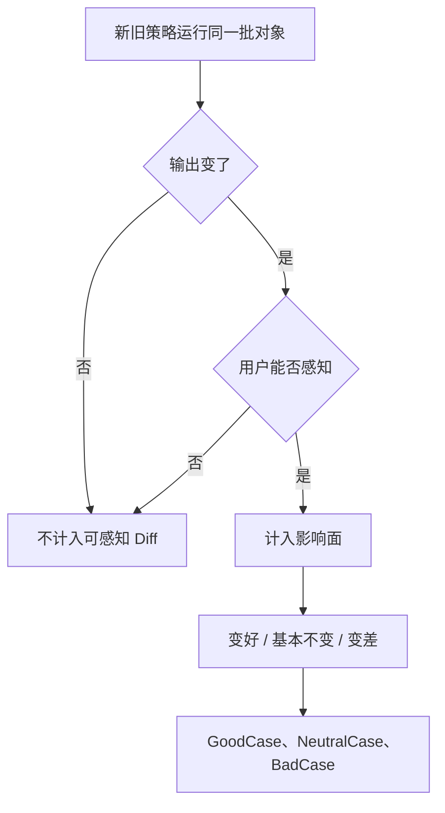

## Diff 评估

Diff 问新旧策略让用户最终看到的结果变了多少、这些变化是好是坏，再决定能不能上线。搜索里用户看到的是需求识别、召回、排序、展现共同作用的结果；推荐同样经过抓取、分类、画像、排序、展现。一个策略单独质量很好，放进系统后可能与其他策略配合产生收益，也可能影响很小，也可能与其他模块冲突导致整体变差。

[开发评估](03-dev-evaluation.md)里的质量评估用召回率 / 准确率对照目标标签；Diff 回答的是变更带来的可感知变化。两个必须一起看的指标：影响了多少对象（策略影响面）；这些变化是好是坏（GoodCase / BadCase 分布）。



影响面很小，即使好案例比例很高，总体收益也可能有限；影响面很大但坏案例也多，等于扩大风险；影响面较大且好案例明显多于坏案例，才更有理由推进，但仍要看坏案例严重度和业务容忍度。

### 影响面：只算用户能感知的变化

```text
策略影响面 = 用户可感知结果发生变化的对象数 ÷ 全部评估对象数
```

它回答这次改动影响了多少人。课例：某个特征权重调整后，很多候选都加了 5 分，但若原来前十都含该特征，统一加分后排序不变，用户可感知的排序影响面为 0。另一种情况：候选之间分差都大于 5 分，加 5 分仍超不过前面的结果，排序依旧不变。评估必须比较最终可感知输出，不能只比中间分数。

再如：原来分值都是整数，把某特征从 1 改成 1.5。若没有任何两条结果只差 0.5 分，排序仍不变，影响面仍是 0。不要因为改了一个参数就默认有用户收益；要确认是否跨过系统的实际决策边界。不改变展现、排序、召回或后续行为，就没有明确的用户收益。

影响面通常可由研发直接跑：同一批对象分别进调整前 / 后策略，比较最终输出。PM 需对齐：新旧输入是否完全一致；比较的是哪个最终输出；「发生变化」的判断条件；是否保留对象 ID 便于后续人工抽评。配置覆盖面不等于用户影响面。

### GoodCase / BadCase 比例

影响面只说明有多少变化，不说明对用户是好是坏。要从发生变化的对象中随机抽样，人工同时看旧结果和新结果，按体验判断方向。档位按精度需要选：三档（变好 / 无明显变化 / 变差）、五档或七档。

| 结果 | 含义 | 典型问题 |
| --- | --- | --- |
| GoodCase | 新结果更符合目标或更满足用户 | 新策略解决了旧策略的问题 |
| NeutralCase | 新旧对体验基本无差异 | 分数变了但最终排序没变 |
| BadCase | 新结果引入错误或体验损害 | 误召回、误推荐或漏掉更好结果 |
| Unclear | 信息不足，无法可靠判断 | 不应强行算成好或坏 |

```text
GoodCase 占比 = GoodCase 数 ÷ 全部 Diff 样本数
BadCase 占比 = BadCase 数 ÷ 全部 Diff 样本数
GoodCase : BadCase = GoodCase 数 : BadCase 数
GoodCase 净优势 = GoodCase 数 - BadCase 数
```

报告必须写明分母：是全部抽样对象，还是已发生可感知变化的对象。不要把「所有样本中的占比」和「变化样本中的占比」混用。GoodCase 比例也不是准确率：前者是新旧差异的方向，后者是策略与目标标签的质量。

| 影响面 | 好坏分布 | 初步判断 |
| --- | --- | --- |
| 小 | 好案例多 | 可能低风险、低收益 |
| 大 | 好案例多 | 可能有明显收益，继续查坏案例严重度 |
| 小 | 坏案例多 | 总体伤害有限，但项目收益不成立 |
| 大 | 坏案例多 | 风险较高，通常不能直接上线 |

最终还要结合项目目标、好坏案例的业务价值、是否存在不可接受的严重问题、修坏案例的成本、行业容错度。

### 大规模对象怎么评

对象可能几十万、上千万，无法逐个比较。五步：从全体随机抽，保持分布；同一对象必须在完全一致的输入下分别跑新、旧策略；先机器统计 Diff，只改中间分数、不改最终输出的不算用户影响；对变化样本站在体验角度判断；统计样本总数、可感知变化数、好 / 中 / 坏 / Unclear、典型案例、是否存在单个严重坏案例。

### 短例：性别识别与菜品辣椒油

**性别识别。**目标是根据订单、浏览、搜索、收藏等行为识别男女。课例随机抽 1,000 人分别进新旧策略，210 人结果不同，影响面 210/1000 = 21%。对这 210 人人工看行为：旧错新对记 GoodCase，旧对新错记 BadCase，真实属性无法判断记 Unclear。课例约 135 个 GoodCase、约 24 个 BadCase，其余含无法判断。只用明确好坏做方向比较，可写成 GoodCase : BadCase 约 135 : 24。不要把 135/210 直接当新策略准确率。

灰色样本常见于家庭购物：妻子可能给丈夫买衣服，行为混合后很难推断账号性别。机器不确定表示当前信息撑不起可靠标签。产品决策上，给无法判断的用户留空标签（男 / 女 / 空），往往优于强行填满：后续男女定向策略不强加于这类用户。标签服务的是业务目标。

**菜品加辣椒油。**配置上看「所有菜都加」覆盖可能是 100%，但有的菜加了变化明显，有的本身味道已够、差异很小，课例实际可感知影响面约 80%。品尝分布课例约为 30 : 10 : 4（好 / 中 / 差三项；视频未钉死分母，只作分布示例）。大多数可能适合，但部分用户不吃辣会造成负面。餐饮是低容错行业：影响面较大且 GoodCase 较多，也不等于可以无条件全量上线。BadCase 若造成明显、不可接受的损害，尤其集中在某类用户或某类菜，应分场景处理或继续优化。

### 从 Diff 结果到能不能上线

评估仍走同一套方法：定义理想态、拆未达、提方案、验证。开发评估侧重后三步。对照需求里的理想态找问题。两类问题：覆盖不足、错误覆盖。不要只留一张 BadCase 截图。用[抽样分析](../02-discovering-problems/06-sampling.md)汇总：问题是什么、共同特征、出现场景、可用什么思路解决。写法接近[复杂策略需求文档](02-complex-prd.md)：不仅写哪里不合适，还写在什么情况下、对应哪个特征、新的应用方式。

老问题看投入产出：若项目就是为解决三个问题、把召回做到 80%，达到后可以考虑上线；剩余问题成本极高、超出预期，可先上线拿收益、留给后续；开发中发现的另一个问题若顺手成本很低，也可以纳入。新问题通常更优先：它由本次改动引入，严重度更高，但原因也更明确、相对好定位。

能不能带着问题上线，看体验判断，不能只看比例。严重且不可接受（如导致 App 崩溃），当前版本必须解决；轻微且修复成本高（如参数还需左右微调），可评估先上线，后续版本解决。一个比例很小但后果极恶劣的 BadCase，也可能阻止上线。

课例用图形策略演示：第一轮与理想差距大，既有未覆盖也有错误覆盖；发现简单线性规则盖不住不同形态的点，转向更复杂规则，第二、三版继续评，直到可接受。具体点数与曲线类型课例识别不稳定，只保留「从简单规则到更复杂规则、多轮复评」的方法。

| 判断项 | 决策倾向 |
| --- | --- |
| 原始目标是否达成 | 未达成则继续优化 |
| 影响面是否足够大 | 太小则收益可能有限 |
| GoodCase 是否明显多于 BadCase | 否则检查方案与风险 |
| 是否存在严重 BadCase | 有则当前版本必须处理 |
| 剩余问题修复成本 | 成本高且影响轻微，可评估后置 |
| 新问题是否由本次引入 | 新问题通常优先解决 |

低容错业务（支付、安全、餐饮课例）要把「不可接受的单个 BadCase」写成上线拦截条件。

### 常见误区

1.  看到中间分数变化就认为用户受影响。统一加分但排序不变，影响面应为 0。
2.  只算影响面，不判断好坏。「影响了 21%」不能说明成功。
3.  把配置覆盖面当成用户影响面。
4.  把 GoodCase 比例当作准确率。
5.  忽略 NeutralCase，夸大好坏比例。
6.  把人工无法判断的对象强行归类。
7.  只看数量，不看坏案例严重度。
8.  样本不是随机的。
9.  只列问题，不抽象共同特征和下轮方向。
10. 为了标签完整而强行填值。

适合有新旧版本、能在同一输入上重放的策略。影响面必须建在最终可感知输出上。灰色对象不能强行进正负样本。Diff 不能替代召回率 / 准确率。影响面大不一定收益大；影响面小不一定无价值。比例不能替代严重度。多轮必须记录版本差异。上线后的系统级验证交给[效果回归](05-effect-review.md)。

### 延伸阅读

-   [开发评估](03-dev-evaluation.md)
-   [复杂策略需求文档](02-complex-prd.md)
-   [抽样分析](../02-discovering-problems/06-sampling.md)
-   [效果回归](05-effect-review.md)
-   [策略通用方法论](06-methodology.md)

## 来源说明

???+ note "来源说明"
    本文根据公开课程《策略产品经理》（B 站 [BV1YE411g717](https://www.bilibili.com/video/BV1YE411g717/)）整理为知识点，不是逐课笔记。

    课程中的数字、阈值和公式是教学示意，不能直接当作可上线参数。

    对应原课第 19 集。整理日期：2026-09-04。
