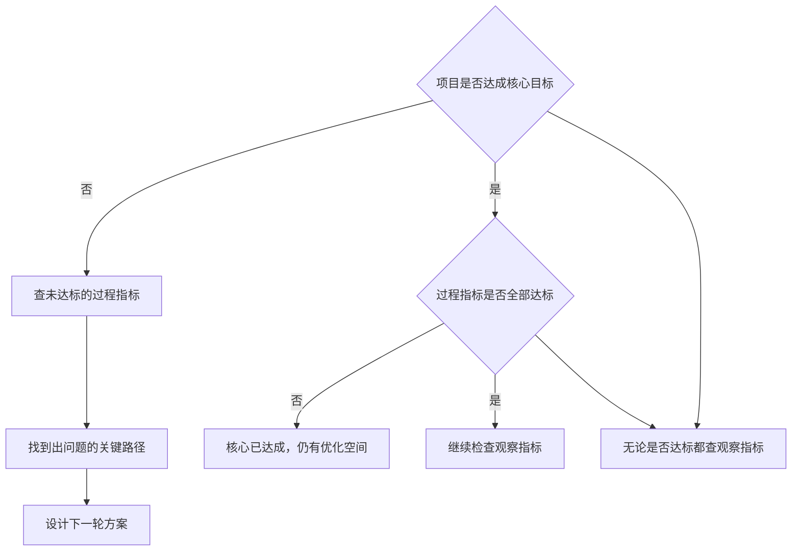
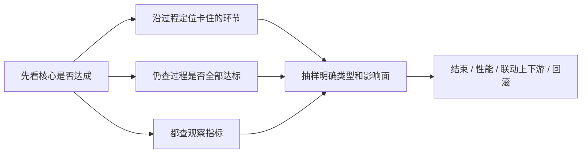

## 效果回归

效果回归用事先定义的核心、过程、观察指标，回答达标没有、还能优化什么、有没有引入新问题。策略工作不是需求开发完就结束。一个项目上线后至少三种情况：目标达成但仍有过程环节未达预期；目标达成却伤害了另一类参与者；目标没达成。没有回归，容易把波动当成功，失败时只凭感觉猜原因。

相对[阶段性调研](../02-discovering-problems/05-periodic-research.md)对产品或模块做全局体检，效果回归针对某一个具体项目，指标要更细，必须把来龙去脉、关键过程和可能受伤害的对象纳入观察。



三个问题有先后：这次有没有解决问题或达成目标；如果达成了，有没有进一步优化空间，或有没有引入新问题；如果有优化空间或新问题，分别用什么手段。第一个答案是「没有」时：第二问改成为什么没达成，第三问改成要达成接下来做什么。

### 启动前就把理想态写成可回收指标

回归贯穿项目前、中、后：上线前明确目标和指标；开发中用评估确认方向；上线后看真实系统。不要上线后再临时定标准。目标卡片至少写：核心问题、目标对象、要改变的路径、预期核心结果、判断时间窗口、达标条件、可能受影响的其他对象。

-   **核心指标**：项目最终要解决什么。必须直接对应最终目的，不要只挑一个容易变好的中间数。课例：打车目标是把用户送到目的地，核心就是到达目的地的比例。
-   **过程指标**：实现目标要经过哪些关键路径。每个环节的比例都要够大，用户才能进入下一环节。打车课例链：发单后未取消、有司机接单、行程未取消、接到乘客、开往目的地、到达。
-   **观察指标**：新路径伤害了谁。每个项目都可能改旧策略、加新策略或加配合功能，用户走新路径，代价可能由另一类参与者承担。课例：为召回更多司机把最远听单距离从 2 公里扩到 3 公里，需观察听单距离、接驾距离，以及乘客是否等更久。追问谁的行为被改变、谁承担新成本、哪个体验可能变差。

埋点必须写进需求。常见事故是上线后才发现想要的数据没统计。每个核心指标能否直接计算、每个环节是否有进入 / 成功 / 失败事件、观察对象能否识别、口径和分母是否写清，这些在[简单策略需求文档](01-simple-prd.md) / [复杂策略需求文档](02-complex-prd.md)阶段就要对齐。

### 全流量同比还是小流量 AB

**全流量：**核心 / 过程 / 观察主要与本项目相关，上线前评估很好、确定性很强，没有明显反向案例，数据变化原因可追溯到本项目，希望尽快让全量获得收益。回归方式是与上一周期同比，例如周三上线，就把本周三至周五分别与上周对应日比较。全流量不等于不做评估。

**小流量 AB：**效果不确定、面向复杂系统，或指标可能被项目外因素拉动。两层原因：控制伤害；实验流量与对照同步运行，隔离外部因素。课例做法是同时抽 10% 实验和 10% 对照（示例比例，不是固定标准），实验用新策略、对照用老策略，跑若干天再比。

分流必须真随机。课例：用手机号尾号「看起来像随机」，只取尾号为 1，因号段和选号偏好，实际只占约 6%，不是随机时应接近的 10%。上线前检查各桶占比、用户结构和历史行为。

即便随机，样本不是无限大时两组也可能有天然差异。课例：两批各 5% 用户，上线前点击率可能是 3% 和 3.2%；若策略真实提升也只有 0.2 个百分点，会把误差当效果。资源允许时，先抽两组不放新策略空跑一段时间（课例五天），估计天然差异，正式回归时剔除。小流量只能降低影响范围，不能自动保证结论正确。

| 判断问题 | 倾向 |
| --- | --- |
| 确定性很强、原因可追溯到项目、背景不复杂、伤害可控、分流已确认随机 | 可考虑全流量同比 |
| 不确定、系统复杂、可能不可控伤害、分流或基线未确认 | 小流量 AB，必要时先空跑 |

### 上线后沿指标决策

先按上线前的定义判断，不要见数后改目标。

```text
环节成功率 = 进入下一环节的对象数 ÷ 进入本环节的对象数
核心达成率 = 达成最终目标的对象数 ÷ 进入目标流程的对象数
相对变化率 = (本期指标 - 对照指标) ÷ 对照指标
```

使用时必须写明分母和统计时段。核心未达标：沿关键路径找未达标的过程指标，定位环节，明确问题，再定方案。核心达标但过程未全部达标：该环节仍有优化空间，未必立刻挡住最终结果，却可能成为后续扩量或环境变化中的瓶颈。无论核心是否达标，都查观察指标，把收益和代价放在一起看。

异常要用[抽样分析](../02-discovering-problems/06-sampling.md)变成问题清单：问题是什么、有哪些类型、分布如何、影响面多大，再按成本与收益排下一轮计划。效果已经很好时，通常不必做与未达标同等规模的人工拆解，先看统计，未达标再抽样。这与[效果监控与策略监控](../02-discovering-problems/03-monitoring.md)的日常看数衔接，但回归更贴具体项目。

### 短例：搜索建议降低输入时长

搜索建议（SUG）帮助降低输入成本，「建议出现了」不等于体验变好。课例启动前写清：目标是降低输入成本；核心指标是用户输入时间，预期降低 2 秒；路径是建议展现、更早展现、用户点击；风险是点击建议后完整 query 的搜索满足度下降。

因需求会随外部事件波动，课例用小流量（实验 / 对照各 10%）并提前空跑。上线后实验组输入时间相对对照降低 1.2 秒，有收益但低于 2 秒预期。过程上，平均输入长度变短（符合），展现率变低（相反），点击率无变化（未达预期）。观察上，SUG query 的搜索满足度下降。

抽样定位：检索模块重构后，长词、多 term 场景加载过慢，建议来不及出现；召回侧对热门候选做了需求扩展，长 query 检索结果往往更差，需与搜索排序联动。1.2 秒与 2 秒、各 10% 流量都是该项目设置，不是通用阈值。

| 指标 | 预期 | 课例结果 | 下一轮 |
| --- | --- | --- | --- |
| 用户输入时间 | 降低 2 秒 | 降低 1.2 秒 | 查过程 |
| SUG 展现率 | 提升 | 下降 | 性能优化 |
| 平均输入长度 | 变短 | 变短 | 继续监控 |
| SUG 点击率 | 提升 | 无变化 | 查召回 / 排序 |
| SUG query 满足度 | 不下降 | 下降 | 联动基础 Rank |

观察指标从角色和上下游倒推：列出项目直接满足的角色；改 A 时可能伤害谁；画出单一角色的完整使用流程；标出项目直接覆盖的环节；检查覆盖范围下游是否出现新影响。SUG 只有用户这一个直接角色，所以观察落在输入之后的搜索结果。

### 决策路径



先看核心目标是否达成。未达成：沿过程指标找到卡住的环节，抽样后开下一轮。已达成：仍查过程指标是否全部达标（有优化空间也不等于必须立刻改）。无论是否达成：都查观察指标。用抽样明确问题类型、分布和影响面，按成本与收益决定：结束本轮循环、性能项目、联动上下游、或回滚。

「暂时中止」只表示本项目阶段性目标完成。环境一变或观察指标报警，再开新循环。方法总图见[策略通用方法论](06-methodology.md)。

### 常见误区

1.  上线后才想目标。
2.  只看核心，不看过程。未达标时找不到环节；达标时错过仍可优化的过程。
3.  只看收益，不看谁承担代价。
4.  把方便字段当随机分流。
5.  忽略两组上线前差异；提升小于基线差时把误差当效果。
6.  指标定了但埋点没写进需求。
7.  把达标当成所有问题结束。
8.  看到有收益就结束回归。课例 1.2 秒说明有收益，但仍低于预期，且过程、观察已报警。
9.  为满足需求盲目扩展 query，不顾下游结果质量。
10. 效果回归一开始就大规模人工抽样。先看统计，未达标再拆。

全流量同比适合因果关系较清晰的项目；外部因素复杂时要用对照。AB 结论依赖分流和可比性。观察指标应围绕新路径和可能受影响对象。指标只能标异常，原因仍靠抽样。SUG 课例的 term 切分、满足度、10% 流量都不能直接照抄。

### 延伸阅读

-   [效果监控与策略监控](../02-discovering-problems/03-monitoring.md)
-   [阶段性调研](../02-discovering-problems/05-periodic-research.md)
-   [理想态](../02-discovering-problems/04-ideal-state.md)
-   [抽样分析](../02-discovering-problems/06-sampling.md)
-   [开发评估](03-dev-evaluation.md)
-   [Diff 评估](04-diff-evaluation.md)

## 来源说明

???+ note "来源说明"
    本文根据公开课程《策略产品经理》（B 站 [BV1YE411g717](https://www.bilibili.com/video/BV1YE411g717/)）整理为知识点，不是逐课笔记。

    课程中的数字、阈值和公式是教学示意，不能直接当作可上线参数。

    对应原课第 20、21 集。整理日期：2026-09-04。
