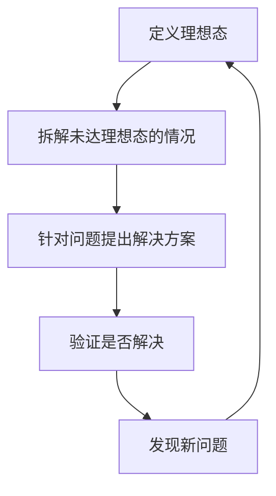
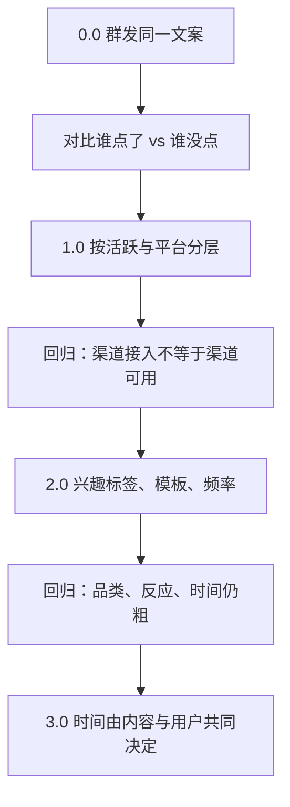
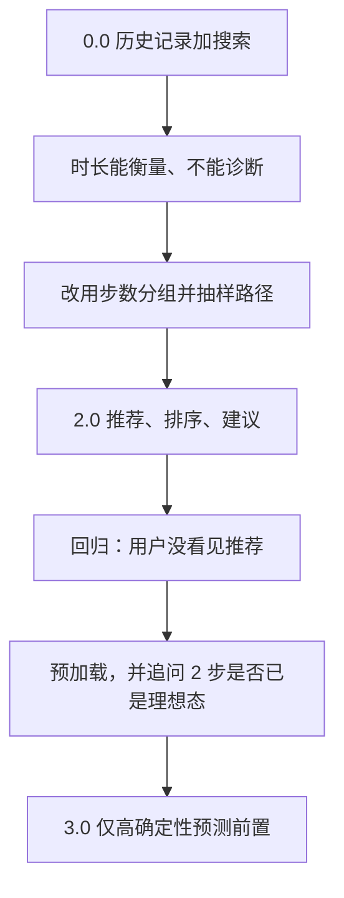

## 策略通用方法论

策略工作反复做同一件事：定义理想态、拆未达、给方案、验证。在复杂空间里用简单规则起步，每轮回归打开下一层问题。前面各篇分别讲发现问题、写需求、开发评估、效果回归。它们是同一套循环落在不同阶段。



也可以看成两组：发现问题对应前两步（定义、拆解、抽样归类、抽象问题）；解决问题对应后两步（方案、验证）。验证不是终点：解决了，确认当前方案有效；没解决，知道下一轮该分析哪一块。


产品和 PM 都在循环里进化。每一轮应至少改变一样：理想态更准、问题边界更清、方案适用条件有新认识、或排除了某条无效路径。策略像在复杂空间找路：开始不一定知道最优解，只能靠连续分析和验证逼近。

### 四步分别做什么

**定义理想态。**先说清楚什么样才算达到预期，尽量用数字化指标或其他明确标准。合格的策略 PM 要能说出：产品目标是什么、项目组共同努力达到什么状态、哪些结果算达标、哪些算偏离。简单工具类产品（天气、打车等）往往可用较明确的单指标；搜索、推荐等复杂产品很难一个数字概括，需要人工分析、样本或竞品对比。理想态是阶段性目标，会随规模、需求和业务重点变化。详见[理想态](../02-discovering-problems/04-ideal-state.md)。

**拆解未达。**理想态明确后，才能判断哪些对象、场景、环节没达标。用[抽样分析](../02-discovering-problems/06-sampling.md)代表总体。重点是找到可复用的问题结构：是否同一需求场景、是否同一输入特征缺失、能否用同一策略方向解决、影响面和严重度是否值得进当前项目。再按影响面、严重程度、解决成本看投入产出，并结合版本节点、资源、合规等外部因素排优先级，见[优先级与项目计划](../02-discovering-problems/07-prioritization.md)。

**提出方案。**把抽象问题翻译成研发能实现的内容。普通产品靠流程图和页面；策略靠问题、输入、计算逻辑、输出和效果 Case。简单策略可以把规则写死，依据来自历史数据或调研，见[简单策略需求文档](01-simple-prd.md)。复杂策略可以暂不确定完整计算规则，但问题、输入、理想输出、不符合预期的现有输出、边界例外必须交代清楚，见[复杂策略需求文档](02-complex-prd.md)。

**验证。**开发中做[开发评估](03-dev-evaluation.md)（策略本身对不对）和[Diff 评估](04-diff-evaluation.md)（放进系统后用户可感知变化是好是坏）；上线后做[效果回归](05-effect-review.md)（核心 / 过程 / 观察是否达标）。未达标则抽样，开启新循环。

### 四个环节的粒度不同

同一套方法，不能用同一种评估方式套完全部工作。

| 环节 | 主要问题 | 分析粒度 | 主要产出 |
| --- | --- | --- | --- |
| 发现问题 | 哪里偏离理想态 | 宏观、方向性 | 问题清单、优先级、解决方向 |
| 编写需求 | 方案如何描述和传递 | 输入-逻辑-输出 | 策略需求文档、Case |
| 开发评估 | 当前版本具体哪里不对 | 具体案例、策略逻辑 | 评估结论、修改项、复评标准 |
| 效果回归 | 上线后整体是否达标 | 先看指标统计，未达标再抽样 | 回归结论、新一轮问题 |

发现问题阶段偏方向：找到理想态和偏离，抽象类型，形成清单。产出是后续需求要解决的问题和方向。途径见[发现问题的四条途径](../02-discovering-problems/01-four-channels.md)。

需求阶段承上启下：把发现阶段的抽象问题写成输入、输出和案例。复杂策略不必一次写死规则，但不能不说明问题和理想输出。

开发评估必须非常具体：哪些输入触发了错误、哪些规则覆盖不足、修改后是否真解决。只给「好 / 不好」不够。质量评估看召回率 / 准确率；效果评估看影响面和 GoodCase / BadCase。

效果回归首先看三类指标变化。达标则记录结论、必要时持续观察，通常不必再做同等规模的人工拆解；未达标再抽样定位。核心指标回答最终成功了没有；过程指标回答哪一步影响了结果；观察指标回答有没有别处变差。

粒度用错的典型症状：发现问题阶段就要求研发改某一条规则（过细，方向还没立住）；开发评估只给「整体还行」（过粗，无法改下一版）；效果回归一上线就对全量 query 做人工拆解（过重，应先看统计）。

| 定义项 | 需要回答 |
| --- | --- |
| 业务目标 | 这个产品 / 项目想解决什么问题 |
| 理想结果 | 用户最终应该看到或得到什么 |
| 衡量指标 | 用什么判断是否达成 |
| 评估标准 | 哪些案例算正确、错误或不可接受 |
| 达标条件 | 达到什么程度可以进入下一环节 |

### 在复杂空间找路

复杂策略很难在需求阶段画出最终曲线。可用的走法是：用简单规则 / 简单分层先上路；上线或评估后做回归；回归打开下一层问题；只加能解释本轮证据的能力；再验证，再打开下一层。

不要一上来建完整推荐系统。数据、标签、行为量不够时，停在能产生合适收益的版本是理性选择。也不要看到一次指标变好就停止分析：达标只说明当前循环可以暂时中止。下面两个课例只保留 0 到 N 如何进化的方法骨架。完整推送、目的地产品细节见[推荐策略](../05-function-oriented/03-recommendation.md)与[目的地与路线策略](../05-function-oriented/04-destination-and-route.md)。

### 短流程：消息推送

活动类消息（不含发货、退款等功能提醒）。初始可用点击率作核心指标，后续再接到购买转化、活动参与等更靠近业务的指标。课例数字只说明该演进过程，不是行业基准。



未点击原因无法一次拆完时，先比较点击与未点击的可观察差异，把「谁更容易点」变成第一层策略。每一轮回归都打开新维度（渠道可用性、兴趣、时间、反馈），而不是把 3.0 的推荐系统当作 0.0 的开工条件。推送效率逐步收敛到合适的用户、合适的时间、合适的消息。是否值得走到 3.0，看运营与研发成本、预期收益、数据基础和人均行为量。

### 短流程：目的地输入

理想态：以最低成本完成目的地输入。平均输入时长适合当核心指标，却不便直接拆问题。于是增加拆解指标「输入步数」，把时长映射到路径类别。



核心指标不够诊断时，换一个能映射到路径的拆解指标。问题分类先问有没有可利用的历史，再决定推荐、排序还是搜索。回归未达预期时，不要默认是排序不准，可能是用户没看见（性能、覆盖、注意）。理想态本身也会被回归改写：当前最短的 2 步不等于用户真正可接受的最优；只有预测足够确定，才允许把推荐做到输入页之前。

两条课例共用同一句口诀：先上路，再让回归告诉你下一层该补什么。版本名字不重要，重要的是每一轮只增加本轮证据要求的能力。接到具体业务时，用[功能导向型策略框架](../05-function-oriented/01-framework.md)；下一层方向见[四大业务方向](../04-application-map/01-four-directions.md)。

### 可复用检查表

```text
一、定义理想态：目标是否明确、理想输出是否可描述、是否有数字化指标或明确标准
二、拆解未达标：抽样是否有代表性、案例是否按共同特征归类、分类是否互斥且覆盖完整
三、提出方案：是否对应具体问题、输入逻辑输出是否清楚、是否区分简单 / 复杂写法
四、验证：指标是什么、是否同时看案例、是否同时关注收益和副作用、未达标时下一轮从哪里开始
```

优先级判断用影响面、严重程度、投入产出比、外部约束记录，不要误解成课规定的统一公式。上线方式按风险选小流量 / 阶段性 / 全流量，课例没有给出可照搬的流量百分比。

### 常见误区

1.  没有定义理想态就直接找坏案例。
2.  把理想态当成永久标准。
3.  复杂产品只用一个指标判断。
4.  抽样只收集案例，不做问题抽象。
5.  用方便样本代替代表性样本。
6.  需求只写方案，不写问题和理想输出。
7.  把开发评估当成交付后的形式验收。
8.  只做质量评估，不做效果评估 / Diff。
9.  效果回归一开始就大量人工抽样。
10. 只看核心指标，不看过程和观察。
11. 用同一种分析粒度贯穿所有环节。
12. 第一天就按 3.0 系统开工，或一次指标变好就停止分析。

四步适合需要持续改进的问题。一次性、确定性强的简单任务可以更轻。理想态必须能被某种标准描述。抽样结论不等于全量事实。质量评估与 Diff / 效果回归不能互相替代。达标后暂时中止循环，不等于产品停止迭代。不要把推送或目的地课例的版本路径、点击率、准确率直接当成自己的必选项或阈值。

策略 PM 的核心能力是在不确定空间里定义目标、发现问题、抽象问题、推动解决并验证。每轮循环减少一部分不确定性，产品就更接近当前阶段的理想态。

### 延伸阅读

-   [策略产品经理的工作循环](../01-concepts/04-workflow.md)
-   [理想态](../02-discovering-problems/04-ideal-state.md)
-   [抽样分析](../02-discovering-problems/06-sampling.md)
-   [简单策略需求文档](01-simple-prd.md)
-   [开发评估](03-dev-evaluation.md)
-   [功能导向型策略框架](../05-function-oriented/01-framework.md)

## 来源说明

???+ note "来源说明"
    本文根据公开课程《策略产品经理》（B 站 [BV1YE411g717](https://www.bilibili.com/video/BV1YE411g717/)）整理为知识点，不是逐课笔记。

    课程中的数字、阈值和公式是教学示意，不能直接当作可上线参数。

    对应原课第 22 至 24 集。整理日期：2026-09-04。
