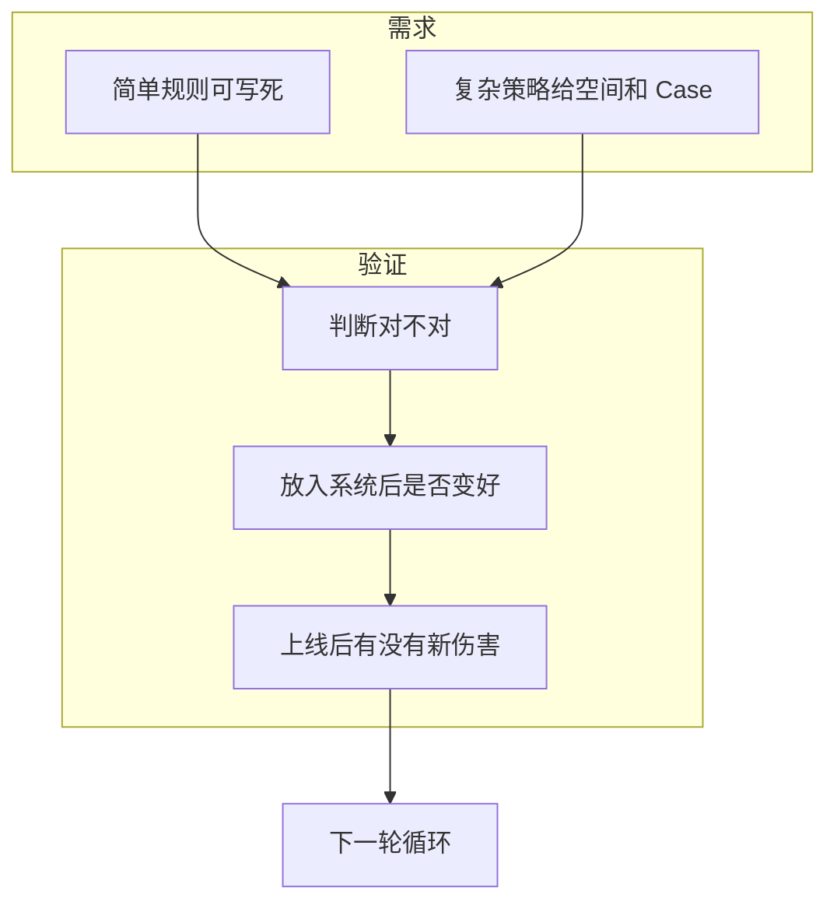

## 需求与验证

把已经看清的问题写成研发能实现的需求，再在开发中和上线后验证。本模块结束后，通用工作法齐了。

简单策略可以把规则写死。复杂策略给出目标空间、原则、Case 和验证标准，由算法探索实现。验证分三层：策略判断对不对、放进系统后用户是否变好、上线后有没有新伤害。

前一模块把理想态和未达情况拆清，本模块负责写成可开发文档并闭环验证。读完即可独立推进一个策略项目。后面三个应用模块按业务类型选读，不必按编号穷尽。

### 两种需求写法

分类看**逻辑复杂度**。几句话能说清、分支少，用简单策略文档；因素多、场景多、需要大量 Case，用复杂策略文档。简单规则也可能因工程改造很重而开发很久，复杂逻辑也可能复用已有能力。先看逻辑，再看成本。

| 写法 | 适用 | 文档要交出的东西 |
| --- | --- | --- |
| [简单策略需求文档](01-simple-prd.md) | 规则可写死、条件少 | 输入、触发、规则、输出、边界、依据、监控 |
| [复杂策略需求文档](02-complex-prd.md) | 因素多、需算法探索 | 原则、特殊场景、Case、验证标准 |

两种写法都要回到[策略四要素](../01-concepts/02-four-elements.md)：待解决问题、输入、影响因素、规则、输出。功能 PRD 写用户走哪条路径、每一步看到什么；策略需求写面对什么输入和条件，系统应给出什么结果、为什么。

### 三层验证

需求写完进入开发，不能把「代码交付」当成可上线。三层问的问题不同，产出也不同。

| 层 | 核心问题 | 主要产出 | 页面 |
| --- | --- | --- | --- |
| 质量评估 | 每个个案判断得对不对 | 召回率、准确率、错误案例 | [开发评估](03-dev-evaluation.md) |
| 可感知变化 | 用户最终看到的结果变了多少、是好是坏 | 影响面、GoodCase / BadCase | [Diff 评估](04-diff-evaluation.md) |
| 上线后回归 | 核心目标达标没有、过程卡在哪、有没有新伤害 | 核心 / 过程 / 观察指标 | [效果回归](05-effect-review.md) |

质量好不等于系统效果好。搜索、推荐都是多策略共同作用，单个策略单独评估良好，不能推断用户体验一定变好。上线后还要用事先写进需求的指标回收，避免把波动当成功。

工程侧的评测集、线上指标和实验设计，见[评测](../../../ai/evaluation.md)。本模块讲策略产品如何把验证嵌进工作循环，两页互补。

### 本模块文章

-   [简单策略需求文档](01-simple-prd.md)：输入、触发、规则、输出、边界、依据、监控
-   [复杂策略需求文档](02-complex-prd.md)：原则、特殊场景、Case、监控；把实现探索留给算法
-   [开发评估](03-dev-evaluation.md)：质量评估（召回 / 准确）与效果评估
-   [Diff 评估](04-diff-evaluation.md)：新旧策略让用户最终看到的结果变了多少、是好是坏
-   [效果回归](05-effect-review.md)：核心、过程、观察三类指标
-   [策略通用方法论](06-methodology.md)：定义理想态、拆未达、给方案、验证；用简单规则起步

六篇文章落在同一条循环上，只是落点不同。[策略通用方法论](06-methodology.md)把它们收成可复用的四步，并说明各环节粒度不同。

### 读完应能做的事

-   按逻辑复杂度选择简单或复杂写法，把四要素填进文档
-   在需求阶段约定监控字段和回归口径，避免上线后才发现没埋点
-   用多轮开发评估判断当前版本是否达到上线标准
-   用可感知影响面和好坏案例决定能不能带着问题上线
-   用核心 / 过程 / 观察三类指标做项目级复盘，再决定结束本轮还是开下一轮

### 本模块证明不了的事

-   某个课例阈值可以直接上线：密码超时 3 分钟、召回率约 81.6%、搜索建议降低 1.2 秒，都是教学示意
-   一次上线即到达[理想态](../02-discovering-problems/04-ideal-state.md)
-   质量评估可以替代 Diff 或效果回归
-   四个应用方向必须同时做满：下一模块才按业务选读

### 阅读顺序

赶工一个策略项目时，先读[简单策略需求文档](01-simple-prd.md)或[复杂策略需求文档](02-complex-prd.md)（按逻辑复杂度二选一），再读[开发评估](03-dev-evaluation.md)与[Diff 评估](04-diff-evaluation.md)，上线后读[效果回归](05-effect-review.md)。需要把整条工作法记成一张图时，读[策略通用方法论](06-methodology.md)。

上一模块：[发现问题](../02-discovering-problems/index.md)。下一模块：[应用总览](../04-application-map/index.md)。总图见[策略产品经理](../index.md)。

### 需求阶段就把验证写进文档

监控字段、回归口径、上线标准都写进需求，开发评估和效果回归才有对照物。简单策略至少约定触发量、目标指标、负向指标和关键日志；复杂策略还要约代表性 Case 如何回归、输入质量如何检查。上线后再临时定标准，结果很容易被解释成对自己有利。

### 写完之后接到哪里

通用工作法到本模块结束。应用侧按问题选读：[功能导向型策略框架](../05-function-oriented/01-framework.md)覆盖搜索、推荐、输入等单侧体验；角色冲突、增长与风控另开模块。应用篇给出业务地图，不能替代本模块的验证三层。

### 延伸阅读

-   [策略四要素](../01-concepts/02-four-elements.md)
-   [策略产品经理的工作循环](../01-concepts/04-workflow.md)
-   [理想态](../02-discovering-problems/04-ideal-state.md)
-   [抽样分析](../02-discovering-problems/06-sampling.md)
-   [功能导向型策略框架](../05-function-oriented/01-framework.md)

## 来源说明

???+ note "来源说明"
    本文根据公开课程《策略产品经理》（B 站 [BV1YE411g717](https://www.bilibili.com/video/BV1YE411g717/)）整理为知识点，不是逐课笔记。

    课程中的数字、阈值和公式是教学示意，不能直接当作可上线参数。

    对应原课第 16 至 24 集。整理日期：2026-09-04。
