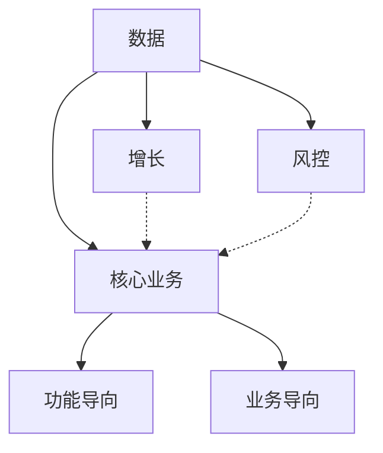
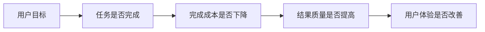
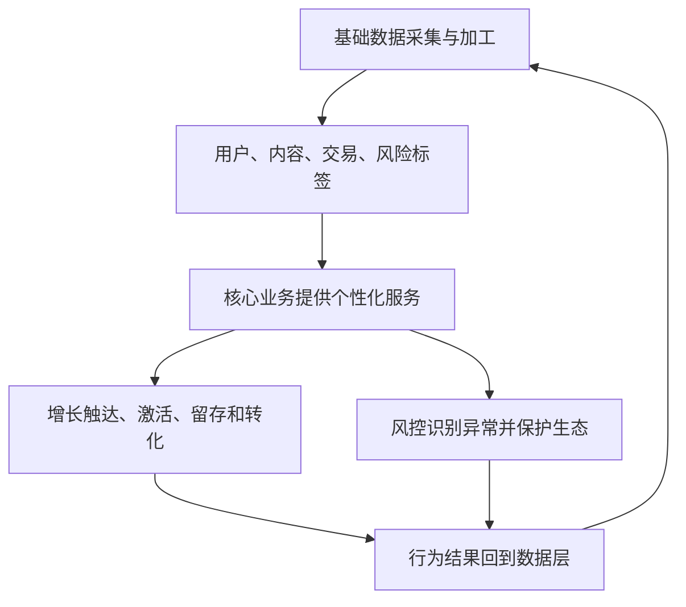
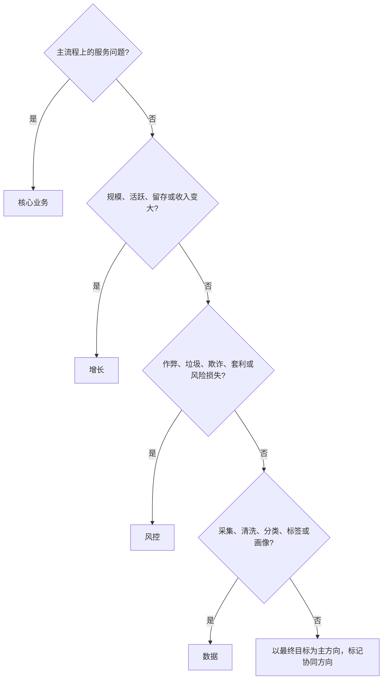

## 四大业务方向

策略是让目标达成过程更好的手段：感知环境、用户、业务因素的变化，给出差异化方案，再用反馈持续优化。见[策略是什么](../01-concepts/01-what-is-strategy.md)、[策略四要素](../01-concepts/02-four-elements.md)。

只把策略理解成给用户推荐什么，会漏掉大半地图。本篇是应用篇总图，后面各篇按方向展开。

### 应用地图

四个方向可以画成：



核心关系是：数据同时支撑三者，并把行为结果收回来；增长和风控围绕核心转，不能脱离核心单独报喜。

| 方向 | 主要问题 | 常见策略工作 |
| --- | --- | --- |
| 核心业务 | 产品如何交付主要服务 | 搜索、推荐、匹配、配送、内容分发 |
| 增长 | 用户、活跃、交易或收入如何变大 | 拉新、激活、留存、召回、分层触达 |
| 风控 | 如何减少作弊、垃圾、欺诈和平台损失 | 反作弊、反垃圾、风险分层、拦截与审核 |
| 数据 | 如何得到可用、可靠、可计算的信息 | 采集、清洗、去重、分类、画像与标签 |

判断一个新问题时，先问它主要落在哪一层，再标上下游协同。一个项目可以跨方向，但要有主方向，避免四套指标同时当核心。

策略适合这类问题：个性化服务（一群人、每人需求不同）；复杂、动态、容易浪费的流程；追求效率或规模的增长；有风险、作弊或利益博弈的环境；需要大量采集、加工、抽象的数据工作。固定功能按同一流程走；策略按用户、内容、时间、风险或业务状态选择不同处理。

后面展开的阅读顺序：功能导向框架与搜索、推荐、目的地，见[功能导向型策略框架](../05-function-oriented/01-framework.md)；业务导向与定价、出行匹配，见[业务导向型策略框架](../06-business-oriented/01-framework.md)；再是增长、风控、数据。

### 核心业务：功能导向与业务导向

核心业务是产品主流程，也就是直接为用户提供的主要服务。策略问题通常是：什么用户、在什么场景、需要什么服务、系统该给什么结果。

分类不看产品名字，看目标和参与角色：

| 维度 | 功能导向型 | 业务导向型 |
| --- | --- | --- |
| 主要目标 | 解决一个用户任务 | 协调多个角色的目标 |
| 参与角色 | 相对单一 | 用户、商家、骑手、生产者、广告主等 |
| 典型产品 | 搜索、天气、翻译、打车工具侧 | 外卖、交易平台、内容平台、社区 |
| 评估重点 | 任务完成、结果质量、用户体验 | 体验、角色收益、平台效率、生态 |
| 策略难点 | 更准地命中需求、降低完成成本 | 在冲突目标之间平衡 |

功能导向的例子：高德打车、翻译、墨迹天气、百度搜索、多数纯工具。评估先看任务是否完成、完成成本是否下降、结果质量与体验是否变好。搜索侧先看有没有找到想要的、结果是否相关、完成成本是否下降；打车工具侧先看目的地是否好输入、推荐地点对不对、下单是否更快。它也可能有广告或生态因素，分析时通常先钉住一个用户角色和一个核心目标。框架见[功能导向型策略框架](../05-function-oriented/01-framework.md)。



业务导向连接多个角色。美团外卖短例：用户希望更快、最好专送；骑手希望单位时间多带单；商家要履约稳定；平台要整体效率与长期生态。只优化专送会伤骑手效率，只优化合单会伤等待与稳定性。今日头条短例：广告分发要同时看用户体验与广告主效果，内容分发要同时看生产者收益与消费者体验。完整框架见[业务导向型策略框架](../06-business-oriented/01-framework.md)。

多边平台不要一上来把所有角色揉成一个指标。可以先把每一侧拆成功能导向问题，再建立多边关系与边界值。同一产品里也可以并存两类模块：出行 App 的目的地输入偏功能导向，司机补贴和匹配则进入业务导向。

### 增长、风控、数据：总图级理解

增长让核心数字变大，覆盖拉新、激活、留存、转化整条路径。用户进入后要经历激活、活跃、留存、转化或付费、高价值。拉新是开源：预算到产品外找目标用户，关心渠道、素材、权益、激活质量。留存是节流：减少流失，把低价值用户推向更高价值状态。策略问题是：哪个用户、处于什么生命周期、该给什么内容或权益、何时通过何渠道触达。展开见[增长策略](../07-growth-risk-data/01-growth.md)。

概念口径（教学示意，不是统一达标线）：

```text
获客成本 = 投放成本 ÷ 新增用户数
激活率 = 完成关键首次行为的新用户数 ÷ 新增用户数
```

| 工作 | 目标 | 典型对象 | 策略问题 |
| --- | --- | --- | --- |
| 拉新 | 把目标用户带进来 | 产品外潜在用户 | 去哪找、花多少、带来什么质量 |
| 激活 | 完成关键首次行为 | 新注册用户 | 如何降低首次使用门槛 |
| 留存 | 减少流失、持续使用 | 已有用户 | 谁要流失、如何唤回、给什么 |
| 转化 | 完成更高价值动作 | 活跃或高意向用户 | 什么时机、内容、权益 |

风控让产品在有利益、有博弈的环境里走得稳。人多、交易多、内容多的地方就有人试图违规获利。传统反作弊、反垃圾偏避免伤害：刷量、垃圾、恶意注册、虚假交易，对应放行、限制、拦截。金融风控更偏综合评估：输出常常是风险等级或处理建议。过松会吃损失，过严会误伤正常用户、拖垮核心效率。

```text
风控策略 = 风险损失控制 + 正常业务通过 + 用户体验保护
```

看拦截量之外，还要看识别准不准、误伤、事件发生率、审核通过率、时延、损失金额。支付、内容、社交的后果不同，不能共用一条线。展开见[风控策略](../07-growth-risk-data/02-risk-control.md)。

数据是上面三层的共同底座。基础数据管客观事实：网页、新闻、商品、地点、行为记录的收集、清洗、分类、去重、更新。画像标签是在基础数据上的抽象与推断：活跃、兴趣、购买能力、内容类别。标签要有来源、置信度和未知状态，不能为了填满而强行打标。

| 维度 | 基础数据 | 画像标签 |
| --- | --- | --- |
| 对象 | 网页、商品、地点、行为记录 | 用户、内容、对象的抽象属性 |
| 处理 | 收集、清洗、分类、去重、更新 | 预测、推断、打标、分层 |
| 主要问题 | 完整、准确、及时、一致 | 可靠、可解释、适用场景 |
| 示例 | 商品名称、一次点击 | 用户活跃、可能喜欢某品类 |

基础数据的四个质量问题：覆盖够不够、更新够不够及时、多来源有没有去重合并、名称与属性有没有标准化。标签数量多，不代表推荐、增长或风控变好。展开见[数据策略](../07-growth-risk-data/03-data.md)。

### 四者关系

核心业务是价值中心。核心交付不好，投放和促销很难变成长期增长；核心流程效率低，风控再严也会一起伤体验。

增长是外延：帮核心获得更多用户、活跃和收入。拉来的人能不能被服务、留下的人能不能拿到价值，都依赖核心能力。

风控是稳定器。没有风控，增长可能带进作弊和低质量用户，核心会被垃圾、套利、欺诈掏空。风控也不能只看拦截量。

数据同时支撑三者，并把行为结果收回来：



遇到问题时的归类顺序：



例如：个性化推荐主方向是核心业务，强依赖数据；促活消息主方向是增长，依赖用户标签；支付拦截主方向是风控，依赖交易基础数据。

### 判断与指标方向

功能导向可从任务完成率、完成成本、结果满足度入手；搜索、地图还可以加准确率、召回率、输入时长。业务导向必须同时看用户侧、供给侧、平台侧和生态侧，避免只优化一方。增长不能只看新增数，还要看成本、激活、留存和后续价值。风控不能只看拦截量，还要看识别准不准、误伤、时延和损失。数据不能只看标签个数，还要看覆盖、时效、重复、缺失和是否真的改善上层结果。

```text
任务完成率 = 完成核心任务的用户数 ÷ 发起任务的用户数
平均任务成本 = 时间成本 + 操作成本 + 判断成本
结果满足度 = 满足需求的结果数 ÷ 被评估结果总数
```

多角色侧至少同时记：用户完成率与等待、供给利用率与单位收益、平台成本与收入、投诉与供需健康。配送不能只看骑手同时带几单。

课程没有给出四方向的统一阈值。目标、风险和容错度不同，达标线必须单独定义。策略化也不等于一定上复杂模型：规则、分层、排序、标签和人工审核都可以是策略手段。见[策略通用方法论](../03-spec-and-validation/06-methodology.md)。

归类时可用短清单：搜索排序、商品推荐 → 核心（功能）；配送合单 → 核心（业务）；召回短信、新用户热门 → 增长，协同数据；虚假点击识别 → 风控；网页抓取去重、消费能力标签 → 数据。主方向按最终要改善的目标定，协同方向写在依赖里。

### 常见误区

1.  把策略等同于推荐。增长、风控、数据同样大量使用策略。
2.  先写规则后找目标，指标会很多却无法判断有没有价值。
3.  功能导向和多角色业务用同一套指标。搜索可以先看满足度，外卖配送必须看多方。
4.  只追拉新数量、不看用户质量，可能买来低质量流量。
5.  把风控写成全部拦截；反作弊与金融风控对象、输出、容错都不同。
6.  把基础数据当成画像标签。上周买了三次牛奶是事实，偏好生鲜是推断。
7.  把四大方向当成部门墙或固定组织图。按问题目标标记主方向和协同方向。
8.  以为输入越多越好。特征增加复杂度、延迟、隐私和误判风险，要看投入产出。

适用边界：这是理解策略业务的分析框架，不是唯一行业分类；功能导向不意味着绝对只有一个角色，交易导向也不意味着各方权重永远相同。

### 延伸阅读

-   [策略是什么](../01-concepts/01-what-is-strategy.md)
-   [策略通用方法论](../03-spec-and-validation/06-methodology.md)
-   [功能导向型策略框架](../05-function-oriented/01-framework.md)
-   [业务导向型策略框架](../06-business-oriented/01-framework.md)
-   [增长策略](../07-growth-risk-data/01-growth.md)
-   [数据策略](../07-growth-risk-data/03-data.md)

## 来源说明

???+ note "来源说明"
    本文根据公开课程《策略产品经理》（B 站 [BV1YE411g717](https://www.bilibili.com/video/BV1YE411g717/)）整理为知识点，不是逐课笔记。

    课程中的数字、阈值和公式是教学示意，不能直接当作可上线参数。

    对应原课第 26 集。整理日期：2026-09-04。
