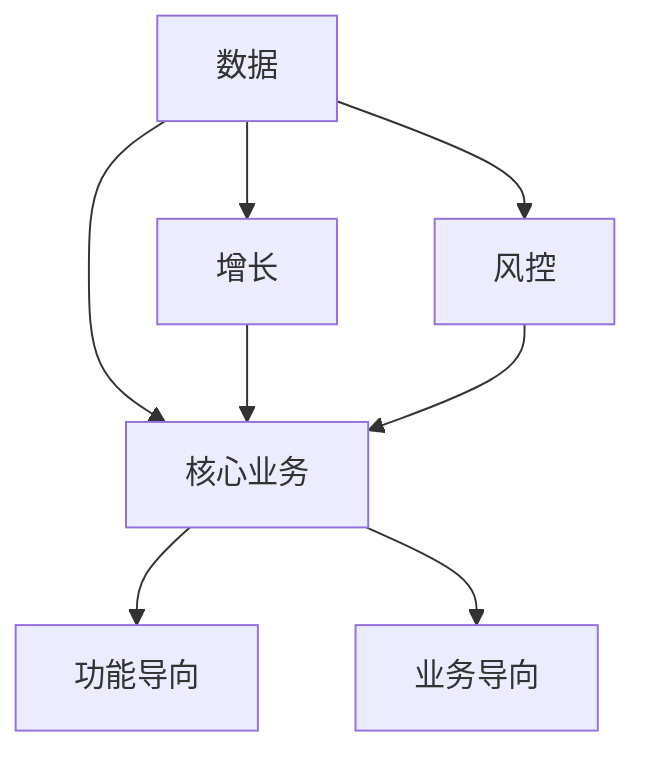
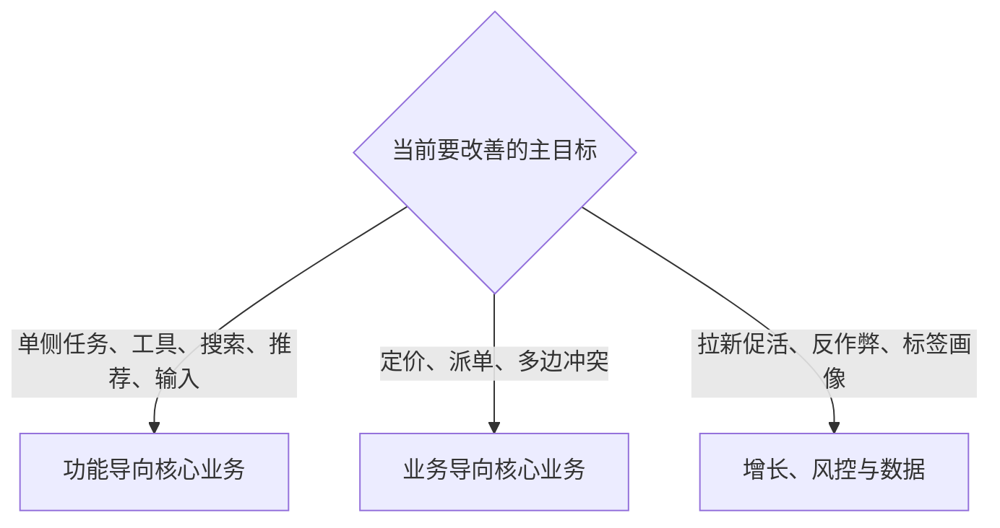

## 应用总览

前面各篇用搜索、推荐、推送、目的地输入讲方法。真实工作里，策略还会落到：谁该被触达、什么该被展示、哪笔交易该拦截、哪些数据该清洗标注、多个角色如何同时拿到合理收益。

核心业务交付用户直接消费的价值；增长把用户和交易做大；风控避免伤害；数据给前面三类提供可判断的信息。核心业务再分成功能导向（单侧理想态）和业务导向（多方冲突）。

本模块只有一篇总图。读完按问题跳转，不必按文件夹顺序把三个应用模块都读完。

核心关系是：数据托底，风控护航，增长放大，核心交付价值。一个项目可以跨方向，但要有主方向，避免四套指标同时当核心。

### 四个方向

| 方向 | 主要问题 | 常见策略工作 |
| --- | --- | --- |
| 核心业务 | 产品如何交付主要服务 | 搜索、推荐、匹配、配送、内容分发 |
| 增长 | 用户、活跃、交易或收入如何变大 | 拉新、激活、留存、召回、分层触达 |
| 风控 | 如何减少作弊、垃圾、欺诈和平台损失 | 反作弊、反垃圾、风险分层、拦截与审核 |
| 数据 | 如何得到可用、可靠、可计算的信息 | 采集、清洗、去重、分类、画像与标签 |

判断一个新问题时，先问它主要落在哪一层，再标上下游协同。策略适合个性化服务、复杂动态流程、追求效率或规模的增长、有风险或利益博弈的环境，以及需要大量采集、加工、抽象的数据工作。固定功能按同一流程走；策略按用户、内容、时间、风险或业务状态选择不同处理。

### 核心业务的两条支路

分类不看产品名字，看目标和参与角色。

| 维度 | 功能导向型 | 业务导向型 |
| --- | --- | --- |
| 主要目标 | 解决一个用户任务 | 协调多个角色的目标 |
| 参与角色 | 相对单一 | 用户、商家、骑手、生产者、广告主等 |
| 典型产品 | 搜索、天气、翻译、打车工具侧 | 外卖、交易平台、内容平台、社区 |
| 评估重点 | 任务完成、结果质量、用户体验 | 体验、角色收益、平台效率、生态 |
| 策略难点 | 更准地命中需求、降低完成成本 | 在冲突目标之间平衡 |

同一产品里也可以并存两类模块：出行 App 的目的地输入偏功能导向，司机补贴和匹配则进入业务导向。多边平台可以先把每一侧拆成功能导向问题，再建立多边关系与边界值。

### 本模块文章

-   [四大业务方向](01-four-directions.md)：核心业务、增长、风控、数据，以及两类核心业务的差别

### 读完如何跳转

-   工具、搜索、推荐、输入框、单侧体验 → [功能导向核心业务](../05-function-oriented/index.md)
-   外卖、打车、定价、多边平台 → [业务导向核心业务](../06-business-oriented/index.md)
-   拉新促活、反作弊、标签与画像 → [增长、风控与数据](../07-growth-risk-data/index.md)

### 贯穿检查

-   **主方向有没有**：最终要改善的目标落在核心、增长、风控还是数据？协同方向写在依赖里，四套指标不要同时当核心。
-   **核心走哪条支**：单侧任务、工具、搜索、推荐走功能导向；定价、派单、多边冲突走业务导向。同一产品可以并存两类模块。
-   **指标有没有错配**：搜索可以先看满足度；外卖配送必须看多方；增长要看成本和留存；风控要看误伤；数据要看是否改善上层结果。
-   **策略手段有没有被窄化**：规则、分层、排序、标签和人工审核都可以是策略。课程没有四方向统一达标线。

### 读完应能做的事

-   给一个新问题标出主方向和协同方向
-   分清功能导向与业务导向，避免用同一套指标评估搜索和外卖配送
-   知道增长、风控、数据各自看什么，避免只把策略理解成推荐
-   按问题选读后面三个模块，不必按编号穷尽

### 本模块证明不了的事

-   四个方向必须同时做满
-   存在四方向统一达标线：目标、风险和容错度不同，达标线必须单独定义
-   策略化等于一定上复杂模型：规则、分层、排序、标签和人工审核都可以是策略手段
-   这是唯一行业分类，或固定组织图

### 阅读顺序

先读[四大业务方向](01-four-directions.md)，再按上表跳转。赶工时，单侧体验读[功能导向型策略框架](../05-function-oriented/01-framework.md)，角色冲突读[业务导向型策略框架](../06-business-oriented/01-framework.md)，拉新、反作弊或标签读[增长、风控与数据](../07-growth-risk-data/index.md)。

上一模块：[需求与验证](../03-spec-and-validation/index.md)。通用工作法齐了之后，本模块只回答策略该落在哪张业务地图。总图见[策略产品经理](../index.md)。

课程案例中的数字、阈值和公式是教学示意，不能直接当作可上线参数。

归类时可用短清单：搜索排序、商品推荐走核心（功能）；配送合单走核心（业务）；召回短信走增长；虚假点击走风控；网页去重走数据。

### 延伸阅读

-   [策略是什么](../01-concepts/01-what-is-strategy.md)
-   [策略四要素](../01-concepts/02-four-elements.md)
-   [策略通用方法论](../03-spec-and-validation/06-methodology.md)
-   [功能导向型策略框架](../05-function-oriented/01-framework.md)
-   [业务导向型策略框架](../06-business-oriented/01-framework.md)
-   [增长策略](../07-growth-risk-data/01-growth.md)

## 来源说明

???+ note "来源说明"
    本文根据公开课程《策略产品经理》（B 站 [BV1YE411g717](https://www.bilibili.com/video/BV1YE411g717/)）整理为知识点，不是逐课笔记。

    课程中的数字、阈值和公式是教学示意，不能直接当作可上线参数。

    对应原课第 26 集。整理日期：2026-09-04。
