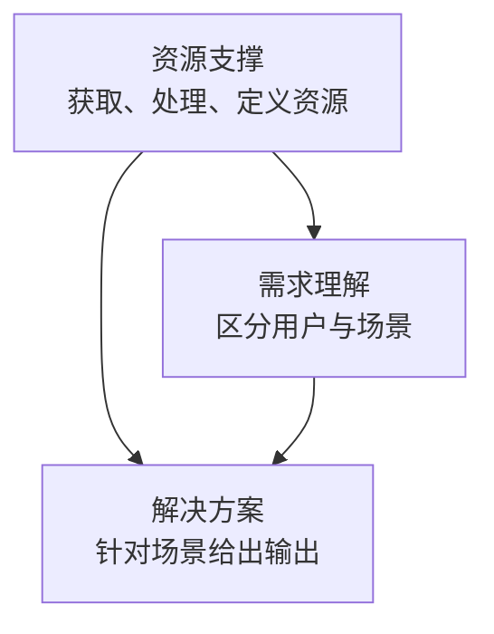
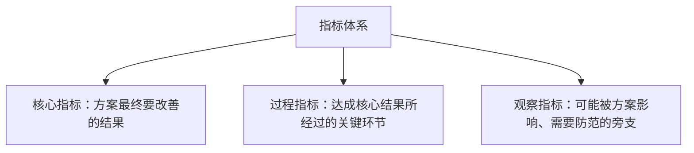
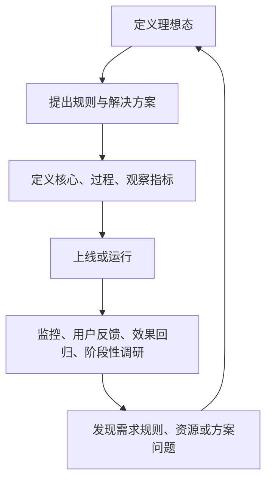

## 功能导向型策略框架

功能导向型业务只需要考虑单一用户，或某一个用户群的需求。面对这一侧时，可以相对明确地写出需求满足的理想态，策略围绕这个理想态改进。多数工具类产品，以及复杂产品里相对独立的策略模块，都可以先按这一类来想。

它对应[四大业务方向](../04-application-map/01-four-directions.md)里核心业务的左支。典型如搜索、天气、翻译、地图里的输入与路线、内容推荐：用户目标相对单一，评估可以主要从任务有没有被满足出发。

理想态较明确，仍然要有输入、规则、输出和指标。自动亮度、目的地输入、推荐都仍要按四要素来做。屏幕亮度是其中较简单的已知短例：环境光等因素相对客观，合适亮度也比较好描述。本篇不展开其实现；后面搜索、推荐、目的地都比它更不确定。

多边平台往往同时服务用户与商户。处理方式是先把任何一边单独拆开。拆开后，针对某一侧仍然可以用本框架。最终还要处理角色之间的约束，那是[业务导向型策略框架](../06-business-oriented/01-framework.md)的工作。

### 三模块框架

课程把功能导向策略抽象成三个互相连接的模块：



核心关系是：把做一个策略拆成一组可验证、可迭代的问题。

-   **需求理解**：不同用户群或场景到底有什么不同，用什么规则区分。
-   **解决方案**：针对每个用户群或场景，产品应该实现什么效果。
-   **资源支撑**：前两步需要的标签、地点、候选、内容从哪里来，如何加工。

框架看起来简单，价值是避免停在上模型、做推荐。它与[策略四要素](../01-concepts/02-four-elements.md)对齐：区分规则对应输入，理想输出对应方案输出，准确率、召回率与核心指标对应计算逻辑是否有效。

### 需求理解：规则加准确率与召回率

需求理解要给出区分不同用户群或场景的规则：

-   哪些用户算同一类
-   哪些场景会产生不同需求
-   用什么输入因素区分
-   用户从一场景切到另一场景时，规则能否识别

短例：按性别或兴趣区分推荐；按活跃程度发不同推送；在图片搜索里区分强、中、弱图片需求；外卖打开时间可能对应午饭、下午茶、晚饭、夜宵。打开时间是一条区分因素，但不保证判断一定对：下午打开也可能在订第二天早餐。

因果链是：


规则必须数字化。通常用准确率和召回率：

$$
准确率 = \frac{规则判断为某需求且真实属于该需求的样本数}{规则判断为该需求的样本总数}
$$

$$
召回率 = \frac{规则判断为某需求且真实属于该需求的样本数}{真实属于该需求的样本总数}
$$

或写成 $Precision = TP / (TP+FP)$，$Recall = TP / (TP+FN)$。课程没有规定统一样本范围或达标线。真实需求如何确认（最终购买、点击、完成任务）必须按业务定义。

两个框要拆开写：黑框是规则本身，黄框是规则好不好。只有规则、没有指标，就无法迭代。性别等标签的价值在于帮助识别兴趣和需求，最终要评估的是需求识别准不准。

### 解决方案：理想效果加指标树

解决方案黑框回答：面对用户的问题，产品要实现的效果是怎样的？先写理想效果，再由研发选技术和工程。

表达方式随项目阶段变化：

| 项目类型 | 如何写理想输出 |
| --- | --- |
| 简单策略 | 按历史数据或调研直接给方案 |
| 复杂策略新项目 | 用若干场景 case 写出理想输出 |
| 已有策略迭代 | 写当前问题，以及解决后应达到的效果 |

黄框把好的体验数字化，通常就是产品核心指标。课程举例：头条推荐看点击率、停留时间；目的地输入看输入步数、输入时长；消息推送看转化或点击。不同业务不能套同一个核心指标，要从好的体验反推。见[理想态](../02-discovering-problems/04-ideal-state.md)。

核心指标要在提出理想输出时一起想，并接入[效果监控与策略监控](../02-discovering-problems/03-monitoring.md)与[效果回归](../03-spec-and-validation/05-effect-review.md)。上线前拆成三支：



核心变好、观察变差，不能宣布成功。提出理想输出时同步回答：什么行为说明体验变好、如何被记录、指标该升还是降、只看核心会不会漏副作用。

三模块各自的工作顺序：

```text
需求理解：场景 → 输入因素 → 规则 → 准确率 / 召回率 → 监控迭代
解决方案：理想效果 → case 或「问题到解决后」 → 核心指标 → 过程 / 观察 → 迭代
资源支撑：列出依赖 → 来源与获取 → 清洗分类定义 → 资源指标 → 缺失时的处理
```

资源的结果是有可靠、能支撑决策的资源。

### 资源支撑：从原始数据到可用输入

需求理解和解决方案都要整合外部资源时，启用资源支撑。它回答标签、候选、地点从哪来，是否准确、完整、稳定。

两个短例：

1.  **消息推送**：要先有活跃、兴趣等标签。标签来自行为收集、分类、定义，再交给需求识别和消息选择。核心指标是转化或点击；标签本身另看准确率、召回率。链路是：行为 → 标签 → 用户群区分 → 消息选择 → 点击或转化。
2.  **地图餐馆搜索**：解决方案是把周围餐馆按排序展现；资源问题是餐馆是否覆盖、类别、评分、开门时间、人均、堂食是否正确。判断一个 POI 是餐馆还是酒店，是资源分类，不是排序方案本身。资源不准，排序再精也是错集合上的精。

资源支撑也是一套规则：原始资源 → 获取 → 处理、分类、定义 → 可用于策略的标签与属性。衡量同样看准确率、召回率。

后面三篇是本框架在不同工具模块上的展开：[搜索策略](02-search.md)输入与结果都复杂；[推荐策略](03-recommendation.md)需求本身不清晰、要持续猜；[目的地与路线策略](04-destination-and-route.md)终止点明确，不确定的是预测对象。复杂度不同，三模块结构相同。

### 迭代闭环

三个模块都通过同一套发现途径迭代，见[发现问题的四条途径](../02-discovering-problems/01-four-channels.md)、[用户反馈处理](../02-discovering-problems/02-user-feedback.md)、[阶段性调研](../02-discovering-problems/05-periodic-research.md)：



需求规则可能把场景分错，资源规则可能把 POI 分错，解决方案可能用错体验定义。都不要求一定上机器学习，重点是把规则变成可验证指标，让指标推动下一轮。理想态和指标本身也会进化。

### 模板

```text
业务 / 策略名称：
服务对象：单一用户 / 某一用户群 / 多边平台中的一侧

一、需求理解
- 用户群 / 场景如何区分：
- 影响需求的输入因素：
- 需求识别规则：
- 规则准确率 / 召回率：
- 真实需求如何确认：

二、解决方案
- 每个场景的理想输出：
- 新项目的场景 case / 迭代项目的当前问题与解决后效果：
- 核心指标、过程指标、观察指标及方向：

三、资源支撑
- 依赖的原始数据 / 标签 / 地点 / 候选：
- 获取、清洗、分类、定义：
- 资源准确率 / 召回率：
- 资源缺失或异常时的处理：

四、迭代
- 效果监控、用户反馈、效果回归、阶段性调研：
- 下一轮优化问题：
```

### 常见误区

1.  以为理想态明确就不用做策略。仍然要有输入、规则和指标。
2.  只写用户群、不写区分规则，也没有准确率、召回率。
3.  方案只写上模型、做排序，没有描述用户应得到的效果。
4.  新项目和迭代项目用同一种写法；复杂新项目更适合 case，迭代更适合问题到解决后效果。
5.  只盯核心指标，不写过程与观察。
6.  把资源支撑当成数据已经有了。标签和 POI 都需要获取、定义和预处理。
7.  把多边平台所有角色混成一个目标。先拆单侧，再用本框架。
8.  以为理想态和指标一成不变。

适用：主要服务单一用户或单一用户群；可以描述相对明确的理想态；需要按场景给不同方案；依赖标签或候选资源；能为规则定义准确率、召回率或核心体验指标。当理想态高度不确定、或多方目标互相冲突时，不能假设存在一个单一核心指标，要进入业务导向框架。

写需求时，功能 PRD 的流程原型不够，要写清输入、条件、规则、输出，见[简单策略需求文档](../03-spec-and-validation/01-simple-prd.md)、[复杂策略需求文档](../03-spec-and-validation/02-complex-prd.md)。开发评估与 Diff 见[开发评估](../03-spec-and-validation/03-dev-evaluation.md)、[Diff 评估](../03-spec-and-validation/04-diff-evaluation.md)。

### 延伸阅读

-   [策略四要素](../01-concepts/02-four-elements.md)
-   [理想态](../02-discovering-problems/04-ideal-state.md)
-   [策略通用方法论](../03-spec-and-validation/06-methodology.md)
-   [四大业务方向](../04-application-map/01-four-directions.md)
-   [搜索策略](02-search.md)
-   [业务导向型策略框架](../06-business-oriented/01-framework.md)

## 来源说明

???+ note "来源说明"
    本文根据公开课程《策略产品经理》（B 站 [BV1YE411g717](https://www.bilibili.com/video/BV1YE411g717/)）整理为知识点，不是逐课笔记。

    课程中的数字、阈值和公式是教学示意，不能直接当作可上线参数。

    对应原课第 27 集。整理日期：2026-09-04。
