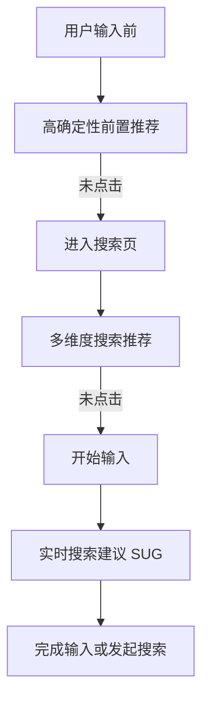
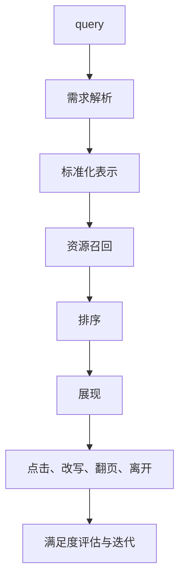

## 搜索策略

搜索看起来是一个输入框，用户真正要完成的是：从想找某个东西走到选到满意结果。策略要减少的是操作、等待、判断和纠错。

网页搜索把同一目标说成：帮助用户高效、准确地获取信息。输入侧与结果侧是同一条任务链上的两段。

本篇套[功能导向型策略框架](01-framework.md)：需求理解猜用户在找什么，解决方案负责召回、排序和展现，资源支撑提供词库与网页。垂直搜索（地点、菜品、话题）与通用网页搜索共用三段输入框架，结果侧的对象和融合程度不同。

### 输入侧三段

按用户确定性递增，而不是按页面控件堆功能：



核心关系是：高确定性直接给快捷目标，中确定性给候选供选择，低确定性让用户输入、系统实时辅助。

**输入前**：把高准确率目标放到首页或搜索框附近，让用户无需输入就能完成。地图的回家是典型：用户已设置家，动作含义明确，点击直接发起路线。外卖、微博搜索框里的提示词常常只是提示或热度，点击后仍进搜索页。能不能直接点完，看对象是否唯一、置信是否够、任务是否完整、纠错是否便宜。

**搜索页**：展示历史、热搜、分类、用户设置、业务对象（地点、店铺、菜品、话题）。来源按垂直对象设计，不要照搬地图的家、公司。

**输入中 SUG**：用户没点前置推荐、开始敲字后，按当前 term 实时给候选。地图可以在短输入时就出建议；外卖要区分菜品与店铺；内容社区可能要更完整的输入，建议与结果差异也更大。触发过晚，等于把输入成本推回给用户。

建议与结果职责不同：建议要在输入很少时快速给少量高可能候选；结果承担更完整的召回、比较和满足。融合程度由任务决定：地点目标明确可以点完，菜品还要选店则建议做导航、结果保留业务结构，热搜有歧义就只做提示。

| 产品 | 输入前 | 搜索页 | 输入中 SUG | 能否直接点完 | 建议与结果 |
| --- | --- | --- | --- | --- | --- |
| 地图 | 家等高确定性入口 | 家、公司、分类、历史 | 短输入即可 | 部分可以 | 融合较紧 |
| 外卖 | 搜索提示 | 菜品、店铺、历史 | 区分菜品与店铺 | 部分可以 | 保留业务结果结构 |
| 微博 | 热搜提示 | 历史、热搜 | 可能要较完整输入 | 部分不能 | 与结果差异更大 |

这张表用来抽象结构，不是对某一版本的永久断言。页面会变，分析时要重新观察。

面对一个候选，四步判断：对象是否唯一、置信是否足够、点击后任务是否完整、纠错成本是否可接受。四者都满足才直接点完，否则当提示，留后续搜索。可以点击并不等于更先进。

搜索成本可以拆成：找到入口、点击与输入、等待、选择判断、输错返工。完成率、平均时长、平均步数要按产品定义完成（选地点并发起路线、进店、看到目标内容）。点击率高若仍要多次选择或经常返回，不算成本下降。路径上可分开看：输入前点推荐、搜索页点推荐、点 SUG、走完整结果。人数占比不能单独判断优劣，还要看各路径时长与满足。

### 结果侧：需求理解

海量 query 不可能逐条人工理解。先分类，再给每类规则。课程从用户需求出发，分成三类：

| 类型 | 特征 | 处理方向 |
| --- | --- | --- |
| 需求明确 | 从文字能判断要找什么 | 切词、结构分析、口语同义归一 |
| 需求明确但答案有特殊要求 | 对象清楚，但要求最新、可下载等 | 把要求变成筛选、验证规则 |
| 需求不明确 | 过短、多义、表达复杂 | 上下文、实体内涵、个性化扩展 |

按任务性质，也可以看成导航（找唯一目标，如官网）、信息（找事实或解释）、事务（要完成下载、购票、借阅等动作）等。分类是入口。同一电影名：上映前偏信息和购票，上映后偏场次与评价，看过之后偏吐槽或资源。字面相同，需求阶段不同。

明确 query 的处理要点：长表达切成最小单元；专名可整留可拆，词项距离影响相关性；口语说法先归一再匹配书面网页；复杂路线句要抽出垂直类型、起点、终点、偏好，必要时交给地图引擎。课程没有指定某一种分词模型。

特殊要求不是普通关键词。最新房价要看页面时间是否可信（生成时间、页内日期、是否只改了皮）；软件下载还要验证链接是否可用，点击后是否还继续找别的下载页。有垂直产品时，搜索引擎的责任是识别类型、抽参数、交接；没有垂直产品时，自己承担筛选和验证。产品经理要先判断结果由谁产生，避免重复建设。

不明确的短词（电影名、明星名）背后常有多种需求，且随生命周期变化。扩展有三条路：会话前后搜索、实体类别的典型需求表（影视 → 视频、演员、评论、购票；地名 → 地址、路线、天气）、用户历史与地域。个性化改的是扩展与排序权重，不改写用户的搜索词。搜索扩展要求主体和意图足够一致。喜欢 A 的人也喜欢 B 更像推荐，不应直接混进当前主结果。见[推荐策略](03-recommendation.md)。

解析后要产出机器可解结构：标准 term、需求项、需求强度、垂直类型、特殊约束。切词、归一、意图、垂直识别都分别看准确率与召回率。真实意图标签如何获得，用人工标注或行为近似，本节没有统一标注流程。

### 多层排序

解决方案先排序、再展现。排序三层：

1.  **不同需求之间按需求强度**：扩展出多个需求后，命中概率或置信更高的排前面。
2.  **同一需求内按结果质量**：相关性、权威性、时效性、可用性。权威不能替代相关；百科类稳定知识未必越新越好；打不开的下载页不是好结果。

| 质量维 | 在问什么 | 典型信号 |
| --- | --- | --- |
| 相关性 | 内容是否围绕当前需求 | 词项匹配、出现次数、距离、是否在标题 |
| 权威性 | 来源是否值得信任 | 官方与个人站、权威媒体与小站 |
| 时效性 | 对新闻、价格、天气是否够新 | 更新时间；并非所有 query 都最优先 |
| 可用性 | 能否打开、下载、使用 | 链接有效、站点是否经常挂 |

3.  **用户点击反馈修正**：某结果对全体排第七、对某用户每次都点，应对该用户前移。反馈能补低频与突发需求，也可能被误点和作弊污染，要与质量信号、异常检测一起看。大型引擎里这类排序可能演化为学习排序，需求层仍要说清维度。

概念上会合成一个分数，课程没有给出权重：

$$
Score(result \mid query, user)
= F(需求强度,\ 相关性,\ 权威性,\ 时效性,\ 可用性,\ 用户反馈)
$$

需求再强、质量极差也不能直接第一；质量很高但完全不对应当前需求，也不能因为权威而第一。

### 展现：识别、给答案、前置下一步

展现要降低定位和下一步的成本。

-   **强化关键信息**：标题、摘要、关键词高亮；图书结果直接给出作者、出版社、年份，避免每条都点进去辨版本。
-   **直接给答案**：天气、电话等单一明确信息，减少在网页里二次寻找。
-   **前置下一步**：借阅、预约、播放、导航等动作放到结果页。用户目的已经是完成动作时，不应为了详情页点击量再加一步。

不同类型资源用不同卡片：视频封面与播放、图片模块、地图地址与电话、路线的交通与站数。通用强化、动作前置、类型专属可以叠用。高风险、多解问题不能为了少点击而跳过来源与时间说明。


图书馆找书：先展示版本区分字段，再在结果页提供借阅或预约。地图地点：地址、电话、如何到达可以直接铺在结果上。这些是常见、相对成熟的做法，不是全部可能性；产品精化后还可以继续降成本。

### 满足度：行为代理加人工评估

好体验是这次搜索是否得到能满足当前需求的结果。一次点击可能满足，多次点击可能仍没找到；有些明确答案甚至不需要进详情页。

行为侧可监控改写、翻页、是否点在核心结果、是否在结果页直接完成动作。概念口径：

```text
搜索改写率 = 再次改写 query 的次数 ÷ 搜索总次数
翻页率 = 发生翻页的次数 ÷ 搜索总次数
```

局限：不点可能是满足也可能是放弃；点击可能是误点；翻页可能是探索。适合大规模发现问题，覆盖不了复杂情况。官网、地点等导航需求，点击应集中在核心结果；电影名等探索需求，多点几类结果不一定失败。两类不能用同一套点击解释。

精度更好的是人工评估：抽 query 或行为样本，判断真实需求、结果是否满足、问题在解析、召回、排序、展现、资源哪一层。卡片至少包括：原始 query、推断需求、是否满足（是 / 部分 / 否）、问题位置。行为监控覆盖流量，人工评估提供诊断。抽样方法见[抽样分析](../02-discovering-problems/06-sampling.md)、[阶段性调研](../02-discovering-problems/05-periodic-research.md)。

### 资源：词库、抓取、更新、页面分析

语言资源：词库支撑切词、专名、同义与纠错；还要词间关系与句子角色（谁是起点、谁是终点）。纠错不能无条件改用户输入，多候选时应保留原词或提示。

网页资源：抓取要覆盖、可访问、规则跟得上站点结构变化。更新周期必须按资源类型配置；直播比分高频轮询既浪费又压源站，更合理的是源站推送更新。外部网页改了，搜索摘要仍可能是旧的。抓取、分析、索引多层，不可能全库实时。站内搜索也一样：数据已改不等于结果已同步，价格等字段可以有更高更新优先级。

抓到 HTML 还要页面分析：识别视频、问答、新闻等类型，抽出标题、正文，给字段加权，才能和标准化 query 匹配。页面抓到了，不等于已经可用于高质量检索。

资源质量仍看覆盖、准确、召回、时效、可用性。词库、切词、同义、实体识别、抓取、页面类型、字段分析、索引时效可以分开记。

抓取本身也是策略：覆盖、时效和源站承受能力要权衡。论坛高频发帖若从头扫到尾且不限速，搜索侧资源耗尽，被抓站也可能扛不住。高时效资源提高更新频率，长尾接受延迟，并在结果上表达时效。点击作弊会污染排序反馈，属于风控协同，见[风控策略](../07-growth-risk-data/02-risk-control.md)。

从 query 到满足的整条链：



问题定位：改写和翻页高，先看解析和召回；点了打不开，看可用性与抓取；摘要对、点进去不对，看页面分析与更新延迟；标题党式摘要，看展现。输入侧完成率低，先看三段有没有按确定性分配。

### 模板

```text
产品目标：降低完成搜索任务的成本
搜索对象：网页 / 地点 / 店铺 / 菜品 / 内容

输入侧
- 输入前：高确定性对象、是否允许直接完成、纠错路径
- 搜索页：历史 / 热搜 / 分类 / 业务对象
- 输入中 SUG：触发长度、对象类型、点击后动作

结果侧
- 需求分类：明确 / 特殊要求 / 不明确；导航 / 信息 / 事务
- 排序：需求强度 → 质量四维 → 点击反馈
- 展现：关键信息、直接答案、下一步动作
- 满足度：行为代理 + 人工评估

资源
- 词库与语言规则
- 抓取覆盖、更新策略、页面分析
```

上线前至少确认：搜索对象和完成条件写清了；输入前推荐有置信依据，直接点击有纠错；SUG 在短输入时有无有效候选；建议与结果的对象类型是否区分；展示、点击、输入、完成都有埋点；时长、步数、完成率、满足度一起看。

### 常见误区

1.  把搜索框当成纯文本容器；有推荐不代表可直接点击；热搜不等于当前用户意图。
2.  建议与结果不必做成完全一样；也不是所有行业都复制地图回家。
3.  需求扩展随便塞相关内容；只按需求强度排序、不顾质量。
4.  把点击率当成满足度；为 KPI 强行加跳转。
5.  爬虫抓到网页就认为资源完成；外部页修改后结果不会马上变。
6.  把自拟切词模型、排序权重、更新周期或满足度分数线写成结论。课程没有给出这些参数。
7.  前置推荐数量越多越好，会增加判断成本；优先高确定性，其余交给搜索页和 SUG。
8.  只统计搜索发起、不统计任务完成，会把点了搜索当成成功。
9.  外卖把菜品和店铺混成一种对象排序，用户不知道下一步点什么。

三段式适合有明确搜索任务的产品；每个产品是否三段都要上，看路径和数据。没有足够历史或设置时，不要为减少点击强行替用户决定。搜索成本不能只用输入字符数：可能字很少但浏览很久。自动化推荐需要数据基础，不足时先从热门、历史、用户主动设置做轻量方案。

直接给答案要谨慎：高风险、时效敏感或多解问题，不能因为少点击就跳过来源、时间和可信度。候选很少、意图固定时，不必照搬网页搜索全套扩展与抓取。竞品观察有时间性，要重新看当前页面。

### 延伸阅读

-   [功能导向型策略框架](01-framework.md)
-   [推荐策略](03-recommendation.md)
-   [目的地与路线策略](04-destination-and-route.md)
-   [理想态](../02-discovering-problems/04-ideal-state.md)
-   [抽样分析](../02-discovering-problems/06-sampling.md)
-   [数据策略](../07-growth-risk-data/03-data.md)

## 来源说明

???+ note "来源说明"
    本文根据公开课程《策略产品经理》（B 站 [BV1YE411g717](https://www.bilibili.com/video/BV1YE411g717/)）整理为知识点，不是逐课笔记。

    课程中的数字、阈值和公式是教学示意，不能直接当作可上线参数。

    对应原课第 25、31 集。整理日期：2026-09-04。
