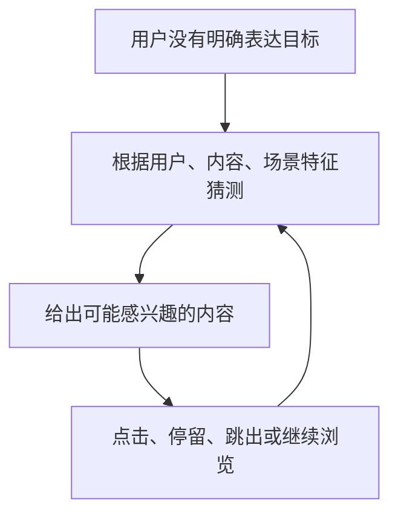
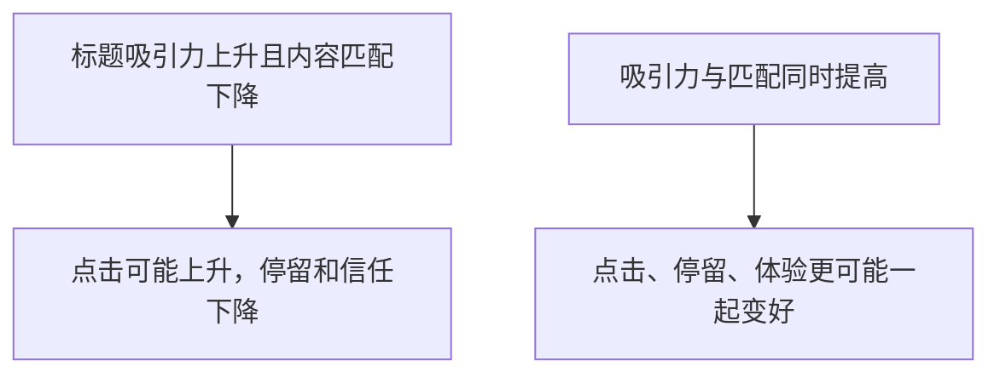
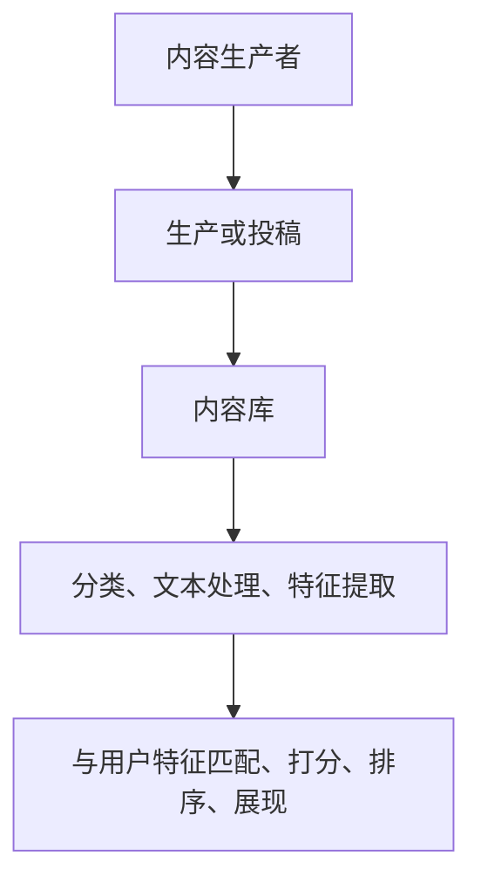
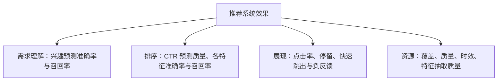

## 推荐策略

内容推荐的宏观目标是让用户愿意打开，并继续消费、停留。用户打开产品时，常常只有想找点有意思的、现在不想工作，说不出具体类型。系统必须根据特征持续预测，再用点击、停留修正。

这与搜索不同：搜索至少有 query；推荐经常没有明确表达。兴趣还可能在一次浏览里连续跳转，从八卦到新闻再到价格、天气，所以推荐不能一次性打上喜欢某类的标签。见[功能导向型策略框架](01-framework.md)、[搜索策略](02-search.md)。



核心关系是：推荐是持续猜测，用行为修正下一轮判断。

### 需求理解：特征、历史、实时场景

需求理解是：根据可观测信号，预测用户此刻愿意点击或消费什么。

$$
Interest(user, content, context) = f(用户特征,\ 内容特征,\ 场景特征,\ 历史行为)
$$

课程没有给出模型或权重。输入可以分成：

| 输入层 | 示例 | 作用 |
| --- | --- | --- |
| 用户基础 / 设备 | 手机型号、位置等 | 使用场景线索，不能直接当身份结论 |
| 长期行为 | 历史点击、主题偏好、对某对象的点击比例 | 稳定兴趣先验 |
| 短期行为 | 最近一次或近期点击 | 即时兴趣变化 |
| 实时场景 | 天气、当前环境 | 此刻上下文 |
| 内容对象 | 主题、类别、关键词、质量 | 待推荐内容本身 |

长期画像不能压死短期行为：用户长期爱娱乐，刚刚连续点了行业新闻，就要允许探索。设备、坐标只是可能被模型用的特征，不能从学校附近直接写成这人是学生。

衡量仍看各特征或规则的准确率、召回率。真实感兴趣可用点击、有效停留等近似，口径必须在项目里写清。输入不是越多越好，要看每个特征对预测的贡献和自身质量。

### 排序：从规则维度到特征加权

解决方案分排序和展现。排序决定给谁看什么，展现决定用户能否识别并愿意消费。

常见基础是 CTR 模型：预测某个用户点击某条结果的概率，再按分数排候选。

$$
CTR(user, content) = P(点击 \mid 用户特征,\ 内容特征,\ 场景)
$$

同一条内容对不同用户分数不同；同一用户在不同场景对同一内容也可能不同。CTR 是用户与结果的组合分。点击是兴趣信号，不等于长期满意或有效阅读，必须和停留一起看。

**规则推荐**按维度各自出结果，再混合：协同（喜欢 A 的人也喜欢 B）、内容相似（看过同类再推同类）、知识或系列关系（一部电影推同系列）。它能快速启动、表达常识、做兜底，但 PM 能想到的维度有限，结果成组出现、难解释单条为何更合适，规则一多就到瓶颈。

**特征化**：把成组规则打散成用户与内容之间的细特征（协同是否存在、紧密程度、与历史兴趣的相似度等），加权后得到该组合的分数：

$$
Score(user, item) = \sum_{i} w_i \cdot feature_i(user, item, context)
$$

这是课程特征加权求和的结构化表达，不是规定必须用线性模型，也没有给出真实权重。好处是：可解释单条为何靠前、可单独评估特征、可让最新行为参与、可用反馈持续改。

| 规则推荐 | 特征化 / 模型排序 |
| --- | --- |
| 先定义维度，各自产出一组结果 | 把关系拆成多个特征 |
| 结果往往成组出现 | 每个用户与内容组合单独打分 |
| 易解释常识，优化很快到瓶颈 | 可评估、可调权重、可学习 |
| 难知道单条为何被推 | 可以看特征贡献和反馈 |

喜欢 A 的人也喜欢 B，在推荐里可以探索关联；在搜索主结果里则要求更强的主体一致，见[搜索策略](02-search.md)。

规则仍有位置：冷启动、兜底、产生候选。到了规则越加越说不清贡献时，再拆特征。

### 展现：点击诱因与正文必须一起评估

推荐展现更偏向吸引点击并留下，尽快定位唯一答案则更接近搜索。要考虑标题、摘要、卡片排列、表达形式，以及展现信息是否与正文匹配。

可以从历史被点击的标题和关键词里抽象更容易引发点击的表达，甚至给创作者标题建议。这条路有对称风险：



标题党是典型失败：短期 CTR 变好，用户发现正文对不上就快速跳出。评审至少问：点击前能否理解主题、标题是否兑现正文、点击后是感兴趣停留还是立刻退出。

| 展现对象 | 要回答的问题 | 一起看的指标 |
| --- | --- | --- |
| 标题 | 是否引起兴趣且准确 | CTR、快速跳出 |
| 摘要 | 是否帮用户判断内容 | CTR、停留 |
| 卡片 | 是否突出用户关心的信息 | 点击、继续浏览 |
| 标题与正文 | 是否兑现点击前承诺 | 短停留、负反馈 |

课程没有给出特定标题算法。用点击和停留验证展现规则，而不是追求固定文案模板。

### 资源：供给与内容特征

没有对象就没有推荐。新闻要有文章，电商要有商品，视频要有片源。质量看是否丰富、是否值得消费、是否及时、能否打开、分类标注对不对。

供给可以用产品手段建设：吸引创作者投稿，形成可用内容库。算法不能凭空补供给缺口。

原始内容还要分类、抽文本特征、得到主题和关键词，才能和用户特征匹配。资源指标包括覆盖度、时效性、各类特征的准确率与召回率。覆盖高但质量差、分类错、过期，排序再强也选不出好结果。数据底座见[数据策略](../07-growth-risk-data/03-data.md)。



| 资源层 | 质量问题 | 指标方向 |
| --- | --- | --- |
| 内容供给 | 对象够不够、够不够丰富 | 覆盖，同时兼顾质量 |
| 内容质量 | 是否值得推荐、能否消费 | 质量评价 |
| 内容时效 | 新闻等是否及时 | 时效满足 |
| 分类与特征 | 类别、主题是否抽对 | 准确率、召回率 |

### 问题定位：理解错、匹配错、展现错、资源错

整体 CTR 下降时，不要直接改排序模型。先判断坏在哪一层：

**理解错**：推荐与近期兴趣明显不符。查历史是否记对、实时点击是否进特征、场景是否缺失、长期兴趣是否压死短期。

**匹配或排序错**：相关内容存在，但用户要滑很久才看到。查候选全不全、CTR 分数是否合理、某一特征是否霸榜、多策略是否没有综合好。

**展现错**：点击上升、停留下降、快速跳出增加。查标题是否夸张、标题与正文是否匹配、卡片是否误导、是否把短期点击当唯一目标。

**资源错**：重复、过时、分类错、供给不足。查生产是否正常、特征抽取准不准、更新是否及时、内容能否消费。

四类问题对应三模块：需求理解、解决方案（排序加展现）、资源支撑。监控上要把核心（点击、停留）和观察（跳出、负反馈、继续浏览）拆开，见[效果监控与策略监控](../02-discovering-problems/03-monitoring.md)。



假设 CTR 上升而停留下降，优先查展现和标题与正文，而不是先加协同规则。假设相关内容在库里却总排后面，再查排序特征和候选。假设全是过期新闻，先查供给和更新。

### 指标与模板

$$
CTR = \frac{发生点击的推荐展现次数}{推荐展现总次数}
$$

$$
平均停留时间 = \frac{\sum 内容停留时长}{有效内容消费次数}
$$

有效停留的起止、后台停留、自动播放是否计入，课程没有规定，必须产品自己定义。特征也要拆开评估：协同是否真的紧密、历史相似度是否带来停留、实时场景是否过拟合一次误点。整体 CTR 变化说明不了是哪条规则或哪类内容在动。

```text
策略名称：内容推荐
目标：点击并持续停留 / 消费

需求理解
- 用户通常不明确想看什么
- 用户特征、历史行为、实时场景、内容特征
- 输出：用户与内容兴趣或点击预测
- 指标：特征准确率、召回率

排序
- 规则维度：协同、内容、知识 / 系列
- 特征化打分，按 CTR / 兴趣分数排序
- 注意：分数是组合分，不是内容绝对质量

展现
- 标题、摘要、卡片
- 同时看吸引力与正文匹配
- 风险：标题党、短停留

资源
- 推荐对象供给、质量、时效、可用性
- 分类与文本特征
- 覆盖度、特征准确率 / 召回率

核心指标：点击率、停留时间
观察：快速跳出、负反馈、继续浏览
```

### 常见误区

1.  把目标写成用户喜欢某类内容；兴趣会在一次浏览中变。
2.  只看历史、不看实时，推荐会滞后。
3.  CTR 模型预测的是点击概率，不是喜不喜欢的最终判决。
4.  规则越多越好；要拆成可评估特征。
5.  只优化标题点击、不管正文匹配。
6.  把推荐算法当成供给替代品。
7.  只看整体 CTR，不拆到特征和策略。
8.  补写课程没有的模型结构、权重和阈值。
9.  一次误点把长期兴趣整个改掉；短期修正要可回退。
10. 协同过宽会把弱相关内容推满，看起来有关联却留不住。

适合：需求不完全明确、候选多、长短期行为都会影响、可用点击和停留观察。用户有非常明确的单一需求时，搜索或直达答案可能更合适。医疗、金融等高风险内容不能只按点击和停留优化；停留越长越好也不能套所有场景，要区分有效消费、误触和被标题误导后的停留。内容平台若还要平衡创作者与广告主，单侧套完本篇后接到[业务导向型策略框架](../06-business-oriented/01-framework.md)。

### 延伸阅读

-   [功能导向型策略框架](01-framework.md)
-   [搜索策略](02-search.md)
-   [理想态](../02-discovering-problems/04-ideal-state.md)
-   [效果监控与策略监控](../02-discovering-problems/03-monitoring.md)
-   [效果回归](../03-spec-and-validation/05-effect-review.md)
-   [数据策略](../07-growth-risk-data/03-data.md)

## 来源说明

???+ note "来源说明"
    本文根据公开课程《策略产品经理》（B 站 [BV1YE411g717](https://www.bilibili.com/video/BV1YE411g717/)）整理为知识点，不是逐课笔记。

    课程中的数字、阈值和公式是教学示意，不能直接当作可上线参数。

    对应原课第 32 集。整理日期：2026-09-04。
