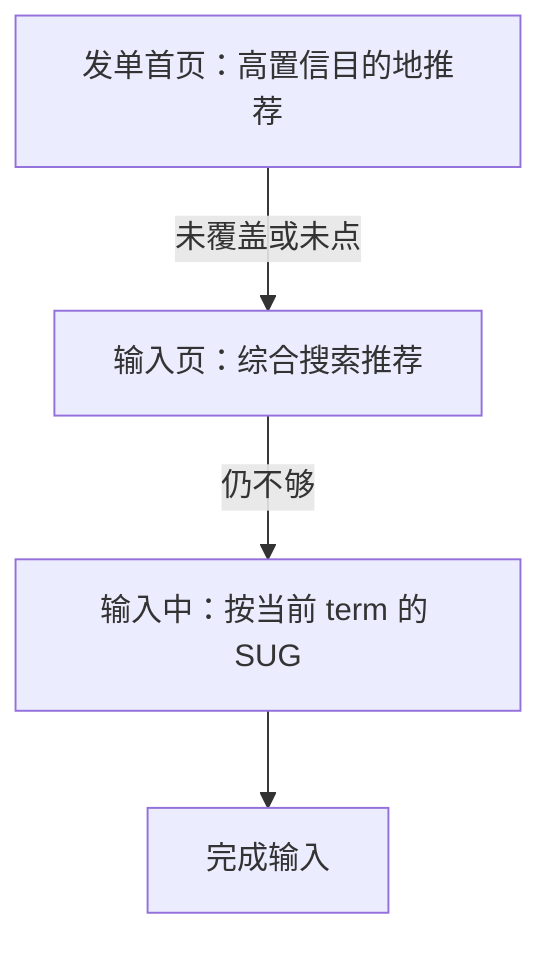
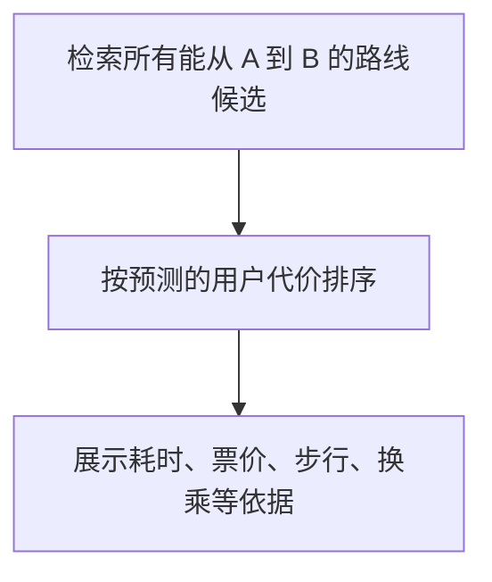

## 目的地与路线策略

两例都属于[功能导向型策略框架](01-framework.md)：服务单一出行用户，理想态可以写成完成一件工具任务。不要把它们写成两份完整产品 PRD；用来练习的是同一套拆法。

| 模块 | 共同终点 | 真正要预测的不确定部分 |
| --- | --- | --- |
| 目的地输入 | 用户选出一个有效地点 | 他还没说完时，想去哪 |
| 公交线路 | 从 A 到 B，路线必须可达 | 他眼里的最低代价是哪种 |

相对屏幕亮度这类输入较客观、理想态较明确的短例，这两例都要在不确定条件下预测，并组织多个候选。亮度实现不在本篇范围。

### 目的地输入：最低成本完成输入

产品目标：帮助用户以最低成本完成目的地输入，完成输入是终止点。

#### 需求理解：四类特征预测地点

系统在用户说完之前猜目的地。潜在需求可以写成：

```text
潜在需求 = f(出发地, 时间点, 用户历史行为, 当前 term)
```

-   **出发地**限定范围：在北京输机场，优先北京机场，而不是外地同名。
-   **时间点**区分场景：周一早上从家出发，更像去公司；周日上午更像商场、娱乐。
-   **历史行为**要群体与个体一起看。课程用机场热门度举例：多数人去首都机场，但在南苑上班的人应把南苑放前面。热门度不是每个人的第一名。
-   **当前 term**是即时意图。工作日早上去南苑的人，若开始输入我，不能继续把南苑钉死在第一，而要跟当前字匹配。历史规律不能压过这一次表达。

特征冲突时谁优先，课程没有固定公式；至少说明当前 term 不能被无视。每个推荐维度（只靠历史、时间加出发地、时间加历史加 term 等）分别看召回（这次有没有覆盖到真实需求）和准确（给出来的是不是这次要用的）。某维度对某用户反复失败，后续就应少用它。召回必须建在足够准确上，否则伤害信任。

历史订单不能直接当出行次数。连续取消、重试可能只对应一次出行；要按订单状态和时间关系清洗去重，课程未给几分钟内合并的阈值。

#### 解决方案：三级，越早完成越好

按输入流程分三级，而不是一个推荐位打天下：



优先级是：目的地推荐 > 综合搜索推荐 > SUG > 手动完整输入。这是在准确率够的前提下，越低成本的模块使用率越高越好。

核心体验是输入成本低，可用输入时长、输入步数衡量；过程上看各级完成比例、各维度召回与准确。课程未规定步数怎么计数，项目里要先固定口径。

| 框架环节 | 目的地输入里问什么 |
| --- | --- |
| 产品目标 | 何时算完成？成本如何衡量？ |
| 需求理解 | 是回顾用户，还是提前猜这一次？ |
| 关键输入 | 四类特征如何组合、冲突谁优先？ |
| 推荐维度 | 每一维覆盖谁、准到什么程度？ |
| 解决方案 | 三个阶段是否覆盖完整输入流程？ |
| 资源 | 历史有没有清洗去重、地点库全不全？ |

首页只放高置信；没覆盖或没点，必须能自然进输入页，不要阻断。综合推荐要处理多来源去重与排序，具体融合算法本节未展开。SUG 的价值是：输入前猜不准时，用户已经表达一部分，再按 term 降剩余敲字成本。

#### 迭代里只需记住的三点

与框架课互补的迭代课里，方法已经收进[效果回归](../03-spec-and-validation/05-effect-review.md)、[抽样分析](../02-discovering-problems/06-sampling.md)。这里只留三条：

1.  平均时长能判断总体，不一定能拆问题；用输入步数把路径变成可分析类别。新用户无历史、老用户历史里有目标却去搜、本次是新地点，三类问题不能共用一个搜索不好的归因。
2.  只有足够高确定性（如强通勤规律）才把推荐前置到下单页；案例里的高比例是示例，不是通用上线线。不确定时留在输入页，误选成本可能高于少点一步。
3.  推荐展示了但没人点，可能是加载慢、被 SUG 盖住，用户根本没看见。可见性和性能也是策略问题。用户访谈常只能得到没注意到，要结合真实设备和日志。App 启动时预加载定位与时间，可避免进入输入页才开始算推荐。

历史记录只按时间从新到旧，高频用户的家、公司会被新记录挤走；排序应综合频次、新近、时段和用户置顶。新用户没有个体历史，用区域热门，不要假装已经知道他要去哪。这些是迭代课里已经验证过的方向，本篇不重写版本数字。

### 公交线路：可达之后，再按因人而异的代价排

产品目标：让用户以最低代价从出发地到达目的地。A 到 B 是用户已经写明的，不必再猜起点终点。不确定的是：时间、价格、步行、换乘、准时或风险里，他此刻在意哪一种。

上班赶点、赶飞机、买菜不赶时间、行动不便少走路，最低代价不是全站同一条公式。

#### 需求理解：预测代价偏好

$$
主要代价 = f(出行时间,\ 目的地类型,\ 历史行为,\ 当前定位,\ 其他场景)
$$

输出是当前任务更关注的代价类型，不是某条具体公交。早上通勤、目的地是机场或车站，准时性权重通常上升；娱乐场所可能更松。历史选择能提示偏好，但不能当永久标签。定位只是线索：学校附近可能对价格敏感，不能写成事实。

特征都未命中时，用面向大多数人的综合默认推荐；具体综合项课程没有给权重。各偏好识别规则仍看准确率、召回率。

地图常被提前用来查第二天的路。若把查询时刻当成出发时刻，准时性和路况都会判错。策略效果不好时，不必只在旧规则里调参，可以加填写出发时间这类功能，把输入补全。这是功能反哺策略的例子。

#### 解决方案：可达、按代价排序、解释依据



没有候选时，先查线路、站点、路网资源，不要空谈排序。排序错了，用户会反复点；路线本身停运、改线，再少点击也不是好策略。

解释不是装饰：用户能判断推荐是否符合自己，预测错了也能改选。

预测用户关注时间，优先更短且可接受的到达；关注价格，更便宜；关注步行或换乘，负担更小；关注准时，更稳、更少受拥堵影响。这是排序目标的结构化表达，没有每类权重公式。

方案指标（方向来自课程，无统一阈值）：

| 指标 | 含义 | 方向 |
| --- | --- | --- |
| 路线准确率 | 推荐路线实际能到达的比例 | 越高越好 |
| 路线覆盖率 | 有效路线被检索到的比例 | 越高越好，尤其不能漏优质新线 |
| 找路点击次数 | 选定前点了多少次 | 越低越好，须与可达一起看 |
| 最终选择排名 | 采用路线在列表中的位置 | 越靠前越好 |
| 负向反馈 | 停运、过期、到不了等投诉 | 越低越好 |

#### 资源

需求侧要用户历史和目的地类型。检索侧要公交或地铁线路、站点位置、运营时间、票价、路网与步行换乘。半夜不能推荐只白天运营的线。到达时间还依赖历史路况，时间代价不是静态时刻表。资源过期会直接变成负反馈。各类资源同样看准确率、召回率、时效。

| 资源 | 用途 | 过期或错误时 |
| --- | --- | --- |
| 用户历史、目的地类型 | 预测代价偏好 | 偏好判错，排序长期偏 |
| 线路、站点、运营、票价 | 检索可达与比价 | 空结果、错结果、半夜推日间线 |
| 路网、换乘、步行 | 把线路连成可走的行程 | 理论上有线、实际上走不通 |
| 历史路况 | 预计到达时间 | 最快名不副实 |

### 两例对照：工具模块怎么套三模块

| 环节 | 目的地输入 | 公交线路 |
| --- | --- | --- |
| 需求理解 | 预测想去哪；出发地、时间、历史、当前 term | 预测在意哪种代价；出行时间、目的地类型、历史、定位 |
| 解决方案 | 三级：首页推荐 → 综合推荐 → SUG | 先可达集合，再按代价排，并展示依据 |
| 核心指标 | 输入时长、步数 | 准确、覆盖、点击、排名、负反馈 |
| 资源 | 历史清洗去重、地点库 | 线路站点运营票价路网路况 |

问题定位也同构：没覆盖先查召回和候选；给了不用先查准不准、当前表达有没有被压住；结果怪先查脏数据；用户在多模块间反复切，查链路有没有断。线路场景再加：

-   没有路线：站点匹配、线路是否完整、新线是否同步、路网、运营时间是否过滤过严
-   有路线但不能到达：改线停运、某站不停、运营过期、检索用了旧数据
-   能到但反复点：代价预测错、排序没把合适的放前面、解释不足、时分价格不准
-   常被指出过期：资源更新和负反馈闭环

两例和搜索输入侧是同一套按确定性分配帮助：高确定性前置，中确定性给候选，低确定性让用户表达后再辅助。差别是对象：地点、路线代价、网页或菜品。目的地输入的 SUG 与[搜索策略](02-search.md)的输入中建议同构，但完成条件是选中一个可发单地点。

和出行匹配的分界：本篇是工具侧（输入地点、选公交）。司机与乘客之间的撮合、补贴，属于[出行匹配策略](../06-business-oriented/03-ride-matching.md)和业务导向，不要塞进这两模块的 PRD。

### 模板

```text
工具型模块：目的地输入 / 公交线路 / 其他「完成一件明确任务」的模块

目标与终止点：
必须满足的硬约束：（有效地点 / 路线真实可达）
需要预测的不确定项：

需求理解
- 输入特征与冲突处理（待实验，不编优先级公式）
- 各规则准确率、召回率
- 输入不足时，是否用功能补输入

解决方案
- 阶段或步骤（三级推荐 / 检索、排序、解释）
- 低置信时的降级路径
- 核心、过程、观察指标

资源
- 历史、地点、线路、路网、路况等
- 清洗去重、更新时效
- 资源准确率、召回率
```

评审时最少问清：终止点是什么，硬约束是什么（有效地点 / 真实可达）；不确定项用哪些特征预测，冲突如何处理（待实验）；低置信如何降级，资源过期如何发现；目的地首页、输入页、SUG 各自何时进入；线路用户能否看懂排序依据，无特征时默认是什么。

### 常见误区

1.  只用一个特征预测目的地；或让历史压过当前 term；或只看热门不看个体。
2.  只追召回、不看准确；把三个输入阶段做成无差别列表。
3.  把订单数当出行次数。
4.  把最快当成所有人的最佳路线；只做检索、不做代价预测。
5.  只看点击、不验证可达；把查询时间当成出发时间；用定位给人贴死标签。
6.  路线数据过期还继续推；只有结果、没有排序依据。
7.  补写课程没有的权重、去重分钟数、准确率门槛。

适用：有明确终止点、可在表达完成前预测、推荐能减少步数或选择成本、底层资源会变。公交、驾车等路径选择都可以从可达硬约束加因人而异的代价起拆。只有一条固定可行方案时，不必上复杂偏好预测。涉及多角色冲突时，要接到[业务导向型策略框架](../06-business-oriented/01-framework.md)。

步数减少必须建立在正确率可接受上：前置推荐不准，纠正成本可能更高。点击推荐是采用信号，没点不等于完全不需要该地点；正式分析要结合最终目的地和完整路径。课程未给模块之间的切换阈值，不能为了提高首页使用率强行展示低置信候选。

### 延伸阅读

-   [功能导向型策略框架](01-framework.md)
-   [搜索策略](02-search.md)
-   [理想态](../02-discovering-problems/04-ideal-state.md)
-   [抽样分析](../02-discovering-problems/06-sampling.md)
-   [出行匹配策略](../06-business-oriented/03-ride-matching.md)
-   [数据策略](../07-growth-risk-data/03-data.md)

## 来源说明

???+ note "来源说明"
    本文根据公开课程《策略产品经理》（B 站 [BV1YE411g717](https://www.bilibili.com/video/BV1YE411g717/)）整理为知识点，不是逐课笔记。

    课程中的数字、阈值和公式是教学示意，不能直接当作可上线参数。

    对应原课第 24、29、30 集。整理日期：2026-09-04。
