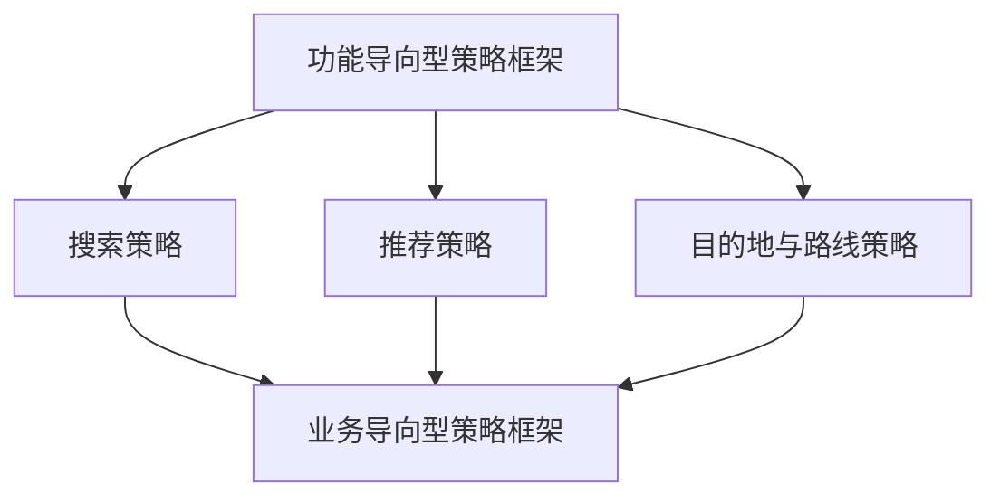

## 功能导向核心业务

服务单一用户或单一用户群、理想态相对明确时，用需求理解、解决方案、资源支撑三模块迭代。

搜索、推荐、目的地输入、公交线路都是这一类：先猜用户要什么，再给出排序或推荐，底层还要有词库、地点、内容供给。多边平台也可以先把某一侧拆出来，用本模块的框架写清楚，再拿到[业务导向核心业务](../06-business-oriented/index.md)里处理冲突。

先读框架，再读正在做的那一类。三篇应用都是同一框架的展开。

核心关系是：三模块结构相同，复杂度不同。搜索的输入与结果都复杂；推荐的需求本身不清晰、要持续猜；目的地与路线的终止点明确，不确定的是预测对象。

### 何时用本模块

| 更适合本模块 | 应转到业务导向 |
| --- | --- |
| 主要服务单一用户或单一用户群 | 需求方、供给方、履约方同时在场 |
| 可以描述相对明确的理想态 | 多方理想态互相冲突 |
| 评估可从任务完成、完成成本、结果质量出发 | 必须同时看角色收益、平台效率、生态 |
| 复杂产品里相对独立的策略模块 | 定价、派单、流量分配等连接规则 |

它对应[四大业务方向](../04-application-map/01-four-directions.md)里核心业务的左支。典型如搜索、天气、翻译、地图里的输入与路线、内容推荐。理想态较明确，仍然要按输入、规则、输出和指标来做。

### 本模块文章

-   [功能导向型策略框架](01-framework.md)：三模块、准确率与召回率、单侧拆解
-   [搜索策略](02-search.md)：降低完成搜索任务的成本；输入三段加结果侧理解、排序、展现
-   [推荐策略](03-recommendation.md)：持续猜测兴趣；CTR 是用户与结果的组合分数
-   [目的地与路线策略](04-destination-and-route.md)：工具型模块如何套三模块

### 三模块在应用篇里怎么落

| 模块 | 搜索 | 推荐 | 目的地 / 路线 |
| --- | --- | --- | --- |
| 需求理解 | 解析 query 在找什么 | 预测此刻愿意消费什么 | 预测想去哪 / 在意哪种代价 |
| 解决方案 | 召回、多层排序、降低后续成本的展现 | 规则或特征化排序，展现看点击与正文 | 三级输入帮助 / 可达后再按代价排 |
| 资源支撑 | 词库、抓取、更新、页面分析 | 内容供给、分类与文本特征 | 历史清洗、地点库 / 线路路网路况 |

每个角色的单侧分析仍用本框架。补贴、券和风控会改变约束，分别见[增长、风控与数据](../07-growth-risk-data/index.md)。

写需求时，功能 PRD 的流程原型不够，要写清输入、条件、规则、输出，见[简单策略需求文档](../03-spec-and-validation/01-simple-prd.md)、[复杂策略需求文档](../03-spec-and-validation/02-complex-prd.md)。上线后用[效果回归](../03-spec-and-validation/05-effect-review.md)看核心、过程、观察三类指标。

### 贯穿检查

-   **理想态是否可衡量**：任务完成、完成成本、结果质量要从好的体验反推，不同业务不能套同一个核心指标。见[理想态](../02-discovering-problems/04-ideal-state.md)。
-   **规则与指标是否拆开**：需求识别要有区分规则，以及准确率、召回率和真实需求如何确认。
-   **资源是否单独验收**：标签、地点、内容供给不准，排序再精也是错集合上的精。
-   **多边是否先拆单侧**：复杂产品里的独立模块可以先按本框架写清，冲突再接到业务导向。

### 读完应能做的事

-   用三模块把一个工具型策略写成可验证问题，避免停在上模型、做推荐
-   给需求识别规则写出准确率、召回率和真实需求如何确认
-   在提出理想输出时同步写核心、过程、观察三类指标
-   把资源质量与排序方案拆开：候选集合错了，排序再精也是错集合上的精
-   按正在做的对象选读搜索、推荐或目的地，不把三篇当成三套新方法

### 读完应能回答

1.  当前模块服务的是单一用户、某一用户群，还是多边里先拆出来的一侧？
2.  需求理解的区分规则是什么，真实需求如何确认？
3.  解决方案写的是用户应得到的效果，还是只写了上模型、做排序？
4.  资源从哪来、准不准、缺失时怎么处理？
5.  核心、过程、观察三类指标分别是什么，观察变差能不能宣布成功？

### 本模块证明不了的事

-   多边冲突可以忽略：单侧写清之后，仍要接到[业务导向型策略框架](../06-business-oriented/01-framework.md)
-   存在统一的准确率、召回率或 CTR 达标线
-   前置推荐数量越多越好，或所有行业都复制地图回家
-   课程中的切词模型、排序权重、更新周期可直接上线

### 阅读顺序

先读[功能导向型策略框架](01-framework.md)。正在做搜索读[搜索策略](02-search.md)，正在做信息流读[推荐策略](03-recommendation.md)，正在做输入或路线读[目的地与路线策略](04-destination-and-route.md)。赶工时，框架加一篇应用即可。

上一模块：[应用总览](../04-application-map/index.md)。对照模块：[业务导向核心业务](../06-business-oriented/index.md)。总图见[策略产品经理](../index.md)。

概念与验证仍要回看：[策略四要素](../01-concepts/02-four-elements.md)把输入、逻辑、输出写齐；[理想态](../02-discovering-problems/04-ideal-state.md)决定什么叫任务被满足；[策略通用方法论](../03-spec-and-validation/06-methodology.md)用简单规则起步。搜索、推荐、目的地三篇都是同一框架，差别只在不确定的那一侧。

| 应用 | 已经确定的 | 要预测的 |
| --- | --- | --- |
| 搜索 | 用户在完成一次查找任务 | query 在找什么、结果如何排和展现 |
| 推荐 | 用户打开产品、候选很多 | 此刻愿意消费什么 |
| 目的地 | 要选出一个有效地点 | 还没说完时想去哪 |
| 公交线路 | 从 A 到 B 必须可达 | 此刻在意哪种代价 |

三篇应用都套同一套需求理解、解决方案、资源支撑，不要当成三套新方法。司机与乘客的撮合不在本模块，见[出行匹配策略](../06-business-oriented/03-ride-matching.md)。

课程案例中的数字、阈值和公式是教学示意，不能直接当作可上线参数。

### 延伸阅读

-   [策略四要素](../01-concepts/02-four-elements.md)
-   [理想态](../02-discovering-problems/04-ideal-state.md)
-   [策略通用方法论](../03-spec-and-validation/06-methodology.md)
-   [四大业务方向](../04-application-map/01-four-directions.md)
-   [业务导向型策略框架](../06-business-oriented/01-framework.md)
-   [搜索策略](02-search.md)

## 来源说明

???+ note "来源说明"
    本文根据公开课程《策略产品经理》（B 站 [BV1YE411g717](https://www.bilibili.com/video/BV1YE411g717/)）整理为知识点，不是逐课笔记。

    课程中的数字、阈值和公式是教学示意，不能直接当作可上线参数。

    对应原课第 24 至 27、29 至 32 集。整理日期：2026-09-04。
