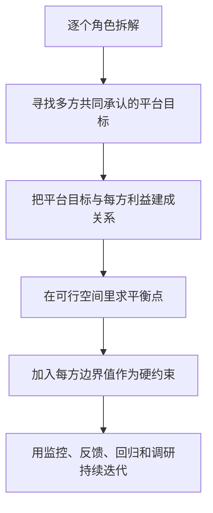

## 业务导向型策略框架

[功能导向型策略框架](../05-function-oriented/01-framework.md)面对的是一个用户群：定义理想态，再持续逼近。业务导向型业务面对的是多个用户群，而且这些理想态会打架。外卖、打车、招聘、内容创作者生态，都是这一类。

它对应[四大业务方向](../04-application-map/01-four-directions.md)里核心业务的右支。平台不能只围着用户把价格压下去，也不能只围着商家把曝光堆上去。一方变好，往往把成本推给另一方。策略要在冲突里找一条让生态还能转下去的路。[理想态](../02-discovering-problems/04-ideal-state.md)从单点最优变成带约束的多方最优。

| 类型 | 面对的对象 | 理想态关系 | 策略任务 |
| --- | --- | --- | --- |
| 功能导向型 | 一个用户 / 用户群 | 相对一致 | 持续接近一个理想态 |
| 业务导向型 | 多个用户群 / 平台角色 | 可能冲突 | 在多方理想态间寻找平衡 |

### 先认清：这是不是业务导向型问题

先问五件事：

1.  谁在用、谁在供、谁在履约、谁在付钱？
2.  每个角色最想要什么、最怕什么？
3.  两两之间，一方变好会不会增加另一方的成本？
4.  冲突发生在价格、时间、流量、订单，还是责任？
5.  有没有一个各方都能部分承认的共同结果？

如果只有一个用户群、理想态大致同向，回到[功能导向型策略框架](../05-function-oriented/01-framework.md)。如果多方互相牵制，再用本篇。

### 两步，不要一步跳到平台最优

#### 第一步：每个角色先套功能导向框架

直接从平台总指标出发，容易把某一方的损失藏进平均数里。正确顺序是：对每个角色单独走一遍[功能导向型策略框架](../05-function-oriented/01-framework.md)。

每个角色至少写清：

-   需求满足的[理想态](../02-discovering-problems/04-ideal-state.md)
-   产品给它的解决方案
-   支撑它行为的资源
-   核心指标、过程指标、观察指标
-   再差一步会离开生态的底线

每个角色都可以写成一张卡片。外卖三张示意如下，指标名称要由业务定义，课程没有给出平台真实口径。

```text
用户侧
需求：便宜、好吃、容易找到、按时收到
输入：位置、时间、偏好、价格、商家和菜品
方案：搜索、推荐、排序、配送承诺
核心 / 过程 / 观察：下单体验；价格感知、取消、投诉、复购

商家侧
需求：曝光、流量、订单、收入、可执行的履约
输入：供给质量、出餐能力、经营状态
方案：排序、广告、流量分配、出餐规则
核心 / 过程 / 观察：订单与收入；退出、投诉、供给稳定性

骑手侧
需求：少等待、单位时间收入、稳定订单
输入：位置、订单、路线、出餐与送达时间
方案：派单、拼单、路径与时间安排
核心 / 过程 / 观察：收入与效率；等待、取消、接单率、退出
```

这三张卡片还不是平台策略，只是后面做平衡的原料。直接从平台总 GMV 出发，骑手流失可以藏在订单还在涨里。

#### 第二步：建立多边关系

功能给用户一条看得见的路；策略给一条不一定看得见的路，把人和资源连上。多边关系问的是：

-   哪些角色必须连在同一笔交易里？
-   连接规则是什么？谁先让、让多少？
-   怎样判断这条连接合理？
-   某一方伤到什么程度就不能再让？

顺序固定：角色理想态 → 平台共同目标 → 目标与各方利益的关系 → 在边界内求解 → 用角色指标和平台指标一起看。

### 美团外卖：一张短冲突矩阵

一笔外卖订单要用户、商家、骑手同时在场。冲突可以压成三对，不必把每个角色的完整卡片再写一遍。

| 角色关系 | A 想要 | B 想要 | 冲突点 | 可用来做桥的指标 |
| --- | --- | --- | --- | --- |
| 用户与商家 | 便宜、好吃、少干扰、容易找到 | 更多曝光、订单、收入 | 低价 / 少广告 vs 高曝光 / 高收入 | 推荐与广告如何共同决定列表 |
| 用户与骑手 | 尽快、少绕路、承诺时间内收到 | 同一时段多送几单 | 单单优先 vs 拼单增收 | 承诺配送时间 |
| 商家与骑手 | 按自己节奏出餐、保证新鲜、兼顾堂食 | 到店即取、少在店里耗时间 | 出餐节奏 vs 配送效率 | 出餐时限与等待 |

用户和商家之间，内容推荐偏向帮用户发现，广告偏向帮商家获流，二者共同决定排序。完全广告化，用户找不到想吃的；完全不管商家经营，供给会退出。

用户和骑手之间，先守住用户可接受的送达边界，再在余量里给骑手拼合适的单。

商家和骑手之间，出餐太早伤品质，出餐太晚伤运力。平台用出餐要求、派单节奏和等待分配，把互相损害改成共同履约。

三方仍能待在同一个生态里，是因为有一个共同结果：平台交易密度上去，用户有得选、商家有单、骑手有活。策略用规则把冲突接到这个共同结果上。

### 共同利益、平台目标、边界值

#### 共同利益不是某一方的理想态

用户目标或商家目标都不能直接当平台目标，否则另一方会被系统性牺牲。要跳出单方，找一个各方都能部分承认、又和每方利益有关的宏观结果：交易完成、服务可持续、生态还在。

共同利益可以先写成服务指标。外卖里，承诺配送时间同时约束用户准时收到、骑手在余量内多接。它不是平台唯一目标，只说明：平衡需要一个能把多方利益接到一起的量。

#### 平台目标要拆到各角色利益

概念上：

$$
PlatformObjective = F(B_{user}, B_{merchant}, B_{courier}; Stage)
$$

$B_i$ 是第 $i$ 个角色的利益或体验，$Stage$ 是平台阶段，$F$ 是组合方式。课程没有规定 $F$ 必须是加权求和，也没有给出权重。实际可能是分段、带约束、随阶段变权。没有这层关系，就解释不了用户为什么要等、商家为什么接受某种流量、骑手为什么接受某种拼单。

#### 边界值：可承受的最大伤害

综合目标最大化时，一定会出现一方更好、另一方变差。所以每个角色要有一条线：可承受的最大伤害。线以内可以让；越过线，体验不可接受，人会离开。

约束是：

$$
B_i \geq Boundary_i
$$

若指标是损失而不是收益，则写成 $Loss_i \leq MaxTolerableLoss_i$。

只看共同利益不够。用户等太久不再下单、商家长期不挣钱退出、骑手收入掉破底线不接，总体数字再好看也撑不住。边界要从历史取消、退出、接单率转折里找，并写进[效果监控与策略监控](../02-discovering-problems/03-monitoring.md)。

### 平衡允许阶段性偏向，越界会破坏生态

平衡不是流量、收入、体验永远三等分，也不是每个阶段一视同仁。

-   启动、扩张期可以更偏向用户，用补贴把密度做起来
-   规模起来后，长期补贴不可持续，可能回归原价、提高商家经营空间
-   偏向方向随[理想态](../02-discovering-problems/04-ideal-state.md)的阶段定义和业务目标变

这是阶段性偏向，前提是让步仍落在其他角色的边界之内，并且留得下切换信号：供给是不是在走、履约是不是在垮、用户是不是在逃。

越界的典型样子：用户侧把价格压到商家无法经营；商家侧把广告堆到用户找不到想要的；运力侧把拼单加到承诺时效之外。局部指标可能短暂变好，生态会裂。先让每一方达到最低边界，再把剩余资源分给对总体目标贡献更大的一方。课程没有给出真实平台的分配比例。

### 六个步骤



**第 1 步**产出角色卡片。没有这一步，总体数字会把某一方的溃败洗掉。

**第 2 至 4 步**决定最优朝哪走、落到变量、在当前阶段求解。共同目标必须能和每方利益说话。没有 $B_i$ 和 $Stage$，算法求出的只是一个数字。$F$ 可以是加权、分段或带约束。PM 先定义目标和可行域。

**第 5 步**把求解关进笼子：先保证 $B_i \geq Boundary_i$，再谈总体最大。

**第 6 步**接回[工作循环](../01-concepts/04-workflow.md)：监控同时看平台指标和角色边界；调研和抽样核对总体变好是不是某一方在默默退出；[效果回归](../03-spec-and-validation/05-effect-review.md)验证阶段目标切换后生态是否还在。

写入需求时至少能回答：角色是谁、冲突在哪、共同目标是什么、阶段偏向谁、各方边界如何观测。突破边界的风险应高于再优化一点单方体验。评估要能对照角色指标。

阶段切换要留下记录，否则后人会把早期补贴用户和后期提高商家利润看成策略自相矛盾：

```text
当前阶段：启动 / 扩张 / 成熟
平台主目标：增长 / 收入 / 效率 / 生态稳定
倾向角色与理由：
对其他角色的让步：
各角色边界是否仍满足：
阶段切换信号：供给、履约、取消、退出
```
### 模板

```text
策略 / 业务名称：
平台阶段：启动 / 扩张 / 成熟
角色列表：

一、单角色拆解（每方一张）
- 需求理想态、解决方案、资源支撑
- 核心 / 过程 / 观察指标
- 最低可接受体验（边界值）与观测方式

二、多边关系
- 哪些角色直接冲突、发生在哪一环
- 一方让步如何改变另一方
- 共同目标、阶段性侧重点

三、综合平衡
- 平台目标与各角色利益的关系（公式或逻辑）
- 约束：B_i ≥ Boundary_i
- 平衡结果、监控与回滚
```

### 常见误区

1.  把多边平台当成单用户功能来做，只选一个理想态。
2.  以为平衡就是平均分，或把阶段性偏向理解成朝令夕改。
3.  只追用户便宜、只追商家广告、只追骑手接单量，不看被转移的成本。
4.  只看平台总订单、总交易额，不拆角色指标和边界。
5.  先写让算法求最优，再补目标和约束。
6.  只设共同利益，不设边界；或把课程没有给出的权重、比例补成定论。

适用：双边或多边、需求方与供给方（及履约方）同时在场、理想态冲突、需要分配流量、订单、价格、时间。单一用户群、冲突不明显时，用[功能导向型策略框架](../05-function-oriented/01-framework.md)更直接。合规、安全、公平是额外约束，本框架讲的是利益平衡，不能替代它们。

### 延伸阅读

-   [理想态](../02-discovering-problems/04-ideal-state.md)
-   [策略通用方法论](../03-spec-and-validation/06-methodology.md)
-   [四大业务方向](../04-application-map/01-four-directions.md)
-   [功能导向型策略框架](../05-function-oriented/01-framework.md)
-   [定价策略](02-pricing.md)
-   [出行匹配策略](03-ride-matching.md)

## 来源说明

???+ note "来源说明"
    本文根据公开课程《策略产品经理》（B 站 [BV1YE411g717](https://www.bilibili.com/video/BV1YE411g717/)）整理为知识点，不是逐课笔记。

    课程中的数字、阈值和公式是教学示意，不能直接当作可上线参数。

    对应原课第 33 集。整理日期：2026-09-04。
