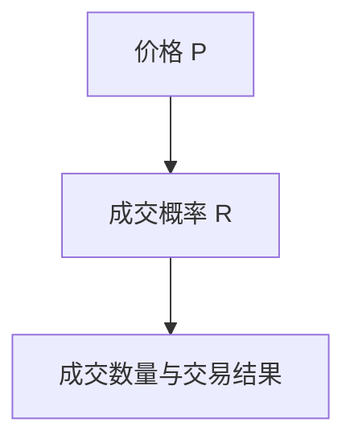
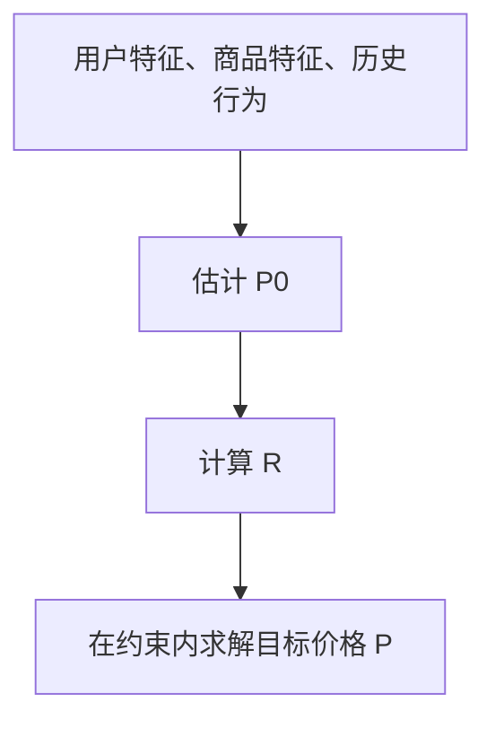
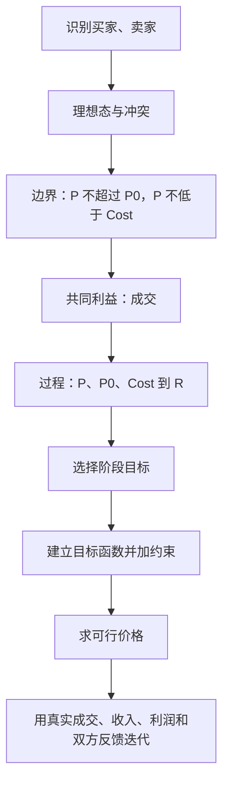

## 定价策略

定价是[业务导向型策略框架](01-framework.md)的第一块实例。买家希望更低，卖家希望更高，双方理想态反向。策略要先问当前阶段最大化的是什么，再看价格如何把共同利益和个体利益接起来。

同一套买卖双方、同一件商品，目标一换，最优价就换。这是[策略通用方法论](../03-spec-and-validation/06-methodology.md)目标决定手段在价格上的窄化。

### 两个边界，一段可成交区间

买家有一个心理价位 $P_0$：根据商品价值、能解决的问题、支付意愿，愿意付出的最高价格。它是主观判断，系统里通常没有现成字段，更不是标价。

卖家有一个成本 $Cost$：再低就不愿意卖。课程把成本当成卖家掌握的相对客观输入。现实里还有库存、固定费用、渠道、税费、机会成本，本篇不展开；先抓住卖家底线这一层。

一次交易要发生，实际价格 $P$ 至少满足：

$$
Cost \leq P \leq P_0
$$

$P > P_0$，买家可能不买；$P < Cost$，卖家可能不卖。若 $P_0 < Cost$，这段区间是空的，硬定一个价解决不了问题，要改价值认知、成本结构或阶段目标。库存、竞争、券、抽佣会进一步缩小或扭曲这段区间，但本篇先把两端边界夹出可行价讲清楚。

可成交不等于应该成交在区间正中。中点没有策略含义；落在哪一端，由阶段目标决定。

### 成交概率 R：价格差是感觉

买家在买与不买之间做决定。课程用 $R$ 表示成交概率，并把它和实际价格、心理价位的关系连在一起：

$$
R = f(P_0 - P)
$$

方向是：$P_0-P$ 越大，成交往往越容易。用户关心的通常是比我心里那个数便宜多少。以为十块会买、五块觉得很划算、九块只便宜一块像被忽悠，说的是同一件事。

这是方向，不是线性定律。真实关系可能有阈值、非线性、商品差和人差，要用历史成交验证，不能写成固定比例。

心理价位是预测。估高了，系统以为还能涨，实际成交会低于预期；估低了，价偏保守，成交率可能好看，销售额或利润被让掉。预测误差会进入 $R$，再进入后面每一个目标函数。

### 价格是共同利益和个体利益之间的桥

双方都希望成交：不成交，买家拿不到商品，卖家拿不到收入。成交是共同利益，价格则决定这笔共同结果怎么在双方之间切，并经由 $R$ 影响能成交多少笔。



所以卖家不能只看单笔单价，买家也不能只看绝对数字。真正要分析的是：价格 → 成交意愿 → 总量 → 阶段目标。价格越低通常对买家越有利，但卖家每单更薄；价格越高通常对卖家越有利，但 $R$ 可能下降。桥的两端都要看。

评审时连续问：双方分别要什么？共同认可的交易结果是什么？价格如何改变购买决策和成本覆盖？目标是成交率、销售额还是利润？$P_0$ 和 $Cost$ 怎么来？任何一方的边界是什么？

### 三步，而不是直接算一个价

1.  **双方利益**：各自理想态、共同利益（成交）、冲突在价格分配上。
2.  **交易过程**：$Cost$、$P_0$、$P$、$R$ 如何串起来；心理价位怎么估计。
3.  **阶段目标下的公式**：成交率、销售额、利润，目标变则 $P$ 变。

这是[策略通用方法论](../03-spec-and-validation/06-methodology.md)的目标决定手段在价格上的落地，也是[业务导向型策略框架](01-framework.md)先共同目标、再求解的窄化。

### 心理价位：统一估计还是按人估计

| 方案 | 做法 | 特点 |
| --- | --- | --- |
| 简单 | 一件商品一个参考心理价 | 好启动，吃不到个体差异 |
| 复杂 | 用用户与商品特征预测 $P_0$ | 更贴人，预测错了直接打到成交和收益 |

课程只说可以用复杂特征，也可以先用一个固定值。可以预测，不等于应该对每个人收不同价。个性化定价还要面对公平、解释、隐私和观感，本篇不把它写成默认结论。

成本相对客观，心理价位必须从需求、价值认知、历史接受过的价格、品类支付意愿里推。输入错，后面的最优价跟着错。这和[推荐策略](../05-function-oriented/03-recommendation.md)里预估的是行为概率是同一类诚实：模型给的是预测，要用成交结果回看。



课程没有要求实现个性化定价，也没有讨论公平与监管。上面只是若要按人估计，$P_0$ 从哪来的数据流。

### 目标不同，价格不同

先写约束，再写目标：

$$
Cost \leq P \leq P_0
$$

没有这条，成交率目标会把价格往零推，销售额或利润目标可能把价格推过买家边界。

#### 成交率最大

在价格越低、$R$ 越高的简化设定下，成交率最大的价格会被压到卖家底线：

$$
P^{*}_{\text{conversion}} \approx Cost
$$

前提是仍存在可成交区间。买家舒服、规模可能起来，卖家利润空间很小。适合特定阶段，不能自动当成长期商业目标。简单目标不必套很重的公式；保留公式是为了目标变复杂以后还能在同一套变量里求解。

#### 销售额最大

总期望销售额来自单价乘成交概率。单用户：

$$
ExpectedRevenue(P) = P \times R(P_0, P)
$$

多用户、允许不同价时：

$$
TotalRevenue = \sum_{u} P_u \times R_u(P_{0,u}, P_u)
$$

涨价提高单笔，但可能压低 $R$。峰值在中间，不在最低价。所有人完全相同、关系也相同，公式会塌成很短的一截。先从单件、统一用户练手，再加人和场景差异。

#### 利润最大

最简的单件变动成本：

$$
ExpectedProfit(P) = (P - Cost) \times R(P_0, P)
$$

价太低，$R$ 高但单笔几乎没剩；价太高，单笔厚但卖不掉。利润率还要把期望利润放在期望销售额上，口径会牵涉固定成本、抽佣，课程没有给完整项，这里不补。

| 目标 | 核心表达 | 价格倾向 | 主要风险 |
| --- | --- | --- | --- |
| 成交率 | 最大化 $R$ | 不低于成本的前提下尽量低 | 利润被掏空 |
| 销售额 | 最大化 $P \times R$ | 单价与成交量折中 | 可能伤支付意愿 |
| 利润 | 最大化 $(P-Cost)\times R$ | 单笔利润与成交量折中 | 价高导致成交掉下去 |

同一商品、同一对买卖双方，阶段目标一换，最优 $P$ 就换。早期要密度，可能贴近成本；规模起来要流水，走进 $P\times R$；更成熟要留下收益，走进 $(P-Cost)\times R$。这是阶段性偏向，仍须落在双方边界内，见[业务导向型策略框架](01-framework.md)。

### 判断逻辑



成交是连接点。新平台可能先要成交率和用户规模，长大后要销售额，再往后要利润和可持续。评估接[效果监控与策略监控](../02-discovering-problems/03-monitoring.md)和[效果回归](../03-spec-and-validation/05-effect-review.md)：对照的是实际成交与角色反馈，不是公式写得漂亮。心理价位估高，成交会低于预期；估低，利润被让掉。误差要进下一轮。

写入需求时，[简单策略需求文档](../03-spec-and-validation/01-simple-prd.md)至少要有目标、区间、心理价位如何估计、成本口径、看哪些指标。一旦按人定价、规则依赖预测模型，升到[复杂策略需求文档](../03-spec-and-validation/02-complex-prd.md)，并在[Diff 评估](../03-spec-and-validation/04-diff-evaluation.md)里看价格分布和成交结构怎么变。[开发评估](../03-spec-and-validation/03-dev-evaluation.md)要能讲清：统一价还是按人价、预测失败时的兜底、价格展示是否可解释。

三个阶段可以对照着写，避免把涨价本身当成策略：

| 阶段背景 | 共同利益仍是成交 | 求解倾向 |
| --- | --- | --- |
| 要密度、要尝到甜头 | 价格贴近成本，提高 $R$ | 买家体验优先，卖家空间薄 |
| 规模已有、原价过低 | 在 $P\times R$ 里找峰值 | 单价与成交量折中 |
| 要留下收益 | 在 $(P-Cost)\times R$ 里找峰值 | 单笔利润与成交量折中 |

上线前至少确认：目标函数与阶段一致；$Cost \leq P \leq P_0$ 写进约束；$P_0$ 标明是预测；上线后同时看 $R$、销售额、利润和双方边界。

增长漏斗与商业约束，见[商业化与增长](../../../pm/monetization.md)。本页讲策略如何把价格接到成交概率；那页讲商业模式、定价模型和 unit economics。

### 模板

```text
策略名称：商品定价
平台 / 业务阶段：
角色：买家、卖家
共同利益：促成交易

边界
- 买家心理价位 P₀：如何估计（统一 / 按人）
- 卖家成本 Cost：口径
- 可行区间：Cost ≤ P ≤ P₀

交易过程
- R = f(P₀ − P) 是否用数据验证过
- 用户差异、预测误差如何进入求解

阶段目标：□ 成交率  □ 销售额  □ 利润  □ 其他
目标函数与约束：
验证：实际成交、收入、利润、双方反馈
```

### 常见误区

1.  先问价格，不问目标。
2.  把最高价当成卖家唯一目标，或把最低价当成双方都满意。
3.  把心理价位当成客观数据，或假定价差越大成交率按固定比例升。
4.  只看单笔价格，不看 $R$；只看销售额，不看利润。
5.  一上来就上复杂公式和个性化，不先做可理解的简化模型。
6.  只建公式，不拿真实交易验证；把课程示意符号当成生产参数。

适用：买卖双方共同参与、价格同时影响购买意愿和卖方收益、可以估计 $R$、阶段目标会变。有库存、多卖家、竞争、拍卖、补贴、券、抽佣时，单一四变量不够，要加供给和平台约束。出行里价格相对标准化，冲突更多转到匹配价值上，见[出行匹配策略](03-ride-matching.md)；券和补贴是另一种改有效价格的杠杆，见[增长策略](../07-growth-risk-data/01-growth.md)。价格由法规或目录锁死、没有议价空间时，重点往往在履约和展示。

### 延伸阅读

-   [理想态](../02-discovering-problems/04-ideal-state.md)
-   [策略通用方法论](../03-spec-and-validation/06-methodology.md)
-   [业务导向型策略框架](01-framework.md)
-   [推荐策略](../05-function-oriented/03-recommendation.md)
-   [出行匹配策略](03-ride-matching.md)
-   [商业化与增长](../../../pm/monetization.md)

## 来源说明

???+ note "来源说明"
    本文根据公开课程《策略产品经理》（B 站 [BV1YE411g717](https://www.bilibili.com/video/BV1YE411g717/)）整理为知识点，不是逐课笔记。

    课程中的数字、阈值和公式是教学示意，不能直接当作可上线参数。

    对应原课第 34 集。整理日期：2026-09-04。
