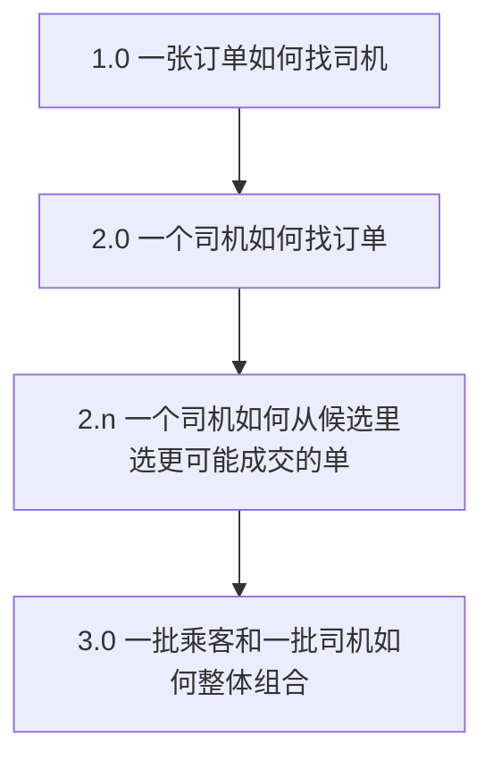
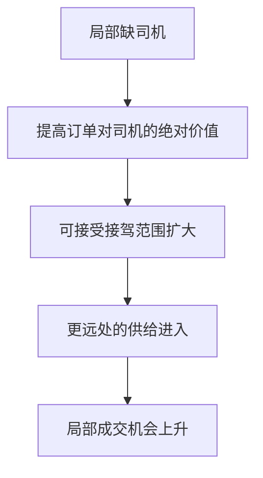

## 出行匹配策略

出行是[业务导向型策略框架](01-framework.md)落到撮合系统上的完整例子。从 0 到 1 要回答：双方理想态冲突时，边界和阶段目标是什么。从 1 到 N 要回答：订单密度、供给竞争和空间分布变了以后，决策中心为什么必须迁移。

底层共同利益一直是成交；变的是谁来决策、用什么信息、在什么约束下逼近可行解。成交率不要窄成某个按钮被点，而是需求产生、匹配、接单到完成的整体成功程度。不同阶段可以用不同代理指标，但要能回到双方交易是否发生。

### 从 0 到 1：冲突、边界、成交率

#### 表面需求和深层需求

乘客说最近的车，深层是等待短、尽快得到服务。司机说最挣钱的单，深层是单位时间收益：接驾别太远、行程别太碎、别堵死在路上。距离只是代理变量。

只有一对司乘时，没有选择，匹配自然成立。现实是多人抢有限的好司机和好订单：乘客 A 最近的司机，对司机来说最近的可能是乘客 B。不能把每个人拿到第一选择写成可行目标。

价格在出行里往往相对标准（起步价、里程价）。冲突更多是同等价格下的价值分配：乘客想要更近、更好的车；司机想要更近、更长、更顺路的单。

#### 边界：让步可以，越线不行

| 对象 | 理想态 | 更可观测的成本 | 边界 |
| --- | --- | --- | --- |
| 乘客 | 合适的车尽快到 | 等待带来的不愉快 | 最长可接受等待 |
| 司机 | 单位时间收益更高 | 空驶时间、油耗、机会成本 | 最远可接受接驾 |

边界看的是再差一步，取消、拒单、流失会明显起来，不是最喜欢等多久。来源可以是体验判断、平台承诺、历史取消或接单曲线。课程没有给出通用的分钟数和公里数，阈值必须由业务数据定。

共同利益是交易发生：乘客叫到车，司机完成单，平台撮合成功。阶段性目标先取成交率最大化，尽量消化当前时刻的订单。这不是永远的唯一目标，只是 0 到 1 常用的第一刀。

成交率阶段，双方让步不必对称。乘客等待偏隐性；司机接驾是时间、油耗和机会成本，更显性。系统仍要长期稳住：司机长期觉得不值会走，价格再调、乘客再变，供需会进入新的反馈。平台不是封闭系统，评估不能只看一次派单。

#### 规则：先过滤越界，再估计成交，再选组合

1.  去掉越过任一方边界的候选
2.  为每个司乘对估计成交概率 $p_{r,d}$（类似[推荐策略](../05-function-oriented/03-recommendation.md)里估计一次行为发生的概率）
3.  在剩余组合里选整体成交更好的方案

教学化加总：

$$
Score(M)=\sum_{(r,d)\in M}p_{r,d}
$$

$M$ 是一种一对一匹配方案。真实系统还要处理取消、容量、优先级，不能只靠这一式。

#### 组合爆炸、近似最优、分工

1 对 1 只有一种；10 个乘客和 10 个司机的一对一排列是 $10!=3{,}628{,}800$。订单量感觉只涨了三倍，匹配计算不是三倍：同时在场的人变多，组合暴涨，还要在秒级甚至毫秒级返回。乘客可能取消，司机在移动，等得越久原先的估计越不准。

线上不追求数学上的绝对最优，而在时限内找足够好的可行解。再抠最后一点收益，计算时间可能从秒变成无法上线的规模。

| 角色 | 负责什么 |
| --- | --- |
| 策略产品经理 | [理想态](../02-discovering-problems/04-ideal-state.md)、双方边界、阶段目标、目标与各方利益的关系、超时和降级时的体验 |
| 算法 / 工程 | 在时限和资源下逼近目标，过滤、分区、降级、性能 |

PM 要懂复杂度会伤害体验，但不必把求解器细节写成需求。需求结构见[复杂策略需求文档](../03-spec-and-validation/02-complex-prd.md)；上线对照见[Diff 评估](../03-spec-and-validation/04-diff-evaluation.md)。计算超时、无供给、拒绝和取消时的体验，属于产品边界，要写进需求。

高峰补贴把日订单从感觉涨三倍拉起来时，匹配面对的不是三倍工作量：同时在场的人变多、组合暴涨、每个组合还要估 $p_{r,d}$、还要在实时窗口内返回。能力不够时，用户看到的是打不开、发单转圈。这是产品问题。

### 从 1 到 N：决策中心跟着现状走

目标或现状变了，问题变，手段才变。低密度阶段上复杂模型，和高密度阶段死守广播，都是错配。每次升级先问：当前目标、规模、旧系统在哪失效、新版本保护谁。

| 版本 | 决策中心 | 主要动作 | 主要要解决的问题 |
| --- | --- | --- | --- |
| 1.0 | 订单 | 生成后按距离向外广播 | 低密度下尽快把需求送出去 |
| 2.0 | 司机 | 空闲时拉取附近未听过的单 | 广播重复、订单不新鲜、供给被抢 |
| 2.n | 司机 | 多特征排序 / 推荐 | 最近不等于对这个司机最有价值 |
| 3.0 | 平台 | 区域内全局组合 / 指派 | 多司机局部决策重叠、空间冷热不均 |
| 再往后 | 市场 / 生态 | 指派机制、动态调价、拼车 | 匹配算法空间变窄，或局部供需持续失衡 |

#### 1.0 订单中心：早年合理，密度上来就裂

早期需求少、期望低（能叫到就行），司机对平台依赖也不深。订单生成 → 按距离扩半径 → 滤掉超接驾边界的司机 → 推送。简单不是落后，是匹配当时的目标和规模。

密度升高后，订单中心广播会出现三类结构性问题：

1.  **不新鲜**：订单一生成就扩散，司机听到的可能已经不是当前最优候选。
2.  **重复占用**：同一司机被多个圈命中，一次只能处理一个，其余变成无效尝试。
3.  **不可见**：乘客看到很远的车、司机看到不想接的单，双方都看不见完整候选集。

用户说不清内部结构，不代表系统没问题，要用日志和候选时间线看。1.0 仍适合订单稀疏、候选少、更关心尽快有车的阶段；这些条件一变，就要改决策中心。

#### 2.0 司机中心：把触发权交给供给

竞争平台出现后，稀缺往往先落在司机：司机可比较多个平台，乘客侧仍有较大开发空间。用户需求涨了，不一定该把系统改成更以乘客为中心；当前稀缺在供给，策略重点就转向司机愿不愿意用。

司机从被动听广播变成：空闲时以自己为中心拉周围订单，优先未播过、在边界内的单，播完或失效再拉。

| 维度 | 1.0 | 2.0 |
| --- | --- | --- |
| 触发 | 订单产生 | 司机空闲 / 需要听单 |
| 中心 | 订单 | 司机 |
| 新鲜度 | 生成时扩散，易变旧 | 需要时重拉 |
| 重复推送 | 容易出现 | 可减少已听过的单 |
| 司机体验 | 被动接收 | 主动拿当前附近候选 |

这仍是每个司机自己的局部视野：解决我怎么找到候选，还没有同时协调所有司机。

#### 2.n：距离只是特征之一

三公里内几十上百单时，最近不够。一百米外可能是起步价短单，稍远可能是机场单；下班回家时，近单可能把人带反方向，稍远的顺路单反而更值。排序应纳入接驾、行程、目的地、被接受概率、司机自身状态。综合价值接近时，可以次级规则优先更近：主目标相同下的同分打破。

抢单模式下，司机不接，交易就不发生。给司机推更可能被接受、从而更可能成交的单，仍是为了共同成交。结果必须回到乘客等待、取消和整体成交率上验证。

#### 3.0 平台中心：局部最优加总不是全局最优

每个司机盯自己的候选圈，热门单被重复抢、边缘单排不进去，直到热门被拿走。决策单位要从一个司机怎么选换成这一批乘客和司机怎么配：

$$
M^*=\arg\max_{M\in\mathcal{M}}\sum_{(r,d)\in M}p(r,d)
$$

$\mathcal{M}$ 是满足一对一、距离、时效等约束的可行分配。2.n 的预测可以当 3.0 的输入。

一次分配里，某人可能拿到更远、表面价值略低的单。若竞争更小、真正拿到的概率更高，期望价值 $EV=V\times p$ 可能更好。乘客不一定每次最近，但被服务的机会可能增加。一个月打二十次车，长期样本不是这一次。群体目标不能拿来掩盖越过个人边界，边界仍是硬的。



这是从单对象决策走到群体决策。特征再堆，如果还是多个司机各选各的，热门重叠和边缘遗漏仍在。

### 抢单到指派，匹配之外还有市场

算法把群体成交率推到接近瓶颈后，可以改交易机制：不把全部确定性交给司机愿不愿意抢。指派的前提是订单价值在平均意义上够到司机可接受范围。供需相对平衡、价值可标准化时，机器做大量重复判断，稳定性可能高于情绪化的即时抢单。人可能掌握机器没有的当场上下文；但决策次数放大到每天成百上千次，机器的累计一致性可能更高。

指派提高确定性，不消灭约束：区域内车不够、深夜周围没车、不能为了指派把人派到边界之外。指派系统通常复用 3.0 的全局组合和 2.n 的价值预测，改的是抢还是派。

局部长期缺车，只在原匹配里排列组合变不出供给。动态调价同时作用两端：乘客感知涨价，部分非必要需求会退；司机看到绝对收益上升，可接受的接驾范围可能扩大，远处的车才进得来。



价格不是越高越好，要同时看成交、接单、乘客取消与流失、司机是否真的进入缺供区。再不够，拼车改的是运力结构：一辆车承载多人，提高系统承载力。生态成立靠两件事：平衡（不持续越界）和各自还能在边界之上生长。

课程没有给出调价公式和区域算法，这里只保留机制，不写成可上线方案。定价变量与[定价策略](02-pricing.md)同源：改的是有效价格和成交概率，对象从商品变成一次出行。

### 简单规则和精准策略会长期并存

1.0 的距离过滤、最大接驾、时段规则，并不会被 3.0 彻底替换。它们提供可解释的底座和降级兜底；推荐、全局组合、按单激励跑在上面做边际。同一原则在供给激励上更完整：通用奖励培养习惯，再按时段、分层、按单精细化，见[增长策略](../07-growth-risk-data/01-growth.md)里的司机补贴。

版本判断可以记成：

1.  旧版本在什么规模下成立？
2.  失效来自密度、供给竞争、空间分布，还是目标变了？
3.  新版本把中心从谁转向谁？
4.  优化的是表面距离，还是成交期望？
5.  边界变了没有？一次成交率会不会伤长期供给？
6.  算法空间不够时，要不要改机制、价格或运力结构？

指标随版本微调，但要能回到广义成交：

| 阶段 | 核心方向 | 过程方向 |
| --- | --- | --- |
| 1.0 | 能否叫到、广义成交 | 等待、接单、超时 |
| 2.0 | 司机侧成交与活跃供给 | 首次听单时延、重复推送 |
| 2.n | 接受 / 成交概率 | 取消、不同特征下的接受率 |
| 3.0 | 区域整体成交 | 覆盖、重复竞争、空闲 |
| 指派 | 成交确定性 | 拒绝、改派、长期收益 |
| 调价 | 调价后成交 | 双端取消、进入 / 离开、供需比 |

阈值不编造，口径跟业务走。对司机，表面距离或金额不够，还要看拿到该单的概率。教学化：

$$
EV(r,d)=V(r,d)\times p_{r,d}
$$

高价值但竞争极热的单，期望未必高；原始价值略低但确定的单，可能更适合当前分配。这是判断逻辑，不是可直接上线的计价公式。

### 模板

```text
一、版本背景：订单量、司机量、供需分布、现行决策中心、阶段目标
二、现状问题：用户看到的表面问题；日志证明的内部问题；时段与区域
三、利益体与边界：乘客最长等待；司机最远接驾 / 最低收益；共同利益 = 成交
四、方案：候选如何生成、过滤、排序、组合或指派；超时与无供给
五、目标函数与约束：核心成交；过程指标；时延、容量、安全
六、迁移：保留哪些旧模块；灰度与回滚；长期流失与价格反馈
```

### 常见误区

1.  把最近当成乘客或司机的充分目标。
2.  认为双边必须让步对称，或用一次更远的单否定群体优化；同时也不允许越界。
3.  以为复杂版本一定更先进；只看订单量，不看密度和空间分布。
4.  每个司机局部最优，平台就会整体最优。
5.  指派等于强迫；动态调价只伤乘客。
6.  PM 规定求解算法，或把示意概率、示意订单量当成生产参数。

适用：出行司乘匹配，以及外卖、上门服务等实时供需撮合。供给不可替代（必须特定资质）、价格受监管、安全权重大于成交时，要扩展目标函数，不能只最大化 $p_{r,d}$ 之和。课程是思考框架，不是任何平台的生产架构披露。

目的地输入、公交选路仍属工具侧，见[目的地与路线策略](../05-function-oriented/04-destination-and-route.md)，不要塞进撮合 PRD。

### 延伸阅读

-   [理想态](../02-discovering-problems/04-ideal-state.md)
-   [复杂策略需求文档](../03-spec-and-validation/02-complex-prd.md)
-   [策略通用方法论](../03-spec-and-validation/06-methodology.md)
-   [业务导向型策略框架](01-framework.md)
-   [定价策略](02-pricing.md)
-   [增长策略](../07-growth-risk-data/01-growth.md)

## 来源说明

???+ note "来源说明"
    本文根据公开课程《策略产品经理》（B 站 [BV1YE411g717](https://www.bilibili.com/video/BV1YE411g717/)）整理为知识点，不是逐课笔记。

    课程中的数字、阈值和公式是教学示意，不能直接当作可上线参数。

    对应原课第 35、36 集。整理日期：2026-09-04。
