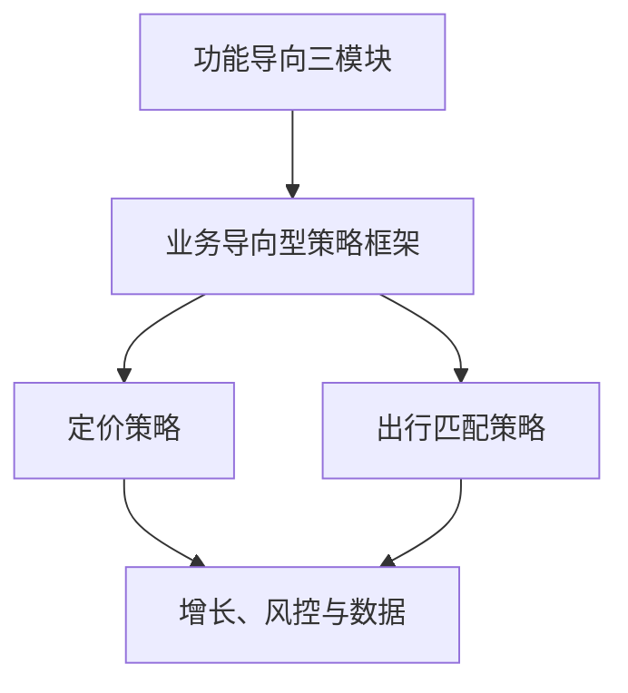

## 业务导向核心业务

多个用户群的理想态会打架时，先把每个角色按功能导向拆清，再在共同利益和各方边界之内求平台目标。

平衡允许阶段性偏向某一侧，前提是其他角色仍在边界之内。定价和出行匹配是两类典型：前者在成本和心理价位之间成交，后者在乘客等待和司机收益之间撮合。

核心关系是：每个角色的单侧分析仍用[功能导向核心业务](../05-function-oriented/index.md)的三模块；补贴、券和风控会改变撮合的约束，分别见[增长、风控与数据](../07-growth-risk-data/index.md)。

### 何时用本模块

先问五件事：

1.  谁在用、谁在供、谁在履约、谁在付钱？
2.  每个角色最想要什么、最怕什么？
3.  两两之间，一方变好会不会增加另一方的成本？
4.  冲突发生在价格、时间、流量、订单，还是责任？
5.  有没有一个各方都能部分承认的共同结果？

如果只有一个用户群、理想态大致同向，回到[功能导向型策略框架](../05-function-oriented/01-framework.md)。如果多方互相牵制，再用本模块。

| 类型 | 面对的对象 | 理想态关系 | 策略任务 |
| --- | --- | --- | --- |
| 功能导向型 | 一个用户 / 用户群 | 相对一致 | 持续接近一个理想态 |
| 业务导向型 | 多个用户群 / 平台角色 | 可能冲突 | 在多方理想态间寻找平衡 |

### 本模块文章

-   [业务导向型策略框架](01-framework.md)：角色卡片、共同利益、边界值、阶段性平台目标
-   [定价策略](02-pricing.md)：可成交区间；目标换成交率、销售额还是利润，价格就换
-   [出行匹配策略](03-ride-matching.md)：从订单广播到司机拉单、订单推荐、平台全局指派

### 两例怎么对照

| 问题 | 定价 | 出行匹配 |
| --- | --- | --- |
| 共同利益 | 成交 | 成交 |
| 冲突落点 | 价格分配 | 同等价格下的价值分配（等待、接驾、行程） |
| 双方边界 | 心理价位与成本 | 最长等待与最远接驾 |
| 阶段目标会换 | 成交率、销售额、利润 | 从尽快有车到区域整体成交 |
| 决策中心 | 价格 | 订单、司机、平台 |

定价把价格写成连接成交概率与双方利益的桥。出行把系统中心从广播迁到拉单、推荐、全局指派。两例都先守边界，再谈总体最大。

### 六个步骤预览

框架正文把求解收成六步，读应用篇时可以对照：

1.  逐个角色拆解，得到每方理想态与利益指标
2.  寻找多方共同承认的平台目标
3.  把平台目标与每方利益建成公式或逻辑关系
4.  在可行空间里求平衡点
5.  加入每方边界值作为硬约束
6.  用监控、反馈、回归和调研持续迭代

没有第 1 步，总体数字会把某一方的溃败洗掉。没有第 5 步，最大化就是允许把弱的一方分到零。阶段切换要留下记录，否则后人会把早期补贴用户和后期提高商家利润看成策略自相矛盾。

### 贯穿检查

-   **角色卡片齐不齐**：每方都有理想态、方案、资源、指标、边界。
-   **共同利益能不能接到每方**：交易完成、服务可持续、生态还在都可以，单方爽不行。
-   **边界有没有观测方式**：取消、退出、接单率转折要写进[效果监控与策略监控](../02-discovering-problems/03-monitoring.md)。
-   **阶段偏向有没有切换信号**：供给、履约、取消、退出。

### 读完应能做的事

-   判断眼前问题是单侧理想态还是多方冲突
-   给每个角色写一张卡片：理想态、方案、资源、指标、边界
-   找出共同利益，并写成能把多方接到一起的量
-   把阶段性偏向和其他角色的边界一起写进需求
-   按正在做的对象选读定价或出行匹配

### 本模块证明不了的事

-   只优化单侧体验即可
-   平衡等于平均分，或阶段性偏向等于朝令夕改
-   存在真实平台的分配比例、等待分钟数、接驾公里数
-   算法求出一个数字就等于生态健康

### 阅读顺序

先读[业务导向型策略框架](01-framework.md)。正在做价格读[定价策略](02-pricing.md)，正在做实时撮合读[出行匹配策略](03-ride-matching.md)。赶工时，框架加一篇应用即可。单侧仍不熟时，先补[功能导向型策略框架](../05-function-oriented/01-framework.md)。

上一模块：[应用总览](../04-application-map/index.md)。对照模块：[功能导向核心业务](../05-function-oriented/index.md)。总图见[策略产品经理](../index.md)。

补贴、券会改变撮合约束，见[增长策略](../07-growth-risk-data/01-growth.md)；虚假履约和套利见[风控策略](../07-growth-risk-data/02-risk-control.md)。课程案例中的数字、阈值和公式是教学示意，不能直接当作可上线参数。

定价先问阶段最大化的是成交率、销售额还是利润。出行先问决策中心在订单、司机还是平台，以及乘客等待、司机接驾有没有越界。

同一产品里也可以并存两类模块：目的地输入仍走功能导向，司机补贴和匹配走本模块。

### 延伸阅读

-   [理想态](../02-discovering-problems/04-ideal-state.md)
-   [策略通用方法论](../03-spec-and-validation/06-methodology.md)
-   [四大业务方向](../04-application-map/01-four-directions.md)
-   [功能导向型策略框架](../05-function-oriented/01-framework.md)
-   [增长策略](../07-growth-risk-data/01-growth.md)
-   [风控策略](../07-growth-risk-data/02-risk-control.md)

## 来源说明

???+ note "来源说明"
    本文根据公开课程《策略产品经理》（B 站 [BV1YE411g717](https://www.bilibili.com/video/BV1YE411g717/)）整理为知识点，不是逐课笔记。

    课程中的数字、阈值和公式是教学示意，不能直接当作可上线参数。

    对应原课第 33 至 36 集。整理日期：2026-09-04。
