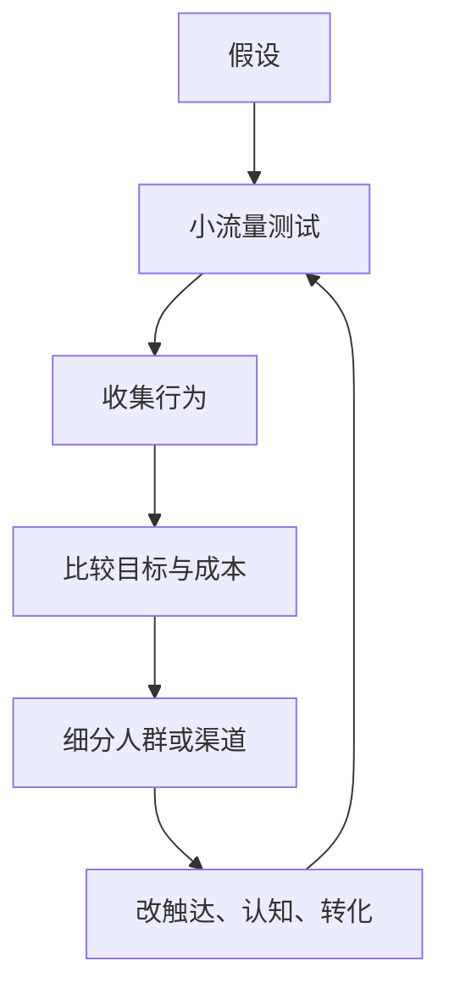
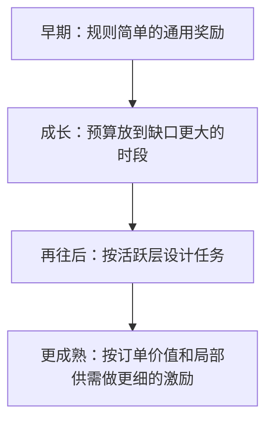

## 增长策略

[四大业务方向](../04-application-map/01-four-directions.md)里，增长主要包括拉新和留存；激活、促活、召回、复购、转介绍都走同一条路径。它要回答：为了让更多人进来、留下来、更常使用，额外投入了什么，换回的是不是比自然趋势多出来的那一截，以及这件事够不够效率。

本节焦点是市场与运营杠杆。产品流程变短带来的自然转化同样重要，但是另一条杠杆，这里不展开。增长漏斗与商业约束，见[商业化与增长](../../../pm/monetization.md)。

### 增长是更有效率的杠杆

杠杆：用有限的额外资源，影响更多目标用户或目标行为，得到超出自然趋势的回报。效率：同样目标下，成本更低、更快、更准、更少浪费。

用户数涨了，还要继续问四句：有没有超出自然趋势？投入了多少钱、流量、注意力或权益？回报能不能盖住投入？有没有更便宜、更快、更准的方案？

$$
\text{增量回报} = \text{活动后结果} - \text{自然趋势下结果}
$$

自然趋势要用同期、对照或分层实验估，不能把季节和市场浪潮算进活动功劳。

#### 额外资源与固定成本

资源不只有现金：流量位、特权、活动机会、注意力、信任和关系，都是可消耗的。判断是不是增长投入，问：不做这次活动，为了正常服务，这笔成本是否仍必须发生？

必须发生的，更接近经营固定成本（原料、店面、履约）。为了改变行为才新增的，才是杠杆（买一送一、券、额外曝光）。免费入口也有机会成本。

销量增加、收入增加、利润增加、有效增长，四者不能画等号。八折可能把单量拉起来、客单价打下去，扣完成本收入没变。只看订单，容易把未来的单提前误当成增长。

### 触达、认知、转化

拉新和留存对象不同，路径同构。召回、促活、复购也可以套这三问。

| 环节 | 问什么 | 常见误判 |
| --- | --- | --- |
| 触达 | 目标用户在哪、用什么渠道碰到 | 越广越好 |
| 认知 | 碰到之后，怎样让他理解产品和要他做的事 | 曝光等于看懂 |
| 转化 | 要付多少额外成本，他才完成目标行为 | 补贴越大越好 |

外部渠道（搜索、应用商店、内容、线下）、用户渠道（分享、口碑）、内部渠道（入口、流程引导、消息）约束不同。搜索塞不进产品里的按钮，却能用内容和检索意图说话；站内才能把完整流程设计完。渠道还可以再拆：搜索拆关键词与意图，老用户渠道拆活跃与是否刚完成交易，召回先定义谁是沉默用户再决定触达谁。

$$
\text{增长方案} = \text{渠道} \times \text{认知形式} \times \text{目标人群}
$$

触达环节要输出：谁、在哪、流量多大、目标占比、每触达或每转化成本、继续还是停。认知环节测渠道与手段的搭配，以及内容是否对得上人。转化环节才进入券型和额度。三环不要共用一个活动转化率。

补贴是广义的：券、折扣、会员、让利、任何提高用户收益或降低用户成本的权益。核心是对不同人群，找到能促成行为的最低有效成本。

漏斗用来定位：

$$
\text{触达人数} \rightarrow \text{认知人数} \rightarrow \text{转化人数}
$$

触达多、认知少，渠道或内容不配；认知多、转化少，激励、流程或人群不对；转化多、回报低，优惠过大或转化并非增量。

### 冷启动到分群最低有效成本

没有历史数字时，不能空转等数据。冷启动靠用户理解、调研、场景判断，写出可执行的第一版，并规定第一批要采什么。目标是用可控成本换反馈。这和[策略如何诞生](../01-concepts/03-how-strategy-emerges.md)、[推荐策略](../05-function-oriented/03-recommendation.md)一样：没有第一版行为，就没有后面的迭代。

有数据之后：



一次只改能解释的变量。2 元还是 3 元、这个点发还是那个点发、满减还是折扣，都是可验证的取舍。实验设计细节（样本量、显著性）课程没给，上线时要避免样本污染和口径不一致。

分群是为了敏感度差异：同一激励下反应不同，才值得拆开测最低有效成本。特征来自活跃、历史行为、渠道、时间、价格敏感、生命周期。解释不了为什么这群要不同手段，标签就没有策略价值。这一点和[数据策略](03-data.md)直接相连。

冷启动方案至少写清：目标用户、可能出现的场景、渠道、认知形式、激励、投入上限、风险、第一版采集哪些事件。有数据后，每个实验只回答一个问题，例如 3 元是否已经够、不必到 5 元。

### 三类短例

#### 拉新：出行分享红包

老用户完成交易 → 分享到社交圈 → 关系领取 → 希望新用户完成首单。领取者可能是新用户，也可能是老用户；混在一个转化率里，会把促活算成拉新。

目标不能停在获取新用户，要补效率方向：获客成本、单用户成本、LTV、速度或规模。四者不能默认成同一个目标。

| 环节 | 对象 | 冷启动 | 反馈后沉淀 |
| --- | --- | --- | --- |
| 触达 | 老用户及其社交圈 | 用老用户消费画像代理圈层质量 | 渠道是否值得继续投 |
| 认知 | 被触达的人 | 红包内容、车型组合 | 哪类内容相对更有效 |
| 转化 | 考虑使用的人 | 券型、额度、门槛 | 人群、券型、金额 |

社交圈通常看不见，代理不是事实，要用带回来的新用户首单和后续订单验证。触达第一步更接近这个渠道值不值得投；认知和转化才是多方案对照。高额现金券可能转化最高，但不一定 ROI 最高。

诊断不要用一个红包转化率打天下：分享多触达少，是入口或传播；触达多新用户少，是圈层质量或口径；领取多首单少，是内容或券；首单多后续差，是人的长期价值。评估看增量新用户、成本、留存、LTV。

#### 促活：外卖券和套餐

动销是拉动销售：满减、折扣、券、套餐、单品，让这周期里发生更多有效消费。触达往往弱，用户本来就在搜、在看推荐、在进店页，商家很难像分享红包那样主动找人。认知和转化经常连在一起：看见优惠，理解条件，决定下不下单。

| 条件 | 更合适的粒度 |
| --- | --- |
| 单店数据少、商家能力有限 | 通用规则 |
| 竞争变化快、要临场跟价 | 简单可解释加人工快调 |
| 数据够、环境相对稳、差异明显 | 分群或平台侧匹配 |

小商家不直接精细化，通常因为：单店样本不够、外部博弈太快、自己没有长期维护标签和实验的能力。平台可以补工具和数据，补不全前两条。精准的目的是让增量转化上升、无效让利下降；维护成本盖过收益，就该退回大群体规则。

满减看门槛和减免；套餐看组合、套餐价相对单点的折扣，以及是否连带其他商品。低价、有特点的套餐也可能把原本不在消费范围内的人拉进来，但低价不等于必然拉新。名义折扣率只是展示，不是商家真实收益。同一套餐对老用户可能是降价促活，对另一群人可能是拉新入口，要分人群看后续复购。

#### 促活（供给）：司机补贴从通用到定向

司机补贴调的是供给意愿：进来、上线、听单、接到缺供的时段和区域、留下。总目标可以写成：在成本约束下提升有效成交。阶段不同，指标不同。早期看新增和首单，不能过早用成熟期的单均补贴成本卡死冷启动。



下载不等于有效供给。要沿进入 → 在线 → 听单 → 接单 → 完成看补贴改的是哪一段。简单规则提供确定性预期和运营可调底座；精准层吃数据、计算、解释和公平成本。两者长期并存。与[出行匹配策略](../06-business-oriented/03-ride-matching.md)里 1.0 边界规则仍留在 3.0 里，是同一条原则。

分层可以记成：基础层给新司机清晰任务；时段层把预算放到缺口；司机层推动活跃迁移；订单层只激励难成交且值得成交的单；市场层用价格调节局部供需。每一层解决不同问题，升级必须由新问题和数据能力驱动。

补贴越来越高但订单不增，优先怀疑无效让利、归因错误或需求本身不足。

### 评估：看增量、成本、留存、LTV

| 环节 | 问题 | 指标方向 |
| --- | --- | --- |
| 触达 | 是否碰到目标用户 | 有效流量、目标占比、渠道成本 |
| 认知 | 是否理解并产生兴趣 | 到达、点击、停留 |
| 转化 | 用多少成本促成行为 | 转化率、每转化成本、增量转化 |
| 整体 | 额外投入换没换来额外回报 | 增量收入 / 毛利、ROI、后续订单、留存、LTV |

领取次数、分享次数、发券张数是过程。高领取可能是老用户重复领、是把自然单换成补贴单、是只来一次的低价值人。对照要分清：

| 看起来像增长 | 还要问 |
| --- | --- |
| 订单涨了 | 客单价、毛利、是否提前消费 |
| 领取很多 | 增量转化、后续留存 |
| 新用户很多 | 是否与老用户混算、LTV |
| 司机打开 App 变多 | 是否在线、接单、完成 |

$$
ROI_{\text{incremental}} = \frac{\text{活动组结果}-\text{自然结果}}{\text{活动新增投入}}
$$

回报口径是流水、毛利还是 LTV，必须先统一。双边平台还要看供给能不能撑住；券和补贴会引来套利，需要[风控策略](02-risk-control.md)。写入[简单策略需求文档](../03-spec-and-validation/01-simple-prd.md)时写清目标行为、人群、渠道、激励和对照；分群和实验一复杂，用[复杂策略需求文档](../03-spec-and-validation/02-complex-prd.md)。效果用[效果回归](../03-spec-and-validation/05-effect-review.md)看完观察窗口。

奶茶店教学案例把增长拆成可测组合：时间（早 / 午 / 晚）× 地点（门口 / 邻店餐桌 / 街道）× 认知载体（传单内容）× 券型（现金 / 满减 / 折扣）× 额度。目标先定为投入产出率。示意结果是某一组合 ROI 最高，那是方法示范，不是所有店都应发的面额。可复用的是六步：定目标 → 找时间地点 → 选与渠道匹配的认知载体 → 设计转化激励 → 估计回报与成本 → 用试验选组合。变量之间不是简单相乘：额度高转化可能升、让利也升；触达多了，店面成本分摊可能下降。

### 模板

```text
目标行为：注册 / 首单 / 复购 / 回流 / 分享
效率方向：最低成本 / 最高 LTV / 最快速度 / 最大规模
新用户定义与排除（避免和老用户混算）：

触达：人群、渠道、冷启动代理、值不值得继续投
认知：内容 / 入口 / 产品组合、对照实验
转化：券型、额度、门槛、最低有效成本

采集：触达、认知行为、转化、成本、负向行为
对照：自然趋势或对照组
长期：后续订单、留存、LTV
停投 / 灰度 / 回滚：
```

漏斗定位：

$$
CR_{\text{reach}\to\text{aware}}=\frac{\text{认知人数}}{\text{触达人数}},\quad
CR_{\text{aware}\to\text{convert}}=\frac{\text{转化人数}}{\text{认知人数}}
$$

分享带新时，单新增用户成本用增量新用户：

$$
\text{增量获客成本}
=\frac{\text{活动新增成本}}{\text{活动组有效新用户}-\text{基线有效新用户}}
$$

### 常见误区

1.  把自然增长算成活动；只看销量、注册、领取。
2.  把增长资源理解成只有钱；同一套方案打所有渠道和人群。
3.  触达、认知、转化混成一个转化率。
4.  冷启动空等数据；实验一次改太多变量。
5.  优惠越大越好；分群做成标签工程。
6.  忽视留存和 LTV；把案例里的示意金额当成通用解。

适用：冷启动、拉新、召回、复购、券与活动、站内触达、按人群测最低激励。高客单价长决策、强监管、双边供给约束、套利风险，要扩展指标并接入[风控策略](02-risk-control.md)与[数据策略](03-data.md)。课程没有给出各渠道转化率或通用补贴金额。

### 延伸阅读

-   [策略通用方法论](../03-spec-and-validation/06-methodology.md)
-   [四大业务方向](../04-application-map/01-four-directions.md)
-   [业务导向型策略框架](../06-business-oriented/01-framework.md)
-   [出行匹配策略](../06-business-oriented/03-ride-matching.md)
-   [风控策略](02-risk-control.md)
-   [商业化与增长](../../../pm/monetization.md)

## 来源说明

???+ note "来源说明"
    本文根据公开课程《策略产品经理》（B 站 [BV1YE411g717](https://www.bilibili.com/video/BV1YE411g717/)）整理为知识点，不是逐课笔记。

    课程中的数字、阈值和公式是教学示意，不能直接当作可上线参数。

    对应原课第 37 至 40 集。整理日期：2026-09-04。
