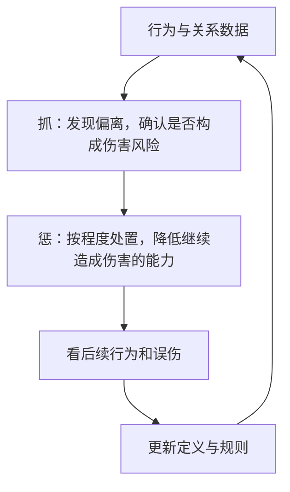

## 风控策略

[四大业务方向](../04-application-map/01-four-directions.md)里，风控的目标是：以最小成本，避免平台和用户受到不可接受的伤害。

本篇只谈产品策略思路：伤害是什么、成本在哪、识别分几层、处置如何匹配。不提供对抗清单，也不把任何业务写成可执行的识别手册。增长发出去的激励，会改变假装完成服务的预期回报，因此风控常与[增长策略](01-growth.md)成对出现。

### 避免伤害

伤害有两头，而且会互相传导。

平台侧：补贴被套走、虚假交易占用资源、内容被垃圾占位、资产被破坏。这些不会停在报表上，正常用户能拿到的权益变少，审核变严，体验变差。

用户侧：垃圾与欺诈、对方随意取消、可用服务变少。体验掉了，信任和留存跟着掉，平台长期价值再受伤。

所以风控结果不能只写拦截率。还要看普通用户是否还走得动、误伤和申诉、长期业务是否被保护。这和[效果监控与策略监控](../02-discovering-problems/03-monitoring.md)要同时看效果与策略健康，是同一类完整性。

### 风控自己也有成本

主要成本至少三类。

1.  **给正常用户加操作**：更多资料、更长流程、更频繁的校验，使用成本上升。履约过程中的额外采集有助于服务与投诉判断，也会消耗设备、流量和隐私预算。
2.  **高风险时拒绝服务**：直接挡在流程外。判错时，正常用户损失很大。
3.  **识别不准造成的误伤**：少见但合理的行为被当成风险，转化、投诉、申诉、流失、客服压力上升。误伤往往没有被刷走多少钱那样的账单，却是真实成本。

更严：风险可能少一块，用户限制和误伤上升。更松：路径顺，伤害也可能放大。策略要定义：哪些风险不可接受，哪些正常行为必须保护，哪些可以延后判断，哪些先提示。

教学化地看总成本：

$$
\text{风控总成本}
=\text{平台直接损失}
+\text{用户体验损失}
+\text{正常用户误伤}
+\text{规则执行与系统成本}
$$

目标是在风险可接受的前提下把总和压低，单项清零通常做不到。

### 两条杠杆：收益和成本

不正当行为通常有驱动：套取资源、占用曝光、破坏规则获得额外位置。产品杠杆是让这件事变得不划算。

| 方向 | 机制 | 产品含义 |
| --- | --- | --- |
| 降低收益 | 预期回报下降，意愿下降 | 可被套取的激励收紧；恶意内容得不到它要的分发 |
| 提高成本 | 相对收益 = 收益减去实施成本 | 让持续作恶需要更多资源、承担更多后果 |

$$
\text{相对收益}=\text{不正当收益}-\text{实施成本}
$$

两条可以一起用。不能只拿正常用户开刀：全员加验，未必动得到真正吃收益的人。效果要问：伤害是否下降、收益是否变少、正常用户是否被过度限制、问题是否只是换了一个入口。拦截人数多，可能只是误伤多。

### 抓与惩



**抓**的本质是相对正常的偏离，但偏离不等于必须处罚。**惩**的本质是匹配伤害程度、判断置信度和及时性。识别与特征更多是策略和数据；处置等级常常要运营一起定；系统自动执行；申诉和人工处理边界。三角缺一，风控会要么空转、要么误伤扩大。

### 三类行为：正常、非正常无害、异常有害

1.  **正常**：多数人在客观环境下的普遍、可接受、与流程一致的行为。不一定是最理想，但是平台接受的常见范围。
2.  **非正常无害**：少数或特殊环境（网络差、设备差、地理差异）下的少见行为，尚未发现对平台或其他用户的伤害。统计上偏离，不等于道德错误，也不等于该封。
3.  **异常有害**：少见，并且已经造成或高度可能造成伤害。处置强度跟伤害走，低程度违规不必按最重档处理。

只设正常与作弊两档，容易把所有偏离平均值的人打成风险。中间这一层用来容纳差异、留观察时间、降低误伤。统计异常不是处罚结论，伤害才是管控依据之一。

| 类别 | 统计上 | 伤害 | 典型处理 |
| --- | --- | --- | --- |
| 正常 | 大多数人的普遍行为 | 无 | 放行 |
| 非正常无害 | 少数或特殊环境 | 无 / 暂未发现 | 观察、降权、继续收集 |
| 异常有害 | 极端或多次叠加 | 有或高度可能 | 限制、延迟、复核或更强处置 |

从产品流程抽正常，而不是凭空想象：列出完整路径，看每个环节多数人怎么走，再定义少见区间，最后才定义极端、多次、与关系或收益叠加后构成伤害的条件。一次快、一次偏，可能只是准备充分或场景特殊；稳定模式加上伤害结果，才进入惩。网络差导致的反复刷新，是非正常无害的典型：少见，但不该因此处罚。

### 规则、特征、模型，离不开数据、解释、误伤

早期常见规则集合：若干条件同时满足则提升风险等级。好处是快、能解释、数据少也能上。坏处是僵、平均值一变阈值就过时、维护成本随条数上升。

更成熟时，对群体做统计、看谁脱离当前分布、把多特征组合起来。可以理解成风险分层的评分：

$$
Risk(u)=\sum_{i} w_i f_i(u)
$$

这是多信号合成的概念式，不是生产模型。机器学习不是天然正确，仍然要：

-   特征是否真的提高对伤害的识别，且收益大于采集和体验成本
-   标签和反馈从哪来
-   误伤怎么评估（精确率、召回率、误伤率要一起看）
-   结论能否解释、用户能否申诉
-   线上是否漂移、是否要更新

特征不是越多越好。多采身份、位置、设备，会增加隐私、延迟和特殊环境下的误判。每加一维都要能回答：它对避免伤害的贡献，是否大于新增成本？数据基础见[数据策略](03-data.md)。

设真正有害且被抓住为 TP，误伤为 FP，漏掉为 FN，正常放行为 TN：

$$
\text{精确率}=\frac{TP}{TP+FP},\quad
\text{召回率}=\frac{TP}{TP+FN},\quad
\text{误伤率}=\frac{FP}{FP+TN}
$$

只追召回，可能把大量正常人挡住。净收益还要扣系统、延迟、转化损失和长期信任：

$$
\text{净风控收益}
=\text{风险损失减少}-\text{风控新增成本}
$$

风控新增成本包括验证与系统、延迟发放、正常用户转化损失、误伤带来的长期价值、客服与人工。识别了很多对象，不代表伤害下降了。

### 实时与滞后

| 更适合实时 | 更适合滞后 |
| --- | --- |
| 伤害正在发生、必须立刻止住 | 单次看起来像，要窗口里才能确认 |
| 单次证据强、误判空间小 | 单次容易误判，需要多次或关系积累 |
| 不处置就不可逆 | 处置可追回、可延迟 |

实时快，误伤也立刻变成体验事故。内容发布前拦截明确禁止的表达、硬性身份规则不满足则不能继续，属于高置信、可当场判断的一类。滞后承认：确认时事实可能已发生，于是用后续限制、复核、不让异常收益留在账上等方式补。需要时间窗口才能看清的模式，不宜在第一次偏离时下最重结论。

部分高风险权益故意晚一点发，是为了给观察留时间，但会增加正常人等收益的成本，只适合损失高、延迟可解释、状态可查询的场景。低置信优先可恢复动作；永久级处置需要更强证据。用户应知道为何受限、如何补充材料，这是降低误伤长期成本的配套。处置从轻到重应分档。

### 短例：激励与虚假履约的产品逻辑

补贴会改变供给意愿，见[增长策略](01-growth.md)；同一笔激励也会改变假装完成服务的预期回报。产品上的进化，是不断提高完成虚假交易的成本，并持续看误伤是否可接受。

可以只记阶段意图：

| 阶段意图 | 策略在提高什么 |
| --- | --- |
| 早期几乎无隔离 | 完成一笔看似真实的交易几乎没有额外成本 |
| 角色隔离 | 同一主体很难同时占据供需两端领取激励 |
| 关系一致性 | 资金、设备、资质等关系上不合理的重合会推高风险 |
| 过程可信 | 订单应经历与真实服务相符的过程，证据不足则延迟权益 |
| 统计观察 | 把单次放到时间窗口和配对历史上看，避免一次偏离定案 |

每升一级，不正当行为更贵，正常用户的流程、采集和等待也可能更贵。单一层不会永久有效，因为环境和对手会变；更新应来自损失、误伤和迁移是否下降，而不是规则条数增加。

课程里的重复关系、反应时间之类数字是示意。任何超过几次就算的阈值都必须由自己的规模、损失和实验重估，本篇不写。正常高频关系可能被统计规则误伤，所以要保留例外、叠加证据和申诉。

具体特征、模型和阈值属于风控与数据团队的受控工作，不应写进对外可复制的步骤。没有数据，就很难判断什么是正常、什么只是少见、什么真正有害，也很难知道规则有没有误伤。冷启动可以先有假设，但必须设计反馈。数据覆盖、准确、及时、完整、可解释，见[数据策略](03-data.md)。跨来源信息可能补全单平台盲区，但必须有授权、用途限制和安全边界。

### 模板

```text
目标风险：对象（账号 / 订单 / 内容 / 关系）、伤害对象、伤害类型

抓
- 正常：完整流程、普遍表现、业务例外
- 非正常无害：少见但未发现伤害
- 异常有害：伤害条件、需叠加的证据、置信度
- 数据：来源、覆盖、及时、隐私边界

惩
- 低：提示 / 观察
- 中：补充验证 / 限制部分功能
- 高：延迟权益 / 复核
- 极高：更强处置 + 更强证据
- 实时还是滞后、用户如何得知、如何申诉与恢复

评估
- 风险损失变化、误伤、转化与留存、投诉申诉、风险是否换入口
```

项目顺序可以记成：明确伤害 → 定最低成本目标 → 按流程定义三类行为 → 选规则、特征、人工 → 分级处置 → 灰度看误伤 → [效果回归](../03-spec-and-validation/05-effect-review.md) → 持续监控漂移与迁移。

指标至少分六层一起看，避免只报拦截：

| 层 | 要回答 |
| --- | --- |
| 识别 | 能否发现目标风险 |
| 判断质量 | 精确、召回、误伤 |
| 处置效果 | 伤害是否下降 |
| 用户影响 | 正常人是否还走得动 |
| 时效 | 能否在伤害扩大前处理 |
| 业务与生态 | 转化、信任、风险是否换入口 |

### 常见误区

1.  越严越好；只看平台损失或只看拦截人数。
2.  只提高正常人成本；一次偏离就定性。
3.  把统计异常当成伤害；只有一档最重处罚。
4.  规则写完不更新；迷信模型而不看误伤和解释。
5.  延迟权益却不说明原因；过度采集却算不清收益。
6.  没有申诉和恢复，一次误伤变成永久流失。

适用：补贴与虚假交易、垃圾内容、账户与关系风险、公共资源被占用。金融授信、身份与位置、会长期影响信用或资格的决策，要另加合规与专业审查。课程中的示意数字不是生产阈值；不要把进化短例扩成实施手册。

### 延伸阅读

-   [效果监控与策略监控](../02-discovering-problems/03-monitoring.md)
-   [效果回归](../03-spec-and-validation/05-effect-review.md)
-   [四大业务方向](../04-application-map/01-four-directions.md)
-   [增长策略](01-growth.md)
-   [数据策略](03-data.md)
-   [复杂策略需求文档](../03-spec-and-validation/02-complex-prd.md)

## 来源说明

???+ note "来源说明"
    本文根据公开课程《策略产品经理》（B 站 [BV1YE411g717](https://www.bilibili.com/video/BV1YE411g717/)）整理为知识点，不是逐课笔记。本页只整理产品思路，不提供可操作的对抗或规避步骤。

    课程中的数字、阈值和公式是教学示意，不能直接当作可上线参数。

    对应原课第 41 集。整理日期：2026-09-04。
