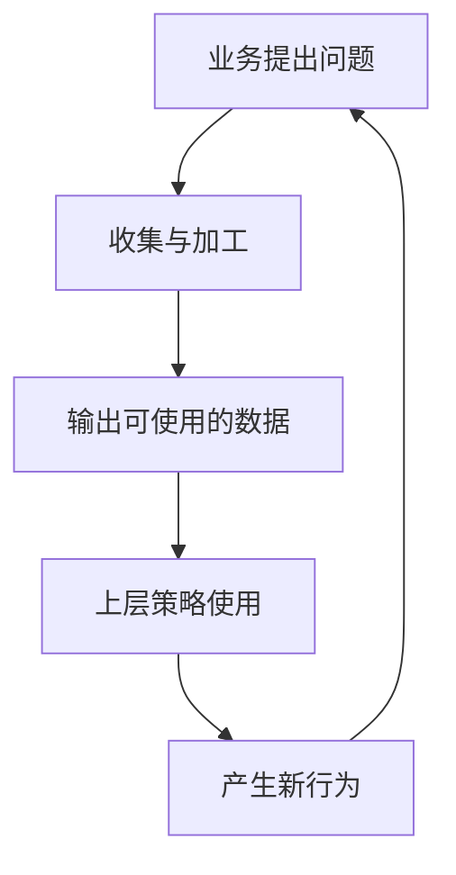
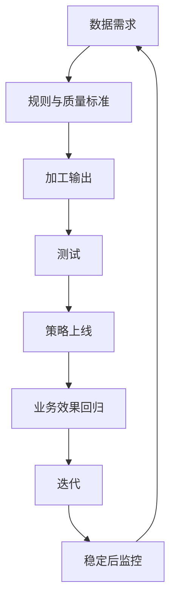

## 数据策略

数据是[四大业务方向](../04-application-map/01-four-directions.md)的第四向，也是前三向的共同底座。搜索、推荐、匹配、增长、风控都在消耗结构化事实和抽象；它们跑起来又吐出新行为，反过来逼数据体系补字段、补标签、补时效。数据很少是先全部做好、策略再开工的静态库存。

一个字段、一张表、一个标签有没有价值，最终看它有没有改善某项决策。



核心关系是：数据服务上层策略，也被策略反馈驱动。

### 基础数据与画像标签

|  | 基础数据 | 画像 / 标签 |
| --- | --- | --- |
| 对象 | 客观事实和原始行为 | 对事实的抽象与预测 |
| 例子 | 网页与商品、订单、轨迹记录 | 高活跃、价格敏感、商家型用户、内容品类 |
| 工作 | 采集、清洗、去重、对齐、更新 | 规则、特征、分群、预测 |
| 质量 | 完整、准确、及时、一致 | 准确率、覆盖率、稳定、可被下游用 |
| 用途 | 事实底座 | 直接改排序、补贴、风控等动作 |

多来源产品（网页、地图）的基础工作，常常是覆盖、更新、合并、去重、冲突核验、字段统一。标签则是在这些事实上再抽象一层，供[搜索策略](../05-function-oriented/02-search.md)、[推荐策略](../05-function-oriented/03-recommendation.md)、[增长策略](01-growth.md)、[风控策略](02-risk-control.md)使用。

增长要看分层准不准、目标人群能不能被覆盖；风控要看行为、关系、设备、交易是否及时完整。没有足够事实，既分不清[业务导向型策略框架](../06-business-oriented/01-framework.md)里各方边界，也分不清风控里的正常与有害。

#### 标签首先是决策工具

业务打男性或女性时，目标往往是决定内容或营销怎么做，鉴定生理性别通常不是下游决策。用户表现出与该业务标签相关的行为，就可以被纳入，用于那一项服务。性别标签准不准，最终要看需求识别和推荐有没有变好。闪送商家用户同理：平台关心的是会不会自然高频发单、还要不要促活。

标签定义要围绕下游决策，而不是追求对真实身份的绝对还原。

没有下游场景的标签，多半是为打而打。每个标签需求先写清：支持什么决策、行为定义是什么、能观察到哪些客观数据、标错会怎样、准确率和覆盖率要到什么业务可接受的程度、谁来用。

基础数据错了，上层再准也会漂。网页重复、地点过期、订单字段对不齐，搜索、匹配、风控都会一起错。所以数据策略也包括多源采集、去重、冲突核验和更新，这是[搜索策略](../05-function-oriented/02-search.md)、[目的地与路线策略](../05-function-oriented/04-destination-and-route.md)的资源底座。

### 流程：需求、质量标准、测试、上线回归、监控

数据项目同样走[策略通用方法论](../03-spec-and-validation/06-methodology.md)和[策略产品经理的工作循环](../01-concepts/04-workflow.md)，只是产出是数据而不是一次排序规则。

#### 1. 提出需求

需要什么、从哪来、怎么加工、输出成什么、给哪条上层策略。写进[简单策略需求文档](../03-spec-and-validation/01-simple-prd.md)或[复杂策略需求文档](../03-spec-and-validation/02-complex-prd.md)时，下游使用方必须是具名的。没有使用方的数据需求，后面的准确率没有业务含义。

#### 2. 定义质量标准

至少包括准确率、覆盖率，以及及时性、完整性、稳定性、可解释性、下游能不能接上。没有标准，做出来了无法验收。搜索对象还要问覆盖和更新；风控特征还要问及时；增长标签还要问会不会抖动到让补贴今天发、明天收。

#### 3. 测试

按定义跑规则或模型，看输出是否符合、覆盖是否够、误判是否可解释、下游是否读得到。用随机或有代表性的样本，不要只拿一眼就能看出来的典型成功案例，那会高估。记录边界误判（例如行为像商家、身份不是），作为规则例外。

测坏了就改来源、清洗、条件、特征、输出方式，再测。和功能策略一样，是逼近而不是一次做对。

#### 4. 上线并做效果回归

质量达标只是入场券。接进真实策略后，用[效果回归](../03-spec-and-validation/05-effect-review.md)看业务有没有动：补贴是否更有效、排序是否更相关、风控误伤是否可接受。只做离线评估，等于只答了像不像这个标签，没答用了有没有用。

对减少补贴类标签，回归要分三组看：被减少资源的人活跃是否维持；继续获得资源的人是否有增量；整体成本与订单是否可接受。对照组用来估计自然趋势，避免把大盘涨跌算进标签功劳。

#### 5. 监控

用户、供给、活动、数据源都会变。要同时看数据侧（量、覆盖、分布、缺失、延迟、标签抖动）和效果侧（成本、转化、活跃、留存）。两张报表不关联，就无法判断是源断了、规则漂了，还是业务真变了。异常时要有暂停和回滚，见[效果监控与策略监控](../02-discovering-problems/03-monitoring.md)。

覆盖率从一成突然跳到三成，排查顺序通常是：任务是否重跑或源是否重复、规则是否被改、是否有活动改变了行为、用户结构是否真变。先排除管道，再接受业务变了。



### 两层指标：标签质量不等于业务效果

设 TP 为标中且符合业务定义，FP 为误标，FN 为漏标：

$$
\text{准确率}=\frac{TP}{TP+FP},\qquad
\text{覆盖率}=\frac{TP}{TP+FN}
$$

条件很宽，覆盖上去、准确下来，资源会发给不该发的人；条件很严，准确好看、覆盖不够，策略够不着目标人群。没有脱离业务的准确率越高越好。没有可靠标注时，不要把规则命中率冒充准确率。

第二层是应用结果：用了这个标签之后，无效投入有没有下降、目标行为有没有改善、有没有伤到不该伤的人。

| 层 | 回答 | 典型指标 |
| --- | --- | --- |
| 标签质量 | 这个抽象靠不靠谱 | 准确率、覆盖率、稳定性、完整率 |
| 业务效果 | 这个抽象改决策之后值不值 | 成本、增量转化、活跃、留存、误伤 |

两层不能互相替代。准但下游没效果，要怀疑定义、用法或目标已经变了；下游暂时好看但质量在垮，下一阶段会把错误放大。

若标签用于减少自然高频用户的补贴，还可以看：

$$
\text{节省补贴}=\text{原方案补贴成本}-\text{标签方案补贴成本}
$$

并检查节省是否造成活跃、订单或留存的不可接受下降。节省了钱、人也塌了，标签定义或用法就有问题。

### 短例：闪送商家用户标签

即时配送上，有人偶尔寄一件，有人几乎每天从固定地点发出稳定品类。后者往往已经是自然高频，再叠促活补贴，多半是无效让利；前者才可能被激励养成习惯。

因此标签的产品目的是：识别高频、稳定使用配送的人，减少对他们的无效促活，把资源留给真正需要被激活的人。

不是鉴定法律意义上的商户身份。在家做甜点偶尔外送、因工作每天寄文件，行为上都可能像商家，身份上却不是。规则会误判；值不值得用，看它能不能支持补贴分层。

冷启动可以从历史订单里抽象行为：相对更高的发单频率、地点更集中、品类更稳定。具体阈值课程没给，必须用随机样本和后续效果估，不能把经验数字写死。标出来之后：

-   被减少补贴的人，活跃若仍在，说明自然高频假设可能成立
-   若活跃塌掉，说明标进了仍对激励敏感的人，规则要改

标签是中间名，减少无效补贴、保住该活跃的活跃才是终点。离线很准但效率没改善，维护它的理由就不充分。可以把业务问题翻译成：

```text
问题：促活预算被自然高频用户消耗
目标：识别稳定高频配送行为
标签：商家用户（行为代理，不是法律身份）
数据：频次、地点集中、品类集中
下游：差异化促活
标签指标：准确率、覆盖率
最终效果：无效补贴下降，目标用户活跃可维持
```

监控要把覆盖率变化接到该类用户的补贴成本、转化和留存上。占比突然跳升，可能是用户真变，也可能是源、任务或规则异常。

### 课程收束：能解决问题的粒度就是好策略

从[功能导向型策略框架](../05-function-oriented/01-framework.md)到本篇，策略一直是问题驱动、目标导向的手段。搜索、推荐、路线、定价、匹配、增长、风控、数据，换的是对象和约束，不换工作循环：发现问题、定义[理想态](../02-discovering-problems/04-ideal-state.md)、选手段、开发和评估、监控与回归。

复杂度应跟着问题长：数据少、环境快、执行能力弱时，通用规则、清晰边界、可解释的处置往往更有效；密度和数据够了，再加分群、预测和全局组合。[出行匹配策略](../06-business-oriented/03-ride-matching.md)的 1.0 广播、[增长策略](01-growth.md)的通用补贴、[风控策略](02-risk-control.md)的简单关系规则，都是当时能解决问题的粒度。

反过来，为复杂而复杂，标签墙、多层模型、全局优化，如果回答不了目标是什么、边界在哪、比简单方案多解决了哪一块，就只是维护成本。好策略是：问题认准，粒度刚好，效果能回归，坏了能回滚。

这也是整门课的收束：[策略是什么](../01-concepts/01-what-is-strategy.md)到[策略通用方法论](../03-spec-and-validation/06-methodology.md)解决怎么做策略；[四大业务方向](../04-application-map/01-four-directions.md)之后解决做到哪。功能导向把单侧理想态做透；业务导向在冲突里加边界；增长找刚刚够用的杠杆；风控用最低成本避免伤害；数据让上层决策有可靠输入。

读完应用篇，可以用四句自检：这个问题主要落在核心、增长、风控还是数据？如果是核心，是单侧理想态还是多方冲突？当前粒度是在解决真问题，还是在堆复杂？上线后看哪两层指标，过程有没有动，业务有没有动？

### 模板

```text
业务问题、现有策略、不做数据会怎样
标签 / 数据名称：行为定义、包含 / 排除、代理含义、不代表的真实属性
来源、更新频率、口径、权限与合规
质量：准确率、覆盖率、完整率、及时性、稳定性
输出：字段、周期、下游使用方
评估：抽样方法、上线标准、误判场景
效果回归：成本、转化、活跃、留存、对照
监控与回滚：分布漂移、源延迟、效果恶化
```

验收至少勾：下游使用方具名；行为定义清楚；质量标准可测；有代表性样本而不是只拿典型成功；已接入策略并做回归；数据和业务双重监控；有暂停条件。

质量指标不要混用：

| 指标 | 含义 |
| --- | --- |
| 准确率 | 被标为目标类的样本中，符合定义的比例 |
| 覆盖率 | 目标对象里被识别出来的比例 |
| 完整率 | 关键字段非空占比 |
| 及时性 | 从发生到可使用的时间 |
| 稳定性 | 相邻周期是否异常抖动 |
| 一致性 | 多源、多系统是否对得上 |

没有可靠标注时，不要把规则命中率冒充准确率。

### 常见误区

1.  数据项目以字段交付为终点；平台数据多就以为单业务样本够。
2.  标签必须等于真实身份；准确率高就等于有用，或覆盖率高就等于好。
3.  只做离线评估；规则上线后不再看漂移。
4.  把标签当独立产品，忽略下游目标；评估只用典型样本。
5.  只采集不谈成本与合规；用系统复杂证明专业。
6.  混淆质量指标和业务指标；不定义回滚。

适用：对象加工、用户与内容标签、增长分层、风控特征、多源清洗。标签若直接影响授信、资格或其他重大权益，要另加公平、解释和合规。敏感个人信息与跨来源合并，必须有必要性、授权和安全边界。课程没有给出商家标签的频次阈值或准确率达标线。

### 延伸阅读

-   [策略产品经理的工作循环](../01-concepts/04-workflow.md)
-   [效果监控与策略监控](../02-discovering-problems/03-monitoring.md)
-   [效果回归](../03-spec-and-validation/05-effect-review.md)
-   [四大业务方向](../04-application-map/01-four-directions.md)
-   [增长策略](01-growth.md)
-   [风控策略](02-risk-control.md)

## 来源说明

???+ note "来源说明"
    本文根据公开课程《策略产品经理》（B 站 [BV1YE411g717](https://www.bilibili.com/video/BV1YE411g717/)）整理为知识点，不是逐课笔记。

    课程中的数字、阈值和公式是教学示意，不能直接当作可上线参数。

    对应原课第 42 集。整理日期：2026-09-04。
