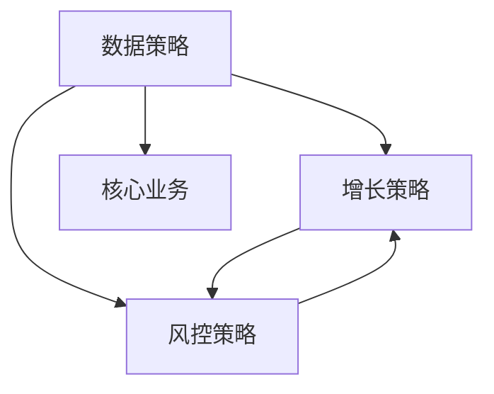

## 增长、风控与数据

核心业务之外的三个方向：用额外资源撬动增量、用最小成本避免伤害、把客观数据加工成能改变决策的标签。

三篇共用前面的工作法（理想态、分群、回归、简单规则起步），对象不同。增长看的是超出自然趋势的增量；风控要同时看伤害和误伤；数据要同时看标签质量和接入业务后的效果。

核心关系是：增长发出去的激励会改变作弊的预期回报，因此增长和风控常成对出现。标签则是搜索、推荐、补贴、风控共用的输入，见[功能导向核心业务](../05-function-oriented/index.md)、[业务导向核心业务](../06-business-oriented/index.md)。

### 三篇分别回答什么

| 方向 | 主问题 | 评估时不能单独当成功 |
| --- | --- | --- |
| 增长 | 额外投入换没换来超出自然趋势的结果 | 领取次数、分享次数、发券张数 |
| 风控 | 以多低的成本避免了不可接受的伤害 | 拦截人数、规则条数 |
| 数据 | 这个字段或标签有没有改善某项决策 | 标签个数、离线准确率单独好看 |

增长漏斗与商业约束，见[商业化与增长](../../../pm/monetization.md)。本模块讲策略如何拆触达、认知、转化，以及如何看增量；那页讲商业模式、定价模型和增长系统。

### 三者如何互相改约束

增长方案会改变不正当行为的预期回报：券、补贴、曝光一旦可被套取，风控的对象和强度就要跟着变。风控加严又会抬高正常人的使用成本，可能把增长漏斗的转化压下去。两边都要看净效果。

数据是共同输入。增长分群要标签覆盖目标人群；风控要行为、关系、交易及时完整；搜索、推荐、匹配的资源底座也是数据。标签准不等于业务有效，接入策略后仍要做[效果回归](../03-spec-and-validation/05-effect-review.md)。

三篇共用[策略通用方法论](../03-spec-and-validation/06-methodology.md)：定义理想态、拆未达、给方案、验证。没有数据时先冷启动，有反馈后再分群。简单规则和精准策略会长期并存，见[出行匹配策略](../06-business-oriented/03-ride-matching.md)与增长里的司机补贴。

主方向仍要先定。个性化推荐主方向是核心业务，强依赖数据；促活消息主方向是增长，依赖用户标签；支付拦截主方向是风控，依赖交易基础数据。见[四大业务方向](../04-application-map/01-four-directions.md)。

### 本模块文章

-   [增长策略](01-growth.md)：触达、认知、转化；分群找最低有效成本；看增量
-   [风控策略](02-risk-control.md)：正常、无害偏离、真正有害；抓与惩；实时与滞后
-   [数据策略](03-data.md)：基础数据与画像标签；标签准不等于业务有效

### 读完应能做的事

-   把一次活动拆成触达、认知、转化三问，避免共用一个活动转化率
-   用对照或同期估计自然趋势，把增量与领取次数分开
-   按正常、无害偏离、真正有害三层定义行为，再决定识别与分级处置
-   给数据需求写明下游使用方、质量标准和效果回归
-   知道增长、风控、数据会互相改约束，主方向仍要先定

### 贯穿检查

-   **增长看增量**：自然趋势要用同期、对照或分层实验估；领取、分享、发券是过程。
-   **风控看净成本**：伤害下降、误伤、正常人是否还走得动，要一起看。本专题只讲产品思路。
-   **数据看两层指标**：标签质量（准确、覆盖、稳定）和业务效果（成本、转化、活跃、留存、误伤）不能互相替代。
-   **粒度跟问题走**：数据少、环境快时，通用规则往往更有效；为复杂而复杂只增加维护成本。

### 读完应能回答

1.  这笔投入若不做活动是否仍必须发生？必须发生的更接近固定成本。
2.  触达、认知、转化分别卡在哪一环，有没有混成一个转化率？
3.  当前行为属于正常、无害偏离，还是已经构成伤害？
4.  这个标签支持哪项下游决策，离线准了之后业务有没有动？
5.  增长发出去的激励，有没有把风控的预期回报一起改掉？

### 本模块证明不了的事

-   领取次数等于有效增长
-   越严越好，或拦截量等于伤害下降
-   标签准就等于业务有效
-   存在各渠道转化率或通用补贴金额、风控阈值、商家标签频次达标线

### 阅读顺序

按正在做的问题选读。拉新、促活、供给激励读[增长策略](01-growth.md)；补贴套利、垃圾、账户风险读[风控策略](02-risk-control.md)；分层、特征、多源清洗读[数据策略](03-data.md)。增长方案一复杂，建议同时打开风控与数据。

三篇不必按编号穷尽。做分享红包时，增长为主、数据提供圈层代理、风控看领取套利。做司机补贴时，增长为主、匹配决定订单能否成交、风控看虚假履约。做标签时，数据为主，增长或风控是具名下游。

风控篇只整理产品思路：伤害、成本、三层行为、分级处置。具体识别特征、模型和阈值属于受控工作，不在本专题展开。

上一模块：[应用总览](../04-application-map/index.md)。总图见[策略产品经理](../index.md)。

评测指标、实验设计和模型协作的工程细节，见[评测](../../../ai/evaluation.md)。课程案例中的数字、阈值和公式是教学示意，不能直接当作可上线参数。

| 典型项目 | 主方向 | 必看协同 |
| --- | --- | --- |
| 分享红包拉新 | 增长 | 数据提供圈层代理；风控看领取套利 |
| 司机补贴 | 增长 | 匹配决定能否成交；风控看虚假履约 |
| 促活券与套餐 | 增长 | 数据做分群；风控看套利 |
| 商家用户标签 | 数据 | 增长是具名下游，回归看无效补贴 |
| 内容或交易伤害 | 风控 | 数据提供及时完整的行为与关系 |

做活动先写对照和观察窗口；做风控先写伤害和误伤怎么看；做标签先写下游使用方。三件事都要能回滚。

增长漏斗的工程与商业口径，还可对照[商业化与增长](../../../pm/monetization.md)里的增长系统；本模块只把策略拆成触达、认知、转化，并强调看增量。风控不提供可操作的对抗步骤。

标签数量多、拦截人数多、领取次数多，都不能单独当成功。

### 延伸阅读

-   [策略通用方法论](../03-spec-and-validation/06-methodology.md)
-   [四大业务方向](../04-application-map/01-four-directions.md)
-   [业务导向型策略框架](../06-business-oriented/01-framework.md)
-   [出行匹配策略](../06-business-oriented/03-ride-matching.md)
-   [商业化与增长](../../../pm/monetization.md)
-   [风控策略](02-risk-control.md)

## 来源说明

???+ note "来源说明"
    本文根据公开课程《策略产品经理》（B 站 [BV1YE411g717](https://www.bilibili.com/video/BV1YE411g717/)）整理为知识点，不是逐课笔记。

    课程中的数字、阈值和公式是教学示意，不能直接当作可上线参数。

    对应原课第 37 至 42 集。整理日期：2026-09-04。
