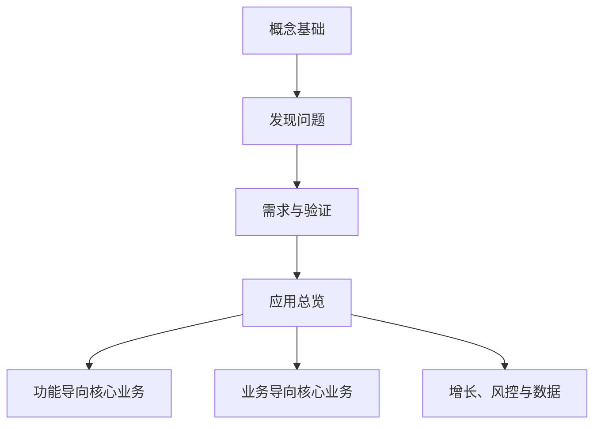

## 策略产品经理

策略产品经理把业务目标转成规则、排序、匹配和动态决策，常见于搜索、推荐、增长、风控和内容分发。本专题把公开课程《策略产品经理》整理为知识点，按工作顺序阅读，不按视频集数对照。

课程案例中的数字、阈值和公式是教学示意，不能直接当作可上线参数。岗位边界因公司而异，先对照[策略产品经理](../../job/product-manager-types/internet-product-manager.md#策略产品经理)。

核心关系是：先把策略写成可验证的决策问题，再按业务类型选择框架。前三个模块是通用工作法，第四个模块是分叉口，后三个模块按问题选读。

### 按问题选择模块

| 工作问题 | 先读 | 模块不能单独证明 |
| --- | --- | --- |
| 这是不是策略问题、四要素如何写 | [概念基础](01-concepts/index.md) | 某个算法必须上线 |
| 结果不好，问题从哪来、怎样才算好 | [发现问题](02-discovering-problems/index.md) | 单条反馈代表全体用户 |
| 如何写成可开发需求并在上线后验证 | [需求与验证](03-spec-and-validation/index.md) | 一次上线即到达理想态 |
| 策略应落在哪张业务地图 | [应用总览](04-application-map/index.md) | 四个方向必须同时做满 |
| 搜索、推荐、输入等单侧体验 | [功能导向核心业务](05-function-oriented/index.md) | 多边冲突可以忽略 |
| 定价、派单等角色冲突 | [业务导向核心业务](06-business-oriented/index.md) | 只优化单侧体验即可 |
| 拉新促活、反作弊、标签画像 | [增长、风控与数据](07-growth-risk-data/index.md) | 领取次数等于有效增长 |

### 文章列表

#### 概念基础

-   [策略是什么](01-concepts/01-what-is-strategy.md)：策略是一种解决问题的手段
-   [策略四要素](01-concepts/02-four-elements.md)：问题、输入、逻辑、输出
-   [策略如何诞生](01-concepts/03-how-strategy-emerges.md)：固定方案无法覆盖差异化时才需要策略
-   [策略产品经理的工作循环](01-concepts/04-workflow.md)：发现问题、写需求、开发评估、效果回归

#### 发现问题

-   [发现问题的四条途径](02-discovering-problems/01-four-channels.md)：反馈、监控、回归、调研
-   [用户反馈处理](02-discovering-problems/02-user-feedback.md)：收集、清洗、形成需求、推动改进
-   [效果监控与策略监控](02-discovering-problems/03-monitoring.md)：白盒看效果，黑盒看策略是否按预期运转
-   [理想态](02-discovering-problems/04-ideal-state.md)：方案确实解决了用户问题
-   [阶段性调研](02-discovering-problems/05-periodic-research.md)：理想态、未达情况、项目计划
-   [抽样分析](02-discovering-problems/06-sampling.md)：用有代表性的案例近似认识群体
-   [优先级与项目计划](02-discovering-problems/07-prioritization.md)：按单位成本下的收益排序

#### 需求与验证

-   [简单策略需求文档](03-spec-and-validation/01-simple-prd.md)：规则可写死时的输入、触发与输出
-   [复杂策略需求文档](03-spec-and-validation/02-complex-prd.md)：给目标空间和验证标准
-   [开发评估](03-spec-and-validation/03-dev-evaluation.md)：判断对不对，以及放入系统后是否变好
-   [Diff 评估](03-spec-and-validation/04-diff-evaluation.md)：用户最终看到的结果变了多少
-   [效果回归](03-spec-and-validation/05-effect-review.md)：核心、过程、观察三类指标
-   [策略通用方法论](03-spec-and-validation/06-methodology.md)：定义理想态、拆未达、给方案、验证

#### 应用

-   [四大业务方向](04-application-map/01-four-directions.md)：核心业务、增长、风控、数据
-   [功能导向型策略框架](05-function-oriented/01-framework.md)：需求理解、解决方案、资源支撑
-   [搜索策略](05-function-oriented/02-search.md)：降低完成搜索任务的成本
-   [推荐策略](05-function-oriented/03-recommendation.md)：持续猜测兴趣
-   [目的地与路线策略](05-function-oriented/04-destination-and-route.md)：工具型模块如何套三模块
-   [业务导向型策略框架](06-business-oriented/01-framework.md)：共同利益与各方边界
-   [定价策略](06-business-oriented/02-pricing.md)：成本与心理价位夹出可成交区间
-   [出行匹配策略](06-business-oriented/03-ride-matching.md)：从订单广播到全局指派
-   [增长策略](07-growth-risk-data/01-growth.md)：触达、认知、转化
-   [风控策略](07-growth-risk-data/02-risk-control.md)：以最小成本避免伤害
-   [数据策略](07-growth-risk-data/03-data.md)：基础数据与画像标签

### 贯穿检查

1.  **四要素是否齐**：问题、输入、逻辑、输出缺一就不能开发，见[策略四要素](01-concepts/02-four-elements.md)。
2.  **理想态是否可衡量**：简单产品找单指标，复杂产品不能把点击当成满足，见[理想态](02-discovering-problems/04-ideal-state.md)。
3.  **先单侧、再多方**：工具和单侧体验用[功能导向型策略框架](05-function-oriented/01-framework.md)；角色冲突用[业务导向型策略框架](06-business-oriented/01-framework.md)。
4.  **简单规则起步**：没有数据时先冷启动，有反馈后再分群，见[策略通用方法论](03-spec-and-validation/06-methodology.md)。
5.  **验证分三层**：策略判断是否正确、放入系统后体验是否变好、上线后有没有新伤害，见[开发评估](03-spec-and-validation/03-dev-evaluation.md)与[效果回归](03-spec-and-validation/05-effect-review.md)。

评测指标、实验设计和模型协作的工程细节，见[评测](../../ai/evaluation.md)。增长漏斗与商业约束，见[商业化与增长](../../pm/monetization.md)。需求分析中的 RICE、WSJF、KANO，见[需求分析](../../pm/requirements.md)，它们回答的是范围排序，不能替代本专题的策略循环。

### 阅读建议

完整路径按模块 01 到 07。赶工一个策略项目时，先读[概念基础](01-concepts/index.md)和[策略通用方法论](03-spec-and-validation/06-methodology.md)，再补[理想态](02-discovering-problems/04-ideal-state.md)与[阶段性调研](02-discovering-problems/05-periodic-research.md)，最后按业务选一篇应用。

需要原片时间戳和逐课练习时，回到 B 站课程，不要把本专题当成视频逐字稿。

## 来源说明

???+ note "来源说明"
    本专题根据公开课程《策略产品经理》（B 站 [BV1YE411g717](https://www.bilibili.com/video/BV1YE411g717/)）整理。原课共 42 集，第 28 集屏幕亮度实例在所用材料中缺失，亮度只作为四要素和复杂需求的短例保留。

    正文是按知识点重排的原创整理，不是逐课笔记，也不替代岗位 JD。课程中的数字、阈值和公式是教学示意。

    整理日期：2026-09-04。
