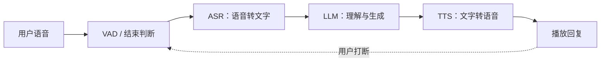

## 语音与音频

语音是人与 AI 交互最自然的方式，也是多模态里理解与生成都相对成熟的方向：语音识别（ASR）已稳定商用，语音合成（TTS）接近真人，实时语音对话（如 GPT-4o 语音模式）把说人话变成了产品标配。覆盖 ASR、TTS、实时语音对话、音乐与音效生成四条线，以及音色授权、深度伪造监管、通话合规等产品视角。

???+ note "读本文之前"
    本文假设读者了解大模型与多模态的基本概念（见 [多模态理解](multimodal.md)）；语音技术术语较多，先记住三条主线：听（ASR）、说（TTS）、对话（实时语音管线），产品问题基本都能归到这三条线上。

## 语音识别(ASR)

### 原理:声学特征 → 音素 → 文本

语音识别的经典管线：音频波形 → 分帧提取声学特征（常用梅尔频谱图，把声音变成类似图像的二维表示）→ 声学模型（把声学特征映射到音素/字符）→ 语言模型（把音素序列整理成通顺文本）。现代方案基本是端到端：一个深度模型直接吃声学特征输出文本，或把音频 token 化后交给多模态模型（如 Whisper 编码器作为多模态模型的音频输入，见 [多模态理解](multimodal.md)）。产品经理不需要会实现，但要理解：识别错误大多来自听不清（声学）与猜不准（语言）两类，排查时先分清楚。

核心关系：ASR 先把声音转换为声学特征，再结合语言规律消歧，最终输出可读文本。

-   **传统管线的可解释性**：声学与语言模块分开，方便定位错误来源（口音问题调声学，术语问题调语言模型），这是传统方案仍在专用场景存活的原因。
-   **端到端方案**：单一模型联合优化，工程简单、跨语言泛化好，但对错误来源是黑盒：出问题只能换数据重训。

### 流式 vs 离线

-   **离线识别**：拿到完整音频后一次性转写，准确率最高，适合会议纪要、字幕、质检：准确率优先、可以等的场景。
-   **流式识别**：边说边出字，首字延迟低（百毫秒级），适合语音助手、实时字幕；代价是准确率略低、需处理半句话的中间结果与纠错：用户说完才完整，产品要处理临时结果 → 最终结果的替换逻辑。

### 指标与难点

-   **WER/CER**：字错误率 / 字符错误率，越低越好；产品报告准确率时要问清是字级还是句级（句级准确率永远比字级好看）。
-   **多语言与方言**：中文方言、中英混说、专有名词是常见掉点；方言识别需专门数据或模型，普通话模型听粤语/四川话会显著掉点。
-   **噪声鲁棒性**：嘈杂环境（车内、工厂、餐厅）识别率显著下降，降噪前处理 + 麦克风阵列是工程标配；远场（隔 3 米）与近场体验差距很大：手机贴脸说和对着会议音箱说是两个世界。
-   **评测方法**：自建噪声 + 方言 + 术语分层测试集（每层 100-200 条），分别报 WER；只报整体 WER 会掩盖日常能听懂、关键术语全错的真实风险。

### 主流方案

-   **Whisper 系**：OpenAI 开源，多语言、多任务（转写/翻译/时间戳），离线批量质量高，社区生态成熟（[Whisper](https://github.com/openai/whisper)）；适合重质量、可离线、可私有化的场景。
-   **商业 API**：各家云厂商与专精厂商提供流式/离线 API，中文效果与价格以官方页面为准；选型要点：中文准确率、方言覆盖、流式首字延迟、按秒计费的价格量级、数据留存政策。
-   **自建 vs API**：自建（Whisper 系 + 微调）胜在数据不出域、批处理成本低；API 胜在免运维、流式与方言能力现成；敏感数据场景（医疗、法务、金融录音）优先私有化。

### ASR 选型对照

| 需求 | 推荐 | 理由 |
| --- | --- | --- |
| 离线批量转写、多语言 | Whisper 系自建 | 免费权重、质量高、可私有化 |
| 中文普通话 + 流式 | 商业 API | 流式与中文调优成熟 |
| 方言/专有名词 | 微调 Whisper 或专精 API | 通用模型听不清，必须定制 |
| 敏感数据（医疗/法务） | 私有化部署 | 数据不出域是硬约束 |
| 实时字幕/同传 | 流式 API + 纠错管线 | 首字延迟与临时结果处理是专业能力 |

## 语音合成(TTS)

### 从参数 TTS 到神经 TTS

-   **参数 TTS**：拼接真人录音片段或参数化建模音色，机械感明显，早年客服语音的机器人味即来源于此。
-   **神经 TTS**：端到端深度学习直接从文本生成波形（或先生成中间表征再生波），音质接近真人，情感与韵律可控性大幅提升；当前主流方案通常与多模态模型结合，实现输入文本 → 自然语音，甚至支持多语种同音色。
-   **声码器环节**：神经 TTS 常分文本 → 声学特征（梅尔频谱）→ 波形两步，最后一步由声码器完成；现代方案也常一步到位，工程差异不影响选型判断，只需知道合成音质的关键在神经声码器与韵律建模。

### 音色克隆与情感控制

-   **音色克隆（少样本）**：用几秒到几分钟的参考音频克隆音色：零样本克隆（几秒即可用）与高质量克隆（需更多数据与训练）是两条产品路线，质量与等待时长成反比；音色是肖像权的音频版，**克隆他人音色需明确授权**（见产品视角）。
-   **情感与韵律控制**：语速、停顿、重音、情绪（高兴/严肃/温柔）可参数化控制；播报（平稳）、有声书（戏剧化）、客服话术（温和）各有最优设置：同一个声音在不同场景下怎么说话是产品体验差异化的关键。
-   **多语言与口音**：同音色跨语言（中文音色说英文）是高频需求，支持度与自然度以各引擎官方为准，商用前实测中文 + 英文混读场景。

### 实时性与 MOS 评估

-   **实时性**：端到端延迟预算：对话场景要求首字延迟与句间停顿都低；TTS 的快体现在首字时间与实时率（生成 1 秒语音所需时间，小于 1 就是快于实时）；流式合成可与 ASR 并行跑，把听与说的延迟叠起来算。
-   **MOS（Mean Opinion Score）**：人工主观听感评分（1-5），是音质评估事实标准；自动化指标只能做初筛，音质好坏最终以人耳为准：上线前组织内部听测，比任何指标都靠谱。
-   **A/B 听测方法**：同一段文本用 2-3 个引擎合成，打乱顺序盲听打分（自然度/情感/稳定性），人数 5 人以上才有统计意义；别让开发团队自己评自己的方案。

### TTS 场景与选型对照

| 场景 | 要求 | 推荐方向 |
| --- | --- | --- |
| 客服/通知播报 | 稳定、便宜、批量 | 标准音色 + 批量合成，预合成缓存 |
| 有声书/内容阅读 | 情感丰富、长文一致 | 高质量神经 TTS，情感参数精细调 |
| 数字人口播 | 形象与声音一致、可克隆 | 授权音色 + 口型同步，见 [视频生成](video-generation.md) |
| 实时对话 | 低延迟、可打断 | 流式 TTS，首字优先 |
| 多语言 | 同音色跨语言 | 多语言引擎，实测中英混读 |
| 个性化 | 用户自己的声音 | 克隆流程 + 授权管理 |

## 实时语音对话

实时语音对话的体验标准不是答得对，而是像人一样聊天：什么时候接话、什么时候闭嘴、被打断怎么反应，这些交互细节决定成败。先理解一个基础概念：**双工（duplex）**：半双工是说完你再说的对讲机模式，全双工是边听边说、随时可插话的电话模式；语音助手要的是全双工体验，工程上要靠 VAD 与打断机制逼近。

### 管线:ASR → LLM → TTS vs 端到端语音模型

-   **级联管线**：ASR 转文本 → LLM 生成回复文本 → TTS 合成语音。组件成熟、可分别调优（A 家 ASR + B 家 LLM + C 家 TTS），是当前大多数语音助手的架构；缺点是模块间有延迟叠加与信息损失：语气、停顿、情绪在语音→文本→文本→语音的两次转换中被抹掉，回答听起来有纸片感。
-   **端到端语音模型**：GPT-4o 语音模式为代表：同一个模型直接吃音频输出音频，保留语气、情感与打断的实时性，感知到响应的延迟更低；但训练与部署门槛高，以官方披露为准（[GPT-4o 系统卡](https://openai.com/index/hello-gpt-4o/)）。
-   **选型**：起步用级联管线（组件都是现成的），体验瓶颈出现再评估端到端；对语气与情绪敏感的陪伴/情感场景，端到端优势明显。

核心关系：级联语音对话把听、想、说串成实时闭环，VAD 与打断机制决定用户能否自然接管对话。

### 管线对比与选型

| 维度 | 级联管线（ASR→LLM→TTS） | 端到端语音模型 |
| --- | --- | --- |
| 组件 | 三个独立模块，可分别替换 | 单一模型 |
| 语气/情绪 | 两次文本转换，损失大 | 原生保留 |
| 延迟 | 模块串行，叠加明显 | 一体，路径最短 |
| 调优 | 各模块独立优化，灵活 | 整体，黑盒 |
| 成本 | 三份用量，可按场景分级 | 一份用量，单价高 |
| 适合 | 大多数助手/客服/纪要 | 陪伴、情感、实时性敏感场景 |

选型口诀：先级联跑通业务，再按体验差距是否影响留存决定是否换端到端。

### 打断、回声与多说话人

-   **打断（barge-in）**：用户说话时 AI 必须立即停嘴：需要 VAD（语音活动检测）与双工设计（边说边听），是体验关键，做不好就是 AI 一直抢话，用户会直接弃用。
-   **回声消除（AEC）**：扬声器声音传回麦克风造成 AI 听见自己说话，需要回声消除与降噪处理；硬件（音箱、耳机）与软件（纯 App）的 AEC 难度完全不同。
-   **多说话人**：会议场景要区分谁在说话（说话人分离/声纹），转写文档按人分段；两人同时说话（重叠语音）是难点，需要专门模型。
-   **VAD 与唤醒词**：VAD 判断有没有人说话，唤醒词（"小爱同学"）决定要不要响应；误唤醒率与拒识率是一对矛盾指标，唤醒词设计（长度、音素特征）影响两者平衡。

### 产品体验指标

-   **首帧延迟**：用户说完到 AI 开口的时长，体感目标一般在 1 秒内，越小越像真人；延迟的主要来源是 VAD 判断说完 + ASR 出字 + LLM 首 token + TTS 首字，每一步都能优化。
-   **往返延迟**：完整一轮对话（说完 → AI 答完）的时间，影响对话流畅度；长回复要边说边生成（流式 TTS 追着 LLM 输出）。
-   **打断成功率、误打断率、回声残留**：工程质量指标，上线前必须实测：打断成功率低用户暴躁，误打断率高 AI 神经质。

### 延迟预算的拆解

| 环节 | 典型量级（参考） | 优化手段 |
| --- | --- | --- |
| VAD 判定说完 | 100-300 ms | 调静音阈值、半句预测 |
| ASR 出字 | 100-300 ms | 流式模型、热词表 |
| LLM 首 token | 200-1000 ms | 快模型、预生成、缓存 |
| TTS 首字 | 100-300 ms | 流式合成、首字优先 |

四项合计就是首帧延迟的底线；逐项设目标、逐项监控，是语音交互产品的基本功。

## 音乐与音效生成

-   **音乐生成**：输入描述（风格/情绪/乐器/时长）生成完整音乐或伴奏。技术可行、产品热闹，**版权是最大风险**：训练数据含大量受版权保护的音乐，生成作品的权属、商用授权、与原创的相似度纠纷都在演进中；商用前必须评估版权风险与平台条款，to B 场景（广告、游戏）尤其严格。
-   **配音与音效**：配音（旁白/广告词）可视为 TTS 的细分；音效生成（脚步声、环境音、拟音）用于影视与游戏，相对低风险，已在创作工具链里落地。
-   **产品注意**：音乐生成要提供版权归属说明与商用授权模式；生成音乐好不好听高度主观，产品定位灵感辅助（给创作者参考）比直接出成品更现实。
-   **技术形态**：音乐生成与语音生成同源（扩散模型 / 自回归 + 音频 token），但音乐的结构（旋律、和声、小节）让长程一致性更难：前 10 秒惊艳、整曲崩掉是常见问题，商用验收要听全曲。
-   **场景分层**：纯 BGM（氛围垫乐）可商用风险低；带人声的歌曲、与知名曲目相似的旋律，风险逐级升高：风险高低决定能不能放开让用户商用。

| 生成物类型 | 版权风险 | 商用建议 |
| --- | --- | --- |
| 纯氛围 BGM | 低 | 可放开商用，附授权说明 |
| 普通配乐 | 中 | 查重后商用，平台担责条款写清 |
| 带人声歌曲 | 中高 | 谨慎，明确非商用限制 |
| 模仿知名艺人/曲风 | 高 | 禁止或强审核，易引发纠纷 |

### 音乐与音效的产品流程

1.  需求描述（风格/情绪/时长）→ 生成多首候选。
2.  版权查重（与已知曲目相似度）→ 风险评级。
3.  人工试听（全曲，不只前奏）→ 选中入库。
4.  授权与标识：生成物元数据写入 AI 生成标识，商用授权书随素材交付。

## 音频理解:环境音、音乐与检索

语音之外，音频理解还有一条非语音线，与 [多模态理解](multimodal.md) 的能力谱系互补：

-   **环境音分类**：识别狗叫、警报、枪声、婴儿哭等非语音声音，用于安防告警、宠物陪伴、老人看护；技术基础是音频分类模型与 CLAP 类音频-文本对比学习模型（把声音与文字描述对齐，零样本分类）。
-   **音乐信息检索**：识别歌曲、流派、版权比对（如 Shazam 类指纹方案 + 大模型语义检索），是音乐平台与版权方的基础设施。
-   **音频检索**：用文字搜音频/语音片段（找一段有鼓点的高潮），是多模态检索在音频域的延伸，素材平台与剪辑工具的刚需。
-   **声学场景分析**：判断在办公室/车内/户外，用于设备自适应（降噪策略、音量调节），是端侧音频产品的小而实用能力。

产品启示：非语音音频理解的成熟度低于 ASR，但竞争也更少；特定声音 + 特定场景的垂直方案（施工噪声监测、婴儿哭声监测）是差异化切入的好位置。

## 产品视角

### 音色授权与肖像权

声音是个人信息与人格权的延伸，克隆真人音色（明星、KOL、素人）必须获得明确授权；产品应把音色库授权管理做成基础设施：每个音色绑定授权文件（来源、用途、期限、渠道），而不是上线后补。数字人产品同时涉及形象与声音两重授权，缺一不可。

授权的落地流程建议：① 授权采集（用户确认授权范围并留档）→ ② 音色入库（来源、用途、期限、渠道四要素）→ ③ 使用留痕（每次合成记录音色与用途）→ ④ 到期停用（自动化下架）。授权即数据，把它当数据系统管，而不是当合同抽屉管。

### 深度伪造监管与语音水印

AI 克隆语音被用于诈骗（AI 换声冒充亲友/领导）是已发生的现实威胁；监管要求生成语音可标识/可溯源，主流做法是语音水印（人耳不可感知、可检测）与元数据溯源（C2PA 类似机制，见 [图像生成](image-generation.md)）；产品要设计合成内容标识与防滥用机制（生成量限制、实名关联、可疑请求拦截）。

风控要点：① 克隆接口做实名与用途申报；② 单账号克隆/合成频率设限；③ 检测模型（判断音频是否 AI 合成）可作为增值能力或合规服务；④ 重大舆情（冒充名人）要能一键追溯合成记录。

### 通话场景合规

-   客服录音、电话外呼的录音告知是硬性要求（各国规定不同，以当地法规为准）；本次通话可能被录音不是可选项。
-   录音数据的存储、调取与脱敏要进合规设计：转写文本同样属于个人信息，访问要留痕；相关指引见 [合规与安全](../practice/compliance.md)。
-   具体到产品：① 录音开关与告知文案在产品内可查；② 录音与转写数据的保留期限按法规设置自动过期；③ 质检、AI 训练使用录音需单独授权，不能录音即默许用于训练；④ 跨境通话（海外客服）还要过数据出境评估。

### 语音产品的度量看板

-   **质量类**：字级 WER（分噪声/方言/术语层）、MOS、说话人分离准确率。
-   **体验类**：首帧延迟、往返延迟、打断成功率、误打断率。
-   **成本类**：每千分钟转写成本、每千次合成成本、实时比例、缓存命中率。
-   **合规类**：授权覆盖度（已授权音色/形象占比）、录音告知率、水印添加率。

四类指标各自设目标、按月复盘：语音产品的健康度，靠这四张表说话。

### 成本与延迟优化

-   **分级路由**：简单问答走级联管线（便宜），复杂对话升级端到端；同 [模型能力与边界](capabilities.md) 的路由思路。
-   **用量控制**：流式识别按秒计费，长音频转写按分钟计费，量级要先算账；批量转写走离线低价通道；实时听写 vs 事后转写的成本可以差一个量级，能异步就别实时。
-   **延迟预算**：实时对话场景把首帧延迟、往返延迟当硬指标，流式 + 预生成（提前合成候选回复，如常见问题直接命中）是常用手段。
-   **成本算例（量级参考，以官方为准）**：假设某会议产品月处理 1 万小时音频，离线转写单价为 A（元/小时），则月度转写成本 ≈ 1 万 × A；若其中 10% 需要实时（客服通话），实时单价通常高于离线，把实时比例压到业务必需是最大降本项。TTS 同理：能预合成（常见问题、模板话术）的绝不实时合成，缓存命中率直接影响账单。

## 未来趋势

-   **端到端语音成为标配**：实时对话、情绪保留、低延迟：级联管线会逐步让位，说人话的体验差距主要由端到端模型拉开。
-   **多模态语音助手**：声音 + 视觉 + 屏幕理解合一（看到用户屏幕再回答），语音助手的边界从听扩展到看。
-   **实时翻译与同传**：流式 ASR + 机器翻译 + 流式 TTS 的成熟，让跨语言实时对话成为大众产品。
-   **语音安全与治理**：语音水印、深度伪造检测、音色授权标准化，从合规负担变成产品信任资产。
-   **音频大模型**：音频 token 化 + 大模型，环境音、音乐、语音统一理解与生成，听得懂世界的音频基础模型是长期方向。
-   **端侧语音**：唤醒词、VAD、小模型 ASR/TTS 上手机与 IoT 设备，离线可用 + 隐私友好让语音交互成为设备默认入口。
-   **语音与人机协作**：机器先答、复杂转人的混合客服形态会成熟：语音产品设计里，何时无缝转人工与转人工后的上下文交接是体验分水岭。
-   **质量可解释**：转写/合成的错误会随模型迭代而变化，错误类型可归类、可归因的评测体系（为什么错、哪类错、怎么修）会成为语音产品的基本功。
-   **开放生态与标准**：语音水印、音色授权、格式互操作的标准会逐步统一，接口即合同：提前按标准设计，避免后期被生态绑定。

### 三大落地场景的要点

-   **会议纪要**：离线高精度转写 + 说话人分离 + 摘要；注意方言、多人抢话、专业术语的容错设计；输出要带时间戳与说话人，一段话不知道谁说的纪要等于废纸。
-   **客服**：流式 ASR + 实时质检（情绪、合规话术）+ 事后全量转写；通话录音合规是前提；质检发现情绪失控比事后听录音更能救单。
-   **语音助手**：打断体验 > 识别精度：宁可识别错一句及时纠正，也不能让用户觉得 AI 不懂闭嘴；唤醒词误唤醒率、拒识率是埋雷指标，参考 [对话助手实践](../practice/chatbot.md)。

### 场景能力对照表

| 场景 | 核心链路 | 关键指标 | 合规要点 |
| --- | --- | --- | --- |
| 会议纪要 | 离线 ASR + 说话人分离 + 摘要 | 字级 WER、说话人准确率 | 录音告知、数据脱敏 |
| 客服质检 | 流式 ASR + 规则/模型质检 | 质检覆盖率、情绪识别准确率 | 录音告知、存储留痕 |
| 语音助手 | 流式 ASR + LLM + 流式 TTS | 首帧延迟、打断成功率 | 唤醒词隐私、儿童保护 |
| 有声书/播报 | 高质量 TTS + 情感控制 | MOS、听测一致性 | 音色授权（若用真人克隆） |
| 实时字幕 | 流式 ASR + 纠错 | 延迟、关键术语正确率 | 公开场合字幕的准确性责任 |
| 音乐生成 | 音乐模型 + 版权管理 | 整曲听感、版权风险评级 | 训练数据与生成物版权 |

### 常见坑

-   **拿演示音频验收**：演示都是精选文本与安静环境；真实场景的噪声、口音、口语词（嗯/啊/重复）才是主战场。
-   **忽略口语修正**：转写出的嗯嗯啊啊、口头禅、自我纠正要清洗，转写准确不等于纪要可读。
-   **音色克隆不设防**：开放克隆 = 诈骗工具；至少要做实名 + 授权确认 + 生成记录，涉及公众人物音色要单独审核。
-   **实时与批量的成本不分**：能离线就别实时，能批量就别流式：实时是成本最高的档位，按场景精确分配。
-   **不做全链路压测**：语音产品的延迟问题常出在链路衔接（ASR 与 TTS 的交接、网络抖动），单模块指标好不等于端到端体验好。
-   **忽略标点与格式**：ASR 输出的标点、大小写、数字格式影响下游可读性，句子打标 + 格式化是转写管线的标配后处理，别把原始输出直接展示。
-   **热词表不维护**：人名、品牌、专业术语要靠热词表纠偏；热词表要随业务更新（新产品名、新术语），上线后不管会让转写质量悄悄下滑。
-   **安全测试缺位**：语音助手的误唤醒后录音、儿童误触发等场景要有专项测试；合成内容被用于诈骗的案例要纳入风控演练。
-   **把 WER 当唯一指标**：WER 低但关键字段（金额、订单号、地址）错，对业务是致命的：按关键信息错误率单独验收，比整体 WER 更重要。
-   **音频链路不做监控**：转写/合成服务的可用性、延迟分位数、错误率要有线上监控与告警，语音挂了但没人知道是客服类事故的常见形态。

???+ note "给产品经理的最终建议"
    语音产品的关键不是最新模型，而是延迟预算、合规授权、质量度量三件事。先把首帧延迟、授权链路、WER 看板立起来，再谈换模型：这三件是语音产品的底盘，不会随模型迭代而过时。

???+ warning "语音产品的三件套测试"
    上线前至少测三组：① 噪声环境（地铁/马路/办公室）的识别率；② 打断与抢话场景的体验；③ 音色克隆与合成的授权与标识是否走通。

    语音产品的口碑往往死于这三个细节。

???+ example "练习"
    设计一个会议纪要素材 + 语音助手的产品方案：画出 ASR/TTS/LLM 的管线组合、列出 3 个关键体验指标的目标值，并说明录音合规与音色授权如何落地。

## 来源说明

> 本文为原创整理，概念与模型信息参考以下来源，访问验证日期 2026-08-23；模型能力与价格变动频繁，以各官方页面为准。

1.  [Whisper（GitHub）](https://github.com/openai/whisper)：开源多语言语音识别方案。
2.  [GPT-4o 系统卡](https://openai.com/index/hello-gpt-4o/)：端到端语音模型与实时对话能力。
3.  [Gemini 多模态文档](https://ai.google.dev/gemini-api/docs)：音频输入与理解能力（超长音频检索式理解）。
4.  AIGC 面试书多模态系列笔记（预取资料 `sources/mm/`）：音频编码器（CLAP/AudioCLIP）、Whisper 编码器在多模态模型中的角色。
5.  站内：[多模态理解](multimodal.md)、[模型能力与边界](capabilities.md)、[对话助手实践](../practice/chatbot.md)、[合规与安全](../practice/compliance.md)。
