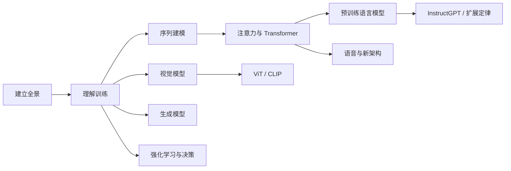

## AI 经典论文

这是一条面向 AI 产品经理的论文阅读路线。主体约 30 篇，并补上通识页反复出现、原清单缺失的 CLIP、ViT、InstructGPT 与扩展定律。覆盖机器学习方法、深度学习训练、视觉模型、序列建模、Transformer、预训练语言模型、生成模型、强化学习、多模态对齐与规模规律。

条目按**概念依赖关系**排序，不按发表年份排列。先建立全局，再理解训练机制，之后进入视觉、序列、生成和决策模型。论文不要求逐行读懂，先抓住研究问题、核心方法、实验结论和适用边界。

核心路线是：先理解模型如何从数据中学习，再看不同数据形态对应的架构，最后连接到今天的大模型和 AI 产品。

## 怎么读

- **第一遍**：读标题、摘要、引言、核心图和结论，回答「要解决什么问题、提出了什么改变、结果如何」。
- **第二遍**：结合对应的数学或架构基础，补读方法和实验设置。
- **产品视角**：记录论文的输入、输出、数据要求、算力成本、可控性和失败边界。
- **阅读顺序**：每个分组内部按编号阅读；不必一次读完全部论文，先读与当前产品问题相关的分组。

## 一、先建立全景

| 序号 | 论文 | 核心贡献 | 产品经理要记住什么 |
| --- | --- | --- | --- |
| 1 | [*Deep Learning*](https://doi.org/10.1038/nature14539)（LeCun、Bengio、Hinton，2015） | 系统回顾深度学习的表示、训练与应用 | 用它建立技术地图，不作为第一篇精读 |
| 2 | [*A Few Useful Things to Know About Machine Learning*](https://homes.cs.washington.edu/~pedrod/papers/cacm12.pdf)（Domingos，2012） | 总结数据、特征、模型、评估和泛化中的实用原则 | 先查问题定义、数据和评估，再讨论模型 |
| 3 | [*The Unreasonable Effectiveness of Data*](https://static.googleusercontent.com/media/research.google.com/en//pubs/archive/35179.pdf)（Halevy、Norvig、Pereira，2009） | 说明大规模数据对机器学习性能的推动作用 | 数据覆盖、质量和反馈闭环决定能力上限 |

## 二、理解训练一张网络

| 序号 | 论文 | 核心贡献 | 产品经理要记住什么 |
| --- | --- | --- | --- |
| 4 | [*Understanding the Difficulty of Training Deep Feedforward Neural Networks*](https://proceedings.mlr.press/v9/glorot10a.html)（Glorot、Bengio，2010） | 分析深层前馈网络训练困难，提出 Xavier 初始化 | 训练不稳定时，初始化、激活函数和梯度都要排查 |
| 5 | [*Dropout: A Simple Way to Prevent Neural Networks from Overfitting*](https://jmlr.org/papers/v15/srivastava14a.html)（Srivastava 等，2014） | 提出 Dropout 正则化，降低神经网络过拟合 | 训练效果好不等于泛化好，必须用独立数据验证 |
| 6 | [*Adam: A Method for Stochastic Optimization*](https://arxiv.org/abs/1412.6980)（Kingma、Ba，2014） | 提出结合梯度一阶矩与二阶矩估计的自适应优化器 | 优化器影响训练效率，但不能替代数据和目标设计 |
| 7 | [*Batch Normalization: Accelerating Deep Network Training by Reducing Internal Covariate Shift*](https://arxiv.org/abs/1502.03167)（Ioffe、Szegedy，2015） | 通过批归一化稳定并加速深层网络训练 | 训练和推理的统计行为可能不同，部署前要验证 |

## 三、视觉模型的演进

| 序号 | 论文 | 核心贡献 | 产品经理要记住什么 |
| --- | --- | --- | --- |
| 8 | [*ImageNet Classification with Deep Convolutional Neural Networks*](https://papers.nips.cc/paper_files/paper/2012/hash/c399862d3b9d6b76c8436e924a68c45b-Abstract.html)（Krizhevsky、Sutskever、Hinton，2012） | AlexNet 结合深度 CNN、ReLU、Dropout 和 GPU，在 ImageNet 上取得突破 | 数据集、算力和架构共同推动了深度学习的跃迁 |
| 9 | [*Very Deep Convolutional Networks for Large-Scale Image Recognition*](https://arxiv.org/abs/1409.1556)（Simonyan、Zisserman，2014） | 用规律堆叠的 3×3 卷积构建更深的视觉网络 | 网络深度带来表达能力，也带来训练和计算成本 |
| 10 | [*Deep Residual Learning for Image Recognition*](https://arxiv.org/abs/1512.03385)（He 等，2015） | 用残差连接解决深层网络的优化困难，提出 ResNet | 复杂系统要保留稳定的增量路径，避免深度增加后难以训练 |

## 四、从序列建模到注意力

| 序号 | 论文 | 核心贡献 | 产品经理要记住什么 |
| --- | --- | --- | --- |
| 11 | [*Long Short-Term Memory*](https://www.bioinf.jku.at/publications/older/2604.pdf)（Hochreiter、Schmidhuber，1997） | 用门控机制保留长期信息，缓解普通 RNN 的梯度问题 | 序列任务要关注信息保留、延迟和上下文长度 |
| 12 | [*On the Difficulty of Training Recurrent Neural Networks*](https://arxiv.org/abs/1211.5063)（Pascanu、Mikolov、Bengio，2013） | 分析 RNN 的梯度消失与爆炸，提出梯度裁剪等方法 | 长链路任务的失败可能来自训练动力学，不只是数据量 |
| 13 | [*Sequence to Sequence Learning with Neural Networks*](https://arxiv.org/abs/1409.3215)（Sutskever、Vinyals、Le，2014） | 建立 Encoder-Decoder 序列到序列框架 | 输入和输出长度可以不同，翻译、摘要等任务由此统一起来 |
| 14 | [*Neural Machine Translation by Jointly Learning to Align and Translate*](https://arxiv.org/abs/1409.0473)（Bahdanau、Cho、Bengio，2014） | 在 Seq2Seq 中引入注意力，对输入内容动态对齐 | 长输入不能只依赖固定长度的中间向量 |
| 15 | [*Attention Is All You Need*](https://arxiv.org/abs/1706.03762)（Vaswani 等，2017） | 用自注意力取代循环结构，提出 Transformer | 并行计算、长距离依赖和规模化共同构成 Transformer 的优势；详见 [Transformer 架构](transformer.md) |

## 五、预训练语言模型

| 序号 | 论文 | 核心贡献 | 产品经理要记住什么 |
| --- | --- | --- | --- |
| 16 | [*Exploring the Limits of Language Modeling*](https://arxiv.org/abs/1602.02410)（Jozefowicz 等，2016） | 研究大规模语言模型的架构、数据和规模，展示语言建模性能的提升路径 | 语言模型能力与数据、参数和训练资源共同变化 |
| 17 | [*BERT: Pre-training of Deep Bidirectional Transformers for Language Understanding*](https://arxiv.org/abs/1810.04805)（Devlin 等，2018） | 用双向 Transformer 和掩码语言模型提升语言理解 | Encoder-only 模型适合理解、分类、抽取和检索表示 |
| 18 | [*Language Models are Unsupervised Multitask Learners*](https://cdn.openai.com/better-language-models/language_models_are_unsupervised_multitask_learners.pdf)（Radford 等，2019） | GPT-2 展示大规模无监督语言模型的零样本迁移能力 | 规模扩大后，单一预测目标可以支持多种下游任务 |
| 19 | [*Language Models are Few-Shot Learners*](https://arxiv.org/abs/2005.14165)（Brown 等，2020） | GPT-3 展示通过上下文示例完成少样本任务 | Prompt 和示例可以临时改变任务行为，但不等于模型更新 |

## 六、生成模型

| 序号 | 论文 | 核心贡献 | 产品经理要记住什么 |
| --- | --- | --- | --- |
| 20 | [*Auto-Encoding Variational Bayes*](https://arxiv.org/abs/1312.6114)（Kingma、Welling，2013） | 建立 VAE，将变分推断用于可学习的生成模型 | 生成模型要同时关注样本质量、潜变量结构和可控性 |
| 21 | [*Generative Adversarial Nets*](https://arxiv.org/abs/1406.2661)（Goodfellow 等，2014） | 用生成器与判别器的对抗训练生成逼真样本 | 生成质量来自训练博弈，稳定性和可控性是核心工程问题 |
| 22 | [*Conditional Generative Adversarial Nets*](https://arxiv.org/abs/1411.1784)（Mirza、Osindero，2014） | 给 GAN 加入类别或其他条件，控制生成结果 | 生成能力进入产品前，必须定义可控制的条件和验收标准 |
| 23 | [*Unsupervised Representation Learning with Deep Convolutional Generative Adversarial Networks*](https://arxiv.org/abs/1511.06434)（Radford、Metz、Chintala，2015） | 用卷积结构改进 GAN 的训练和表示学习 | 架构先验可以提高生成稳定性，但不消除数据偏差 |
| 24 | [*Denoising Diffusion Probabilistic Models*](https://arxiv.org/abs/2006.11239)（Ho、Jain、Abbeel，2020） | 建立扩散模型的加噪与去噪生成过程 | 生成质量、采样速度、算力成本和可控性需要一起权衡；详见 [图像生成](image-generation.md) |

## 七、强化学习与决策

| 序号 | 论文 | 核心贡献 | 产品经理要记住什么 |
| --- | --- | --- | --- |
| 25 | [*Playing Atari with Deep Reinforcement Learning*](https://arxiv.org/abs/1312.5602)（Mnih 等，2013） | 将深度神经网络用于 Q-learning，提出 DQN 并学习 Atari 游戏策略 | 强化学习依赖环境反馈，奖励函数决定模型优化的方向 |
| 26 | [*Human-level Control through Deep Reinforcement Learning*](https://doi.org/10.1038/nature14236)（Mnih 等，2015） | 在多种 Atari 游戏上达到接近人类的控制表现 | 评估不能只看单个任务，跨场景稳定性同样重要 |
| 27 | [*Mastering the Game of Go with Deep Neural Networks and Tree Search*](https://doi.org/10.1038/nature16961)（Silver 等，2016） | 结合策略网络、价值网络和蒙特卡洛树搜索，构建 AlphaGo | 复杂决策通常需要模型预测与搜索、规划或工具协同 |

## 八、语音、新架构与研究视角

| 序号 | 论文 | 核心贡献 | 产品经理要记住什么 |
| --- | --- | --- | --- |
| 28 | [*Deep Speech: Scaling up End-to-End Speech Recognition*](https://arxiv.org/abs/1412.5567)（Hannun 等，2014） | 探索端到端语音识别，用深度神经网络直接建模语音到文字的映射 | 语音产品要在端到端效率、可解释性、数据和错误兜底之间取舍；后续 Deep Speech 2（Amodei 等，2015，[1512.02595](https://arxiv.org/abs/1512.02595)）把规模与多语言再推进一步 |
| 29 | [*Neural Ordinary Differential Equations*](https://arxiv.org/abs/1806.07366)（Chen 等，2018） | 将残差网络推广为连续深度模型，用微分方程描述隐藏状态变化 | **选读**。新架构的价值要落到精度、延迟、内存和部署复杂度；产品路线可跳过 |
| 30 | [*The Lottery Ticket Hypothesis: Finding Sparse, Trainable Neural Networks*](https://arxiv.org/abs/1803.03635)（Frankle、Carbin，2019） | 提出稠密网络中存在可训练的稀疏子网络 | 模型压缩不能只看参数量，还要验证精度、训练成本和硬件收益 |

## 九、多模态、对齐与扩展定律

通识页里反复出现的概念，原「30 篇」清单没有对应论文，补在这里。与第 8–10、17–19、24 条一起读。

| 序号 | 论文 | 核心贡献 | 产品经理要记住什么 |
| --- | --- | --- | --- |
| 31 | [*An Image is Worth 16x16 Words: Transformers for Image Recognition at Scale*](https://arxiv.org/abs/2010.11929)（Dosovitskiy 等，2020） | ViT 把图像切成 patch 当 token，用 Transformer 做视觉识别 | 视觉也可以走 token 化；分辨率、patch 大小和算力一起决定成本；详见 [Transformer 架构](transformer.md) |
| 32 | [*Learning Transferable Visual Models From Natural Language Supervision*](https://arxiv.org/abs/2103.00020)（Radford 等，2021） | CLIP 用图文对比学习对齐视觉与语言空间 | 多模态检索和零样本分类的基础；对齐空间不等于细粒度推理；详见 [多模态理解](multimodal.md) |
| 33 | [*Training Language Models to Follow Instructions with Human Feedback*](https://arxiv.org/abs/2203.02155)（Ouyang 等，2022） | InstructGPT：SFT + RM + PPO，小参数对齐模型优于更大未对齐 GPT-3 | 对齐改变的是「听不听人话」，不是 Chinchilla 意义上的训练/推理算力配比；详见 [模型训练与对齐](llm-training.md) |
| 34 | [*Scaling Laws for Neural Language Models*](https://arxiv.org/abs/2001.08361)（Kaplan 等，2020） | 损失随参数、数据、算力呈可预测的幂律 | 规模是杠杆，但幂律在数据质量、重复和过训练区间会拐弯 |
| 35 | [*Training Compute-Optimal Large Language Models*](https://arxiv.org/abs/2203.15556)（Hoffmann 等，2022） | Chinchilla：同等算力下应给模型配足够 token，许多大模型当时欠训练 | 训练/推理经济最优 ≠ 对齐税；不要和 InstructGPT 的结论混写；详见 [模型训练与对齐](llm-training.md) |

## 经典编号接到哪一页

| 经典条目 | 站内正文 |
| --- | --- |
| 11–15 序列与注意力 | [深度学习基础](dl-basics.md)、[Transformer 架构](transformer.md) |
| 16–19、33–35 预训练、指令与规模 | [大模型基础](llm-basics.md)、[模型训练与对齐](llm-training.md) |
| 20–24 生成 | [图像生成](image-generation.md) |
| 31–32 ViT / CLIP | [Transformer 架构](transformer.md)、[多模态理解](multimodal.md)、[多模态前沿论文](multimodal-frontier-papers.md) |
| 25–27 强化学习 | [模型训练与对齐](llm-training.md)、[RLVR 与 GRPO](llm-rlvr-grpo.md) |
| 2024 年后的架构与训练 | [大模型前沿论文](llm-frontier-papers.md)（论文导读，不是通识课） |

## 读完之后

- 想理解模型内部机制，继续读 [深度学习基础](dl-basics.md) 和 [Transformer 架构](transformer.md)。
- 想理解大模型如何形成，继续读 [大模型基础](llm-basics.md) 与 [模型训练与对齐](llm-training.md)。
- 想把生成模型用于产品，继续读 [图像生成](image-generation.md)、[语音与音频](audio.md) 和 [评估与评测](evaluation.md)。
- 想把模型接入业务流程，继续读 [Agent 与工作流](agent.md) 和 [AI 系统架构](architecture.md)。
- 想从经典论文接到 2024 年后的架构与训练研究，继续读 [大模型前沿论文](llm-frontier-papers.md)。

## 来源说明

本文为原创整理，引用日期：2026-09-04。条目 1–30 的取舍参考 [AI 领域经典论文清单-30篇](https://zhuanlan.zhihu.com/p/1896686592673949413)；参考文章中 VAE 条目重复，本文合并为一篇，并按概念依赖关系调整顺序。第 31–35 条为补通识缺口追加。论文标题、作者、年份和链接以各论文原始页面为准。
