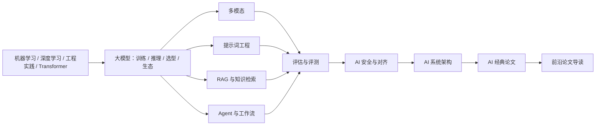

## AI 基础简介

本栏目是 AI 产品经理的技术通识课：不以从零训练大型模型为主，讲清楚 **AI 能做什么、不能做什么、怎么用**，帮助你在产品决策中理解技术边界、与工程师高效协作。内容按知识类分卷，每个知识类拆多篇：先有地基（机器学习、深度学习、工程实践与 Transformer），再到大模型（训练、推理、能力边界与模型生态），再到各应用技术（多模态、提示词、RAG、Agent），最后是评估、安全、系统架构与 AI 前沿。相邻栏目：[产品方法论](../pm/index.md) 回答「怎么判断、怎么设计」，[商业与财会](../business/index.md) 回答「金融与财务领域是怎么运转的」，本栏目回答「模型能做什么、怎样把模型做成可维护的系统」。

核心关系：上图是知识依赖主链，不是阅读顺序，也不是完整目录。完整页面见下列；阅读顺序见文末阅读建议。经典论文补概念依赖，前沿专题按需选读，不替代通识页的厚度。

## 内容列表

### 机器学习与深度学习（地基）

-   [机器学习基础](ml-basics.md)：监督/无监督/半监督/强化、回归/分类/聚类、模型评估与特征工程——传统 ML 全景
-   [深度学习基础](dl-basics.md)：神经网络、反向传播、CNN/RNN/GNN、优化与训练——深度学习全景
-   [深度学习工程实践](deep-learning-practice.md)：数据与模型契约、训练调试、checkpoint、评估、导出、服务化与上线回滚——把模型做成可维护的系统
-   [Transformer 架构](transformer.md)：注意力机制、多头、位置编码、三种形态——大模型的地基

### 大模型

-   [大模型基础](llm-basics.md)：LLM 是怎么工作的、token/上下文/温度、幻觉、发展简史
-   [模型训练与对齐](llm-training.md)：预训练、扩展定律、RLHF/DPO、微调与蒸馏——模型是怎么炼成的
-   [模型推理与部署](llm-inference.md)：预填充/解码、KV Cache、量化、私有化部署与成本结构
-   [模型能力与边界](capabilities.md)：做得到做不到、推理预算与选型快照
-   [开源与闭源模型生态](model-ecosystem.md)：许可、开闭源格局、本地化与迁移风险

### 多模态

-   [多模态理解](multimodal.md)：文本之外——图像、文档、视频、音频的理解能力
-   [图像生成](image-generation.md)：扩散模型原理、Stable Diffusion/FLUX 生态、可控生成
-   [视频生成](video-generation.md)：视频生成架构、典型模型、产品边界
-   [语音与音频](audio.md)：ASR/TTS、实时语音对话、音乐生成与合规

### 提示词工程

-   [提示词工程](prompting.md)：与模型高效对话的方法、结构与技巧
-   [高级提示词技巧](prompt-advanced.md)：复杂推理、上下文工程、结构化输出、企业级实践
-   [提示词安全](prompt-security.md)：提示词注入、越狱、防护体系与红队

### RAG 与知识检索

-   [RAG 基础](rag.md)：让模型知道你的私有知识——流程、失败模式与评估
-   [检索技术](rag-retrieval.md)：Embedding、向量检索、BM25、混合检索与重排
-   [高级 RAG](rag-advanced.md)：查询处理、GraphRAG、Agentic RAG、评测体系

### Agent

-   [Agent 与工作流](agent.md)：从对话到自主完成任务——基础概念与产品设计要点
-   [工具调用与 MCP](agent-tools.md)：Function Calling、MCP 协议、工具安全，兼及 A2A
-   [Agent 架构与多智能体](agent-architecture.md)：设计模式、记忆系统、多智能体编排、AgentOps

### 评估、安全与架构

-   [评估与评测](evaluation.md)：三层评估体系、基准与榜单、LLM-as-Judge、红队与灰度
-   [AI 安全与对齐](ai-safety.md)：模型安全、应用安全与内容安全，对齐技术与上线评审
-   [AI 系统架构](architecture.md)：一张四层地图，讲清业务、应用、技术、数据每层 PM 该关注什么

### AI 前沿

-   [AI 经典论文](classic-papers.md)：按概念依赖组织代表作，并接到 CLIP / ViT / InstructGPT / 扩展定律与前沿专题
-   [大模型前沿论文](llm-frontier-papers.md)：前沿论文导读总入口，按架构、推理、训练、Agent、多模态、记忆、替代范式与可信研究组织专题

#### 架构与序列

-   [架构组件与训练稳定性](llm-frontier-architecture.md)：位置编码、归一化、激活函数、残差连接与深层优化
-   [注意力与 KV Cache](llm-frontier-attention.md)：MHA、MQA、GQA、MLA、CSA/HCA 及缓存压缩
-   [稀疏与局部注意力](llm-frontier-sparse-attention.md)：结构化稀疏、滑动窗口、局部—全局注意力与 DSA
-   [线性注意力与状态空间](llm-frontier-sequence-models.md)：Lightning Attention、Mamba、DeltaNet、KDA 与 Mamba-3
-   [混合专家模型](llm-frontier-moe.md)：稀疏路由、专家专业化、负载均衡与分布式代价
-   [世界模型与具身智能](world-models-embodied.md)：环境动力学、潜在 rollout、VLA 和机器人闭环

#### 推理与训练

-   [推理时扩展](llm-reasoning-scaling.md)：采样、搜索、验证器、自适应预算和 test-time compute
-   [RLVR 与 GRPO](llm-rlvr-grpo.md)：可验证奖励、过程监督、DeepSeekMath 与 DeepSeek-R1
-   [推理系统与量化](llm-inference-systems-quantization.md)：IO、调度、缓存、投机解码、量化和端到端成本

#### Agent 与多模态

-   [Agent 与 Computer Use](agent-computer-use-frontier.md)：GUI grounding、浏览器、桌面、移动端和软件工程 Agent
-   [多模态前沿论文](multimodal-frontier-papers.md)：视觉语言模型、原生多模态、视频音频与视觉 grounding

#### 记忆与替代范式

-   [外部记忆与模型编辑](llm-memory-model-editing.md)：检索式模型、测试时记忆、参数编辑与遗忘
-   [Diffusion Language Model](diffusion-language-models.md)：离散扩散、Masked Diffusion、infilling 与并行生成
-   [Tokenizer-free 模型](tokenizer-free-models.md)：字节级、字符级、多尺度压缩与多语言成本

#### 可信前沿

-   [可解释性与安全前沿](interpretability-safety-frontier.md)：内部表征、因果干预、SAE、监督和安全监控

## 产品经理需要掌握到什么程度

-   **必懂**：幻觉、上下文窗口、token、RAG 概念、评估方法
-   **应懂**：常见模型家族的差异、提示词技巧、Agent 的边界、提示词安全
-   **可懂**：训练/微调的基本原理，听懂、不误解即可；前沿论文按岗位选读

???+ note "阅读建议"
    没有 ML 背景的读者先读「机器学习与深度学习」四篇，再进大模型；其中[深度学习工程实践](deep-learning-practice.md)可先读与目标岗位相关的章节。有基础的可以直接从 [Transformer 架构](transformer.md) 开始。

    大模型按列出的顺序读：基础 → 训练 → 推理 → [模型能力与边界](capabilities.md)（做不做得了、档位）→ [开源与闭源模型生态](model-ecosystem.md)（许可与迁移）。再按多模态、提示词、RAG、Agent 进入应用。收口依次是 [评估与评测](evaluation.md)、[AI 安全与对齐](ai-safety.md)、[AI 系统架构](architecture.md)。经典论文按概念依赖补读；前沿从 [大模型前沿论文](llm-frontier-papers.md) 的瓶颈地图按需选专题，不要用前沿页代替通识厚度。

    每个知识类内部文章按列出的顺序阅读，由浅入深。
