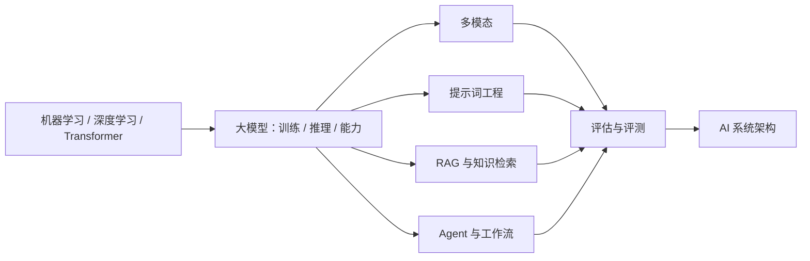

## AI 基础简介

本栏目是 AI 产品经理的技术通识课：不讲怎么训练模型，讲清楚 **AI 能做什么、不能做什么、怎么用**，帮助你在产品决策中理解技术边界、与工程师高效协作。内容按知识类分卷，每个知识类拆多篇：先有地基（机器学习/深度学习/Transformer），再到大模型（训练、推理、能力边界），再到各应用技术（多模态、提示词、RAG、Agent），最后是评估与系统架构。相邻栏目：[产品方法论](../pm/index.md) 回答「怎么判断、怎么设计」，[商业与财会](../business/index.md) 回答「金融与财务领域是怎么运转的」，本栏目回答「模型能做什么」。

核心关系：学习路径从模型地基走向应用能力，最终由评测与系统架构把各条技术线串成可落地的产品闭环。

## 内容列表

### 机器学习与深度学习(地基)

-   [机器学习基础](ml-basics.md)：监督/无监督/强化、回归/分类/聚类、模型评估与特征工程——传统 ML 全景
-   [深度学习基础](dl-basics.md)：神经网络、反向传播、CNN/RNN/GNN、优化与训练——深度学习全景
-   [Transformer 架构](transformer.md)：注意力机制、多头、位置编码、三种形态——大模型的地基

### 大模型

-   [大模型基础](llm-basics.md)：LLM 是怎么工作的、token/上下文/温度、幻觉、发展简史
-   [模型训练与对齐](llm-training.md)：预训练、扩展定律、RLHF/DPO、微调与蒸馏——模型是怎么炼成的
-   [模型推理与部署](llm-inference.md)：预填充/解码、KV Cache、量化、私有化部署与成本结构
-   [模型能力与边界](capabilities.md)：推理模型时代的能力地图与选型方法

### 多模态

-   [多模态理解](multimodal.md)：文本之外——图像、文档、视频、音频的理解能力
-   [图像生成](image-generation.md)：扩散模型原理、Stable Diffusion/FLUX 生态、可控生成
-   [视频生成](video-generation.md)：视频生成架构、典型模型、产品边界
-   [语音与音频](audio.md)：ASR/TTS、实时语音对话、音乐生成与合规

### 提示词工程

-   [提示词工程](prompting.md)：与模型高效对话的方法、结构与技巧
-   [高级提示词技巧](prompt-advanced.md)：复杂推理、上下文工程、结构化输出、企业级实践
-   [提示词安全](prompt-security.md)：提示词注入、越狱、防护体系与红队

### RAG 与知识检索

-   [RAG 基础](rag.md)：让模型知道你的私有知识——流程、失败模式与评估
-   [检索技术](rag-retrieval.md)：Embedding、向量检索、BM25、混合检索与重排
-   [高级 RAG](rag-advanced.md)：查询处理、GraphRAG、Agentic RAG、评测体系

### Agent

-   [Agent 与工作流](agent.md)：从对话到自主完成任务——基础概念与产品设计要点
-   [工具调用与 MCP](agent-tools.md)：Function Calling、MCP 协议、工具安全
-   [Agent 架构与多智能体](agent-architecture.md)：设计模式、记忆系统、多智能体编排、AgentOps

### 评估与架构

-   [评估与评测](evaluation.md)：三层评估体系、基准与榜单、LLM-as-Judge、红队与灰度
-   [AI 系统架构](architecture.md)：一张四层地图，讲清业务、应用、技术、数据每层 PM 该关注什么

## 产品经理需要掌握到什么程度

-   **必懂**：幻觉、上下文窗口、token、RAG 概念、评估方法
-   **应懂**：常见模型家族的差异、提示词技巧、Agent 的边界
-   **可懂**：训练/微调的基本原理，听懂、不误解即可

???+ note "阅读建议"
    没有 ML 背景的读者先读「机器学习与深度学习」三篇再进大模型；有基础的可以直接从 [Transformer 架构](transformer.md) 开始。

    每个知识类内部文章按列出的顺序阅读，由浅入深。
