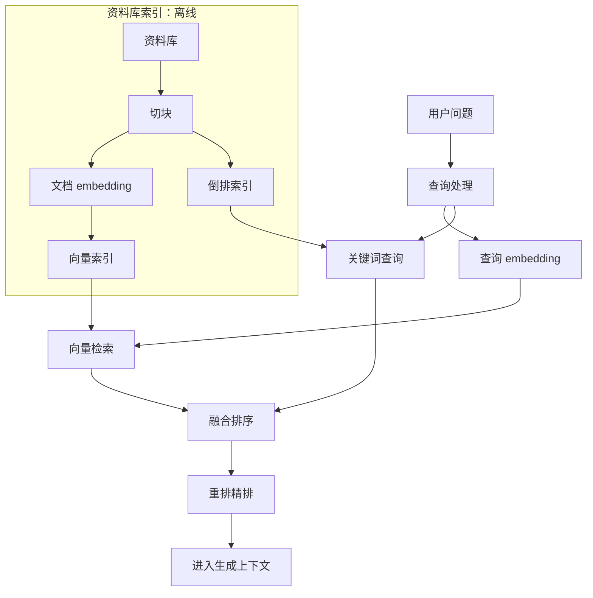
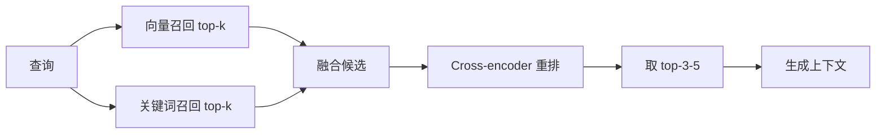

## 检索技术

检索是 RAG 的第一公里：**检索到什么，决定生成能有多好**。

检索技术的原理包括关键词与向量两条路线、embedding 与向量索引、BM25、混合检索与重排、切块策略，以及检索质量怎么评估。

RAG 整体流程与产品视角见 [RAG 基础](rag.md)，查询改写、GraphRAG、Agentic RAG 等进阶方案见 [高级 RAG](rag-advanced.md)。

## 检索在 RAG 中的位置

RAG 的检索侧是一条小管线，先建立全局视角再逐节展开：



核心关系：离线索引准备向量与倒排两条检索通道，在线查询并行召回后融合、重排，才把候选资料交给生成。

这条管线里的每个环节（查询处理、切块、embedding、索引、融合、重排）都影响正确的块能不能进生成上下文：除查询处理（见 [高级 RAG](rag-advanced.md)）之外，本页讲其余各个环节。

## 检索的两条路线

检索本质上是在资料库中找出与问题最相关的内容，实现路线分两大派：

-   **关键词检索（稀疏）**：把文档拆成词，建倒排索引，查询时按词匹配打分。代表算法：TF-IDF、BM25。
-   **向量检索（稠密）**：把文档和查询都编码成语义向量，按向量相似度打分。代表算法：embedding + ANN 近邻搜索。

| 维度 | 关键词检索（稀疏） | 向量检索（稠密） |
| --- | --- | --- |
| 匹配逻辑 | 词面精确匹配 | 语义相似匹配 |
| 强项 | 型号、编号、人名、专有名词等精确术语 | 同义改写、口语化表达、跨语言意图 |
| 盲区 | 不懂同义改写（报销搜不到差旅费用） | 对精确字符串不敏感（A100 可能命中 A1000 的语义） |
| 依赖 | 分词/词干化质量 | embedding 模型质量 |
| 索引 | 倒排索引，轻量、省内存 | 向量索引，占内存、需调参 |
| 延迟 | 极快（词表集合运算） | 快（ANN），但比关键词路重 |
| 典型算法 | TF-IDF、BM25 | 双塔 embedding + ANN |
| 可解释性 | 高（能指出命中了哪个词） | 低（向量距离说不清理由） |

直觉对比：用户问报销流程，关键词路要求文档里**出现报销这个词**；向量路允许文档里写的是差旅费用规范：它知道这两者语义相近。反过来，用户问 A100 显卡，关键词路精确命中型号，向量路可能把 A1000 也当成语义邻居召回来。结论：两条路线互补，**混合检索（两路都跑再融合）通常好过任何单一检索器**，这是当前产品化 RAG 的标配。

### 何时用哪条路线

| 场景 | 优先路线 | 原因 |
| --- | --- | --- |
| 代码/型号/编号查询 | 关键词 | 精确字符串匹配，向量容易混淆 |
| FAQ 型常识问答 | 向量 | 用户换说法提问，靠语义 |
| 制度/文档库问答 | 混合 | 既有术语又有改写，两路都不可缺 |
| 多语言检索 | 向量 | 跨语言语义对齐，关键词无能为力 |

## Embedding 与向量化

### embedding 是什么

Embedding 是把文本映射为**语义向量**（如 768/1024/3072 维浮点数）的模型输出：语义相近的文本，向量距离近；语义无关的文本，向量距离远。报销流程与差旅费用报销规范即便没有共同的词，向量距离也可能很近：这就是向量检索能听懂换种说法的原因。

向量是模型在训练中学出来的**语义坐标**，不是词的一个编号：每个维度捕捉一种语义特征（语法角色、话题、情感、领域……），维度越多表达能力越强、存储与计算成本也越高。选维度时按数据量权衡：小库用低维足够，大库与长文档用高维。

### 双塔架构

主流的文本 embedding 模型采用**双塔（dual encoder）架构**：一个编码器处理文档、另一个编码器处理查询（或共享同一编码器），各自输出向量，训练目标就是让相关的文档-查询对向量更近（用对比学习：拉近正样本对、推远负样本对）。训练数据的正负样本决定了模型觉得什么相关：通用语料训的模型懂通用语义，领域语料训的模型才懂领域黑话。双塔把理解语义前置到向量空间，查询时只做向量运算，所以检索可以很快：这是它与后面要讲的 cross-encoder 重排模型的本质区别：**双塔每个文本独立编码一次（向量可离线算好存库），重排模型要问题 + 文档两两配对算，只能在线跑少量候选**。

### 相似度度量

| 度量 | 公式直觉 | 特点 |
| --- | --- | --- |
| 余弦相似度 | 向量夹角的余弦 | 只看方向不看长度，最常用；多数 embedding 模型按它训练 |
| 点积 | 对应位相乘求和 | 受向量长度影响，与余弦结果排序一致（归一化后） |
| 欧氏距离 | 空间直线距离 | 数值越小越相似，排序与余弦相反（需取负/倒数） |

工程要点：**用什么度量要跟模型匹配**：多数公开 embedding 模型按余弦训练，别换成点积/欧氏后不做归一化；向量数据库默认度量与模型不匹配是检索效果突然变差的常见原因。少数模型（如部分按点积训练的双塔）另说，选模型时看官方说明。

### 向量距离的直觉例子

同一句如何申请报销的三个候选块：

-   块 A 员工差旅费用报销申请流程（语义相近，距离近：应当命中）。
-   块 B 报销单据粘贴规范（语义相关但侧重不同，距离中等）。
-   块 C 公司组织架构调整公告（语义无关，距离远）。

向量检索按距离排序会给出 A、B、C 的顺序：这就是语义相关的直观工作方式。注意向量路**说不出**因为都提到了报销，它只觉得 A 和问题在语义空间里靠得近。

### embedding 模型的选择

-   **开源**：BAAI 的 bge 系列（`bge-large-zh` 等中文模型、`bge-m3` 多语言，支持 8000+ 字符长文本）、bge-reranker 系列配套重排；HuggingFace MTEB 榜单（[MTEB](https://github.com/embeddings-benchmark/mteb)）可横向对比主流模型效果。
-   **闭源 API**：OpenAI `text-embedding-3-small/large`（支持 1536/3072 维输出、可按需降维）、Cohere Embed（多语言、可按需压缩维度）：能力与价格以官方页面为准（[OpenAI Embeddings 文档](https://platform.openai.com/docs/guides/embeddings)、[Cohere Embed 文档](https://docs.cohere.com/docs/embeddings)）。
-   **MTEB 一句话**：MTEB 是覆盖 100+ 数据集、50+ 语言的 embedding 基准榜，看榜时注意挑**与你的语言、任务类型**匹配的子集，总榜第一不等于你的场景第一。

选型实操：先按语言筛（中文场景优先中文/多语言模型），再在你的领域语料上跑小评测集实测；关注检索命中率而不是单看模型卡的数字；同模型的不同维度档位（如 1536 vs 3072）也值得在成本与效果间测一下：维度减半成本与内存都可能减半，效果未必差多少。

### 何时需要微调 embedding

通用 embedding 模型在垂直领域（法律、医疗、代码、公司内部黑话）可能听不懂领域同义关系。要不要微调 embedding 的决策：

-   **先试用领域相关的现成模型**（如法律/医疗领域微调版），多数场景够用。
-   **再测差距**：小评测集上对比通用模型与领域模型，命中率差 < 3-5% 就不值得微调。
-   **真需要微调时**：准备领域相关对/不相关对数据（几百到几千条），用对比学习继续训练；微调后必须重新嵌入全库、重跑评测集：这是一次全链路改动，不只是换个模型。

???+ warning "「embedding 要按语言与领域选」的坑"
    中文文档用英文为主的 embedding 模型，语义距离会明显退化；法律、医疗、代码等垂直领域的术语分布与通用语料不同，通用模型可能听不懂。客户说打款、文档里写付款这种领域同义关系，只有领域语料训过的模型才接得住。选型做法：拿你的领域语料在 MTEB 对应子集上对比，或直接用小评测集实测，不要只看总榜分数。

## 向量检索与 ANN

### 精确检索的代价

最朴素的做法是暴力扫描：查询向量与库中每一个向量算相似度，取最大的 k 个。十万级文档可行，百万级以上每次查询都要全库扫描，延迟与算力都不可接受：100 万向量、768 维，一次全扫是亿次级浮点运算，单次查询要数百毫秒到秒级，且内存占用约 3 GB（100 万 × 768 维 × 4 字节）。所以需要**近似最近邻（ANN，Approximate Nearest Neighbor）索引**，用少量精度损失换几个数量级的提速。

### ANN 三大类

| 索引 | 思路 | 一句话直觉 | 典型库 |
| --- | --- | --- | --- |
| HNSW | 图（跳表式分层小世界图） | 从粗到细逐层找邻居，查询快、召回高，代价是内存大（[HNSW 论文](https://arxiv.org/abs/1603.09320)） | FAISS、Qdrant、Milvus 默认之一 |
| IVF | 倒排聚类（先聚类再就近搜索） | 把向量分成多个簇，只搜最近的几个簇，省算力但召回略降 | FAISS、Milvus |
| PQ | 乘积量化（压缩向量） | 把向量切成多段各自量化编码，内存可压到 1/8-1/64，召回损失换取海量规模 | FAISS、Milvus |

### 参数直觉

以 FAISS 为代表，各库命名略有差异：

-   **HNSW**：`M`（每层邻居数，越大召回越高内存越大）、`efConstruction`（建图精度，建库时用）、`efSearch`（查询时搜索范围，越大越准越慢）：调 `efSearch` 是最常用的精度-延迟旋钮，128-512 是常见范围。
-   **IVF**：`nlist`（簇数量，越多检索越细但建库越慢）、`nprobe`（查询时探访几个簇，越大越准越慢）：小库 `nlist` 设几百就够，`nprobe` 从 10-20 起调。
-   **PQ**：分段数 × 每段码位数决定压缩比，压缩比越高召回损失越大：大库优先，配合 IVF 用（IVF-PQ 是 FAISS 海量场景的标准组合）。

### 召回率-延迟-内存三角

ANN 的本质是权衡：**召回率（近似度）↑、延迟 ↓、内存 ↓ 三者不可兼得**。HNSW 召回高但内存大；IVF 省内存但召回依赖聚类质量；PQ 最省内存但召回损失最大。产品化常用组合：IVF 或 HNSW 做粗召回 + 后面 rerank 精排补精度，让粗召回快而全、精排准而贵：ANN 的精度损失被 rerank 兜住，这是工程上最常见的搭配。调参决策也是三角取舍：延迟预算紧就调小 `efSearch`/`nprobe`，内存紧就上 PQ，两者都不紧就无脑 HNSW。

### 向量数据库与索引实现

-   **Milvus**：云原生分布式向量数据库，支持十亿级规模与 GPU 加速，重场景（[Milvus 官网](https://milvus.io)）。
-   **Qdrant**：Rust 实现，原生支持混合检索（稠密 + 稀疏向量 + RRF 融合），轻量易部署（[Qdrant 文档](https://qdrant.tech/documentation/concepts/hybrid-queries/)）。
-   **Chroma**：轻量嵌入式，原型与 demo 最快，适合起步（[Chroma 文档](https://docs.trychroma.com)）。
-   **pgvector**：PostgreSQL 扩展，已有 PG 基建的场景零新增组件，百万级够用（[pgvector 仓库](https://github.com/pgvector/pgvector)）。
-   **FAISS**：Meta 开源的 ANN 算法库，不是数据库，适合自建管线（[FAISS 仓库](https://github.com/facebookresearch/faiss)）。

选型一句话：**数据量 < 100 万、已有 PG → pgvector；要混合检索与托管 → Qdrant；重规模与运维能力 → Milvus；原型验证 → Chroma；自建管线 → FAISS**。供应商与托管方案的细节见 [LLM API 与供应商](../tools/llm-api.md)；只给定位，不展开商业对比。

### 向量数据库选型对比

| 维度 | Chroma | pgvector | Qdrant | Milvus | FAISS |
| --- | --- | --- | --- | --- | --- |
| 定位 | 嵌入式 | PG 扩展 | 独立服务 | 分布式平台 | 算法库 |
| 规模上限 | 百万级以下 | 百万级 | 千万级 | 十亿级 | 看自建 |
| 混合检索 | 弱 | 弱 | 原生支持 | 支持 | 自拼 |
| 运维成本 | 最低 | 低（复用 PG） | 中 | 高 | 自建 |
| 适合 | 原型/demo | 已有 PG 的团队 | 产品化轻量部署 | 大规模重场景 | 深度定制 |

## 关键词检索与 BM25

### 倒排索引

关键词检索的地基是**倒排索引**：一张词 → 包含该词的文档列表的表。建索引时对每篇文档分词、把词登记进表；查询时把问题分词，查表拿到候选文档集合，再按打分公式排序。建索引只需一次（离线），查询只在词表上做集合运算，所以极快、极省资源：100 万文档的关键词查询是毫秒级。

示例直觉：报销 → [文档 3、文档 17、文档 102]；流程 → [文档 3、文档 5]；查询报销流程 = 取两个词的交集候选，再按分数排序。

### TF-IDF 直觉

TF-IDF 给每个「文档-词」对打分，两项相乘：

-   **TF（词频）**：词在文档里出现得越多越重要：但长文档天然词频高，需要归一。
-   **IDF（逆文档频率）**：词越稀有越有区分度：报销比公司更有信息量，因为几乎所有文档都有公司。

直觉例子：报销在制度文档里出现 5 次、在另一篇文档出现 1 次，且报销在全局很少见：前一篇文档的相关分远高于后一篇。而公司出现 50 次也说明不了什么：大家都用这个词。

### BM25 为什么是基线强手

BM25 是 TF-IDF 的概率化改良，至今仍是关键词检索的事实标准（[Okapi BM25 - Wikipedia](https://en.wikipedia.org/wiki/Okapi_BM25)），强在两点：

-   **词频饱和**：词频加到一定程度后收益递减，避免重复最多的词 = 最相关：文档里报销出现 50 次不比出现 10 次好 5 倍。
-   **文档长度归一**：长文档词频天然高，按长度打折，避免长文档系统性占优。

打分直觉（示意，完整公式见 Wikipedia）：

```text
score(查询, 文档) = Σ 每个查询词:  IDF(词) × 词频饱和项(出现次数, k1) ÷ 长度归一项(文档长度, b)
```

两个可调参数：`k1`（词频饱和速度，默认 1.2-2.0）、`b`（长度归一强度，默认 0.75）。再加上实现简单、零训练成本、解释性强，BM25 至今是**任何 RAG 检索基线的首选**：先拿 BM25 出基线，再叠加向量检索，用评测数据决定是否加复杂度。

### BM25 的领域适配

-   **分词**：中文要先用分词器（jieba 等）切词，分词质量直接决定命中率；英文要做小写化、词干化。
-   **停用词**：去掉「的、了、是」等高频无义词，减小倒排索引体积、避免低区分度词干扰。
-   **专有名词**：产品名、型号、人名要保证不被错误切分（自定义词典，如 ChatGPT 不能被切成 Chat + GPT）。
-   **参数**：`k1` 与 `b` 有默认值，领域语料上可用评测集调优；文档长短差异极大的库，`b` 调大（长度惩罚更强）。
-   **同义词扩展**：领域同义词表（打款 = 付款）可手工扩充，代价是维护成本：这恰恰是向量检索最擅长的部分，所以实践中同义词交给向量路、精确词交给关键词路的分工最省事。

## 混合检索与重排

### 混合检索：为什么要混

单路检索各有盲区：向量漏精确术语，关键词不懂同义改写。**混合检索 = 两路（或多路）各跑各的，再融合排序**，让语义与精确互补：文档量上来之后，这是召回质量最实在的兜底手段。典型形态：向量路（语义覆盖）+ 关键词路（精确覆盖）+ 元数据过滤（权限/时效/类型收窄），三路合成最终候选集。

### 融合方式

| 方式 | 思路 | 要点 |
| --- | --- | --- |
| RRF（倒排融合） | 按名次加权合并：`score = Σ 1/(k + rank)`，`k` 默认 2 | 不看原始分数、不怕量纲差异，官方视为安全默认（[Qdrant 混合查询文档](https://qdrant.tech/documentation/concepts/hybrid-queries/)） |
| 加权 RRF | 给不同路不同权重 | 有评测集时用 train/val 划分调权重 |
| 加权和 / DBSF | 把各路分数归一化后相加 | 信任原始分数量纲时才用；官方提醒不要对两路分数做固定比例线性加权：分数尺度不同，结果不可比 |

RRF 为什么安全：它只看排名，向量分数是 0-1 的余弦、BM25 分数是无界的，直接相加必然被量纲大的那路主导；按名次融合天然免除了这个麻烦，所以没有评测集时先上 RRF 是工程默认。

### 工程要点

-   融合的候选集合要够大：各路各取 top-k（如 50），融合后取前 5-10 进生成，避免某一路的相关块被另一路挤掉。
-   融合前可先按元数据过滤（权限、时效、文档类型），缩小候选集、省后续精排成本。
-   优先选原生支持混合查询的向量库（如 Qdrant），把两路检索与融合收敛在存储层，少维护一套自拼逻辑。
-   融合参数（各路权重、RRF 的 k）都是可调参数，一律用评测集定，不拍脑袋。

### 重排（rerank）：两阶段检索

粗召回阶段（向量 + 关键词）追求快而全，精排阶段用**更强的模型**对候选逐条打分，只留最相关的几个进生成：



核心关系：粗召回负责覆盖率，重排负责精度，少量高相关候选最终进入生成上下文。

-   **cross-encoder reranker**：把问题 + 候选文档拼成一个输入，用完整 Transformer 编码，直接输出相关性分数：它看到的是问题与文档的**完整交互**（双向注意力能对齐「问题里的『它』指文档里的哪句」），比双塔的向量近似准得多，代价是每个候选都要一次模型推理，只能对少量候选用（[LangChain reranker 文档](https://docs.langchain.com/oss/python/integrations/document_transformers/cross_encoder_reranker)）。
-   **后期交互（ColBERT）**：把文档 token 级向量存下来，查询时对 token 级向量做最大相似度匹配（MaxSim），在比双塔准、比 cross-encoder 快之间取折中（[ColBERT 论文](https://arxiv.org/abs/2004.12832)）。
-   **模型选型**：小模型可免费在 CPU 上跑（如 `BAAI/bge-reranker-v2-m3` 多语言），追求极致可用更大的 1.5B 级模型（需 GPU）；托管方案有 Cohere Rerank，按 search units 计费，另有 fast 变体降本提速（[Cohere Rerank 文档](https://docs.cohere.com/docs/rerank-overview)）。
-   **典型配置**：粗召回 top-20-50 → rerank → 取 top-3-5 进生成。
-   **对最终质量的杠杆**：rerank 是对 RAG 流水线质量提升最大的单点改进之一：top-20 粗召回 + rerank 取 top-3，往往比单路直接取 top-3 好一个档次；代价是延迟与成本，所以只对候选集精排、不对全库精排。

### 端到端配置示例

一个中等规模知识库（10 万文档、100 万块）的典型检索配置（示意，参数以评测为准）：

```text
切块：递归切块，chunk_size 512 token，overlap 10%，父子块（父块上限 2000 token）
嵌入：bge-m3（多语言，1024 维），余弦相似度
索引：HNSW（M=16, efConstruction=200, efSearch=256）
关键词路：jieba 分词 + 自定义词典（产品名/型号），BM25（k1=1.5, b=0.75）
融合：RRF（k=2），各路 top-50，融合后取 top-20
重排：bge-reranker-v2-m3，对 top-20 精排，取 top-3 进生成
元数据过滤：权限标签、更新时间（检索前过滤）
```

每个参数都有评测集上的对应指标：改 `efSearch` 看延迟与命中率的此消彼长，改 `chunk_size` 看命中率与回答质量，全部可回滚可对比。

## 切块策略

切块（chunking）决定检索单元的大小与边界，是 **RAG 的第一工程决策**：块太大，检索不精确、上下文浪费；块太小，语义断裂、上下文不足。切块策略还直接影响引用粒度：块越碎，引用越精确，但来源可读性越差。

-   **块大小与重叠的权衡**：块越大语义越完整、但匹配越粗；块越小匹配越精确、但上下文越缺。相邻块之间留重叠（overlap，如 10-20%）能缓解答案恰好被切断在边界的问题。
-   **固定切块**：按固定 token 数切，长度稳定、实现简单，但会在句子中间切断：英文可按字符/token 切，中文还要避免把词切开。
-   **递归切块**：按段落 → 句子 → token 的层级递归切，优先尊重结构边界，是实用默认（LangChain `RecursiveCharacterTextSplitter` 一类）。
-   **语义切块**：按相邻句子的向量相似度自适应找断点，块更连贯，但对语言敏感（[LlamaIndex node parser 文档](https://developers.llamaindex.ai/python/framework/module_guides/loading/node_parsers/modules/)）。
-   **父子块与上下文补充**：小块嵌入做精确检索、命中后把其所属的大块（父块）一起给生成：窄检索 + 宽上下文的经典组合，检索的精确性与生成的上下文完整性同时满足。
-   **上下文化切块**：Anthropic Contextual Retrieval 的思路：切块后先让模型为每块补一段上下文说明（所在文档、主题、与其他块的关系），再嵌入与检索，能显著提升命中率（[Anthropic Contextual Retrieval](https://www.anthropic.com/news/contextual-retrieval)）。
-   **结构化内容先解析再切**：代码块、表格、HTML、Markdown 先用对应解析器提取，再决定切法：表格可以整表一块、代码按函数切、Markdown 按标题层级切。

| 策略 | 适合 | 不适合 | 一句话总结 |
| --- | --- | --- | --- |
| 固定切块 | 长度均匀的日志/条款 | 长段落文档 | 简单但粗暴 |
| 递归切块 | 大部分文档 | 表格、代码 | 实用默认 |
| 语义切块 | 连贯叙述型文档 | 短句堆叠、多语言混杂 | 质量好、成本高 |
| 父子块 | 需要精确检索 + 完整上下文 | 存储与实现复杂度敏感 | 窄检索宽上下文 |
| 上下文化切块 | 块内上下文缺失严重的库 | 预算紧张 | 效果明显、成本是模型调用 |

### 常见切块错误

-   **在句子中间硬切**：固定 token 切分最常见的产物：块以半句话开头、半句话结尾，嵌入时语义残缺，检索命中率直接崩。
-   **列表/表格被拆散**：一条制度的三列数据被分到三个块，查职级 P7 年假时找不到完整对应。
-   **块内无上下文**：条文编号单独一块、正文单独一块，命中第 34 条时模型看不到条文内容：父子块与上下文化切块就是为这类问题设计的。
-   **切法与检索粒度脱节**：用户问的是条款级问题，块却切到章节级：检索命中第五章整块，答案淹没在大段文字里。

### 参数配置建议

-   `chunk_size`：256-512 token 是常见起点（经验值，非铁律），长文档知识库可试 512-1024；**必须与 embedding 模型匹配**：不同模型对块大小的偏好不同。
-   `chunk_overlap`：10-20% 起步，答案常跨边界时加大。
-   全部做成**可配置参数**：切块没有普适最优解，把大小、重叠、切法暴露为配置，在同一评测集上对比后再定：这是切块是 RAG 的第一工程决策的落地方式。

### 全局影响

切块策略影响检索、上下文组装与引用三个环节：切法变了，命中率、回答质量、引用正确率全变。**没有普适最优切法**（不同 embedding 模型偏好不同块大小，ada-002 时代 256-512 token 块较优是经验值而非铁律），必须把块大小、重叠、切法做成可配置参数，用评测集对比后定案。

## 检索评估

组件级评估直接衡量检索这一步的质量，先于端到端评测暴露问题：

| 指标 | 定义 | 直觉 |
| --- | --- | --- |
| 命中率（hit rate） | 应命中的块是否出现在 top-k 结果里 | 检没检到，RAG 检索的第一条命 |
| 召回@k（recall@k） | top-k 里命中的应命中块占全部应命中块的比例 | 应命中的有多个时，看逮住了几个 |
| MRR（平均倒数排名） | 第一个应命中块的位置倒数的平均 | 不只问有没有，还问排第几 |
| NDCG | 按相关性等级加权的排序质量 | 多级相关（很相关/部分相关/无关）时的排序评估 |

评测集构建（检索线的地基）：

1.  收集 30-50 个真实问题（常见、长尾、应拒答、跨文档、多轮）。
2.  为每个问题标注应命中的文档/块 id：这是检索评测的必要标注，人工做。
3.  批量跑检索管线，统计 top-1/5/10 的命中率与 MRR；按问题类型分组看短板。
4.  每次改动（切块、embedding、索引参数、融合权重）重跑同一评测集，出对比报告。

### 检索调试工作流

当命中率不达标时，按固定流程排查：

1.  **人工看案例**：随机抽 10 个 miss 案例，读问题 + top-k 结果，归类失败原因（切块碎？查询含混？术语没覆盖？）。
2.  **单路对比**：分别跑向量路、关键词路，看是哪一路丢的：两路都丢，问题在切块/查询；只有一路丢，补那一路。
3.  **查索引与元数据**：相关块真的入库了吗？被权限/时间过滤掉了吗？：检不到先排除压根没入索引。
4.  **调参迭代**：按上一步定位，改对应环节（切块参数 / 查询改写 / 融合权重 / rerank），重跑评测集对比。
5.  **记录结论**：每次调试留下问题 → 假设 → 实验 → 结论，避免重复踩坑。

### 评估报告示例

```text
检索基线（BM25 + 向量 + RRF）:
  hit@5: 0.72   MRR@10: 0.61   recall@10: 0.78
+ rerank 后:
  hit@5: 0.86   MRR@10: 0.79   recall@10: 0.80
按问题类型分组:
  常见问题  hit@5 0.95 | 长尾问题 0.68 | 跨文档 0.71 | 多轮追问 0.55 ← 多轮是短板
```

报告的价值在于分组：整体数字会掩盖多轮追问全挂的结构性短板。

要点：

-   检索评测要**批量跑**，而不是逐条看：单次检索好坏说明不了问题（[LlamaIndex 官方评测文档](https://developers.llamaindex.ai/python/framework/understanding/evaluating/evaluating/)）。
-   **组件级评估与端到端评估是两回事**：检索命中率 100% 不保证回答正确（生成可能无视资料），回答正确也可能检索很烂（答案在常见知识里）：组件级定位哪一环坏了，端到端评估衡量用户体感如何，两者要分开跑、对起来看；端到端指标（RAGAS 等）见 [高级 RAG](rag-advanced.md) 的 RAG 评测体系一节。

## 常见问题 FAQ

-   **向量维度是不是越大越好？** 不是。维度大表达能力强，但内存、延迟、成本都涨；768/1024 维对多数场景够用，选维度看数据量与评测结果，不看越大越高级。
-   **HNSW 和 IVF 选哪个？** 内存够、要召回 → HNSW；内存紧、海量 → IVF(-PQ)；拿不准就在你的库上各跑一版评测。
-   **BM25 还要不要自己实现？** 不要。Elasticsearch、Lucene、Rank-BM25 库都是现成的，直接用；你要做的是分词与词典适配。
-   **rerank 一定要上吗？** 提升最大的单点改进之一：预算允许就先上；延迟敏感场景用 CPU 可跑的小 reranker。
-   **切块大小多少合适？** 256-512 token 是常见起点，但必须用评测集在你的语料上对比；不同 embedding 模型偏好不同。
-   **为什么换了向量库后检索变差了？** 先查相似度度量是否与 embedding 模型匹配（最常见原因），再查 ANN 参数是否一致。
-   **检索评测集要多大？** 30-50 条起步够暴露主要问题；按问题类型分层（常见/长尾/跨文档/多轮），别全放简单问题。

## 产品视角

-   **检索质量 = 产品体验上限**：检索不到，生成再好也没用：模型只能基于拿到的资料回答，top-k 里没有答案，后续一切优化都是空中楼阁。预算分配上，检索侧的投入（切块、混合、重排、评测集）通常回报最高。
-   **检索延迟预算**：检索链路（embedding + ANN + 融合 + rerank）的延迟要按用户场景设预算：客服问答可接受 2-3 秒，实时助手要秒级；粗召回取小 top-k、精排只对少量候选、向量库上 ANN 参数调优（如调小 `efSearch`/`nprobe`），都是在预算内换质量的手段。

| 场景 | 延迟预算 | 做法 |
| --- | --- | --- |
| 实时助手 / 语音 | 首 token < 1 秒 | 小 top-k、轻 rerank、向量库走内存 |
| 客服问答 | 2-3 秒 | 标准混合检索 + rerank |
| 异步分析报告 | 10 秒+ | 可上多路召回 + 大 top-k + 更强 rerank |

-   **监控指标清单**：无命中率（检索空结果的比例）、top-1 相关率（抽样人工标注）、检索延迟分位数（p50/p95）、检索失败率（向量库超时/报错）：上线前定阈值，上线后监控。
-   **日志与 badcase 回流**：线上检索要打日志（问题、检索命中的块 id、排序分、各路贡献），监控无命中率与 top-1 相关率（抽样人工标注）；每个错答案例回流归因（切块问题、检索问题还是生成问题），修好后补进评测集防回归。**没有日志与回流，检索优化就是盲调**；日志里命中块 id 与用户是否满意关联起来，还能发现检到了但用户不满意的深层问题。

### 来源说明

本文为原创整理，主要依据以下权威来源（截至 2026-08-23 均已核实可达，引用日期 2026-08-23）：

1.  [Okapi BM25 - Wikipedia](https://en.wikipedia.org/wiki/Okapi_BM25)——BM25 算法说明
2.  [HNSW 论文（arXiv 1603.09320）](https://arxiv.org/abs/1603.09320)——分层可导航小世界图
3.  [ColBERT 论文（arXiv 2004.12832）](https://arxiv.org/abs/2004.12832)——后期交互检索模型
4.  [MTEB（embeddings-benchmark）](https://github.com/embeddings-benchmark/mteb)——embedding 评测基准
5.  [OpenAI Embeddings 文档](https://platform.openai.com/docs/guides/embeddings)——text-embedding 系列能力与用法
6.  [Cohere Embed 文档](https://docs.cohere.com/docs/embeddings)与 [Cohere Rerank 文档](https://docs.cohere.com/docs/rerank-overview)——多语言 embedding 与托管 rerank
7.  [Anthropic Contextual Retrieval](https://www.anthropic.com/news/contextual-retrieval)——上下文化切块与混合检索
8.  [Qdrant 官方文档：Hybrid Queries](https://qdrant.tech/documentation/concepts/hybrid-queries/)——RRF / DBSF 融合方式与工程建议
9.  [LangChain 官方文档：Cross encoder reranker](https://docs.langchain.com/oss/python/integrations/document_transformers/cross_encoder_reranker)——rerank 原理与模型选型
10. [LlamaIndex 官方文档：Node Parser Modules](https://developers.llamaindex.ai/python/framework/module_guides/loading/node_parsers/modules/)与 [Evaluating](https://developers.llamaindex.ai/python/framework/understanding/evaluating/evaluating/)——切块策略与检索评测
11. [BAAI/bge 仓库](https://github.com/BAAI/bge)——bge 系列 embedding 与 reranker 模型
12. [Milvus](https://milvus.io)、[Qdrant](https://qdrant.tech)、[Chroma](https://docs.trychroma.com)、[pgvector](https://github.com/pgvector/pgvector)、[FAISS](https://github.com/facebookresearch/faiss) 官方站点/仓库——向量数据库与索引库定位
