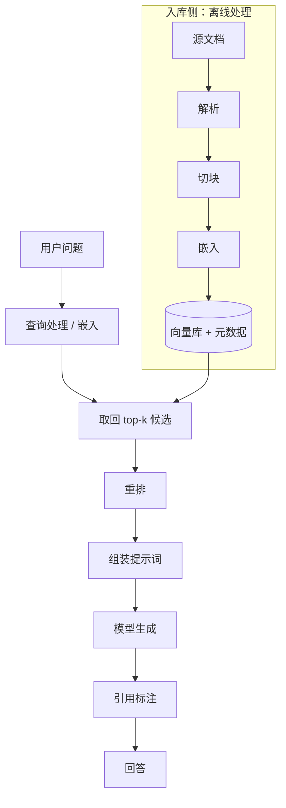
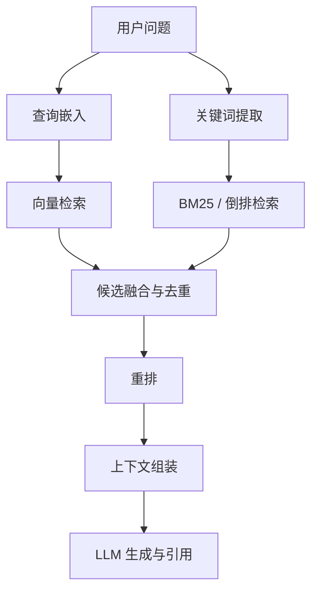
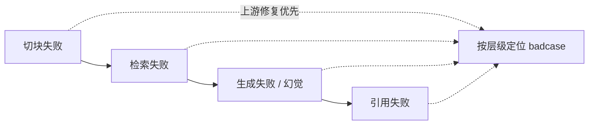

## RAG 基础

RAG（Retrieval-Augmented Generation，检索增强生成）是让模型知道私有知识、降低幻觉的主流方案：**先检索相关资料，再让模型基于资料回答**。这一范式由 Lewis 等人于 2020 年提出，核心是把参数化记忆（模型权重中固化的知识）与非参数化记忆（外部资料库）结合：回答知识密集型问题时先查资料、再作答（[Retrieval-Augmented Generation for Knowledge-Intensive NLP Tasks](https://arxiv.org/abs/2005.11401)）。

RAG 的**知识机制**包括为什么需要、基本流程、关键环节、失败模式与产品设计要点。工程落地的案例与选型见 [RAG 产品化实战](../practice/rag-practice.md) 与 [知识库问答](../practice/kb-qa.md)；检索技术的原理细节见 [检索技术](rag-retrieval.md)；查询改写、GraphRAG、Agentic RAG 等进阶方案见 [高级 RAG](rag-advanced.md)。

## 为什么需要 RAG

-   **模型不知道你的私有知识**：公司文档、产品手册、用户数据……这些内容从未出现在训练数据里，模型天然不知道，无论问多少次都只能编。
-   **训练截止日期之后的信息它不知道**：模型的知识停留在训练截止点，新政策、新版本、新流程都无法覆盖，除非重新训练。
-   **纯靠模型记忆回答容易幻觉**：模型对不熟悉的事实会自信地编造，而且无法指出哪些内容是确定的，用户无从分辨。
-   **合规与溯源**：金融、医疗、法律等场景要求回答可追溯、可审计，只有检索能给出一手依据，模型记忆给不出。

### 幻觉从哪来：为什么模型会「一本正经地胡说」

要理解 RAG 的价值，先理解幻觉的根源。大模型本质是**按概率续写文本**的机器：它学的是「给定上文，下一个 token 最可能是什么」，而不是「记住一条事实，需要时原样取出」。所以：

-   知识以**概率分布**的形式存在于权重里，没有「数据库记录」式的确定条目，相近的知识会互相干扰。
-   训练目标偏好在「流畅、像人话」的方向输出，**流畅性优先于事实性**：编得通顺的假话比生硬的真话更像模型会说的话。
-   长尾事实（小公司制度、冷门条款）在训练数据里出现次数少，模型记住的概率低、遗忘的概率高。

结论：幻觉不是 bug，是生成式模型的**默认行为**。RAG 的作用是把幻觉关进资料之外的笼子里：模型只能基于检索到的资料发挥，资料里没有的它就无从编起。

### 模型记忆 vs 检索：边界在哪里

| 维度 | 模型记忆（纯 LLM） | 检索（RAG） |
| --- | --- | --- |
| 知识来源 | 训练数据 | 你提供的资料库 |
| 更新成本 | 重新训练/微调，天到周级 | 改资料 + 刷新索引，分钟级 |
| 覆盖面 | 广但陈旧、有截止点 | 窄但可控、新鲜 |
| 事实可追溯 | 无法说明依据 | 可给出引用来源 |
| 每次问答成本 | 只有生成 | 检索 + 生成 |
| 权限控制 | 无法区分用户 | 检索层可按用户过滤 |
| 幻觉风险 | 高 | 有资料约束，仍可能残留 |

边界结论：**高频稳定的常识靠模型记忆，动态的私有事实靠检索**。公司成立于哪年这种稳定事实可以直接答；本月报销政策这种会变的、私有的事实必须检索。判断一句话模型该不该知道：问自己它出现在模型训练数据里的概率有多大：概率低、又要求准确，就该走检索。

### RAG 适用与不适用场景

| 适合 RAG | 不适合 RAG |
| --- | --- |
| 私有知识问答（制度、手册、FAQ） | 创意写作、闲聊、头脑风暴 |
| 时效性强的信息（政策、版本、价格） | 稳定常识问答（模型已经答得很好） |
| 需要溯源与审计的场景（合规、医疗、法律） | 纯风格/格式转换任务（那是微调的地盘） |
| 权限隔离要求高的多用户知识库 | 每次回答成本敏感的超高频问答（检索 + 生成本身不便宜） |

???+ note "长上下文模型出现后，RAG 还有必要吗"
    上下文窗口达到百万级的模型可以直接把整份文档塞进提示词。但长上下文按 token 计费、输入越长注意力越容易被稀释，且无法解决知识更新与权限区分问题：**RAG 与长上下文是互补关系，不是替代关系**：大文档一次性问答可以直接塞，持续更新、权限隔离、成本敏感的场景仍要检索。对比详见下文 RAG vs 微调 vs 长上下文一节。

## RAG 的基本流程



核心关系：文档先离线解析、切块并建立索引，在线问题经过检索与重排后才进入生成，最终以引用把答案连回来源。

1.  **文档处理**：解析源文档（PDF、Word、HTML、Markdown），提取正文与结构。常见坑：PDF 表格被拆乱、扫描件需要 OCR、Word 中的文本框丢失、代码块被当成正文。
2.  **切块**：把长文档切成检索单元（chunk）。常见坑：在句子中间切断导致语义断裂、块太大导致检索不精确、切法与 embedding 模型不匹配（策略详见 [检索技术](rag-retrieval.md)）。
3.  **嵌入**：把每个块用 embedding 模型转成向量。常见坑：用错语言（中文文档用英文 embedding 模型）、查询与文档的文本分布不一致。
4.  **入库**：向量连同元数据（来源、页码、更新时间、权限标签）存入向量数据库。常见坑：忘记存元数据，后续权限过滤、引用溯源、新鲜度排序全都做不了。
5.  **检索**：用户问题转成向量后检索最相关的块，通常取 top-k（如 20-50 个）候选。常见坑：纯向量检索漏掉精确术语（型号、编号、人名），需要混合检索兜底（详见 [检索技术](rag-retrieval.md)）。
6.  **生成**：把重排后的检索结果（通常 3-5 个块）+ 问题 + 指令组装成提示词，要求只基于资料回答、资料不足就明说。常见坑：检索结果塞得太多导致模型注意力被稀释；提示词没有约束不得使用资料之外的知识。
7.  **引用**：回答时标注每个论断对应的来源，用户可点击核对原文。常见坑：模型引用了与论断无关的来源，引用正确性需要单独评估（见下文产品经理的评估视角一节）。

### 流程速查：每步做什么、坑在哪、决策点是什么

| 步骤 | 做什么 | 常见坑 | 关键决策 |
| --- | --- | --- | --- |
| 文档处理 | 解析格式、提取正文 | 表格拆乱、扫描件没 OCR | 解析器选型、结构化提取 |
| 切块 | 切成检索单元 | 语义断裂、块过大过小 | 块大小、重叠量、切分策略 |
| 嵌入 | 文本转语义向量 | 语言不匹配、领域不匹配 | embedding 模型选型 |
| 入库 | 向量 + 元数据入向量库 | 元数据缺失 | 向量库选型、元数据设计 |
| 检索 | 取回候选块 | 单路召回有盲区 | 混合检索、rerank 策略 |
| 生成 | 组装提示词让模型作答 | 塞太多、约束不足 | 提示词模板、块数量 |
| 引用 | 标注来源供核对 | 张冠李戴 | 引用编号机制、正确率评估 |

### 一个最小示例：「员工手册问答」走一遍全流程

假设要把一本 50 页的《员工手册》做成问答产品：

1.  **文档处理**：PDF 解析出正文，目录章节、页眉页脚被剥离，表格（如各职级年假天数表）单独提取保留。
2.  **切块**：按章节递归切块，每块约 200-500 token，年假制度一节自成一块；块与块之间留 20% 重叠，防止答案切断在边界。
3.  **嵌入**：中文场景选 bge 或 text-embedding-3 系列，每个块转成 1024 维向量。
4.  **入库**：向量 + 元数据（文档名员工手册 v3、章节第五章 休假制度、页码、更新时间、可见权限）入向量库。
5.  **检索**：用户问年假几天，问题转向量，取回 top-20 候选；关键词路命中年假相关块，两路融合。
6.  **生成**：重排后取 top-3 块 + 问题 + 指令喂给模型：只基于资料回答，标注来源编号。
7.  **引用**：回答正式员工每年 10 天带薪年假 [1]，[1] 指向手册第五章第 3 节，用户可点击核对。

## 关键环节与常见问题

| 环节 | 常见问题 |
| --- | --- |
| 文档切块 | 切得不好 → 语义断裂、检索不到 |
| 检索质量 | 召回不准 → 答非所问 |
| 多轮对话 | 追问时丢失上文，检索失焦 |
| 知识更新 | 文档更新后索引未同步，答案停留在旧版 |
| 引用可信度 | 模型可能引用错误来源 |
| 权限过滤 | 权限只在 UI 层做，检索层不过滤，换接口即泄密 |
| 评测缺失 | 没有评测集，改好改坏说不清，迭代靠感觉 |

## 关键环节详解

### 文档处理与切块

-   **格式解析**：PDF 要先判断是文本型还是扫描型，扫描件需 OCR；表格是最容易翻车的结构：多行合并单元格、跨页表格被拆成两半，切块后语义断裂，检索时整表信息丢失。Word 文档要注意文本框、页眉页脚里的信息；HTML/Markdown 先剥掉样式与导航噪音。
-   **表格陷阱实例**：职级-年假天数对照表被切成职级表头块与天数数据块两半后，问 P7 年假几天就检索不到完整对应关系：表格类内容优先整表保存、带标题一起切块，或转成一行一条的文本再切。
-   **结构化优先**：HTML、Markdown、JSON 等有结构标记的格式，先用对应解析器提取标题层级，把标题 + 正文绑定在一起，检索命中时能带上章节上下文：检索到第 3.2 节的内容比检索到一段不知出处的话好用得多。
-   **元数据**：每个块携带来源文档、章节路径、页码、版本、更新时间、权限标签。元数据是后续权限过滤、引用溯源、时间衰减排序的地基，入库时就要打好；事后再补等于重跑一遍入库。
-   **切块策略**：块大小、重叠量、切分方式（固定 / 递归 / 语义 / 父子块）直接影响检索质量，没有普适最优解，要用评测集对比定参。切块是 RAG 的第一工程决策，详见 [检索技术](rag-retrieval.md) 的切块策略一节。

### 检索

-   **向量检索**：语义相似匹配，能命中换个说法的查询（报销流程命中差旅费用报销规范），但对精确术语不敏感：A100 可能只召回 A1000 的语义邻居。
-   **关键词检索**：精确词匹配，型号、编号、人名、专有名词靠它，但不懂同义改写。
-   **混合检索**：两路互补合并，通常好过任何单一路；再加 rerank 精排，是检索质量提升最大的单点改进之一（[LangChain 官方 reranker 文档](https://docs.langchain.com/oss/python/integrations/document_transformers/cross_encoder_reranker)）。
-   机制与选型细节：见 [检索技术](rag-retrieval.md)。

混合检索的在线链路可以画成两路召回、一路融合：



核心关系：向量检索覆盖语义改写，关键词检索守住精确术语，两路候选融合后再重排，才进入生成上下文。

### 检索质量自检清单

每次改完检索相关配置，按清单快速自查：

1.  同一问题换个说法（报销 → 差旅费用），还能检索到吗？——测语义路
2.  同一问题用精确术语（型号、编号），能检索到吗？——测关键词路
3.  top-k 里相关块排第几？前 3 名相关，还是第 15 名才相关？——测排序
4.  检索延迟在预算内吗？p95 呢？——测性能
5.  权限标签过滤生效吗？低权限用户能检索到高权限块吗？——测安全

### 生成

-   **提示词组装**：把检索到的块（按相关度排序）+ 用户问题 + 指令拼进提示词。指令要点：只基于资料回答、资料不足时明确说明、每个论断标注引用编号、不要编造资料外的内容。
-   **长度控制**：检索结果过多会稀释注意力并推高成本，常见做法是重排后只保留 3-5 个块；回答也建议限长（如 300 字以内分点回答），避免模型凑字数。
-   **生成参数**：事实问答场景通常用较低温度（0-0.3）减少发散；`max_tokens` 限制回答长度；流式输出改善首 token 体验：生成侧参数与提示词一样，属于要进评测集回归的变量。
-   **指令模板示例**（示意，实际按你的模型调）：

    ```text
    你是一个基于资料回答的助手。只使用下面资料中的事实回答用户问题；
    资料不足时明确说明「根据现有资料无法回答」。回答中每个关键论断后标注
    对应资料的编号，如 [1]、[2]。不要使用资料之外的知识。

    资料：
    [1] 报销流程：……
    [2] 差旅标准：……

    问题：……
    ```

-   **与提示词工程的关系**：RAG 的生成侧本质是提示词工程的一个特例，通用技巧（角色、格式约束、few-shot）同样适用，见 [提示词工程](prompting.md)。

### 引用

-   **来源标注**：回答中的关键论断带 `[1]`、`[2]` 编号，下方列出对应来源（文档名 + 章节 + 页码/链接），用户可点击直达原文。
-   **编号机制的实现**：给每个进入上下文的块分配固定编号（如 `[1]-[5]`），指令要求模型引用必须取自资料编号；生成后用程序校验：回答里出现的编号必须都在资料编号集合内，越界编号视为引用错误。
-   **引用正确性**：模型可能答案对但引用错或引用对但答案错，这是两类需要分别修的缺陷；实现上可以在生成时强制模型只引用提示词里真实存在的块编号，并单独评估引用正确率。
-   **引用与权限**：引用的原文可能属于不同权限级别，展示来源时也要做权限过滤，不能答案脱敏、来源泄密。

## 常见失败模式

| 失败模式 | 症状 | 排查方向 |
| --- | --- | --- |
| 检索不到 | 明明有答案，回答却说「没有相关资料」 | 切块是否切断语义？embedding 是否与语言/领域匹配？关键词（型号、编号）是否走了关键词路？块是否带上了足够上下文？ |
| 答非所问 | 检索到了错误的内容，回答与问题无关 | 召回错了：检查 top-k 里相关块排第几、检索查询是否需要改写（多轮追问的上下文是否带上）、是否需要 rerank 精排 |
| 幻觉仍有 | 回答内容资料里根本没有 | 提示词是否约束只基于资料？资料不足时模型是否被允许拒答？检索到的块是否真包含答案（模型在硬编）？ |
| 引用错误 | 标注的来源并不支持对应论断 | 生成时是否强制使用真实存在的块编号？引用与答案是否分开评估？是否需要换更强的模型或加引用校验步骤 |
| 多轮失焦 | 追问后回答跑偏 | 追问是否丢失了上文？检索输入是本轮问题还是问题 + 上下文？话题漂移是否限制了轮次内范围（见 [高级 RAG](rag-advanced.md)） |
| 知识滞后 | 文档已更新，答案还是旧的 | 索引同步是否触发？同步延迟是否监控？旧块是否被正确删除或替换 |

???+ tip "排查顺序建议"
    按切块 → 检索 → 生成 → 引用从前往后排：先确认资料里确实有答案（切块后块里能不能找到），再查检索有没有召回（top-k 里有没有相关块），然后看生成是否忠实（提示词与模型），最后才查引用是否正确。多数答得不好都死在检索之前。

???+ example "典型失败案例"
    用户问公司年假多少天，知识库制度文档里有员工享有 10 天带薪年假：但系统回答暂无相关资料。排查顺序：先在切块后的块里搜年假：找到了，说明切块没问题；再查检索日志：问题嵌入后 top-k 命中的全是请假审批流程，说明**向量检索语义偏了**；改走混合检索（关键词路直接命中年假）后问题消失。一个案例走完一套排查方法。

### 失败模式的层级关系

失败模式不是并列的，而是有因果层级：**切块失败 → 检索失败 → 生成失败 → 引用失败**，前面环节的失败会传染给后面。所以排查时永远先查上游：检索不到先看切块，幻觉仍有先看检索到的块里有没有答案。评测时也按层级拆指标，才能在整体变差了的时候定位到具体环节。



核心关系：RAG 错误会沿数据流向下游传播，排查应从切块和召回等上游环节开始，而不是先修改生成提示词。

### 先分清「检索不到」与「检索不准」

两个症状相似但修复手段完全不同：

-   **检索不到**（该检的块没进 top-k，回答没有相关资料）：问题在切块、embedding 或查询侧：换个说法搜一下、直接搜块里的关键词，能定位是哪一环。
-   **检索不准**（检到了但排位靠后，或检到错的，答非所问）：问题在排序侧：rerank 没上、融合权重不对、top-k 太小把相关块挤掉了。

排查第一步先问：相关块到底在不在检索结果里？在 → 排序问题；不在 → 召回问题。方向错了，后面的修复全是白费。

## RAG vs 微调 vs 长上下文

| 维度 | RAG | 微调 | 长上下文 |
| --- | --- | --- | --- |
| 知识更新 | 改资料 + 刷索引，分钟级 | 重新训练，天到周级 | 换提示词输入，分钟级 |
| 成本 | 每次问答都要检索 + 生成 | 训练一次 + 常规推理 | 输入 token 随长度线性暴涨 |
| 事实准确 | 有资料依据，可控可溯源 | 记忆不精确，仍会幻觉 | 取决于模型能否在长文中找到答案 |
| 部署 | 需要向量库等组件 | 一个模型即可 | 一个模型即可 |
| 合规与权限 | 检索层可按用户过滤 | 无差别输出 | 无差别输出 |

-   **RAG 不是万能**：当正确性依赖稳定的行为模式（如固定输出格式、特定语气风格、特定任务流程）而非事实内容时，微调更合适。OpenAI 官方 Cookbook 的检索问答范例明确：**事实性回忆场景检索优于微调，微调更适合风格与任务教学**（[Question answering using embeddings-based search](https://developers.openai.com/cookbook/examples/question_answering_using_embeddings)）；微调机制详见 [模型训练与对齐](llm-training.md)。
-   **什么时候直接用长上下文**：一次性大文档问答（合同、财报、论文）、不需要持续更新、不需要权限区分、单次成本可接受：直接塞全文比搭建检索管线更简单可靠。
-   **长上下文的边界**：文档体量超过模型窗口、需要多文档交叉引用且体量总和超窗、知识会频繁更新：这些情况长上下文要么塞不下、要么每次都要重塞、要么按 token 计费扛不住，回到检索更优。
-   **组合使用是常态**：RAG 负责事实、微调负责风格与格式、长上下文兜底大文档，三者并不互斥；选型用评测数据说话，不要因为流行所以上 RAG。

### 决策流程（按顺序问自己）

1.  知识会变吗、需要权限隔离吗、回答要可溯源吗：任一为是，RAG 优先。
2.  行为模式（格式、风格、流程）要固化吗：是，叠加微调。
3.  文档是一次性、不用更新、体量可负担吗：是，直接长上下文更简单。
4.  拿不定？建 30-50 条评测集，三种方案各跑一遍，用指标说话。

### 组合架构示例

```text
用户问题 → 路由（简单问题 → 直接长上下文/快模型；事实问题 → RAG；格式任务 → 微调模型）
RAG 路径：检索 → 生成（基座模型，未微调，因为事实由资料负责）
微调模型路径：固定格式输出（风格、流程由微调负责）
```

## 进阶方案

-   **混合检索 + 重排**：向量检索 + 关键词检索 + rerank 精排，显著提升召回质量，是当前产品化的标配：原理见 [检索技术](rag-retrieval.md)。
-   **查询改写 / 多查询 / HyDE**：检索前先处理问题本身，让问得不好的问题也能检索到对的内容：见 [高级 RAG](rag-advanced.md) 的查询处理一节。
-   **知识图谱与 GraphRAG**：把实体关系结构化，适合找关联、多跳推理类问题：见 [高级 RAG](rag-advanced.md)。
-   **Agentic RAG**：把检索做成多步决策（先查目录 → 再查章节，检索结果不满意 → 重新检索），复杂问题更准：见 [高级 RAG](rag-advanced.md)。

## 产品设计要点

-   **知识治理在前**：文档质量决定问答质量：先治理知识（结构化、去重、版本化、明确哪些可被问哪些保密），再做检索优化；给烂数据打补丁式的检索优化毫无意义（详见 [知识库问答](../practice/kb-qa.md)）。
-   **知识更新节奏**：明确源文档变更 → 索引同步的触发方式（定时任务或事件驱动）与同步延迟 SLA；文档改版后旧块要删除或替换，避免幽灵引用；更新链路要可监控、可回溯。增量更新（按文档 id + 内容哈希去重，只刷变化的文档）是推荐模式，配套做法见 [RAG 产品化实战](../practice/rag-practice.md) 的知识治理与更新一节。
-   **权限与可见性**：不同用户能看到的知识范围不同：权限过滤必须作用在**检索层**（检索前按用户权限标签过滤），而不是只在 UI 隐藏结果；权限标签随元数据入库，查询时直接过滤。答案脱敏、检索不过滤等于没做权限。
-   **引用可验证**：回答必须带来源，用户能点开原文核对；无法验证的回答对高信任场景等于没有回答。引用要能回溯到具体版本（来源带版本号），而不是只给一个文档名。
-   **评估体系**：检索线（命中率、MRR）+ 回答线（忠实度、相关性）+ 引用线（引用正确率）三条指标线齐备，评测集持续扩充；评测方法论见 [评估与评测](evaluation.md)，RAG 专属指标见 [高级 RAG](rag-advanced.md) 的 RAG 评测体系一节。
-   **拒答与降级**：资料里没有就明确说没有相关资料，不要硬编；拒答不是缺陷，而是可信度的一部分（[dair-ai Prompt-Engineering-Guide 的 RAG 综述](https://www.promptingguide.ai/research/rag)把负面拒答列为 RAG 鲁棒性评测的维度之一）。低置信时还可引导澄清问题、给 FAQ 链接或转人工。
-   **成本与延迟预算**：embedding、rerank、LLM 生成每一轮都花钱，量上来后账单会超预期；检索 + 重排 + 长上下文生成层层叠加会变慢：上线前按预估调用量算成本，按场景设延迟预算（客服 2-3 秒、实时助手秒级）。
-   **用户引导**：告诉用户怎么问得好（FAQ 建议句式）、在回答旁展示依据来源增强信任感；不要指望用户自动学会与 AI 沟通。
-   **埋点与监控**：上线后监控无命中率（检索空结果比例）、top-1 相关率（抽样人工标注）、用户点踩率、拒答率、检索延迟分位数；错案回流 → 归因（修文档 / 修检索 / 修提示词）→ 修复 → 补进评测集防回归：这条闭环是 RAG 产品长期质量的生命线。
-   **灰度上线**：换 embedding、换 rerank、改切块这类改动先在评测集回归，再小流量灰度对比线上指标，确认无劣化再全量。

## 产品经理的评估视角

评估 RAG 产品，核心看三类指标：

1.  **召回率**：该检索到的内容检没检索到。口径上常用 hit rate（top-k 里有没有应命中的块）与 MRR（应命中的块排在第几位），需要人工标注问题 → 应命中的文档/块 id。
2.  **答案准确率**：回答是否正确、是否忠实于资料。需要人工判分或 LLM-as-judge 打分，并区分忠实于资料但资料错了与资料对但答错了两种错误：前者是知识治理问题，后者是生成问题。
3.  **引用正确率**：引用的来源是否真的支持答案。单独统计答案对但引用错的比例，这类缺陷修复方式与答案错误不同（强制引用真实块编号、加引用校验）。

### 怎么测：指标口径

-   **hit rate / 召回率**：评测集里标注了应命中块 id 的问题，检索 top-k 结果包含应命中块的比例：衡量检没检到。
-   **MRR**：对每个问题，取第一个应命中块在结果中的排名的倒数，再对所有问题平均：衡量排得靠不靠前，前 5 位与第 20 位都算命中，但体感完全不同。
-   **答案准确率**：端到端人工判分（正确 / 部分正确 / 错误 / 拒答），或 LLM-as-judge 打分：注意分忠实于资料与正确两个维度，资料错了但回答忠实，是知识治理的事。
-   **引用正确率**：逐条核对论断 → 引用来源是否真的互相支持；来源支持但答案错、答案对但来源张冠李戴，是两类缺陷。

### 评测集构建

1.  **来源**：从真实用户日志、客服工单、FAQ 收集，而不是自己出题自己答：真实分布才反映真实失败。
2.  **规模**：30-50 条起步即可暴露主要问题，随后随反馈闭环持续扩充。
3.  **覆盖五类**：常见问题、长尾问题、应拒答问题（资料里没有的）、跨文档问题（答案散在多份文档）、多轮追问。
4.  **标注**：答案由领域专家标注；应命中的文档/块 id 同样人工标注：检索线的评测依赖它。
5.  **LLM-as-judge 规模化 + 人工抽检校准**：自动打分可以跑大量样本，但判断器可能偏爱冗长或自带立场，需要定期人工抽检校准（详见 [评估与评测](evaluation.md)）。
6.  **每次改动重跑**：改切块参数、换 embedding 模型、换 rerank、改提示词，都重跑同一评测集，防止改好了 A 坏掉了 B；错答案例持续回流补进评测集。

指标速查：

| 指标 | 衡量什么 | 怎么测 |
| --- | --- | --- |
| hit rate / 召回率 | 该命中的块是否出现在 top-k | 人工标注应命中块 id，批量检索统计 |
| MRR | 应命中的块排得靠不靠前 | 取命中位置倒数的平均 |
| 答案准确率 | 回答是否正确、忠实 | 人工判分或 LLM-as-judge |
| 引用正确率 | 来源是否真的支撑论断 | 逐条核对引用与论断的对应关系 |

### 常见误区

-   只测端到端答得好不好，不拆检索线：答错了不知道是没检到还是没答好。
-   评测集不更新：线上错案不回流，评测集与真实分布渐行渐远。
-   用公开 benchmark 代替自建评测集：通用基准与你的用户分布几乎必然不同。
-   改完不回归：这次应该没问题，是 RAG 迭代里最常见的翻车现场。

???+ example "练习"
    设想你要做一个公司规章制度问答产品：

    -   文档会怎么切块？制度条文一条一块，还是按章节整段切？切块时要不要把第 34 条这样的条文编号编进元数据？
    -   用户可能问哪些类型的问题？流程类（报销流程是什么）、查询类（年假多少天）、比较类（产假和陪产假区别）、矛盾类（第 34 条和 56 条冲突吗）：每类问题分别考验哪个环节？
    -   哪些问题 RAG 答不好？跨条款推理（哪些条款提到了报销）、矛盾检测（第 34 条和 56 条矛盾吗）、意图不明（我想请个假）：各自的失败模式是什么？
    -   为这个产品设计一份 10 条的种子评测集，标注答案与应命中的条文，覆盖上面至少三类问题。
    -   追问设计：用户先问报销流程，再问那差旅费呢：多轮检索会怎么失焦？你打算怎么处理？

## 常见问题 FAQ

-   **为什么加了 RAG 还会答错？** 按层级排查：切块 → 检索 → 生成 → 引用。经验上大多数答得不好死在检索之前：先确认相关块到底进没进 top-k。
-   **知识库多大多小才需要 RAG？** 几十篇文档就有价值（文档越多越值得）；量级影响的是技术选型（向量库、ANN 索引），不是要不要做的判断。
-   **RAG 会不会很慢？** 延迟构成：查询 embedding（毫秒）+ 向量检索（毫秒）+ rerank（每候选一次推理）+ LLM 生成（秒级大头）。优化顺序：先压检索链路，再考虑生成侧（换快模型、流式输出）。
-   **用 embedding 还是 BM25？** 语义匹配 vs 精确匹配，单用都有盲区：混合检索是产品化标配，不要二选一。
-   **一次检索 vs 多次检索（Agentic）？** 简单问题一次检索最稳；一次拿不全的复杂问题才值得决策循环（详见 [高级 RAG](rag-advanced.md)）。
-   **文档更新后要重新嵌入吗？** 按文档 id + 内容哈希做增量更新，只重刷变化的文档，不要全库重跑。
-   **RAG 和 Elasticsearch 是什么关系？** Elasticsearch 是关键词检索的生产化实现（分词、倒排、打分全套），可以作为 RAG 的关键词路复用；它缺的是语义路与向量检索，两者互补。
-   **RAG 能保证 100% 不幻觉吗？** 不能。RAG 是降低幻觉并让错误可追溯，不是消灭；资料错、检索错、生成无视资料都会产生错误答案：所以评估与监控才不可或缺。

## 术语速查

| 术语 | 一句话解释 |
| --- | --- |
| chunk（块） | 检索的基本单元，文档被切成的片段 |
| embedding | 把文本映射为语义向量的模型输出 |
| top-k | 检索返回的前 k 个候选块 |
| rerank（重排） | 对候选块用更强模型重新排序 |
| 向量数据库 | 存向量并支持近邻检索的数据库 |
| 混合检索 | 向量 + 关键词多路检索后融合 |
| hit rate | 应命中的块是否出现在结果里 |
| MRR | 应命中块排名的倒数平均 |
| faithfulness（忠实度） | 回答是否忠于检索资料 |
| 幻觉 | 模型编造资料中没有的内容 |

### 来源说明

本文为原创整理，主要依据以下权威来源（截至 2026-08-23 均已核实可达，引用日期 2026-08-23）：

1.  [Lewis et al., Retrieval-Augmented Generation for Knowledge-Intensive NLP Tasks（arXiv 2005.11401）](https://arxiv.org/abs/2005.11401)——RAG 范式原始论文：参数化记忆 + 非参数化记忆
2.  [dair-ai Prompt-Engineering-Guide：RAG 综述](https://www.promptingguide.ai/research/rag)——基础 RAG 的局限、切块研究、鲁棒性评测维度
3.  [OpenAI Cookbook：Question answering using embeddings-based search](https://developers.openai.com/cookbook/examples/question_answering_using_embeddings)——检索问答范式、「开卷考试」类比、检索优于微调的事实场景
4.  [LangChain 官方文档：Cross encoder reranker](https://docs.langchain.com/oss/python/integrations/document_transformers/cross_encoder_reranker)——rerank 是 RAG 质量提升最大的单点改进之一
5.  [RAGAS 官方文档：Metrics](https://docs.ragas.io/en/stable/concepts/metrics/)——faithfulness、answer relevancy、context precision 等端到端指标
6.  [Anthropic 官方工程博客](https://www.anthropic.com/engineering)——「只在评测证明必要时增加复杂度」的工程原则
