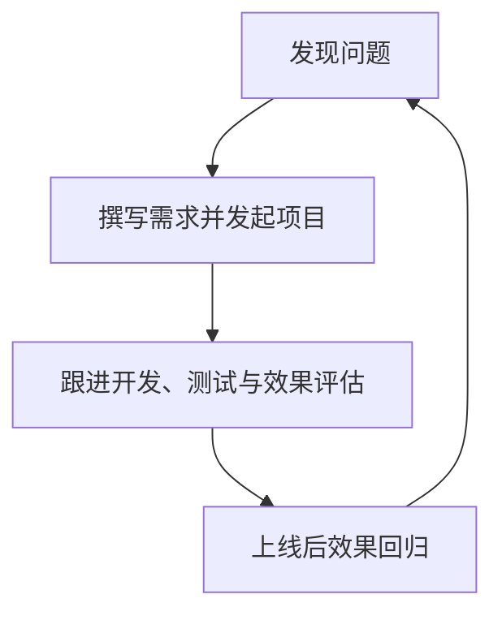
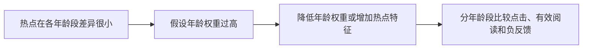

## 策略产品经理的工作循环

策略产品经理首先仍是产品经理。产品经理要为目标负责，也要根据问题灵活组合功能、文案、活动和策略等手段。一个同时包含功能和策略的特性，例如屏幕背光，完全可能由一个 PM 设计完成。岗位分工描述的是主要擅长方向。

策略 PM 之所以单独出现，是因为复杂度和工作量增加。当公司只有一个 PM 时，他可能同时负责后台、用户、商业、功能和策略。团队扩大后，可以按服务对象或产品形态分工；问题复杂到值得有人专门研究「策略面对什么问题、依赖哪些输入、如何落地、效果如何评估」时，才会出现策略产品经理。

不同公司称呼不同。课程以百度的「功能型产品经理 / 策略型产品经理」和腾讯的「产品策划 / 产品运营」为例：前者更多聚焦功能设计，后者更多与规则和数值打交道。名称不能直接决定职责，判断一个岗位时应看它实际解决问题的手段和交付物。先对照[产品经理岗位类别](../../../intro/product-manager-types.md)里的策略产品说明。

策略工作适用于结果会随人、时、地和供给条件变化，且可以通过数据持续评估的场景。若问题简单、规则固定或数据无法可靠获得，先用功能、人工流程或固定规则可能更合适。是否该用策略，见[策略是什么](01-what-is-strategy.md)与[策略如何诞生](03-how-strategy-emerges.md)。

### 功能 PM 与策略 PM：手段差异

-   **功能型 PM**：更擅长通过设计功能、页面和流程，解决相对聚焦的需求
-   **策略型 PM**：更擅长通过设计规则、数值、排序、匹配和动态决策，解决多样化、统计性的需求

「功能 PM 面对一个人，策略 PM 面对一群人」是帮助理解的简化表达。两者抽象需求的粒度不同：

-   功能 PM 更多把差异抽象成一套共同流程，再处理少数异常流程
-   策略 PM 需要保留更多用户群和典型场景的差异，决定不同人群要被满足到什么程度

以推荐为例：评论功能可能有统一入口和大体一致的操作流程，PM 重点是让用户能顺利完成发送、展示和管理。新闻推荐则很难画出一条对所有人都适用的路径：早晨的工程师可能关心科技发布，午后的 PM 可能关心娱乐新闻；同一个人今天也可能因为热点事件改变兴趣。策略 PM 因此要同时考虑人群规模、需求强度、场景差异和满足力度。

| 环节 | 功能 PM 的常见重点 | 策略 PM 的额外重点 |
| --- | --- | --- |
| 发现问题 | 抽象用户需求、聚焦核心流程 | 分群、场景、规模、需求强度与变化因素 |
| 需求撰写 | 流程、原型、交互和异常路径 | 逻辑、数据统计、规则、Case 与边界 |
| 开发评估 | 验收呈现和流程是否符合预期 | 输入维度、逻辑严谨性、权重、输出与数据链路 |
| 上线回归 | 看功能是否达到目标 | 持续挖掘特征、验证分群效果并迭代策略 |

同一个岗位可能同时做功能和策略。重点永远是解决问题的手段。

### 四阶段循环

策略 PM 与其他 PM 一样，可以把工作归纳为四个环节。问题是一切产品循环的原动力。四个环节不是一次性线性流程：回归结果可能证明问题定义不准确、输入不足或逻辑不合理，需要回到前面重新分析。



核心关系是：功能问题相对明确时，一个版本可能已经解决问题；策略面对复杂、多变和多因素问题，很难一次上线就达到理想效果，所以回归是下一轮的入口。

### 阶段一：发现问题

功能方案往往希望抽象出一条大多数用户都能使用的流程；策略方案则要保留足够的差异，观察不同人群在不同场景下的需求。发现问题时先建一张分群表，避免只用自己的体验代表全部用户：

| 用户群 / 场景 | 典型诉求 | 规模 | 需求强度 | 当前结果 | 可能要调整的因素 |
| --- | --- | ---: | ---: | --- | --- |
| 早晨通勤用户 | 快速获取重要信息 |  |  |  | 时间、主题、历史行为 |
| 午后休闲用户 | 浏览感兴趣内容 |  |  |  | 兴趣、内容类型、停留 |
| 新用户 | 不知道如何使用 |  |  |  | 冷启动信息、默认规则 |

表格不要求一开始就得到精确数据，作用是逼自己同时具备用户视角和整体视角：既能理解一个具体用户的感受，也能想象大量用户的分布和差异。

检查清单：

1.  当前异常是现象还是根因？例如「转化率低」只是结果，仍需拆分人群、路径和场景。
2.  哪些用户受影响？是否有沉默的大多数没有表达？
3.  问题集中在什么时间、地点、设备、内容类型或业务环节？
4.  问题影响规模与严重程度如何？是否值得进入策略项目？
5.  需要什么数据、反馈或用户案例来验证判断？
6.  如果不做策略，固定功能或人工流程是否已经足够？

问题从哪四条途径来，见[发现问题的四条途径](../02-discovering-problems/01-four-channels.md)。

### 阶段二：写需求并发起项目

功能 PM 面对相对收敛的方案，有限的流程图、原型和交互说明通常可以表达用户如何操作、页面如何变化。策略 PM 面对的是发散的组合：不同用户在不同情况下可能得到不同结果，无法为每一种「用户 × 内容 × 场景」都画一张原型。

可以画出信息流卡片的外观，但不可能仅靠一张图画清楚「什么用户在什么时刻看到什么内容」。策略需求要用更适合表达决策系统的材料：逻辑描述、数字统计、具体 Case、边界与兜底。

一份策略需求不要求预先写完所有算法细节，但要让研发能回答「我们在解决什么、系统依据什么、结果如何使用」。如果只写「提高精准度」「做个推荐模型」，研发无法判断输入、输出和验收标准；如果只给一个极端 Case，又可能把局部问题误当成全局规律。逻辑、统计和案例需要相互校验。四要素如何填进方案，见[策略四要素](02-four-elements.md)。简单规则如何写成需求，见[简单策略需求文档](../03-spec-and-validation/01-simple-prd.md)。

### 阶段三：跟进开发与评估

功能 PM 通常关注开发和 QA 后的用户呈现：流程能否走通、页面是否符合预期、异常操作是否有合理反馈。策略 PM 同样关注最终效果，但还必须深入策略的各个要素：

-   **输入维度**是否完整，口径是否一致，数据是否及时
-   **计算逻辑**是否严谨，条件是否互相冲突，极端值如何处理
-   **权重与优先级**是否符合业务判断，是否把某个因素放得过重
-   **输出**是否真的能被产品和业务执行，是否存在不可解释结果
-   **效果指标**是否能区分策略带来的变化和外部波动

课程举例：PM 可以提出增加用户历史浏览时长，帮助更准确判断兴趣；也可以指出社会热点对年龄的依赖较弱，年龄权重不应过高，因为不同年龄段都可能关心同一热点。这类讨论是把业务理解转化为可检验的假设：



核心关系是：策略错误可能在页面上完全看不出来，所以不能只验收最终页面。这个环节投入的时间通常比普通功能验收更多。

「深入参与」不等于一个人包办：与业务方确认目标和不可突破的边界；与数据同学确认指标口径、样本和分群；与策略研发确认输入可用性、逻辑实现和计算成本；与工程和 QA 确认接口、降级、版本和异常处理；与运营、客服同步用户解释、人工兜底和反馈回收。实验设计和指标拆解的工程细节，见[评测](../../../ai/evaluation.md)。

### 阶段四：上线后效果回归

效果回归的任务是决定：当前策略是否达到目标；哪些人群或场景仍然不满足；是输入缺失、逻辑问题、输出执行问题，还是外部环境变化；下一版本应继续优化、扩大范围、降级还是停止。

要特别关注平均值掩盖的问题：总体指标上升，不代表所有用户都受益；少量用户的严重错误，也不能仅因为比例低就忽略。策略的效果回归要同时看总体指标、关键分群和高风险案例。推荐策略可能需要不断挖掘新的用户特征；亮度策略可能上线后才发现少数特殊场景体验很差。达到目标或边际收益不足时应停止。方法见[效果回归](../03-spec-and-validation/05-effect-review.md)。

### 三张最小交付物

**策略需求的最小结构**

```text
一、背景与问题
-   当前现象、受影响人群、典型 Case

二、目标与约束
-   目标指标、辅助指标、不能突破的边界

三、策略方案
-   输入因素及口径
-   判断 / 计算逻辑
-   输出结果和优先级
-   分群、场景与默认规则

四、评估方案
-   基线、实验分组、观察周期、成功标准

五、风险与兜底
-   数据缺失、异常、误判、回滚和人工介入
```

**开发评估清单**

-   用真实用户和真实数据回放典型 Case
-   检查正常、边界、数据缺失和冲突条件
-   分人群、场景和时间段比较结果，而不是只看总平均
-   关注输入数据是否产生漂移或延迟
-   明确版本、实验组、基线和回滚条件
-   记录每次调整改变了什么，避免「感觉变好」无法复盘

**回归报告的最小结构**

```text
版本 / 实验：
目标与基线：
总体结果：
分群结果：
新增异常 Case：
输入与逻辑变化：
用户 / 业务副作用：
结论：保持、扩大、调整、回滚或停止
下一轮假设与行动：
```

立项前用一页确认四要素是否齐；开发中用评估清单检查输入和逻辑；上线后用回归报告决定下一轮。三张模板对应循环里的三个交付物。

### 误区与边界

-   **把岗位名称当成能力边界。** 同一个岗位可能同时做功能和策略，重点是解决问题的手段。
-   **把「面对一群人」理解为不需要抽象。** 策略仍然要分群和抽象，只是保留的差异更多。
-   **只画流程图，不描述逻辑。** 原型能表达长什么样，不能独立表达动态决策。
-   **把策略 PM 当成算法工程师。** PM 不必实现模型，但必须能与研发共同检查问题、输入、逻辑和结果。
-   **只验收最终页面，不看数据和逻辑。** 策略错误可能在页面上完全看不出来。
-   **上线一次就结束。** 复杂策略需要效果回归；达到目标或边际收益不足时应停止。
-   **只看平均指标。** 必须同时看分群、极端和高风险 Case。

贯穿这套循环的四项能力：

1.  **整体视角**：能从整体用户群和多种场景观察问题，不把个人经验当成全局事实。
2.  **逻辑思维能力**：能把复杂需求拆成问题、输入、规则、输出和验证路径。
3.  **数据敏感度**：能从数据发现异常、分群差异和规律，并用数据检验判断。
4.  **拥抱不确定性**：接受策略往往没有标准答案，通过一轮轮评估和迭代逐渐逼近更好的结果。

没有这四项能力，四阶段会退化成「写一版需求、上线一次、看一个总数」。有这四项能力，循环才能把[策略四要素](02-four-elements.md)真正跑起来。

### 延伸阅读

-   [产品经理岗位类别](../../../intro/product-manager-types.md)：策略产品与其他方向的分工
-   [策略是什么](01-what-is-strategy.md)：先确认面对的是策略手段
-   [策略四要素](02-four-elements.md)：需求、评估和回归都按问题、输入、逻辑、输出检查
-   [发现问题的四条途径](../02-discovering-problems/01-four-channels.md)：阶段一如何从结果层走进问题层
-   [简单策略需求文档](../03-spec-and-validation/01-simple-prd.md)：阶段二里功能 PRD 与简单策略需求的写法差异
-   [评测](../../../ai/evaluation.md)：实验设计与指标拆解

## 来源说明

???+ note "来源说明"
    本文根据公开课程《策略产品经理》（B 站 [BV1YE411g717](https://www.bilibili.com/video/BV1YE411g717/)）整理为知识点，不是逐课笔记。

    课程中的数字、阈值和公式是教学示意，不能直接当作可上线参数。

    对应原课第 4 集。整理日期：2026-09-04。
