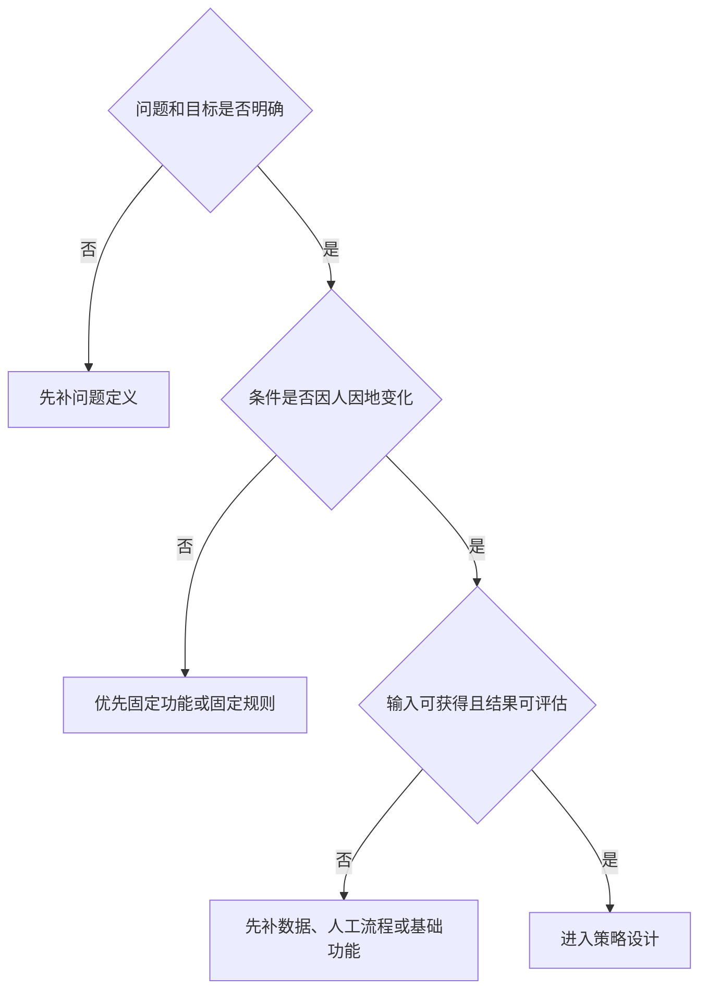

## 概念基础

策略产品经理把业务目标转成规则、排序、匹配和动态决策。动手写需求之前，先分清眼前这件事是不是策略问题、用哪四个格子把它写下来、缺的是载体还是决策逻辑，以及上线后按什么循环迭代。

本模块是后面发现问题、需求验证和应用篇的前提。读完应判断：这个问题要不要用策略解决，以及怎样写成可开发的决策。

核心关系是：先确认这是按条件做决定的问题，再写成问题、输入、逻辑、输出，判断缺的是载体、功能还是决策逻辑，最后按循环把策略做成可迭代项目。

### 本模块要建立的判断

策略是一种解决问题的手段，和功能、文案、活动并列。行业、页面、算法都不是策略本身。

把策略落到纸上，只填四个格子：待解决问题、输入因素、计算逻辑、方案输出。缺一格就不能开发。

固定、统一的方案盖不住人、时、地的差异时，策略才从硬件和功能里长出来。缺屏幕、缺主流程时，先补载体和功能。

策略产品经理首先仍是产品经理，岗位名称只描述擅长的手段。工作按发现问题、写需求、开发评估、效果回归循环；复杂策略很难一次上线就到达理想态。

核心关系是：统一动作用功能，条件变化且输入可评估时才进入策略。

### 文章列表

-   [策略是什么](01-what-is-strategy.md)：策略是一种解决问题的手段；从用户看见的现象反推系统做了什么选择
-   [策略四要素](02-four-elements.md)：问题、输入、逻辑、输出必须连成闭环，并用策略卡片互相校验
-   [策略如何诞生](03-how-strategy-emerges.md)：固定方案无法覆盖差异化时，才从硬件和功能里长出策略
-   [策略产品经理的工作循环](04-workflow.md)：发现问题、写需求、开发评估、效果回归；对照功能 PM 的手段差异

### 读完应回答

1.  这句话里的「策略」能否换成功能、活动或文案？能换，说明它们是并列手段。
2.  用户看见的列表、价格、道路或亮度背后，系统依据什么做了选择？
3.  四个格子是否齐：要解决什么、依据什么、如何计算、输出什么动作？
4.  当前缺的是硬件载体、操作流程，还是随条件变化的决策逻辑？
5.  这一轮循环停在发现、需求、评估还是回归？回归结果要把团队带回哪一格？

说不清第 3 问，还停留在感觉。说不清第 4 问，容易用复杂策略掩盖基础能力缺陷。说不清第 5 问，项目会停在一次上线。

### 和后面模块怎么接

概念基础只回答「这是不是策略、怎样写下来」。问题从哪来、怎样才算好，见[发现问题](../02-discovering-problems/index.md)。怎样写成可开发需求并在上线后验证，见[需求与验证](../03-spec-and-validation/index.md)。

岗位边界因公司而异。百度常说功能型 / 策略型，腾讯常说产品策划 / 产品运营，名称不能直接决定职责。先对照[产品经理岗位类别](../../../intro/product-manager-types.md)里的策略产品说明，再看本模块的工作循环。

评测指标、实验设计和模型协作的工程细节，见[评测](../../../ai/evaluation.md)。本模块不展开算法公式和实验平台。

### 四要素卡片速览

立项前用这七项检查是否可开发。细节和公式见[策略四要素](02-four-elements.md)。

| 格子 | 至少写清 | 缺了会怎样 |
| --- | --- | --- |
| 待解决问题 | 现象、对象、可观察结果 | 需求停在「做一个模型」 |
| 目标与约束 | 主指标、辅助指标、不可突破的边界 | 逻辑再精细也可能优化错方向 |
| 输入因素 | 与目标相关、可获得、可合法使用 | 逻辑完整却不知道依据什么 |
| 计算逻辑 | 判断、打分、排序或触发；冲突如何取舍 | 列了一堆数据，无法决定 |
| 方案输出 | 可执行的内容、数值、顺序或动作 | 研发无法实现 |
| 评估方式 | 指标、对照、观察周期 | 上线后无法说清好坏 |
| 兜底方案 | 输入缺失、异常、低置信度时怎么办 | 策略不完整 |

亮度从手动开关走到多因素自动调节，电子价签把价格策略接到可执行载体上：两例都说明策略必须建立在可用的产品基础上。演进步骤见[策略如何诞生](03-how-strategy-emerges.md)。

### 工作循环的四个交付物

| 阶段 | 策略 PM 多交出什么 | 功能验收不够的原因 |
| --- | --- | --- |
| 发现问题 | 分群表：人群、场景、规模、需求强度 | 个人体验代表不了统计性需求 |
| 写需求 | 逻辑、统计、Case、边界与兜底 | 一张原型画不清动态决策 |
| 开发评估 | 输入口径、逻辑冲突、权重、数据链路 | 策略错误可能在页面上看不出来 |
| 效果回归 | 总体、分群、高风险 Case 与下一轮假设 | 平均值会掩盖误伤 |

岗位名称只描述擅长的手段。百度常说功能型 / 策略型，腾讯常说产品策划 / 产品运营，判断岗位应看交付物。对照见[产品经理岗位类别](../../../intro/product-manager-types.md)。

### 贯穿检查

-   **手段对不对**：所有情况都执行同一动作时，固定功能通常更简单；决策随用户、内容或场景变化时，才进入策略。
-   **格子齐不齐**：问题变了要改目标和输出；输入变了要重查逻辑；输出上线后的反馈会暴露问题或输入的遗漏。
-   **载体在不在**：策略算出价格却没有价签或下发能力，输出无法执行。
-   **循环有没有下一轮**：功能问题相对收敛时，一个版本可能结束；策略面对分群和多因素时，回归是下一轮入口。

### 阅读建议

按列表顺序读四篇。赶工一个策略项目时，先用[策略是什么](01-what-is-strategy.md)确认手段，再用[策略四要素](02-four-elements.md)填卡片，最后用[工作循环](04-workflow.md)对上发现、需求、评估、回归四个交付物。

课程案例中的数字、阈值和公式是教学示意，不能直接当作可上线参数。

### 延伸阅读

-   [策略产品经理专题](../index.md)：七个模块的阅读顺序和贯穿检查
-   [发现问题](../02-discovering-problems/index.md)：反馈、监控、回归、调研如何从结果走进问题
-   [策略通用方法论](../03-spec-and-validation/06-methodology.md)：定义理想态、拆未达、给方案、验证
-   [产品经理岗位类别](../../../intro/product-manager-types.md)：策略产品与其他方向的分工
-   [评测](../../../ai/evaluation.md)：指标、实验与模型协作

## 来源说明

???+ note "来源说明"
    本文根据公开课程《策略产品经理》（B 站 [BV1YE411g717](https://www.bilibili.com/video/BV1YE411g717/)）整理为知识点，不是逐课笔记。

    课程中的数字、阈值和公式是教学示意，不能直接当作可上线参数。

    对应原课第 1 至 4 集。整理日期：2026-09-04。
