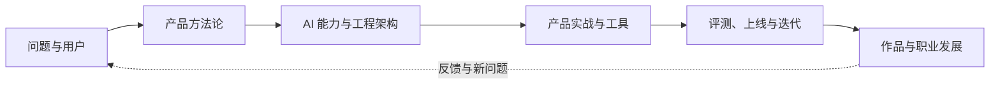

<h1 class="pm-wordmark">
<svg viewBox="0 0 60 6" role="img" aria-label="AI-PM-WIKI"
 shape-rendering="crispEdges" fill="currentColor" xmlns="http://www.w3.org/2000/svg">
  <g class="pm-wordmark__shadow" transform="translate(1 1)">
    <path d="M1 0h3v1h-3z M0 1h1v1h-1z M4 1h1v1h-1z M0 2h5v1h-5z M0 3h1v1h-1z M4 3h1v1h-1z M0 4h1v1h-1z M4 4h1v1h-1z M6 0h5v1h-5z M8 1h1v1h-1z M8 2h1v1h-1z M8 3h1v1h-1z M6 4h5v1h-5z M18 0h4v1h-4z M18 1h1v1h-1z M22 1h1v1h-1z M18 2h4v1h-4z M18 3h1v1h-1z M18 4h1v1h-1z M24 0h1v1h-1z M28 0h1v1h-1z M24 1h2v1h-2z M27 1h2v1h-2z M24 2h1v1h-1z M26 2h1v1h-1z M28 2h1v1h-1z M24 3h1v1h-1z M28 3h1v1h-1z M24 4h1v1h-1z M28 4h1v1h-1z M36 0h1v1h-1z M40 0h1v1h-1z M36 1h1v1h-1z M40 1h1v1h-1z M36 2h1v1h-1z M38 2h1v1h-1z M40 2h1v1h-1z M36 3h2v1h-2z M39 3h2v1h-2z M36 4h1v1h-1z M40 4h1v1h-1z M42 0h5v1h-5z M44 1h1v1h-1z M44 2h1v1h-1z M44 3h1v1h-1z M42 4h5v1h-5z M48 0h1v1h-1z M52 0h1v1h-1z M48 1h1v1h-1z M51 1h1v1h-1z M48 2h3v1h-3z M48 3h1v1h-1z M51 3h1v1h-1z M48 4h1v1h-1z M52 4h1v1h-1z M54 0h5v1h-5z M56 1h1v1h-1z M56 2h1v1h-1z M56 3h1v1h-1z M54 4h5v1h-5z"/>
    <path d="M13 2h3v1h-3z M31 2h3v1h-3z" fill="var(--pm-wordmark-accent)"/>
  </g>
  <path d="M1 0h3v1h-3z M0 1h1v1h-1z M4 1h1v1h-1z M0 2h5v1h-5z M0 3h1v1h-1z M4 3h1v1h-1z M0 4h1v1h-1z M4 4h1v1h-1z M6 0h5v1h-5z M8 1h1v1h-1z M8 2h1v1h-1z M8 3h1v1h-1z M6 4h5v1h-5z M18 0h4v1h-4z M18 1h1v1h-1z M22 1h1v1h-1z M18 2h4v1h-4z M18 3h1v1h-1z M18 4h1v1h-1z M24 0h1v1h-1z M28 0h1v1h-1z M24 1h2v1h-2z M27 1h2v1h-2z M24 2h1v1h-1z M26 2h1v1h-1z M28 2h1v1h-1z M24 3h1v1h-1z M28 3h1v1h-1z M24 4h1v1h-1z M28 4h1v1h-1z M36 0h1v1h-1z M40 0h1v1h-1z M36 1h1v1h-1z M40 1h1v1h-1z M36 2h1v1h-1z M38 2h1v1h-1z M40 2h1v1h-1z M36 3h2v1h-2z M39 3h2v1h-2z M36 4h1v1h-1z M40 4h1v1h-1z M42 0h5v1h-5z M44 1h1v1h-1z M44 2h1v1h-1z M44 3h1v1h-1z M42 4h5v1h-5z M48 0h1v1h-1z M52 0h1v1h-1z M48 1h1v1h-1z M51 1h1v1h-1z M48 2h3v1h-3z M48 3h1v1h-1z M51 3h1v1h-1z M48 4h1v1h-1z M52 4h1v1h-1z M54 0h5v1h-5z M56 1h1v1h-1z M56 2h1v1h-1z M56 3h1v1h-1z M54 4h5v1h-5z"/>
  <path d="M13 2h3v1h-3z M31 2h3v1h-3z" fill="var(--pm-wordmark-accent)"/>
</svg>
</h1>

## 关于本项目

**AI-PM**（AI Product Manager）是一个面向 AI 产品从业者、学习者与协作者的中文知识站点。站点不只整理模型知识，也关注产品判断、工程协作、评测迭代、商业化与求职实践。

本文介绍当前仓库中的项目状态。涉及模型、工具、价格、岗位与公司信息的页面，应以页面注明的核验日期和官方信息为准。

## 为什么做这个站点

AI 产品的知识分布在产品方法论、模型与工程文档、行业实践、工具平台、招聘信息和一线复盘中。单独学习其中一块，容易知道术语，却难以完成从问题定义到上线迭代的完整判断。

AI-PM 把这些内容放进同一套可互相链接的知识结构中：用产品方法论判断问题与价值，用 AI 基础理解能力边界，用工程与架构知识对齐实现约束，用评测和线上反馈验证效果，再把经验沉淀为可复用的方法。

## 当前内容版图

当前站点按以下内容区块组织：

-   **产品方法论**：需求分析、用户研究、产品设计、项目管理、AI 产品生命周期、PRD、战略与商业化
-   **工程与架构**：开发流程、系统架构、数据库、缓存、消息队列、第三方服务与 AI-Native 研发流程
-   **工商管理**：组织与决策、市场与消费者、战略与创新、项目管理与财务等课程
-   **商业与财会**：金融学、会计学、公司金融、计量经济学与金融工程等课程
-   **AI 基础**：机器学习、大模型、多模态、提示词、RAG、Agent、评估与安全、系统架构与前沿
-   **AI 产品实战**：对话助手、知识库问答、Agent、Copilot、工作流、AI 编程工具与案例分析
-   **工具与平台**：模型 API、成本测算、框架、提示词与评测工具、数据、设计与产品经理工作台
-   **学习资源**：信息源、原创读书笔记与播客笔记
-   **求职专题**：产品经理岗位类别、协作团队与岗位、真实 JD 样本、简历作品集、面试与入职后的发展
-   **垂直领域**：网络安全、金融、法律、教育、地球科学、医疗健康与企业服务的对象、监管或系统记录、数据工作流和 AI 产品切入点

这些区块不是彼此孤立的栏目。一个 AI 产品案例通常需要同时调用产品方法、技术理解、评测、合规、行业规则与商业判断；阅读时可以从目标任务或目标岗位反向选择入口。



## 项目技术与运行方式

-   站点使用 [MkDocs](https://www.mkdocs.org/) 构建，主题通过仓库内的定制 `mkdocs-material` 子模块加载；配置使用 `theme.name: null` 与 `custom_dir`，不依赖安装 PyPI 版 `material` 主题包
-   站内搜索使用 MkDocs 内置 `search` 插件，构建后生成本地 `search/search_index.json`，不依赖上游远程搜索服务
-   文档问答 Agent 以独立的 `agent-server` 子项目提供后端能力，站点构建阶段只注入前端 widget；它不是静态文档构建的必要依赖
-   源码托管在 [AI-PM-Wiki/AIPM](https://github.com/AI-PM-Wiki/AIPM)，站点部署在 [aipm.ac](https://aipm.ac/)

### 页面 UI 部件

页面本身也由一组固定部件组成。桌面端分左右两块：左块是 MkDocs 文档站，页头两层导航加正文三栏；右块是面板区，批注、评论与 AI 助手共用同一块屏幕区域，同一时刻只开一个。

面板打开时左块整体收窄，正文与面板各自滚动，互不遮挡。

=== "桌面端（Docs Layout）"

    ```mermaid
    flowchart TB
        subgraph head["页头 · 第一层导航"]
            direction LR
            h1["站点字标"] ~~~ h2["配色切换"] ~~~ h3["搜索"] ~~~ h4["仓库入口"] ~~~ h5["批注入口"]
        end
        subgraph bar["Tab 栏 · 第二层导航"]
            direction LR
            t1["一级栏目"] ~~~ t2["当前栏目"]
        end
        subgraph doc["文档站 · 三栏"]
            direction LR
            nav["侧边栏 · 页面树"] ~~~ art["正文 · 文章内容"] ~~~ toc["目录 · 本页标题"]
        end
        subgraph pane["面板区 · 同时只开一个"]
            direction LR
            p1["批注 · 评论"] ~~~ p2["AI 助手"]
        end
        head --> bar
        bar -. "发丝线" .-> doc
        doc -. "打开面板，文档站收窄" .-> pane
    ```

    核心关系：两层导航决定读哪一页，三栏决定这一页怎么读，面板区承载页面之上的批注、评论与提问。

=== "移动端（Docs Layout Mobile）"

    ```mermaid
    flowchart TB
        mh["页头 · 单层：抽屉入口 · 站点字标 · 搜索 · 批注入口"]
        subgraph dr["导航抽屉"]
            direction LR
            d1["一级栏目"] --> d2["页面树"] --> d3["本页目录"]
        end
        art["正文 · 单栏"]
        subgraph sh["底部面板 · 三段停靠"]
            direction LR
            s1["收起"] ~~~ s2["半开"] ~~~ s3["近全屏"]
        end
        mh --> dr
        dr -. "覆盖在正文之上" .-> art
        art --> sh
    ```

    核心关系：Tab 栏收起，桌面端的三栏在抽屉里串成一条路径；右侧面板改从底部升起，按三段高度停靠。

| 部件 | 位置 | 说明 |
| --- | --- | --- |
| 页头 | 页顶第一层 | 站点字标、配色切换、搜索、GitHub 仓库入口、智能高亮与批注入口；吸顶常驻，全站唯一的玻璃层 |
| Tab 栏 | 页头下第二层 | 一级栏目切换，当前栏目为胶囊高亮；窄屏收起，入口让给抽屉 |
| 侧边栏 | 左栏 | 当前栏目的页面树，页面多时按分组折叠 |
| 正文 | 中栏 | 文章内容；页面评论排在正文末尾 |
| 目录 | 右栏 | 本页标题导航，随滚动高亮；窄屏并入抽屉 |
| 发丝线 | 导航与正文交界 | 1px 分隔线，滚动时上移，吸在页头下缘 |
| 批注 · 评论面板 | 桌面右块、移动端底部面板 | 面板标题即视图切换；批注锚定正文中的一段话，评论对整页说话 |
| AI 助手面板 | 与批注面板共用同一格 | 文档问答，移动端入口是右下角的询问助手按钮；两个面板互斥；可以带着正文里划的一段话或面板里的一条批注提问（悬浮窗与批注卡片上的「问助手」） |
| 底栏 | 页底 | 版权与许可，窄屏同款 |

断点由导航与面板各自决定：面板在 `≥1200px` 停靠右侧，`768–1199px` 转浮层加遮罩，`<768px` 收成底部抽屉；导航在窄屏把 Tab 栏与侧边栏收进抽屉，更窄时目录一并并入。

## 如何参与

内容反馈、错误报告与新主题建议优先通过 [GitHub Issues](https://github.com/AI-PM-Wiki/AIPM/issues) 提出；完整内容可以按[如何参与](intro/htc.md)的流程提交 Pull Request。页面评论区的具体状态以当前部署为准，不作为唯一反馈渠道。

项目采用 [CC BY-SA 4.0](https://creativecommons.org/licenses/by-sa/4.0/deed.zh) 与附加的 [SATA](https://github.com/zTrix/sata-license) 条款，转载和改编时请遵守页面标注的许可信息。

## 更新原则

AI 领域的变化速度不同。本站按两类内容维护：

-   **稳定层**：产品方法、系统边界、评测方法、权限治理与工程协作，优先写可迁移的判断框架
-   **变化层**：模型版本、价格、工具功能、公司组织与岗位要求，正文注明核验日期，引用官方页面或一手资料，避免把临时状态写成长期结论

发现内容与当前实践不符时，欢迎在 Issue 中说明具体页面、段落和依据。站点会优先修正项目事实错误、失效链接和影响学习路径的核心内容。

???+ note "Note"
    评论区由 [giscus](https://giscus.app/zh-CN) 驱动，利用 [Discussions](https://github.com/AI-PM-Wiki/AIPM/discussions) 实现。

???+ note "网页批注"
    页面批注和文字高亮由本站自建服务提供，入口在页面右上角（搜索框与 GitHub 图标右侧）：贴着浏览器右边缘的那颗是批注面板开关，它左边那颗是「智能高亮」。选中正文里的任意一段话，就会浮出颜色选择条。

    悬浮窗上「写批注」右侧那颗星是**「问助手」**：点它会把刚划的这段原文送进 AI 助手面板，摆在输入框上方，接着就能就着这段话提问。批注卡片上的「问助手」同理，送进去的是那条批注的引文与正文。送进去的语境一直留在输入框上方，追问同一段话不必重新送一遍；不需要了点它右端的叉收掉。

    **「仅本机」的批注送不进对话**：它的承诺是只在那台设备上，而语境会随提问发到问答后端。想跟助手讨论它，先在卡片上把它上传为公开或私有。

    **批注分三种，存放位置和可见范围各不相同：**

    -   **公开**：存在本站服务器，任何访客无需登录即可阅读。创建需要 GitHub 登录，只有作者本人能改、能删。
    -   **私有**：同样存在本站服务器，但只有作者本人登录后可见。**换一台设备登录同一个 GitHub 账号也能看到**，其他人读不到，也不会知道它存在。
    -   **仅本机**：不登录也能创建和编辑，**只存在这台设备的浏览器里，绝不上传**。换设备、清浏览器缓存就会丢失，可以导出 JSON 自行备份。

    登录用 GitHub 账号授权，站点只读取你的公开用户名与头像（`read:user`），不索取邮箱，也不建立独立账号体系。登录状态是一枚保存在浏览器里的凭据，不使用第三方 Cookie。

    页头右上角那颗「智能高亮」由模型判断页面里哪些段落值得划线、该用哪种颜色，**默认开启**：进到一个还没判过的页面时自动判一次，给出的建议当场写成「仅本机」高亮（署名是生成它的模型型号）；判过的页面直接用缓存，不再发给模型。页头那颗按钮随时可以手动判一遍，面板里的「全部关闭」撤下这一页的全部智能高亮，并让这一页往后不再自动判分。使用该功能时，**该页面的正文片段会发送到模型服务**（用于判分的 TypeSafe 与 Anthropic）。这个功能不需要登录。

    站点会记录批注内容与作者用户名，用于展示和归属判定。除此之外不收集其他个人信息。不使用批注功能时，页面正文仍可正常阅读。
