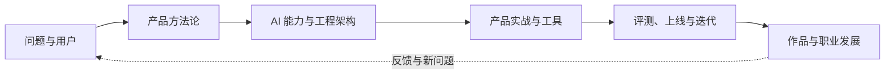

## 关于本项目

**AI-PM**（AI Product Manager）是一个面向 AI 产品从业者、学习者与协作者的中文知识站点。站点不只整理模型知识，也关注产品判断、工程协作、评测迭代、商业化与求职实践。

本文介绍当前仓库中的项目状态。涉及模型、工具、价格、岗位与公司信息的页面，应以页面注明的核验日期和官方信息为准。

## 为什么做这个站点

AI 产品的知识分布在产品方法论、模型与工程文档、行业实践、工具平台、招聘信息和一线复盘中。单独学习其中一块，容易知道术语，却难以完成从问题定义到上线迭代的完整判断。

AI-PM 把这些内容放进同一套可互相链接的知识结构中：用产品方法论判断问题与价值，用 AI 基础理解能力边界，用工程与架构知识对齐实现约束，用评测和线上反馈验证效果，再把经验沉淀为可复用的方法。

## 当前内容版图

当前站点按以下内容区块组织：

-   **产品方法论**：需求分析、用户研究、产品设计、项目管理、AI 产品生命周期、PRD、战略与商业化
-   **工程与架构**：开发流程、系统架构、数据库、缓存、消息队列、第三方服务与 AI-Native 研发流程
-   **工商管理**：组织与决策、市场与消费者、战略与创新、项目管理与财务等课程
-   **商业与财会**：金融学、会计学、公司金融、计量经济学与金融工程等课程
-   **AI 基础**：机器学习、大模型、多模态、提示词、RAG、Agent、评估与安全、系统架构与前沿
-   **AI 产品实战**：对话助手、知识库问答、Agent、Copilot、工作流、AI 编程工具与案例分析
-   **工具与平台**：模型 API、成本测算、框架、提示词与评测工具、数据、设计与产品经理工作台
-   **学习资源**：信息源、原创读书笔记与播客笔记
-   **求职专题**：产品经理岗位类别、协作团队与岗位、真实 JD 样本、简历作品集、面试与入职后的发展
-   **垂直领域**：网络安全、金融、法律、教育、地球科学、医疗健康与企业服务的对象、监管或系统记录、数据工作流和 AI 产品切入点

这些区块不是彼此孤立的栏目。一个 AI 产品案例通常需要同时调用产品方法、技术理解、评测、合规、行业规则与商业判断；阅读时可以从目标任务或目标岗位反向选择入口。

## 项目技术与运行方式

-   站点使用 [MkDocs](https://www.mkdocs.org/) 构建，主题通过仓库内的定制 `mkdocs-material` 子模块加载；配置使用 `theme.name: null` 与 `custom_dir`，不依赖安装 PyPI 版 `material` 主题包
-   站内搜索使用 MkDocs 内置 `search` 插件，构建后生成本地 `search/search_index.json`，不依赖上游远程搜索服务
-   文档问答 Agent 以独立的 `agent-server` 子项目提供后端能力，站点构建阶段只注入前端 widget；它不是静态文档构建的必要依赖
-   源码托管在 [AI-PM-Wiki/AIPM](https://github.com/AI-PM-Wiki/AIPM)，站点部署在 [aipm.ac](https://aipm.ac/)

## 如何参与

内容反馈、错误报告与新主题建议优先通过 [GitHub Issues](https://github.com/AI-PM-Wiki/AIPM/issues) 提出；完整内容可以按[如何参与](htc.md)的流程提交 Pull Request。页面评论区的具体状态以当前部署为准，不作为唯一反馈渠道。

项目采用 [CC BY-SA 4.0](https://creativecommons.org/licenses/by-sa/4.0/deed.zh) 与附加的 [SATA](https://github.com/zTrix/sata-license) 条款，转载和改编时请遵守页面标注的许可信息。

## 更新原则

AI 领域的变化速度不同。本站按两类内容维护：

-   **稳定层**：产品方法、系统边界、评测方法、权限治理与工程协作，优先写可迁移的判断框架
-   **变化层**：模型版本、价格、工具功能、公司组织与岗位要求，正文注明核验日期，引用官方页面或一手资料，避免把临时状态写成长期结论

发现内容与当前实践不符时，欢迎在 Issue 中说明具体页面、段落和依据。站点会优先修正项目事实错误、失效链接和影响学习路径的核心内容。

???+ note "Note"
    评论区由 [giscus](https://giscus.app/zh-CN) 驱动，利用 [Discussions](https://github.com/AI-PM-Wiki/AIPM/discussions) 实现。

???+ note "网页批注"
    页面批注和文字高亮由本站自建服务提供，入口在页面右上角（搜索框与 GitHub 图标右侧）：贴着浏览器右边缘的那颗是批注面板开关，它左边那颗是「智能高亮」。选中正文里的任意一段话，就会浮出颜色选择条。

    **批注分三种，存放位置和可见范围各不相同：**

    -   **公开**：存在本站服务器，任何访客无需登录即可阅读。创建需要 GitHub 登录，只有作者本人能改、能删。
    -   **私有**：同样存在本站服务器，但只有作者本人登录后可见。**换一台设备登录同一个 GitHub 账号也能看到**，其他人读不到，也不会知道它存在。
    -   **仅本机**：不登录也能创建和编辑，**只存在这台设备的浏览器里，绝不上传**。换设备、清浏览器缓存就会丢失，可以导出 JSON 自行备份。

    登录用 GitHub 账号授权，站点只读取你的公开用户名与头像（`read:user`），不索取邮箱，也不建立独立账号体系。登录状态是一枚保存在浏览器里的凭据，不使用第三方 Cookie。

    页头右上角那颗「智能高亮」由模型判断页面里哪些段落值得划线、该用哪种颜色。使用该功能时，**该页面的正文片段会发送到模型服务**（用于判分的 TypeSafe 与 Anthropic）；结果只作建议，点「全部高亮」整批落下后才写入批注（「全部关闭」整批撤回）。这个功能不需要登录，也可以完全不使用。

    站点会记录批注内容与作者用户名，用于展示和归属判定。除此之外不收集其他个人信息。不使用批注功能时，页面正文仍可正常阅读。
