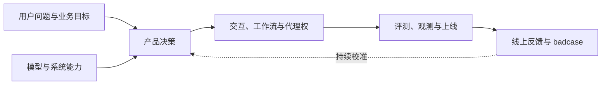
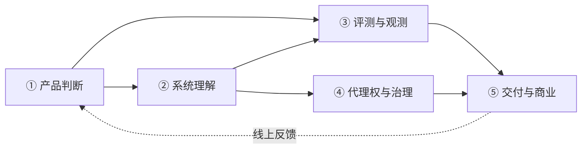
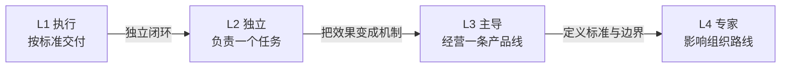
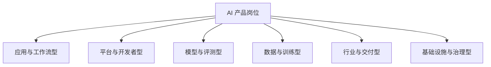
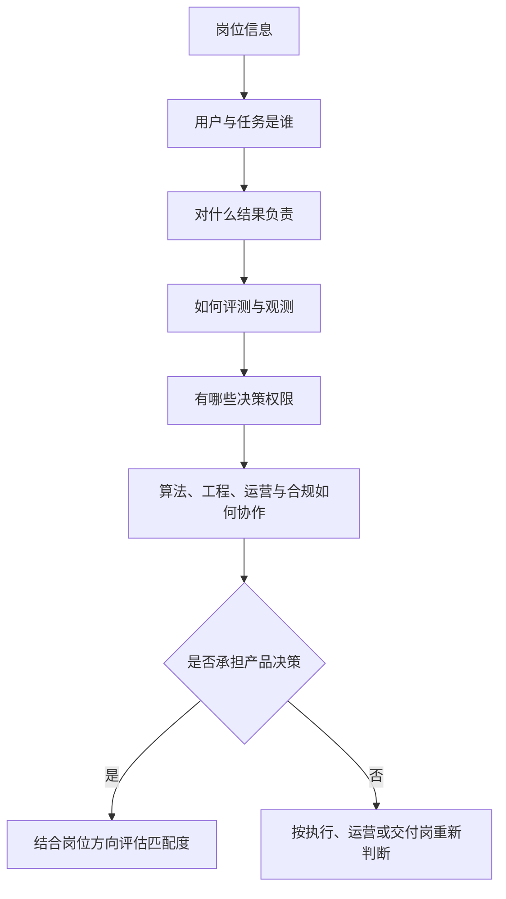
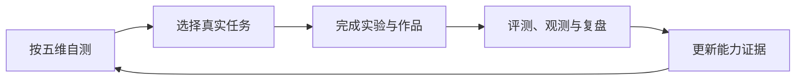

## AI 产品经理能力模型与岗位

AI 产品经理的工作对象已经从单个功能扩展到一套持续运行的 AI 系统：用户提出任务，模型或工作流处理任务，工具可能产生真实副作用，产品团队再用评测、线上数据和人工反馈持续修正系统。

本文给出一套用于自测和岗位分析的工作模型：五个能力维度、四个责任层级和六类岗位。它描述可观察的行为与交付物，不把某个模型、平台或提示词技巧当作长期能力标准。不同岗位对各维度的权重不同，判断时以实际用户、决策权和结果责任为准。

???+ note "阅读方式"
    先看五个维度，找到自己缺少行为证据的部分。

    再看四个层级，判断自己目前能独立承担的责任范围。

    最后对照岗位类型和 JD 清单，确认目标岗位要求的是产品决策，还是单纯的执行、运营或工具使用。

## 一、AI 产品经理的职责定位

AI 产品经理负责把用户问题、业务目标与 AI 系统约束收束成可交付、可评测、可运营的产品方案。工作范围通常包括：定义任务与价值，验证模型或工作流的可行性，设计交互与代理权，建立评测和观测闭环，协调研发上线，并对成本、风险和结果负责。

产品决策把价值、能力和风险放在同一张表里，再通过评测与线上反馈验证方案是否值得继续投入。

| 对比维度 | 传统产品经理 | AI 产品经理需要额外处理的变量 |
| --- | --- | --- |
| 问题定义 | 用户需求、业务流程与产品目标 | 任务是否适合模型、工作流或 Agent，成功标准能否被验证 |
| 产品方案 | 功能、流程与交互 | 上下文、检索、工具、模型路由、人工接管与失败恢复 |
| 效果验收 | 功能是否按规格运行 | 输出概率性、评测集、线上指标、人工抽检与 badcase 回流 |
| 运行成本 | 服务器与运营成本 | token、推理、检索、工具调用、人工复核与延迟成本 |
| 发布治理 | 权限、质量与版本发布 | 代理权阶梯、审批节点、审计、灰度、熔断、回滚与数据治理 |

AI 产品经理不需要替代算法、工程、设计、测试或法务角色。需要做的是把各角色的输入组织成一套可决策的产品约束，并在关键关卡对取舍结果负责。

### 一次完整的 AI 产品决策

遇到“给产品增加一个 AI 功能”的需求，可以按下面的顺序推进：

1.  **定义任务**：明确谁在什么场景下完成什么任务，现状由谁完成，失败的真实代价是什么。
2.  **验证可行性**：用小样本 spike 检查模型、检索、工具或工作流是否达到最低门槛。
3.  **选择形态**：步骤固定时优先 Workflow；需要动态探索且结果可验证时再考虑 Agent；高风险动作保留人工确认。
4.  **定义证据**：建立种子评测集、线上指标、trace 字段、人工抽检和 badcase 分类。
5.  **设计边界**：写清楚权限、预算、最大步数、确认点、降级路径、回滚方式与责任人。
6.  **安排上线**：从小范围灰度开始，比较质量、成本、延迟和业务结果，再决定是否扩大代理权。

这些步骤与 [AI 产品开发生命周期（CC/CD）](../pm/ai-lifecycle.md)、[评估与评测](../ai/evaluation.md) 和 [Agent 产品](../practice/agent-product.md) 的方法相互衔接。

## 二、能力模型：五个维度

五维模型是本站的工作分类。每个维度都用行为描述和可交付物作为自测证据，避免把“了解”“熟悉”等抽象词当作能力本身。

| 维度 | 主要问题 | 可观察的行为证据 |
| --- | --- | --- |
| ① 产品判断与用户价值 | 做什么、为谁做、为什么现在做 | 定义任务和基线；完成用户研究与需求取舍；说明价值、失败代价和成功标准 |
| ② AI 系统与工程理解 | 系统能否做到、如何稳定做到 | 判断模型、RAG、Workflow、Agent、工具调用和 MCP 的适用边界；能读懂架构、接口、上下文、延迟与成本约束 |
| ③ 评测、数据与可观测性 | 怎么证明效果、出了问题怎么定位 | 构建种子集与回归集；区分离线质量和线上业务指标；设计 badcase 回流、trace、日志和人工抽检机制 |
| ④ 代理权、安全与治理 | 系统可以替用户做什么、何时必须交还控制权 | 设计权限、确认、人工接管、降级、审计、隐私、内容安全和回滚；为不同风险设置不同自主程度 |
| ⑤ 交付、商业与组织协作 | 方案能否上线、持续运行并产生价值 | 平衡效果、成本、延迟、可靠性和收入；推动 PRD、评审、灰度、运营与事故复盘；让算法、工程、设计、运营和合规对齐 |

五个维度相互连接：产品判断定义要解决的任务，系统理解决定方案边界，评测与观测提供证据，治理约束代理权，交付与商业判断决定是否长期运行。沟通是贯穿五维的工作方式，不单独等同于“会表达”。

### ① 产品判断与用户价值

核心证据不是写出一份漂亮 PRD，而是能把开放式愿望收束成可验证的任务：

-   说明目标用户、触发场景、现有流程和替代方案
-   区分用户真正要完成的任务与用户提出的实现方式
-   写出基线：当前完成率、处理时间、成本、人工流程或用户满意度
-   判断 AI 带来的增量价值，说明为什么规则、搜索或普通 Workflow 不足
-   定义最小可行范围、失败代价和不做的部分

可交付物包括问题定义、用户旅程、需求取舍记录、价值假设、基线数据和可行性 spike 计划。

### ② AI 系统与工程理解

产品经理不必实现模型或服务，但要能在技术评审中做出产品判断：

-   说清模型的输入、输出、上下文边界、典型失败模式和版本变化影响
-   判断一个任务适合单次调用、RAG、固定 Workflow、工具调用还是 Agent
-   理解工具 schema、入参校验、权限范围、超时、重试、幂等和副作用
-   知道 MCP 等协议解决的是工具与上下文接入问题，不等同于产品能力或安全保证
-   能读懂请求链路、数据流、模型路由、缓存、队列、部署和降级方案
-   在模型能力、效果、延迟、稳定性、算力与调用成本之间做取舍

可交付物包括系统边界图、模型或方案对比、工具清单、接口约束、风险清单和技术评审决策记录。相关基础见 [Agent 与工作流](../ai/agent.md)、[工具调用与 MCP](../ai/agent-tools.md) 与 [工程与架构](../tech/index.md)。

### ③ 评测、数据与可观测性

AI 功能上线前后都需要证据。至少要能完成以下工作：

-   从真实日志、工单或访谈中抽取典型、边界和对抗样本
-   为样本写出期望行为和可接受答案范围，记录标注规范与分歧仲裁
-   区分模型能力、任务质量、产品指标和用户体验四层问题
-   设计离线评测、人工评测、LLM-as-Judge 校准、线上指标与人工抽检的组合
-   记录模型、Prompt、检索、工具、阈值和数据集版本，支持结果复现
-   把错误按数据、检索、指令、模型、工具、交互或治理原因分类，再回填评测集
-   通过 trace 和日志观察成功率、延迟、token、成本、重试、转人工和工具失败

可交付物包括评测集、评分卡、回归报告、线上指标定义、trace schema、badcase 看板和版本复盘。详细方法见 [评估与评测](../ai/evaluation.md)。

### ④ 代理权、安全与治理

AI 系统会从“给建议”逐步走向“替用户执行”。产品经理要先设计控制边界，再讨论是否开放更高自主度：

-   将只读、生成草稿、确认后执行、受限自治和全自主区分开
-   对发送消息、修改数据、支付、删除和发布等不可逆动作设置确认点
-   为工具设置最小权限、作用域、预算、速率限制、沙箱和审计日志
-   设计暂停、转人工、拒绝、重试、降级、检查点恢复和一键停用
-   将隐私、数据留存、内容安全、提示词注入和供应链风险纳入设计评审
-   明确谁可以放行、谁负责监控、谁处理事故、谁批准代理权升级

可交付物包括权限矩阵、人工接管流程、风险分级、护栏清单、回滚预案、审计字段和上线准入标准。相关内容见 [Agent 产品](../practice/agent-product.md)、[AI 安全与对齐](../ai/ai-safety.md) 与 [AI-Native 研发流程](../tech/ai-native-sdlc.md)。

### ⑤ 交付、商业与组织协作

AI 产品的“做好”同时受质量、成本和组织执行能力约束。需要能够：

-   按真实输入输出、循环次数、检索与工具调用估算单次任务成本
-   把成本、延迟、吞吐、可用性和人工复核量纳入产品指标
-   说明 AI 增量带来的收入、转化、留存、效率或风险下降
-   推动从意图、规格、计划到开发、测试、发布和维护的交付链路
-   在评审中让产品、算法、工程、设计、测试、运营与合规对同一成功标准负责
-   通过灰度、监控和复盘决定继续投入、降级、回滚或停止

可交付物包括成本模型、ROI 假设、发布计划、跨团队责任矩阵、灰度方案、运营看板和事故复盘。

## 三、能力层级：四个层级

层级描述能力与责任范围，不对应公司职级。判断层级时看最近完成过什么闭环，以及是否能拿出过程和结果证据。

| 层级 | 责任范围 | 关键行为证据 | 常见岗位 |
| --- | --- | --- | --- |
| L1 执行层 | 在明确标准下完成一个环节 | 按规范整理需求、原型、标注、评测或运营记录；能说明输入、输出和验收标准 | AI 产品助理、初级 AI 产品经理、评测执行 |
| L2 独立层 | 独立负责一个任务或功能 | 从问题定义、可行性实验、方案设计到上线复盘形成闭环；能维护小型评测集和失败清单 | AI 产品经理、应用产品经理、工作流产品经理 |
| L3 主导层 | 主导一条产品线或一套系统 | 建立评测、观测、数据回流、权限治理和版本发布机制；能平衡效果、成本、可靠性与业务结果 | 高级 AI 产品经理、平台产品负责人、行业 AI 负责人 |
| L4 专家层 | 定义跨团队或跨产品线标准 | 规划 AI 产品组合与治理边界；推动组织采用统一方法；处理重大事故并影响技术与商业路线 | AI 产品总监、领域负责人、AI 战略或治理负责人 |

**L1 到 L2**的分界是能否独立定义问题并验证结果；**L2 到 L3**的分界是能否把个人经验变成评测、观测和治理机制；**L3 到 L4**的分界是能否定义跨团队标准并对长期结果负责。

???+ example "同一个任务的四级证据"
    以“优化知识库问答”为例：

    - **L1**：按给定 badcase 清单复现问题，记录修改前后结果。

    - **L2**：从线上样本发现一类错误，提出检索或提示词改动，补充评测样本并完成一次回归。

    - **L3**：建立评测集版本、发布门槛、线上指标、抽检节奏和责任分工，让团队可以持续处理同类问题。

    - **L4**：将问答评测、数据治理和风险分级沉淀为跨产品线标准，推动技术和业务共同采用。

## 四、岗位盘点

“AI 产品经理”覆盖多种用户、产品形态和决策距离。下面六类用于分析岗位组合，不代表统一的行业分类；同一个岗位可以同时属于应用型、行业型和平台型。

| 类型 | 典型岗位 | 核心工作 | 重点能力 |
| --- | --- | --- | --- |
| 应用与工作流型 | 对话助手、Copilot、工作流产品经理 | 把 AI 接入用户任务，设计流程、交互、反馈和降级 | 产品判断、场景设计、评测、用户体验 |
| 平台与开发者型 | 模型平台、开发者平台、Agent 平台 PM | 提供模型、数据、工具、权限、发布和计费能力 | API 与架构理解、开发者体验、平台治理 |
| 模型与评测型 | 模型产品、模型评测、能力规划 PM | 定义能力路线、评测标准、版本发布和模型服务 | 模型理解、数据评测、成本与发布决策 |
| 数据与训练型 | 数据产品、标注、训练与行为调优 PM | 建设数据管线、标注规范、反馈闭环和行为验收 | 数据治理、质量控制、统计分析、协作推动 |
| 行业与交付型 | 金融、医疗、教育、政企 AI PM 或解决方案 PM | 将领域规则、客户流程和部署约束转成可交付产品 | 行业知识、交付管理、合规、需求抽象 |
| 基础设施与治理型 | AI Infra、模型运营、安全治理、可观测性 PM | 管理推理服务、成本、稳定性、权限、审计和风险 | 系统思维、可靠性、治理机制、跨团队影响力 |

岗位名称相同，实际责任可能完全不同。先确认用户是谁、首个交付物是什么、谁定成功标准、谁批准上线、谁处理线上失败，再判断岗位是否适合自己的能力和成长目标。

???+ note "与求职专题岗位解读的关系"
    本页提供岗位分析坐标，回答“这类岗位负责什么、需要哪些能力”。

    具体 JD 的关键词、面试准备和作品建议见求职专题：[常见岗位与 JD](../job/positions/index.md)、[AI 产品经理岗位解读](../job/positions/ai-pm.md)。

## 五、识别“伪 AI 产品经理岗”

岗位名称的变化速度快于能力模型。判断一份 JD 时，重点看它是否拥有问题定义、方案取舍、效果验收和迭代决策的权限。

| 鉴别信号 | 需要追问的事实 | 面试可以怎么问 |
| --- | --- | --- |
| 只要求会用某个 AI 工具或会写 Prompt | 是否定义任务、指标和上线标准 | “这个岗位对哪项用户或业务结果负责？” |
| 不谈评测、线上数据或 badcase | 效果由谁定义，失败由谁归因和修复 | “上线后如何判断效果？失败样本进入什么流程？” |
| 职责集中在文案、运营和执行 | 是否拥有需求发起、优先级和方案取舍权 | “我可以独立发起什么类型的需求？谁批准方案？” |
| 只负责接入第三方模型 | 是否参与模型、检索、工具、成本和风险决策 | “模型或 RAG 方案由谁决定？产品参与到哪一步？” |
| Agent JD 只写自动化和效率 | 是否设计权限、确认节点、状态恢复和人工接管 | “Agent 做错或执行不可逆动作时如何停下和恢复？” |
| 没有算法、工程或领域专家协作界面 | 产品决策是否有真实技术与业务支撑 | “团队如何分工？产品和技术对成功标准如何达成一致？” |

???+ tip "电话初筛可以先问三件事"
    1. 这个岗位入职后第一个要解决的问题是什么？

    2. 目前使用什么模型或系统方案，效果和成本如何衡量？

    3. 这个岗位有哪些决策权限，上一任留下了什么交付物？

“AI 运营”“内容产品”“数据标注产品”等岗位本身都可以是正当且有价值的岗位。需要确认的是岗位名称与实际责任是否一致，而不是把所有非模型岗位都排除。

## 六、与自学路线的衔接

能力模型回答“要形成哪些可交付能力”，[自学路线](self-study-roadmap.md)回答“按什么顺序练习”。建议用作品和证据完成循环：

1.  先写下目标岗位、目标用户和自己最弱的两个维度。
2.  选择一个真实任务，完成问题定义、最小实验和可运行原型。
3.  为原型补齐评测集、成本记录、失败分析、权限边界和上线方案。
4.  用复盘结果更新作品和能力证据，再决定下一阶段的学习重点。

**“我现在能独立负责什么？”自测清单**：

1.  【产品判断】我能说明用户任务、现状基线、AI 增量价值和不做的范围——见[需求分析](../pm/requirements.md)。
2.  【系统理解】我能判断任务适合单次调用、RAG、Workflow 还是 Agent，并说明工具、上下文和成本约束——见[Agent 与工作流](../ai/agent.md)。
3.  【评测观测】我能建立包含典型、边界和对抗样本的评测集，并把离线结果与线上指标、trace 和 badcase 联系起来——见[评估与评测](../ai/evaluation.md)。
4.  【代理权治理】我能设计权限、确认节点、人工接管、降级、审计和回滚——见[Agent 产品](../practice/agent-product.md)。
5.  【交付商业】我能估算单次任务成本，说明效果、延迟、稳定性和业务结果的取舍，并推动灰度与复盘——见[LLM 成本测算](../tools/llm-cost.md)。

五项都有真实证据，通常具备独立承担一个 AI 功能的基础；证据集中在执行环节时，先按 L1 的行为补齐；能将一次经验沉淀为团队机制，再考虑 L3 的责任范围。

## 来源说明

本文是 AI-PM 基于站内方法与当前 AI 产品实践整理的工作模型，主要参考：

- [Agent 与工作流](../ai/agent.md)：Agent、Workflow、工具调用、权限与观测
- [评估与评测](../ai/evaluation.md)：评测集、线上指标、人工评测与 badcase 闭环
- [AI 产品开发生命周期（CC/CD）](../pm/ai-lifecycle.md)：代理权阶梯、持续校准与发布治理
- [AI-Native 研发流程](../tech/ai-native-sdlc.md)：意图、规格、评审关卡与持续维护
- [Anthropic：Building effective agents](https://www.anthropic.com/engineering/building-effective-agents)：工作流与 Agent 的边界、先简单后复杂原则，访问日期 2026-08-30
- [Model Context Protocol 官方文档](https://modelcontextprotocol.io/introduction)：工具与上下文协议的基础概念，访问日期 2026-08-30

岗位名称、职责与招聘要求变化较快，具体判断仍应以目标团队的最新 JD、面试沟通和实际交付范围为准。
