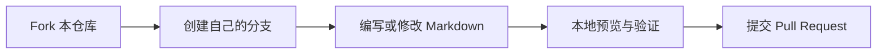

## 如何参与

我们非常欢迎你为 **AI-PM** 编写内容，将自己的所学所得与大家分享。

## 贡献方式

-   **编写/修改文章**：在 `docs/` 下对应的目录新建或修改 Markdown 文件
-   **反馈问题**：在 [Issues](https://github.com/AI-PM-Wiki/AIPM/issues) 中提出内容错误、补充建议
-   **讨论方向**：参与 Issue 中关于内容规划的讨论，或在文章评论区参与关于文章内容讨论

## 贡献流程

贡献从分支开始，经本地验证后提交 Pull Request；具体写作要求由格式手册约束。

1.  Fork 本仓库，创建自己的分支
2.  在 `docs/` 对应目录编写内容，遵循[格式手册](format.md)
3.  本地验证：`uv run mkdocs serve -v` 预览效果
4.  提交 Pull Request，说明修改内容

## 编写规范

-   新文章先想清楚读者是谁、解决什么问题，再动手写
-   文章内容尽量**可验证**：引用来源、给出示例、标注适用范围
-   保持条目化、结构化的写作风格，方便读者快速检索
-   知识类内容比观点类内容更受欢迎；观点请标注"一家之言"

???+ note "Todo"
    每一篇文章顶部的 frontmatter 中可以加入 `todo: true` 标记，表示该文尚未完成。
