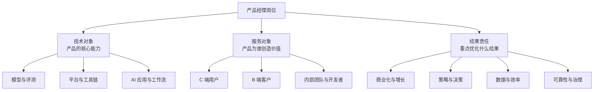
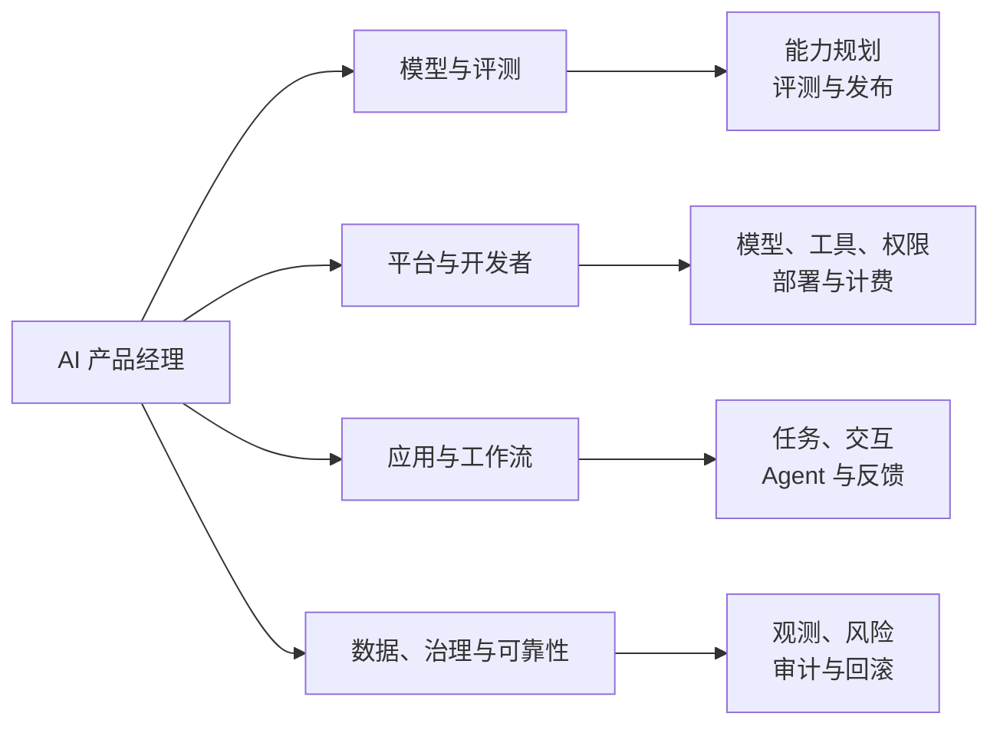
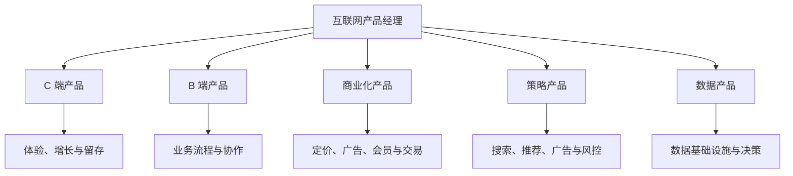
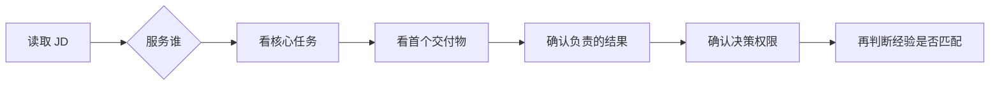

## 产品经理岗位类别

产品经理的分类没有唯一标准。同一个岗位可以同时属于多个类别：AI 应用产品可能面向 C 端用户，也可能服务企业客户；Agent 平台可能是开发者产品，也可能承担基础设施和治理职责。

判断岗位时，先看三个问题：**产品服务谁、产品解决什么问题、产品对什么结果负责**。比岗位名称更重要的是决策权、交付物和结果证据。

### 三个分类维度

下文按常见方向展开。分类用于建立认知，不代表公司的组织架构或 JD 一定采用这些名称；岗位可以跨多个维度。

## 一、AI 产品经理

AI 产品经理围绕用户任务、AI 系统和业务结果做取舍。重点不只是把模型接进产品，而是把概率性输出变成可验证、可控制、可持续运行的产品能力。

### 模型与评测型

模型与评测型岗位围绕基础模型、多模态模型、模型 API 或领域模型展开。产品经理通常负责场景定义、能力规划、评测标准、版本路线和发布协作，不代替算法工程师完成训练工作。

-   **典型产品**：模型 API、模型能力平台、多模态模型、行业模型、评测平台
-   **主要工作**：拆解能力需求；定义任务和评测集；比较质量、延迟、成本和稳定性；推动版本发布与行为回归
-   **常见指标**：任务质量、评测通过率、延迟、可用性、调用成本、安全事件和开发者采用率
-   **适合背景**：有算法、工程、数据或技术产品经验，能读懂模型评测与部署约束

### 平台与开发者型

平台与开发者型岗位为模型研发、应用构建或团队协作提供基础设施，用户通常是算法工程师、应用开发者、企业管理员或内部业务团队。

-   **典型产品**：模型接入平台、Agent 搭建平台、数据与标注平台、开发者控制台、工具与 MCP 管理平台
-   **主要工作**：设计模型、数据、工具、权限、发布和计费流程；降低开发与部署门槛；维护文档、SDK、版本和可观测性
-   **常见指标**：开发者激活与留存、从创建到上线的时长、任务成功率、平台稳定性、资源利用率和调用成本
-   **关键能力**：理解 API、数据流、鉴权、权限、部署和故障排查，把复杂工程流程整理成可操作的产品流程

### 应用与工作流型

应用与工作流型岗位把模型接入具体场景，直接帮助用户完成任务。产品经理的重点从模型本身转向任务流程、交互体验、效果验收和业务闭环。

-   **典型产品**：对话助手、智能客服、知识库问答、办公 Copilot、营销内容生成、AI 搜索
-   **主要工作**：定义用户任务；选择模型、检索和工具方案；设计反馈、人工接管和降级；建立 badcase 回流和版本评测
-   **常见指标**：任务完成率、采纳率、修改率、转人工率、留存率、转化率、回答质量和单次任务成本
-   **关键能力**：理解真实工作流，能判断幻觉、上下文不足、检索失败、工具失败和用户信任问题

### Agent 与自动化型

Agent 产品经理负责需要动态规划、工具调用或跨步骤执行的任务。很多 Agent 产品同时包含固定 Workflow，选型时要先证明动态决策确实带来收益。

-   **典型产品**：研究 Agent、编码 Agent、运营自动化、数字员工、企业流程 Agent
-   **主要工作**：拆解任务；设计工具 schema 和上下文；规定权限、预算、停止条件、确认节点、检查点和人工接管
-   **常见指标**：端到端任务成功率、工具调用成功率、人工接管率、恢复率、步骤数、延迟、成本和高风险动作拦截率
-   **关键能力**：理解 Agent 与 Workflow 的边界，能把自主性分级并为失败设计恢复路径

### 数据、治理与可靠性型

这类岗位让 AI 系统可观测、可审计、可持续改进，用户可能是内部研发团队、业务团队、风险与合规团队或企业客户。

-   **典型产品**：数据闭环、评测与观测平台、模型运营、AI 安全治理、AI Infra 产品
-   **主要工作**：定义日志和 trace；建设数据、评测、成本、延迟和质量看板；设计权限、审计、灰度、熔断和回滚
-   **常见指标**：数据覆盖率、评测稳定性、问题定位时长、可用性、成本、事故率、修复周期和治理覆盖率
-   **关键能力**：系统思维、数据治理、可靠性、风险分级以及跨团队推动机制

AI 应用、平台、Agent 和治理并不是互斥岗位。比如企业知识库 Agent 可能同时属于应用型、行业型和平台型；判断时以实际交付和责任边界为准。

## 二、互联网产品经理

互联网产品经理把用户需求、业务流程和技术能力组织成可持续迭代的产品。AI 能力可以嵌入任何方向，但不改变岗位首先要对用户和业务结果负责的基本要求。

### C 端产品经理

C 端产品直接服务个人用户，工作重点偏向功能设计、用户体验、增长和留存。AI 相机、内容推荐、个人效率工具和消费级助手都可能属于这一方向。

-   **主要工作**：理解用户需求；设计功能和交互；优化用户路径；验证拉新、促活、留存和 AI 功能采纳
-   **常见指标**：DAU、留存率、使用时长、转化率、任务完成率、用户满意度和市场份额
-   **关键挑战**：用户规模大、反馈分散，输出质量和体验变化会直接影响活跃与信任

### B 端产品经理

B 端产品服务企业、组织或特定岗位，工作重点偏向业务流程、中后台和组织协作。使用者、购买者和决策者可能不是同一个人，需求分析要同时考虑业务目标与角色权限。

-   **主要工作**：梳理业务流程；设计角色、权限、审批和配置；建设中后台；支持交付、实施与业务扩展
-   **常见指标**：用户采用率、流程覆盖率、处理时长、错误率、运营成本、验收率和续费率
-   **关键挑战**：客户个性化与标准产品之间的边界，数据隔离和跨组织协作的责任划分

B 端产品不等于没有业绩压力。交付周期、客户续费、项目验收和业务部门的使用效果，都可能成为产品经理的考核内容。

### 商业化产品经理

商业化产品经理负责把用户价值和业务流量转化为收入，重点关注定价、售卖、广告、会员、增值服务和交易抽佣等机制。AI 产品还要把调用成本、人工复核和推理资源纳入单位经济模型。

-   **主要工作**：设计变现模式；搭建售卖和计费流程；优化广告或交易链路；平衡收入、体验、留存与 AI 成本
-   **常见指标**：收入、ARPU、付费率、转化率、ROI、GMV、留存率、毛利和单任务贡献
-   **关键能力**：商业分析、定价、漏斗分析、实验设计和多方利益平衡

### 策略产品经理

策略产品经理负责把业务目标转化为规则、算法策略和决策逻辑，常见于搜索、广告、推荐、增长、风控和内容分发场景。工作方法、需求写法与四类业务应用见[策略产品经理](../case/strategy-pm/index.md)专题。

-   **主要工作**：定义策略目标与约束；设计排序、召回、分发或激励逻辑；推动算法实验；分析效果与风险
-   **常见指标**：CTR、转化率、准确率、召回率、用户满意度、成本和风险指标
-   **关键能力**：数据分析、实验设计、算法协作、指标拆解与策略迭代

策略产品与商业化产品常常交叉。例如广告排序既影响收入，也影响用户体验；最终要看岗位实际对哪些指标负责。

### 数据产品经理

数据产品经理把数据加工成可使用的基础设施、分析工具或业务能力，服务对象可能是管理者、运营、销售、研发或其他产品团队。

-   **主要工作**：定义数据口径；设计采集、加工和查询流程；建设指标体系；支持业务决策与运营优化
-   **常见指标**：数据覆盖率、准确率、及时性、查询性能、产品使用率和决策效率
-   **关键能力**：数据建模、指标体系、业务分析、SQL 基础与数据治理意识

数据产品不只是做报表。高价值的数据产品要让数据进入业务流程，影响决策、执行和复盘。

## 三、如何选择产品方向

### 先按工作内容筛选

阅读 JD 时按四步判断：

1.  **看用户**：服务个人用户、企业客户、开发者、算法工程师、内部团队还是风险与合规团队。
2.  **看任务**：主要解决功能体验、业务流程、模型能力、自动化执行、数据治理还是收入增长。
3.  **看交付物**：第一个交付是 PRD、原型、评测集、模型方案、平台功能、客户方案、指标看板还是运营结果。
4.  **看责任**：谁定义成功标准，谁批准上线，谁处理 badcase、事故和回滚。

四步都能回答清楚，再判断自己的经验是否匹配。不要只根据岗位名称或“AI”前缀决定方向。

### 根据优势匹配方向

-   **用户洞察与交互设计**：C 端 AI 应用、对话产品、Copilot
-   **业务理解与流程梳理**：B 端 AI、行业解决方案、工作流产品
-   **数学、算法与工程协作**：模型、平台、Agent、策略和 AI Infra
-   **数据分析与指标体系**：评测、数据、策略、模型运营和治理
-   **商业分析与增长**：商业化、C 端增长、AI 计费与成本产品

这是初步筛选，不是能力定型。真正的选择还要看团队配置、业务阶段、汇报对象和岗位授权范围。

## 四、读 JD 时重点确认什么

岗位名称相同，实际工作可能差异很大。投递或面试前，至少确认以下问题：

-   **用户是谁**：使用者、付费者、决策者和受影响者是否不同
-   **第一个交付是什么**：需求、方案、实验、评测集、平台功能、客户交付还是运营结果
-   **结果由谁负责**：指标定义、数据来源、人工验收和线上复盘由谁承担
-   **决策权限在哪里**：能否发起需求、定优先级、选择方案、设置门槛和推动回滚
-   **团队如何配置**：算法、工程、设计、测试、Infra、销售、实施、法务和安全如何分工
-   **系统如何持续运行**：是否有版本、评测、观测、反馈、治理与事故处理机制

如果 JD 只强调会使用 AI 工具，却没有说明用户、问题、指标和团队分工，需要进一步确认岗位是否真正承担产品决策。可以结合[AI 产品经理能力模型](capability.md)和[AI 产品经理岗位解读](../job/positions/ai-pm.md)继续判断。

## 与站内内容的衔接

-   想了解 AI 产品经理需要具备哪些可交付能力，阅读[AI 产品经理能力模型](capability.md)。
-   想补齐需求、设计、项目和数据等通用基本功，阅读[产品方法论](../pm/index.md)。
-   想理解模型、Agent、评测和工程协作，阅读[AI 基础](../ai/index.md)与[工程与架构](../tech/index.md)。
-   想系统学习 AI 产品化，阅读[自学路线](self-study-roadmap.md)和 [AI 产品实战](../practice/index.md)。
-   想了解具体岗位 JD 与求职准备，阅读[求职专题-岗位类别](../job/positions/index.md)。

## 来源说明

本文按技术对象、服务对象与结果责任三个维度整理岗位方向。岗位职责、指标、组织结构与招聘要求变化较快，具体内容以目标公司的最新公开 JD、面试沟通和实际交付范围为准。AI 产品能力模型与学习建议见[AI 产品经理能力模型](capability.md)，不将本文的分类视为行业统一标准。
