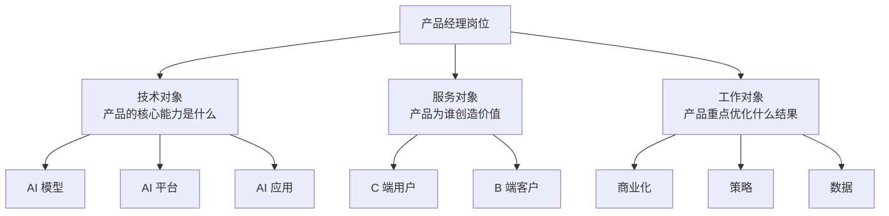
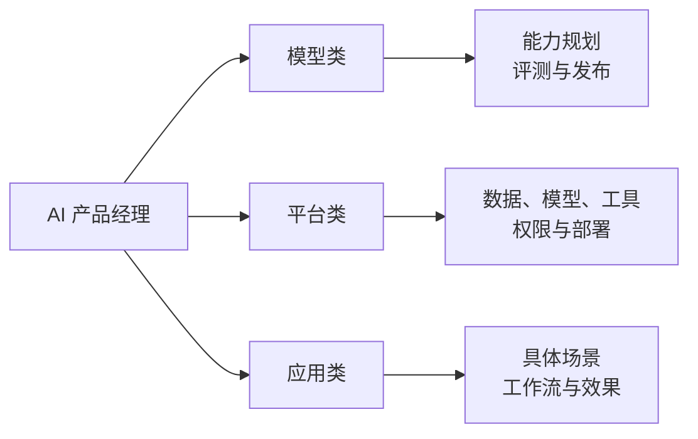
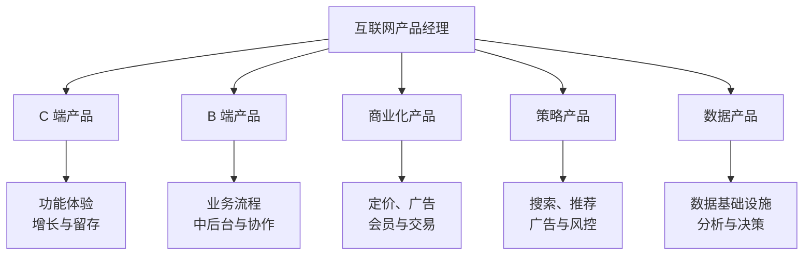
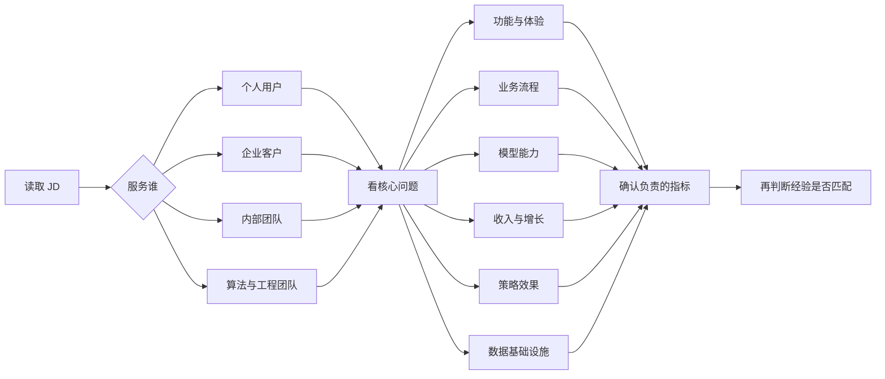
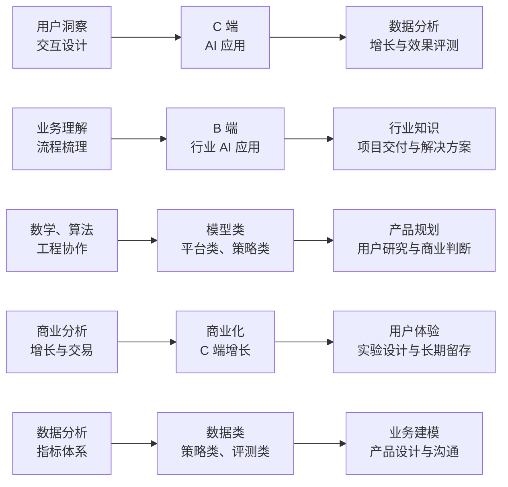
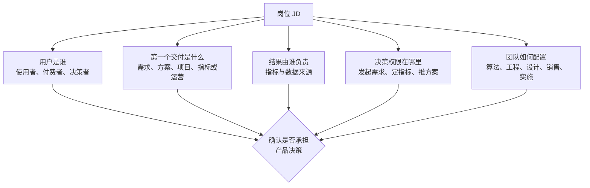

## 产品经理岗位类别

产品经理的分类没有唯一标准。同一个岗位可以同时属于多个类别：AI 应用产品可能面向 C 端用户，也可能服务企业客户；商业化产品经常与策略产品、数据产品协作。

判断岗位时，先看三个问题：**产品服务谁、产品解决什么问题、产品对什么结果负责**。比起岗位名称，这三个问题更接近实际工作。

### 三个分类维度

下文按常见岗位方向展开。分类用于建立认知，不代表公司的组织架构或 JD 一定采用这些名称。

## 一、AI 产品经理

AI 产品经理围绕模型能力、用户需求和商业结果做取舍。模型能做什么，决定产品上限；评测结果、调用成本和安全边界，决定产品能否上线并持续运行。

### 模型类

模型类产品围绕基础模型、多模态模型或行业模型展开。产品经理通常负责场景定义、能力规划、版本路线、评测标准和模型发布协作，不代替算法工程师完成模型训练工作。

- **典型产品**：基础大模型、多模态模型、模型 API
- **主要工作**：定义模型服务什么场景；拆解能力需求；设计评测集与发布标准；平衡效果、延迟、稳定性、成本和安全
- **常见指标**：任务准确率、评测通过率、延迟、调用成本、稳定性与安全事件
- **适合背景**：有算法、工程、数据或技术产品经验，对模型原理和能力边界有持续学习意愿

### 平台类

平台类产品为模型研发、应用构建或团队协作提供基础设施，用户通常是算法工程师、开发者、企业管理员或内部业务团队。

- **典型产品**：数据标注与训练平台、模型管理平台、开发者平台、Agent 搭建平台，如 Coze 一类的产品
- **主要工作**：设计数据、模型、工具、权限与发布流程；降低开发和部署门槛；处理版本管理、监控、计费与协作问题
- **常见指标**：平台活跃用户、任务成功率、从创建到上线的时长、资源利用率、平台稳定性与调用成本
- **关键能力**：理解 API、数据流、模型部署和权限体系，把复杂技术流程整理成可操作的产品流程

### 应用类

应用类产品把模型接入具体场景，直接解决用户任务。产品经理的重点从模型本身转向工作流、交互体验、效果验收和业务闭环。

- **典型产品**：图像生成、智能客服、办公助手、营销内容生成、知识库问答
- **主要工作**：选择适合的模型与方案；设计人机协作流程；定义成功标准；建立 badcase 回流、评测和迭代机制
- **常见指标**：任务完成率、用户满意度、留存率、转化率、回答准确率、单次任务成本
- **关键能力**：理解用户场景，同时能够判断模型幻觉、上下文限制和工具调用失败等问题

AI 应用并不天然属于 C 端。面向消费者的 AI 相机和面向企业的智能客服都属于应用类，区别在于用户、流程和商业模式不同。

## 二、互联网产品经理

互联网产品经理的核心工作是把用户需求、业务流程和技术能力组织成可持续迭代的产品。按照服务对象和优化目标，常见方向如下。

### C 端产品经理

C 端产品直接服务个人用户，工作重点偏向功能设计、用户体验、增长和留存。社交、内容、电商、工具、出行和本地生活产品都属于常见场景。

- **主要工作**：理解用户需求；设计功能与交互；优化用户路径；推动拉新、促活和留存
- **典型产品**：Soul、陌陌、抖音、快手、淘宝、京东、滴滴、大众点评、个人效率工具
- **常见指标**：DAU、留存率、使用时长、转化率、市场份额、GMV
- **关键挑战**：用户规模大、反馈分散，体验变化会直接影响活跃和留存

### B 端产品经理

B 端产品服务企业、组织或特定岗位，工作重点偏向业务流程、中后台和组织协作。用户、购买者和决策者可能不是同一个人，需求分析要同时考虑业务目标与角色权限。

- **主要工作**：梳理业务流程；设计角色、权限和审批；建设中后台；支持交付、实施与业务扩展
- **典型产品**：办公协同、客户管理、企业资源计划、物流管理、人力资源、制造执行系统
- **常见指标**：用户采用率、流程覆盖率、处理时长、错误率、运营成本、续费率
- **关键能力**：业务理解、流程建模、复杂需求协调、方案交付与跨部门沟通

B 端产品不等于没有业绩压力。交付周期、客户续费、项目验收和业务部门的使用效果，都可能成为产品经理的考核内容。

### 商业化产品经理

商业化产品经理负责把用户价值和业务流量转化为收入，重点关注定价、售卖、广告、会员、增值服务和交易抽佣等机制。

- **典型方向**：广告投放、会员与增值服务、直播带货、交易抽佣、企业付费
- **主要工作**：设计变现模式；搭建售卖和计费流程；优化广告或交易链路；平衡收入、体验与长期留存
- **常见指标**：收入、ARPU、付费率、转化率、广告填充率、ROI、GMV、留存率
- **关键能力**：商业分析、定价、漏斗分析、实验设计和多方利益平衡

### 策略产品经理

策略产品经理负责把业务目标转化为规则、算法策略和决策逻辑，常见于搜索、广告、推荐、增长、风控和内容分发场景。

- **主要工作**：定义策略目标与约束；设计排序、召回、分发或激励逻辑；推动算法实验；分析策略效果
- **典型产品**：短视频推荐、信息流广告、搜索排序、用户召回、内容审核策略
- **常见指标**：CTR、转化率、准确率、召回率、用户满意度、成本与风险指标
- **关键能力**：数据分析、实验设计、算法协作、指标拆解与策略迭代

策略产品与商业化产品常常交叉。例如广告排序既影响收入，也影响用户体验；最终要看岗位实际对哪些指标负责。

### 数据产品经理

数据产品经理把数据加工成可使用的基础设施、分析工具或业务能力，服务对象可能是管理者、运营、销售、研发或其他产品团队。

- **典型方向**：数据中台、指标平台、BI 可视化、数据服务、业务分析工具
- **主要工作**：定义数据口径；设计采集、加工和查询流程；建设指标体系；支持业务决策与运营优化
- **常见指标**：数据覆盖率、准确率、及时性、查询性能、产品使用率、决策效率
- **关键能力**：数据建模、指标体系、业务分析、SQL 基础与数据治理意识

数据产品不只是做报表。高价值的数据产品要让数据进入业务流程，影响决策、执行和复盘。

## 三、如何选择产品方向

### 先按工作内容筛选

可以从用户、问题和指标三步筛选岗位：

三步都能回答清楚，再判断自己的经验是否匹配。不要只根据岗位名称决定方向。

### 两个常见的切入方向

**B 端产品**适合希望从业务理解和方案交付切入产品岗位的人。企业流程、角色权限和行业知识提供了明确的学习对象，做出一个可落地的方案通常比从零建立大规模 C 端用户增长更容易验证能力。需要提前确认客户交付、项目验收、续费和行业经验要求，避免把 B 端简单理解为低压力岗位。

**成熟业务上的 AI 应用**适合希望进入 AI 产品、又需要较快验证成果的人。已有业务通常具备用户、流程和数据，AI 可以作为增量能力接入客服、办公、营销、知识管理等环节，效果更容易找到对照组。与此同时，模型效果不稳定、成本随调用量增长、隐私与合规要求更高，仍然需要完整的评测和上线机制。

### 根据优势匹配方向

这张图只用于确定初步方向。真正的选择还要看团队配置、业务阶段、汇报对象和岗位授权范围。

## 四、读 JD 时重点确认什么

岗位名称相同，实际工作可能差异很大。投递或面试前，至少确认以下问题：

如果 JD 只强调会使用 AI 工具，却没有说明用户、问题、指标和团队分工，需要进一步确认岗位是否真的承担产品决策。识别岗位真伪的更多方法见[AI 产品经理能力模型](capability.md)。

## 与站内内容的衔接

- 想了解产品经理需要具备哪些能力，阅读[AI 产品经理能力模型](capability.md)。
- 想补齐需求、设计、项目和数据等通用基本功，阅读[产品方法论](../pm/index.md)。
- 想系统学习 AI 能力、评测与产品化，阅读[自学路线](self-study-roadmap.md)和 [AI 基础](../ai/index.md)。
- 想了解具体岗位 JD 与求职准备，阅读[求职专题-岗位类别](../job/positions/index.md)。

## 来源说明

本文根据产品经理岗位分类资料与配图整理，并结合本站的产品方法论与 AI 产品岗位框架补充。文中的产品示例用于说明类别，实际岗位职责、指标和招聘要求以具体公司的业务与 JD 为准。
