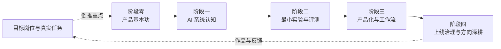
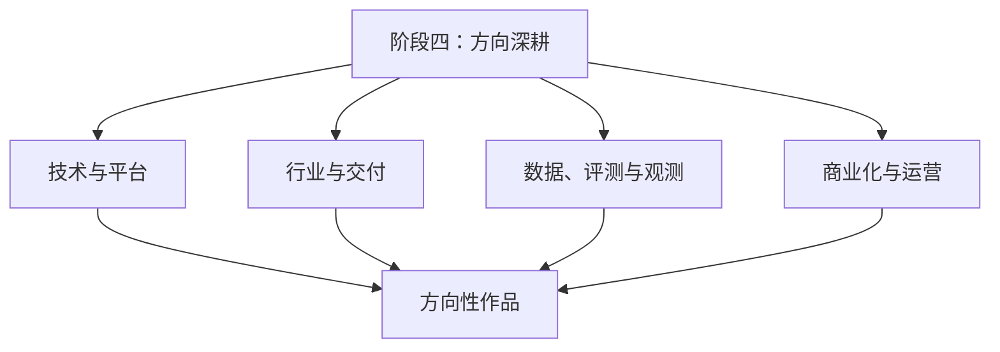

## 自学路线

自学 AI 产品经理，学习目标不应是记住一组模型名或工具名，而是能够把一个真实任务做成可验证、可交付、可持续迭代的产品。路线从通用产品基本功开始，逐步加入 AI 系统理解、实验评测、工作流与 Agent、上线治理和商业判断。

路线按目标岗位倒推。应用型岗位重点练任务设计与用户体验，平台型岗位重点练 API、数据、权限与开发者体验，评测或基础设施岗位重点练数据、观测、成本和可靠性。各阶段都以作品和过程证据收尾，有经验者可以跳过已经形成证据的部分。

### 总览：五阶段路线

| 阶段 | 重点 | 最小产出 |
| --- | --- | --- |
| 阶段零 产品基本功 | 问题定义、战略与经营阶段、用户研究、需求、设计、PRD、项目与数据 | 一份问题定义、用户流程和需求方案 |
| 阶段一 AI 系统认知 | 模型边界、许可与生态、提示词、训练与推理、多模态、RAG、工具、安全与架构 | 一张系统图和 10 条能力边界记录 |
| 阶段二 最小实验与评测 | 用真实任务做 spike，记录质量、失败、成本和延迟 | 可运行原型、20–50 条种子评测集和实验记录 |
| 阶段三 产品化与工作流 | 设计交互、工具、权限、人工接管、观测和发布 | 一份完整产品方案或可复现 Workflow/Agent |
| 阶段四 上线治理与方向深耕 | 灰度、回滚、badcase 闭环、商业化、安全治理和方向选择 | 一次上线复盘、治理清单和方向性作品 |

目标岗位决定练习重点，真实任务贯穿五个阶段；最后用作品和线上反馈反向更新学习计划。

### 阶段零：产品基本功

AI 产品经理首先要能定义值得解决的问题。模型知识无法替代用户研究、需求判断、交互设计和跨团队交付。

#### 先理解一个需求如何走到上线

| 环节 | 要回答的问题 | 产出 |
| --- | --- | --- |
| 机会判断 | 谁遇到了什么问题，现状如何完成，为什么现在处理 | 问题定义、用户证据、基线 |
| 需求与方案 | 做哪一段任务，不做什么，如何验证价值 | 需求取舍、流程、原型 |
| 交付与验证 | 研发、设计、测试和业务如何协作，完成标准是什么 | PRD、验收标准、排期与风险 |
| 发布与迭代 | 上线后看什么数据，如何处理反馈和失败 | 指标、复盘、下一轮假设 |

产品经理负责把问题、方案和结果连起来。AI 场景还要在方案阶段加入模型可行性、评测方式、成本、权限和安全边界。

#### 要学哪些能力

-   **问题定义与需求分析**：把业务方、用户和技术反馈整理为可验证的任务，区分目标与实现方式（[需求分析](../pm/requirements.md)）
-   **用户研究**：通过访谈、可用性测试和行为数据理解真实流程，尤其关注用户如何修改、拒绝或绕过 AI 输出（[用户研究](../pm/user-research.md)）
-   **产品战略与经营阶段**：立项时选战场（[产品战略与竞争](../pm/strategy.md)），用导入 / 成长 / 成熟 / 衰退判断资源投向，不要和 CC/CD 混用（[产品生命周期](../pm/product-lifecycle.md)）
-   **产品设计**：设计任务流程、输入输出、反馈、空状态、异常和人工接管（[产品设计与原型](../pm/design.md)）
-   **PRD 与验收**：把目标、范围、边界、指标和验收样例写成研发与测试可以共同使用的规格（[AI 产品 PRD](../pm/prd.md)）
-   **项目管理**：拆分验证轨道与交付轨道，管理依赖、风险、灰度和回滚（[项目管理与迭代](../pm/project-management.md)）
-   **数据分析**：定义基线、漏斗、任务完成、采纳、转人工、成本和留存等指标（[数据分析入门](../pm/data-analysis.md)）

#### 练习方式

选一个自己熟悉的任务，完成一份不超过两页的问题定义：用户、触发场景、现有做法、主要痛点、业务价值、失败代价、基线数据和暂不处理的范围。再画出当前流程与目标流程，写出三条可验证假设。

### 阶段一：AI 系统认知

**目标**：能够判断 AI 系统能做什么、怎样做、会在哪里失败，以及一个需求是否真的需要 Agent。

查词随时用 [AI 黑话速查](../ai/jargon.md) 与 [AI 定理与经验定律](../ai/theorems.md)，不必插入下面的序号。

按下面的顺序阅读站内内容：

1.  [机器学习基础](../ai/ml-basics.md)：监督学习、评估、数据切分和传统模型基线
2.  [深度学习基础](../ai/dl-basics.md)：神经网络、CNN/RNN/GNN、Encoder-Decoder 与变长序列
3.  [深度学习工程实践](../ai/deep-learning-practice.md)：数据管线、训练调试、checkpoint、评估、部署和回滚
4.  [Transformer 架构](../ai/transformer.md)：注意力、Encoder/Decoder、mask 与训练/推理差异
5.  [大模型基础](../ai/llm-basics.md)：token、上下文、生成、幻觉和能力边界
6.  [模型训练与对齐](../ai/llm-training.md)：预训练、扩展定律、RLHF 与微调边界
7.  [模型推理与部署](../ai/llm-inference.md)：预填充/解码、KV Cache、量化与私有化
8.  [模型能力与边界](../ai/capabilities.md)：做得到做不到、推理预算、成本和版本变化
9.  [开源与闭源模型生态](../ai/model-ecosystem.md)：许可、开闭源格局、本地化与迁移风险
10. [提示词工程](../ai/prompting.md)：系统提示、少样本、思维链与采样参数
11. [多模态理解](../ai/multimodal.md)：图像、文档、视频、音频的理解边界
12. [RAG 基础](../ai/rag.md)：知识来源、检索、引用和数据更新
13. [Agent 与工作流](../ai/agent.md)：工具调用、状态、记忆、停止条件和失败恢复
14. [工具调用与 MCP](../ai/agent-tools.md)：工具接口、权限、协议与执行边界
15. [提示词安全](../ai/prompt-security.md) 与 [AI 安全与对齐](../ai/ai-safety.md)：注入、越狱、护栏与上线评审
16. [工程与架构](../tech/index.md)：请求链路、服务、数据、部署、可观测性和 AI-Native 研发

重度使用 2–3 个 AI 产品时，不要只记录“好不好用”。每次记录：任务是什么、系统看到了什么上下文、调用了哪些工具、结果如何验证、用户做了什么修改、失败是否可恢复。

#### 练习产出

-   一张从用户输入到最终结果的系统图，标出模型、检索、工具、人工和日志位置
-   10 条能力边界记录，每条包含输入、期望行为、实际结果、失败模式和可行的改进方向
-   一张 Workflow 与 Agent 选型表：步骤是否可枚举、结果是否可验证、失败是否可恢复
-   一份最小深度学习实验记录：输入/输出 shape、变长序列的 mask、训练与真实推理指标、checkpoint 和失败样本

判断标准：能解释系统为什么出错，并能提出验证方案；能读懂一个最小训练/推理流程并指出数据、模型、评估和服务边界；只会描述模型“聪明”或“笨”还不算完成。

### 阶段二：最小实验与评测

**目标**：把“模型应该可以”变成可复现的数字和失败样本。

#### 先做可行性 spike

选择一个阶段零定义的任务，用最小成本回答几个问题：模型能否完成，检索能否找到资料，工具能否安全执行，输出格式是否稳定，延迟和成本是否可接受。涉及自建或微调模型时，按[深度学习工程实践](../ai/deep-learning-practice.md)记录数据版本、训练配置、checkpoint、评估切片与导出一致性；只调用模型 API 时，也至少保留输入、版本、结果和失败样本。

| 实验问题 | 最小做法 | 记录内容 |
| --- | --- | --- |
| 任务质量 | 准备典型和边界输入，统一运行候选方案 | 正确点、错误点、不可接受行为 |
| 检索质量 | 用真实问题检查 Top-k 召回和引用 | 命中文档、缺失资料、冲突资料 |
| 工具可靠性 | 重复调用并模拟错误参数、超时和权限拒绝 | 选择准确性、失败恢复、重复执行风险 |
| 成本与延迟 | 用真实长度和并发条件压测 | 输入输出 token、p50/p95、单次任务成本 |
| 输出稳定性 | 重复运行，验证 schema 和关键字段 | 解析失败、格式漂移、需要人工修正的比例 |

实验记录要保留输入、版本、配置、结果和结论。不要用一次成功的 Demo 替代评测。

#### 从 20–50 条评测集开始

种子评测集不需要一开始就很大，但要包含典型、边界、对抗、多轮和应拒答样本。为每条样本写期望行为与可接受答案范围，记录标注来源和版本。

接着建立最小闭环：

1.  用同一批样本跑基线和候选方案。
2.  按准确、相关、完整、忠实、安全和风格等维度记录结果。
3.  把失败归类为数据、检索、Prompt、模型、工具、交互或治理问题。
4.  修复后重新回归，保存模型、Prompt、数据集和日期。
5.  预先定义上线门槛，不为一次好看的结果临时改标准。

详细方法见[评估与评测](../ai/evaluation.md)。

#### 练习产出

-   一个能被别人复现的原型或实验脚本
-   一份种子评测集、标注说明和回归结果
-   一份失败模式表，包含触发条件、影响、修复方向和后续样本
-   一张成本与延迟记录表，并说明质量与成本的取舍

### 阶段三：产品化与工作流

**目标**：把实验变成用户可使用、团队可维护的产品形态。

先用最简单的方案解决问题：单次调用或固定 Workflow 足够时，不要为了“像 Agent”增加动态规划。只有当任务路径不可预知、工具选择需要动态决策，并且结果有验证与人工兜底时，才逐步增加 Agent 的自主度。

#### 产品化检查清单

-   **任务与交互**：用户如何开始、查看进度、修改结果、暂停或接管
-   **上下文**：系统需要哪些资料，哪些内容要裁剪、摘要、引用或脱敏
-   **工具**：工具的用途、schema、错误返回、权限、超时、幂等和副作用
-   **代理权**：只读、草稿、确认后执行、受限自治分别允许什么动作
-   **反馈**：用户采纳、修改、拒绝和转人工如何记录，并如何进入评测集
-   **恢复**：失败时如何重试、降级、从检查点恢复、转人工或回滚
-   **观测**：每轮模型和工具调用如何记录 trace、耗时、token、成本和错误
-   **发布**：如何灰度、比较旧版本、触发熔断和执行回滚

MCP 可以作为工具与上下文的接入方式之一，但协议本身不替代产品权限、评测、审计和安全设计。产品方案应分别写清协议能力与业务控制边界。

#### 练习产出

完成一份完整产品方案，至少包含：定位、用户任务、基线、方案比较、流程与原型、系统边界、工具清单、评测集、线上指标、权限矩阵、人工接管、成本估算、灰度和回滚。

若做的是 Agent 或 Workflow，再补一份执行记录：每一步的输入输出、工具调用、状态变化、失败处理和最终结果。作品的重点是可复现和可追问，而不是界面看起来像产品。

### 阶段四：上线治理与方向深耕

**目标**：能让 AI 功能在真实环境中稳定运行，并形成一个有方向的长期能力。

#### 先练上线后的闭环

-   用小范围灰度验证任务完成率、采纳率、转人工率、错误率、延迟和成本
-   每周抽样人工复盘真实交互，优先分析低分、修改多和投诉多的样本
-   把线上 badcase 回填评测集，改动后重新跑回归
-   为模型、Prompt、检索、工具、阈值和数据集维护版本记录
-   为高风险动作设置审批、最小权限、审计和人工接管
-   为关键指标定义降级、熔断、停用和回滚条件
-   用[AI 产品开发生命周期（CC/CD）](../pm/ai-lifecycle.md)管理持续校准与持续开发
-   用[AI-Native 研发流程](../tech/ai-native-sdlc.md)理解从意图、规格到测试、发布和维护的协作方式

#### 再选择一个深耕方向

-   **技术与平台**：模型选型、RAG、工具链、Agent 编排、部署、API 与开发者体验
-   **行业与交付**：领域流程、私有化、客户交付、规则编码、隐私与监管；领域地图见[垂直领域](../vertical/index.md)
-   **数据、评测与观测**：数据治理、评测体系、线上指标、trace、质量分析和反馈闭环
-   **商业化与运营**：定价、ROI、用量增长、留存、人工效率、成本和容量

每个方向都要做出一个完整作品：说明真实问题、方案取舍、评测证据、失败模式、成本、风险和下一步。只列工具清单或转述行业新闻，不能替代方向性实践。

### 工具怎么选

工具服务于产出，不构成能力本身。按团队和任务选择即可：

| 产出 | 可选工具类别 | 选择标准 |
| --- | --- | --- |
| 结构与流程 | Mermaid、在线白板、流程图工具 | 能让用户流程、系统边界和责任清楚 |
| 原型与交互 | Figma、Axure、国内原型工具、代码原型 | 能验证关键任务，不以高保真为目标 |
| 文档与协作 | 协作式文档、Wiki、项目管理工具 | 讨论、决策、版本和责任可追溯 |
| 实验与评测 | Notebook、脚本、评测平台、表格 | 输入、版本、结果和失败样本可复现 |
| 版本与交付 | Git、代码托管、CI/CD | 变更、评审、测试和回滚有记录 |
| 运行观测 | 日志、trace、指标和成本看板 | 能定位失败并支持持续迭代 |

Axure、Visio、XMind、Project 和墨刀可以在特定团队中继续使用，但不应作为所有人的“必须掌握”清单。先学会表达问题、流程、交互、评测和决策，再选择能降低沟通成本的工具。

### 贯穿全程的学习习惯

-   **每周做一次真实练习**：一份问题定义、一次实验、一次评测或一次复盘都可以
-   **记录输入和失败**：保留原始样本、版本、配置和错误，不只保存最终截图
-   **阅读一手资料**：模型、协议、产品功能和价格以官方文档及页面日期为准
-   **把作品写成案例**：问题、基线、方案、证据、成本、风险、结果和下一步缺一不可
-   **定期复测**：每完成一个阶段，回到[能力模型](capability.md)检查新增了哪些可独立交付的证据

### 与站内内容的衔接

-   通用产品基本功：[产品方法论](../pm/index.md)
-   AI 技术与系统：[AI 基础](../ai/index.md)、[工程与架构](../tech/index.md)
-   AI 产品实践：[AI 产品实战](../practice/index.md)
-   工具与成本：[工具与平台](../tools/index.md)
-   目标岗位：[求职专题](../job/index.md)
-   行业知识：[垂直领域](../vertical/index.md)

## 来源说明

本路线为 AI-PM 结合站内内容与 AI 产品实践整理的学习框架。工作方法参考[产品方法论](../pm/index.md)、[评估与评测](../ai/evaluation.md)、[AI 产品开发生命周期（CC/CD）](../pm/ai-lifecycle.md)、[Agent 与工作流](../ai/agent.md) 和 [AI-Native 研发流程](../tech/ai-native-sdlc.md)。工具名称仅作示例，功能和价格以各工具官方页面为准；页面结构与建议核验日期为 2026-08-30。
