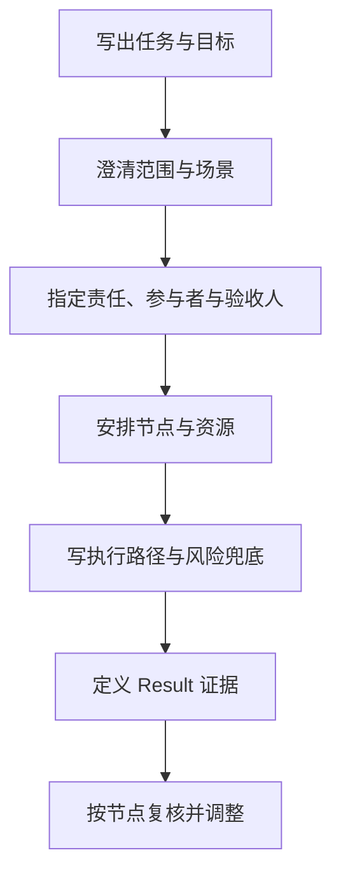

## 5W2H1R：从任务澄清到结果复盘

**5W2H1R** 在 5W2H 的基础上增加一个结果闭环。本页采用 **R = Result（结果）**，要求记录验收结果和指标。不同团队也把 R 写作 `Review（复核）` 等变体；使用其他口径时，应在团队文档开头明确含义，不要混用字段。

5W2H1R 适合把已经选定的任务说清楚、分配出去并检查完成情况。它不负责判断任务是否值得做，也不替代需求分析、优先级排序和风险评估。

### 七个澄清维度与结果

| 维度 | 要回答的问题 | 典型产出 |
| --- | --- | --- |
| **What** 做什么 | 交付什么行为、功能或结果 | 任务范围与非目标 |
| **Why** 为什么做 | 要解决什么问题，和哪个目标相关 | 问题、目标与成功理由 |
| **Who** 谁负责 | 谁负责、谁参与、谁验收、谁受影响 | 责任人与协作关系 |
| **When** 何时做 | 何时开始、完成、检查和发布 | 截止时间与里程碑 |
| **Where** 在哪里 | 哪个产品、流程、系统、地区或用户场景 | 适用范围与环境 |
| **How** 如何做 | 采用什么步骤、方案、标准和兜底 | 执行路径与验收方法 |
| **How much** 多少 | 需要多少人力、预算、数据、算力和时间 | 资源预算与约束 |
| **Result** 结果 | 完成后改变什么，如何确认，未达标怎么办 | 指标、证据、复盘与退出条件 |

### 使用步骤

1. 先写 What 和 Why。若 What 只有技术方案名称，回到用户问题或业务结果重新表述。
2. 再写 Where，限制产品版本、用户群、流程节点和数据范围，防止任务在执行中扩张。
3. 为 Who 指定唯一负责人，同时写清参与者、决策者、验收人和被影响的团队。
4. 为 When 写开始时间、关键节点、截止时间和依赖，避免只给一个无法追踪的日期。
5. 为 How 写步骤、输入、输出、质量标准、异常处理和人工接管方式。
6. 为 How much 核算人力、预算、数据、算力、调用成本和机会成本。
7. 为 Result 设定可观察指标、证据来源、检查时间和未达标时的调整或退出动作。

### AI 产品行动卡

以“验证 AI 客服路由建议”为例：

| 字段 | 示例填写 |
| --- | --- |
| What | 在客服工作台展示工单路由建议，保留人工确认 |
| Why | 降低首次分派耗时，同时控制错误分派风险 |
| Who | 产品经理负责；客服主管标注；工程师接入；运营验收 |
| When | 两周内完成 50 条种子评测集和灰度验证，第三天检查数据质量 |
| Where | 退款、物流、投诉、咨询四类工单；先在内部客服环境灰度 |
| How | 结构化输出部门、置信度和理由；低置信度转人工；记录人工修改 |
| How much | 1 名产品、1 名工程、客服主管 4 小时；调用预算每月不超过 300 元 |
| Result | 路由准确率不低于 90%，P95 延迟低于 3 秒，人工修改率和转人工率按周复核 |

Result 不是“功能上线”这一事件。上线只证明交付发生，指标和真实使用证据才用于判断任务是否达到目标。

### R 的变体

| 写法 | 关注点 | 适用时的记录方式 |
| --- | --- | --- |
| `Result` 结果 | 任务产生了什么可观察变化 | 写指标、证据来源、验收时间和未达标动作 |
| `Review` 复核 | 如何检查执行状态、偏差和后续调整 | 写复核人、复核频率、偏差和决定 |

本专题默认使用 `Result`，因为它与行动卡中的验收和业务结果直接对应。如果团队沿用 `Review`，保留 5W2H 字段并在标题或首段标出该口径即可。

### 常见误用与边界

- **只填任务，不填结果**：完成清单不能证明用户价值、质量或业务指标成立。
- **把 Who 写成部门**：部门不能代替具体负责人，验收责任也要单独指定。
- **把 How 写成口号**：AI 任务要写输入、输出、评测、失败处理、人工接管和成本护栏。
- **把 When 写成单一截止日期**：依赖、里程碑和检查点同样需要可追踪。
- **把 5W2H1R 当成立项决策**：任务卡描述如何执行，是否立项仍要回到问题、证据、价值、风险和资源。

### 相关内容

- [思维模型总览](index.md)：查看模型选择矩阵，并了解它与 MoSCoW、PRC、GROW 的组合。
- [项目管理](../../management/15-project-management/index.md)：项目生命周期、范围、责任、节点与验收的课程语境。
- [需求分析](../../pm/requirements.md)：从机会、假设和证据进入需求判断，再形成可执行产物。
- [项目管理与迭代](../../pm/project-management.md)：把行动卡放进迭代计划与验收。

## 来源说明

???+ note "来源说明"
    5W1H 是新闻与调查里的任务澄清结构；质量管理实践常补 How much。本站默认 **R = Result（结果）**，要求写指标和未达标动作；若团队把 R 写作 Review，须在文档开头声明，不要混用字段。
