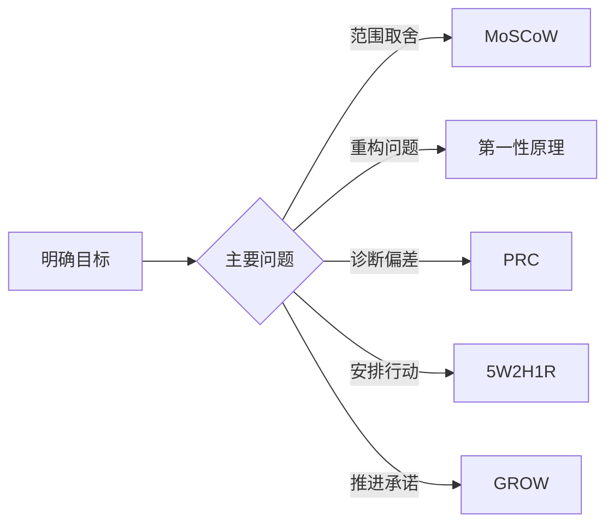

## 思维模型

思维模型把问题拆成一组可重复提问，帮助团队共享判断语言、显性化假设和记录决策。模型只规定分析结构，不提供事实，也不替代用户研究、行为数据、模型评测和业务指标。本专题挂在[产品方法论](../../pm/index.md)栏目下，和需求、战略、数据页配合使用。

### 按问题选择模型

先确定要做的判断，再选择模型。模型之间可以组合，但没有固定的使用顺序。

| 工作问题 | 推荐模型 | 最小产出 | 模型不能单独证明 |
| --- | --- | --- | --- |
| 固定时间和资源下保留哪些范围 | [MoSCoW](moscow.md) | Must、Should、Could、Won’t 分类表 | 同类需求的精确排序 |
| 现有做法是否仍然必要 | [第一性原理](first-principles.md) | 目标、约束、事实、假设和候选方案 | 用户一定会采用新方案 |
| 结果为什么偏离预期 | [PRC](prc.md) | 问题陈述、根因证据和对策验证计划 | 没有证据支撑的因果关系 |
| 把决定变成可执行任务 | [5W2H1R](5w2h1r.md) | 责任、节点、资源和结果验收卡 | 方案本身值得投入 |
| 帮助个人或团队形成行动承诺 | [GROW](grow.md) | 目标、现实、选项和行动记录 | 需求优先级或资源裁决 |

需求分析中的 RICE、WSJF、KANO 和其他方法，见[需求分析](../../pm/requirements.md)。它们与本专题模型回答的问题不同，不能只凭模型名称互相替代。

### 统一使用步骤

1. **写清目标**：说明要改变的结果、适用范围和决策时点。
2. **记录基线**：保留当前行为、数据、约束和已经发生的失败。
3. **选择模型**：说明选择它是为了分类、重构、诊断、执行还是推进。
4. **显性化假设**：为关键判断写出证据来源、置信度和可证伪方式。
5. **形成产出**：把讨论结果写成范围、方案、行动、指标和责任，而不是只保留会议结论。
6. **安排验证**：设置检查点、退出条件和复盘时间，验证结果后再调整模型或方案。

### 组合示例：AI 客服工单助手

同一个产品问题可以使用不同模型处理不同层次的判断：

- 用[第一性原理](first-principles.md)区分“提高首次分派准确率”的目标与“必须做全自动 Agent”的惯例。
- 用[PRC](prc.md)分析错误分派的问题、根因和最小对策。
- 用[MoSCoW](moscow.md)在固定发布窗口内分类人工确认、置信度展示和全自动回复等范围。
- 用[5W2H1R](5w2h1r.md)把已选方案落实为责任人、评测集、发布时间、成本上限和结果指标。
- 用[GROW](grow.md)在复盘或 `1:1` 中帮助负责人识别阻碍、比较选项并作出下一步承诺。

组合的依据是问题层次和证据需求，不是为了把所有模型都套一遍。

### 模型的使用边界

- 模型是提问顺序和记录结构，不是结论生成器。
- 评分、分类或清单不能消除目标冲突、数据偏差、技术不确定性和责任分歧。
- AI 产品还要单独记录模型能力、评测集、成本、延迟、权限、人工接管和回滚条件。
- 公开分享模型时，注明适用场景、输入、输出、来源口径和不适用情形，避免把团队约定写成普遍标准。

### 延伸阅读

- [管理决策](../../management/03-management-decision/index.md)：界定问题、分离事实与解释、比较选项并复盘。
- [项目管理](../../management/15-project-management/index.md)：项目生命周期、任务澄清、责任、节点与验收。
- [设计哲学与设计思维](../../pm/design-philosophy.md)：设计决策、心智模型与用户体验判断。
- [数据分析入门](../../pm/data-analysis.md)：指标拆解、基线、归因和验证纪律。
- [产品方法论简介](../../pm/index.md)：决策链、内容地图与分场景阅读路径。
- [AI 产品经理能力模型](../capability.md)：把思考结构转化为可观察的工作能力。
- [需求分析](../../pm/requirements.md)：RICE、WSJF、KANO、JTBD 与证据层级，不与本专题模型互相替代。

## 来源说明

???+ note "来源说明"
    各模型的出处与适用边界写在对应专页。本页只规定选择顺序、组合方式和与[需求分析](../../pm/requirements.md)排序模型的分工。

    MoSCoW 来自 DSDM / Agile Business Consortium；第一性原理取产品工作中的目标—事实—假设—约束拆分，不是物理学推导；5W2H 来自新闻与质量管理的任务澄清，本站默认 R = Result；PRC 在问题诊断语境中展开为 Problem / Root Cause / Countermeasure，不是通用标准缩写；GROW 来自 John Whitmore《Coaching for Performance》。
