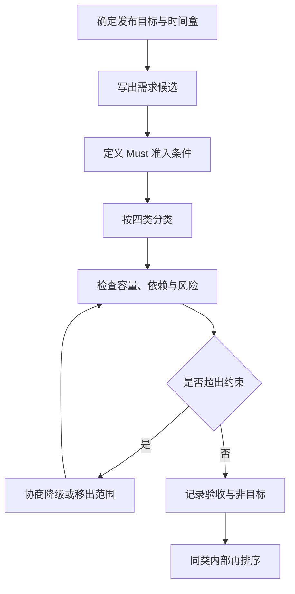

## MoSCoW：需求优先级分类

**MoSCoW** 把需求分为 Must、Should、Could、Won’t 四类，适合在发布时间或资源总量固定时协商范围。它先回答“本轮保留什么”，再把同类需求交给其他方法排序。

### 四类含义

| 类别 | 含义 | 判断问题 |
| --- | --- | --- |
| **Must** | 本轮交付不可缺少；缺少它会破坏目标、合规、安全或核心流程 | 不做是否无法验收或会造成不可接受的损失 |
| **Should** | 重要但存在可接受的临时替代方案 | 延后一轮是否仍能维持核心结果 |
| **Could** | 有价值但不影响本轮核心目标 | 本轮有剩余容量时是否值得加入 |
| **Won’t** | 本轮明确不做或不承诺 | 是否已经写清排除范围和重新评估时点 |

`Won’t` 表示“本轮不做”，不等于永久否定。每一类都要绑定本次发布目标、范围和责任人。

### 使用步骤

1. 先写发布目标、固定时间盒、可用容量和验收结果。
2. 为 Must 设准入条件，例如不做会导致核心流程失败、合规不成立或无法验证目标。
3. 对每条需求写出用户、场景、价值、依赖、成本和失败代价，再完成初次分类。
4. 检查所有 Must 是否能在容量内交付，检查 Won’t 是否有人确认并记录重新评估条件。
5. 处理跨类依赖、风险和替代方案。分类结果不能绕过技术可行性与业务责任。
6. 在 Must 或 Should 内部继续使用证据、价值、风险、时机和成本排序，并把排序依据写入需求文档。

### AI 产品案例

以 AI 客服工单助手为例：

| 候选范围 | 分类 | 分类理由 |
| --- | --- | --- |
| 路由建议加人工确认 | Must | 直接服务首次分派目标，并保留人工兜底 |
| 置信度和推荐理由 | Should | 有助于判断是否采纳，但可先用基础提示和人工记录替代 |
| 批量处理和快捷操作 | Could | 提高效率，但不影响单张工单的核心链路 |
| 对外全自动回复 | Won’t | 本轮尚未完成合规、错误责任和质量验证 |

这个结果只说明范围边界，不证明 Must 项一定是最有价值的产品机会。仍需通过评测集、用户行为和业务指标验证。

### 常见误用与边界

- **把分类当排序**：MoSCoW 不回答 Must 内部先做哪一项，也不提供分数。需要排序时补充 RICE、WSJF 或基于证据的组合判断，相关语境见[需求分析](../../pm/requirements.md)。
- **所有需求都是 Must**：全员 Must 等于没有范围决策。必须回到发布目标和不做的代价，限制 Must 的数量。
- **把 Won’t 当永久否定**：记录本轮不做的原因、负责人和复查条件，避免范围在会后悄悄回来。
- **忽略依赖和风险**：一个需求即使属于 Must，也可能因为数据、模型、接口、合规或人力未就绪而需要拆分或降级。
- **只听职位高低**：分类需要共同接受验收标准和业务结果，不能用提出者的职级替代证据。

### 相关内容

- [思维模型总览](index.md)：按问题选择模型，并查看与 PRC、5W2H1R 的组合示例。
- [需求分析](../../pm/requirements.md)：需求机会、证据、优先级、拆解与 AI 特判。
- [项目管理与迭代](../../pm/project-management.md#must--should--could)：交付迭代里的 Must / Should / Could。

## 来源说明

???+ note "来源说明"
    MoSCoW 来自 DSDM（现 Agile Business Consortium）的范围管理：Must、Should、Could、Won't。它回答本轮保留什么，不回答同类需求的精确排序；排序回[需求分析](../../pm/requirements.md)的 RICE、WSJF 或组合判断。
