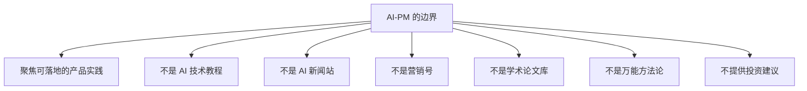

## AI-PM 不是什么

了解"AI-PM 不是什么"，有助于明确本站的定位与边界。

正向定位是可落地的产品实践，其余节点构成本站主动避开的内容边界。

-   **不是 AI 技术教程**：本站不教底层技术。技术性内容请前往其它深度学习/LLM 技术类站点。
-   **不是 AI 新闻站**：本站不追踪每日热点。我们只整理**相对稳定**的知识与方法，时效性内容请关注新闻与周报。
-   **不是营销号**：本站不吹捧任何公司或产品，不做"AI 焦虑"贩卖。内容要求可验证、有依据。
-   **不是学术论文库**：本站关注的是**可落地的产品实践**。
-   **不是"万能方法论"**：本站提供的是思考框架和已知实践，不是包治百病的答案。请带着批判性思维阅读。
-   **不提供投资建议**：涉及公司、产品、市场的分析均为知识整理，不构成任何投资建议。

???+ note "边界意识"
    如果你发现本站内容越过了上述边界，欢迎在 Issues 中提出。
