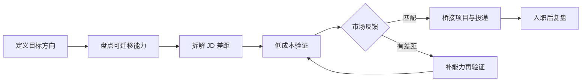

## 转行与职业转换：用低成本验证降低切换风险

转行不是把过去的经历清零，也不是学完一套课程就自动获得新岗位。有效的职业转换要回答三个问题：目标方向是否真的适合自己，现有能力能迁移多少，市场是否愿意为新的能力证据提供机会。

本文默认聚焦已经有工作经历、准备进入或转向 AI 产品相关岗位的人，也适用于在同一行业内换岗位、从传统行业转到 AI 团队，或从产品转向技术与评测方向的人。尚未入行者可先读[入行感悟](../insights/newcomers.md)，了解切入路径和第一年体验。

!!! info "时效性"
    本文信息截至 2026-08。AI 岗位定义和招聘要求变化较快，目标岗位的真实职责以近期 JD、面试反馈和实际工作内容为准。

核心关系是：先定义目标和差距，再用真实任务、作品和试投递验证匹配度，确认方向成立后才扩大投入或正式切换。

## 先区分转岗、转方向和转行业

不同类型的转换，风险和准备重点不同：

| 类型 | 变化 | 主要难点 | 典型准备 |
| --- | --- | --- | --- |
| 同岗位换行业 | 工作方法相近，业务和用户变化 | 行业知识与业务语境不足 | 补行业认知，证明能迁移方法 |
| 同行业换岗位 | 用户和业务相近，职责变化 | 新岗位硬技能和产出证据不足 | 参与桥接项目，补目标岗位作品 |
| 产品转技术或评测 | 工作对象从需求与方案转向系统、数据或模型效果 | 技术深度和工程交付门槛 | 用可运行项目或评测报告验证能力 |
| 传统行业转 AI | 行业经验保留，AI 方法和岗位语言变化 | 对模型边界、数据和评测不熟 | 结合原行业场景做 AI 项目 |
| AI 岗位之间转换 | 行业和技术背景部分重合 | 目标岗位的职责边界不同 | 对照 JD 补齐关键职责证据 |

先说清楚自己属于哪种转换，才能判断是需要补行业知识、岗位能力、技术深度，还是需要重写职业叙事。

## 定义目标方向

不要从“我不想继续现在的工作”开始，而要写一张目标岗位卡：

-   **目标岗位**：例如 AI 产品经理、评测工程师、训练师、应用工程师或 FDE
-   **目标场景**：企业软件、消费产品、知识库、Agent、模型平台或其他具体场景
-   **日常职责**：从近期 JD 中摘录真实工作，而不是只看岗位名称
-   **硬门槛**：学历、年限、技术栈、行业经验、语言或作品要求
-   **可接受代价**：薪资变化、职级回撤、城市变化、工作强度和学习周期
-   **验证标准**：什么证据会让你确认自己愿意长期做，也让招聘方愿意继续面试

目标越具体，验证成本越低。“转 AI”不是岗位目标；“转向面向企业知识库的 AI 产品经理，负责检索、评测和工作流闭环”才足以指导准备。

## 盘点可迁移能力与差距

把过去的经历翻译成目标岗位能识别的能力，不要只罗列职位名称。可以使用下面的差距矩阵：

| 目标能力 | 过去经历中的证据 | 当前缺口 | 最小验证方式 |
| --- | --- | --- | --- |
| 需求与问题定义 | 访谈、流程改造、用户反馈分析 | 缺少 AI 场景的需求判断 | 完成一次用户问题拆解和方案取舍 |
| 项目推进 | 跨团队排期、风险跟进、上线交付 | 缺少模型或评测依赖管理 | 组织一个带验收标准的桥接项目 |
| 数据与评测 | 指标分析、实验或质量复盘 | 不熟悉模型评测与失败归因 | 建立小型种子集并输出评测报告 |
| 技术理解 | 与研发协作、系统或数据经验 | 无法判断模型、检索和成本边界 | 完成一个可运行 demo 并记录限制 |
| 业务与行业 | 原行业用户、流程和合规知识 | 目标行业语境不足 | 访谈从业者，拆解 3 份近期 JD |
| 表达与协作 | 汇报、培训、客户沟通、冲突处理 | 缺少目标岗位语言 | 用目标岗位格式重写 2 个项目案例 |

将每个缺口分为三类：必须在投递前补齐、可以入职后学习、当前岗位不要求。不要为了追求“全都懂”而无限延长准备期。

## 选择桥接岗位和切入点

转行不一定要一步跳到最终岗位。结合自身优势选择一个能积累目标证据的切入点：

| 切入方向 | 适合的已有基础 | 需要补的核心能力 | 风险提示 |
| --- | --- | --- | --- |
| AI 产品经理 | 产品、运营、项目、行业或客户经验 | 模型能力边界、评测、数据闭环、AI 产品设计 | 岗位名称差异大，必须按职责判断 |
| 数据、评测与训练 | 数据分析、质量管理、语言、内容或领域知识 | 评测设计、错误归因、标注规范和一致性 | 关注岗位的成长路径和工作稳定性 |
| 大模型应用工程师 | 后端、前端、全栈或自动化经验 | API、检索、Agent、部署和工程质量 | 纯零基础转入工程岗的门槛较高 |
| FDE 或解决方案岗位 | 客户交付、实施、售前或技术支持经验 | 场景建模、部署边界、需求回流和技术沟通 | 出差与客户现场工作比例要问清 |
| 原行业 AI 岗位 | 深厚行业知识和用户资源 | AI 通识、数据和评测方法 | 业务经验要能转成可验收的产品结果 |

桥接岗位的价值不是“先随便进去”，而是能在合理时间内积累下一阶段真正需要的证据。选择前先问清工作内容、评价指标、团队支持和后续转向空间。

## 用 90 天完成低成本验证

### 第 1–2 周：验证目标是否真实

-   访谈 3–5 位目标岗位从业者，询问日常工作、最难问题和评价方式
-   阅读 10–15 份近期 JD，记录重复出现的职责、硬门槛和工具要求
-   观察目标团队的产品、文档或公开案例，确认自己是否对真实工作感兴趣
-   写一页目标岗位卡，列出接受和不能接受的代价

这一阶段的结果不是“学了多少”，而是知道目标岗位究竟在解决什么问题。

### 第 3–6 周：完成一个桥接项目

选择一个范围可控、能展示判断的项目，至少包含：

1.  **问题与用户**：谁遇到什么问题，当前如何解决
2.  **方案与边界**：为什么使用 AI，哪些情况明确不交给模型
3.  **实现或流程**：完成 demo、评测流程、运营方案或交付方案
4.  **验收标准**：定义质量、成本、延迟、风险或人工效率指标
5.  **失败分析**：展示失败样本、限制条件和后续改进计划

项目不必追求复杂。一个范围清楚、能复现、能解释取舍的小项目，比堆叠多个教程截图更有说服力。

### 第 7–10 周：获取真实市场反馈

-   用目标岗位的简历版本试投递少量职位
-   请从业者或面试官评价作品和项目叙事，不只问“感觉怎么样”
-   记录简历筛选、笔试和面试每一关暴露的具体缺口
-   按反馈更新差距矩阵，决定补能力、换切入点还是停止验证

如果连续反馈都指向同一个硬门槛，应调整计划，而不是用更多泛学习掩盖问题。

### 第 11–13 周：决定是否正式切换

在正式辞职或接受 offer 前复盘：

-   目标岗位的真实工作是否符合预期？
-   自己是否完成了至少一项可被外部验证的桥接成果？
-   哪些缺口入职后可以补，哪些缺口会直接导致无法胜任？
-   是否有足够现金流和时间应对空窗、试用期或职级回撤？
-   如果验证失败，能否回到当前岗位或其他相邻方向？

## 把桥接项目变成求职证据

作品集要呈现“旧能力如何迁移到新岗位”，而不是掩盖过去。每个项目按以下顺序整理：

-   **原有优势**：你从过去经历带来了什么方法、行业知识或协作资源
-   **新能力补齐**：为了目标岗位补了什么，如何证明不是只看过教程
-   **真实结果**：项目由谁使用或评估，结果和限制是什么
-   **个人贡献**：哪些判断、实现、协调和复盘由你直接完成
-   **下一步**：如果继续投入，还会验证什么问题

简历中的项目名称、职责动词和指标口径应接近目标 JD，但不要把参与过的事情改写成独立负责，也不要把练习项目写成生产项目。更多简历结构见[简历与作品集](../resume-portfolio.md)。

## 组织转行叙事

面试官通常关心的不是“为什么讨厌原行业”，而是你为什么选择目标方向、过去的经验如何迁移、你已经做了什么验证。可以按四段表达：

1.  **过去**：用一个具体项目说明原岗位积累的能力
2.  **触发**：说明你在什么问题上发现目标方向与原经验有连接
3.  **验证**：展示 JD 研究、桥接项目、评测结果和面试反馈
4.  **目标**：说明希望在新岗位承担什么职责，以及仍在补什么能力

不要贬低原岗位、把转行说成逃离，也不要声称“我什么都能做”。承认差距并给出补齐计划，通常比夸大匹配度更可信。

## 在职转行与风险管理

### 优先在职验证

在当前工作中寻找与目标方向重合的任务：参与 AI 项目、负责数据或评测、协助自动化、做内部工具、跟随客户交付。先获得真实反馈，再决定是否离职。

如果存在保密、竞业或知识产权约束，作品必须使用公开数据或自建数据，不能带走公司代码、客户信息、内部文档和模型输出。相关劳动风险见[裁员与劳动权益](../layoff-and-labor.md)。

### 计算切换成本

至少估算以下项目：

-   现金流可以覆盖多少个月的生活和求职成本
-   是否接受职级、薪资或城市回撤，回撤的上限是多少
-   试用期不通过时的备用方案是什么
-   家庭、签证、社保、住房或其他约束是否影响切换时间
-   何时停止继续投入，重新评估目标方向

把“我想转行”变成一组可承受的条件，才能避免在压力最大时接受不合适的 offer。

## 转行后的前 90 天

进入新岗位后，转换并没有结束。前 90 天优先完成三件事：

1.  **确认职责与评价**：与管理者对齐目标、边界、协作对象、试用期标准和反馈节点
2.  **交付短周期成果**：选择一个能在 30–60 天内完成的任务，建立可信度并暴露真实缺口
3.  **建立反馈机制**：记录业务、技术和用户反馈，把不熟悉的领域问题转成具体学习任务

不要用持续加班掩盖职责不清，也不要因为短期不熟悉就否定整个方向。用可验证的交付和定期复盘判断是否需要调整。

## 常见误区

-   **把课程完成当成转行完成**：学习输入没有转成作品、项目结果和外部反馈
-   **只看岗位名称不看职责**：同一个 AI title 可能对应产品、运营、交付或研发工作
-   **一次投递失败就否定方向**：不区分简历筛选、硬门槛、作品和面试表达的具体问题
-   **为了转行切断所有退路**：没有验证、现金流和备用方案就裸辞
-   **过度包装过去经历**：把协作写成主导，把练习写成生产，入职后反而更难建立信任

## 行动清单

1.  **本周**：写目标岗位卡，拆解 10 份近期 JD，列出硬门槛和可迁移能力
2.  **本月**：完成差距矩阵，访谈目标岗位从业者，确定一个最小桥接项目
3.  **90 天内**：完成项目、评测或交付案例，拿到至少一轮真实市场反馈
4.  **切换前**：准备目标岗位简历、作品和转行叙事，计算现金流、职级回撤和备用方案
5.  **入职后**：在前 90 天对齐目标和反馈节点，用短周期成果验证选择

## 相关阅读

-   [入职之后](index.md)：绩效、晋升、转行与劳动权益的栏目导航
-   [入行感悟](../insights/newcomers.md)：三类切入路径与 AI 产品经理第一年体验
-   [职业发展感悟](../insights/career.md)：跳槽、平台选择与职业瓶颈的经验视角
-   [产品经理协作团队与岗位](../positions/index.md)：目标岗位职责与协作边界
-   [简历与作品集](../resume-portfolio.md)：把项目经历整理成可追问的材料
-   [自学路线](../../intro/self-study-roadmap.md)：从通用产品技能到 AI 深耕的学习路径
-   [AI 产品经理能力模型](../../intro/capability.md)：识别当前能力与目标岗位差距

## 来源说明

-   本文是面向 AI 产品从业者的原创方法整理，不承诺统一的转行路径或结果。
-   目标岗位的职责、门槛和招聘节奏应以近期官方招聘页面、实际 JD、面试反馈和入职后的工作内容为准。
-   作品集与项目证据框架参考站内[简历与作品集](../resume-portfolio.md)、[入行感悟](../insights/newcomers.md)和[AI 产品经理能力模型](../../intro/capability.md)。
