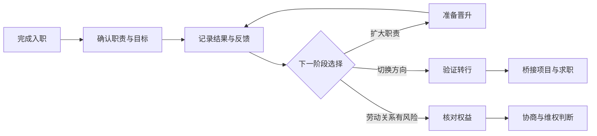

## 入职之后

求职结束并不代表职业选择结束。入职后要同时处理三类问题：把工作结果交付出来，理解组织如何评价和发展员工，以及在方向变化或劳动关系出现风险时保护自己的选择权。

本栏目提供面向 AI 产品从业者的结构化方法。绩效、晋升和转行部分讨论可执行的工作与决策方法；裁员与劳动权益部分讨论常见风险和信息核对，不替代公司制度、当地法规或专业意见。

核心关系是：先把职责和评价规则弄清楚，再用持续证据支持发展选择，遇到方向变化或劳动风险时保留可行动的退路。

!!! info "时效性"
    本栏目内容截至 2026-08。公司职级、绩效和晋升制度变化较快，劳动权益以现行法律法规和当地实务口径为准。

## 内容列表

-   [绩效管理与考核](../positions/performance-management.md)：从目标设定、过程辅导、证据沉淀到评审反馈，理解组织如何评价工作结果
-   [晋升与职业发展](promotion.md)：确认职级标准，建立成果证据账本，准备晋升沟通与评审
-   [转行与职业转换](career-transition.md)：盘点可迁移能力，用低成本验证和桥接项目降低切换风险
-   [裁员与劳动权益](../layoff-and-labor.md)：识别裁员、PIP、竞业和解除风险，核对补偿与劳动保障

## 推荐阅读顺序

1.  **刚入职或职责变化**：先读[绩效管理与考核](../positions/performance-management.md)，确认目标、评估人、证据和反馈机制
2.  **准备扩大职责**：读[晋升与职业发展](promotion.md)，把日常产出整理成与目标职级匹配的证据
3.  **考虑换岗位或换行业**：读[转行与职业转换](career-transition.md)，先验证方向，再决定是否切换
4.  **遇到低绩效、PIP 或解除信号**：读[裁员与劳动权益](../layoff-and-labor.md)，保存文件并核对适用规则

## 与真实感悟栏目的区别

[真实感悟](../insights/index.md)记录匿名从业者对入行、发展、踩坑和心态的经验整理，适合了解不同选择背后的处境。本栏目更关注规则、证据、步骤和检查清单；两类内容结合阅读，不把任何一篇文章当成统一答案。

## 相关阅读

-   [求职专题首页](../index.md)：从公司、岗位、材料、面试到入职后的完整导航
-   [真实感悟](../insights/index.md)：入行与职业发展的经验视角
-   [AI 产品经理能力模型](../../intro/capability.md)：对照能力层级识别发展差距

## 来源说明

-   本栏目为 AI 产品从业者常见工作场景与决策框架的原创整理，具体制度以所在公司的书面规则为准。
-   晋升与绩效内容参考站内[能力模型](../../intro/capability.md)、[绩效管理与考核](../positions/performance-management.md)和[高管岗位与公司管理黑话](../positions/cxo-roles.md)。
-   劳动权益内容以[裁员与劳动权益](../layoff-and-labor.md)中的法规提示为准，不构成法律意见。
