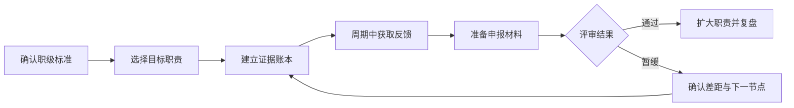

## 晋升与职业发展：把工作成果变成可评审的证据

晋升不是把工作做得更多，也不是等组织在年末发现你的努力。它通常意味着你已经稳定承担了更大范围、更高复杂度或更强影响力的职责，并能用证据说明结果、判断和方法可以复用。

不同公司的职级名称、评审周期和晋升门槛差异很大。本页提供一套通用的准备框架，帮助你把组织规则翻译成目标、证据和沟通动作。具体制度以所在公司的职级文档、绩效制度和直属管理者确认的口径为准。

!!! info "时效性"
    本文信息截至 2026-08。AI 产品岗位和职级体系仍在变化，涉及具体公司制度的内容请以最新内部规则为准。

核心关系是：先确认目标职级要求，再持续积累可验证证据，用周期中的反馈修正差距，最后把材料和答辩建立在平时的工作记录上。

## 晋升到底评估什么

晋升评估的重点不是单个项目是否成功，而是你是否已经表现出目标职级需要的稳定能力。常见维度如下：

| 维度 | 评估的问题 | 可准备的证据 |
| --- | --- | --- |
| 结果与影响 | 你解决了什么问题，给业务、用户或团队带来什么变化 | 目标指标、上线数据、成本变化、用户反馈、验收记录 |
| 问题复杂度 | 你处理的问题是否包含不确定性、跨团队依赖或高风险决策 | 方案取舍、风险记录、关键决策和复盘 |
| 职责范围 | 你是否从完成分配任务转向主动定义问题和推动闭环 | 目标设定、项目边界、优先级判断、端到端交付 |
| 协作与影响力 | 你是否让其他团队更有效地完成工作 | 协作反馈、机制建设、跨团队推动、冲突解决事实 |
| 能力与复用 | 你是否沉淀出可复用的方法，而不是只完成一次性工作 | SOP、模板、评测集、培训材料、方法论文档 |
| 组织贡献 | 你是否改善了团队的长期效率、质量或风险水平 | 流程改进、知识沉淀、人才培养、风险预防结果 |

工作量、加班时长和会议数量只能说明活动发生过，不能单独证明晋升所需的结果和职责变化。

## 先确认所在公司的晋升规则

把下面的问题问清楚，再决定如何准备：

-   **职级结构**：岗位采用专业序列、管理序列还是双轨制？目标职级负责什么范围？
-   **评审周期**：晋升按季度、半年还是年度进行？申报和评审分别在什么时候截止？
-   **资格条件**：是否有任职时长、绩效等级、岗位空缺或业务预算等前置条件？
-   **评估角色**：直属管理者、跨团队评审人、校准委员会和最终决策人的职责分别是什么？
-   **证据口径**：重点看业务结果、能力模型、行为准则还是综合评价？个人与团队成果如何区分？
-   **结果影响**：晋升是否和调薪、奖金、职务任命或职责调整同时发生？
-   **异议渠道**：评审未通过时能否查看反馈，谁负责解释差距，下一次检查节点是什么？

绩效和晋升通常有关联，但不是同一件事。绩效回答“本周期约定的工作做得怎样”，晋升回答“是否已经稳定承担目标职级的职责”。先读[绩效管理与考核](../positions/performance-management.md)，再把绩效证据转换为职级证据。

## 拆解目标职级的职责

不要只记住职级名称或一句“影响力更大”。把目标职级改写成可观察的行为：

1.  **列出职责变化**：从执行任务到定义问题，从单项目交付到组合目标，从个人产出到推动他人完成结果，分别发生了什么变化？
2.  **标记复杂度变化**：目标职级需要处理哪些不确定性、资源约束、跨团队依赖和风险？
3.  **寻找同级样本**：观察团队中已经处于目标职级的人承担什么问题，不把单个样本当成统一标准。
4.  **形成差距清单**：每项要求标记为“已有稳定证据”“偶尔做到”或“尚未验证”，再为每个差距安排工作场景。

目标职级不是把所有事情都做一遍。优先选择能同时验证结果、复杂度和影响范围的项目，避免用零散任务堆出一份无法评审的清单。

## 建立成果证据账本

建议每周或每两周更新一次，不要等到申报前凭记忆补写。每条记录至少包含以下字段：

| 字段 | 写法 | 检查问题 |
| --- | --- | --- |
| 背景与目标 | 说明用户、业务、约束和目标值 | 为什么要做，成功标准是什么？ |
| 个人职责 | 写清你直接负责的部分和协作边界 | 哪些判断和结果可以归因于你？ |
| 关键行动 | 记录方案、取舍、协调和风险处理 | 你做了什么关键决定？为什么这样做？ |
| 结果证据 | 记录基线、变化、质量和成本 | 结果由谁验收，数据从哪里来？ |
| 影响范围 | 说明是否复用到其他团队、产品或流程 | 谁因为你的工作改变了做法？ |
| 复盘与下一步 | 写出不足、可复用方法和下一阶段问题 | 这次经验如何支持更大职责？ |

AI 产品项目还应记录模型版本、评测口径、失败样本、人工兜底和成本变化。只写“上线了 AI 功能”不足以说明产品判断和长期价值。

### 一条合格证据的例子

“负责优化问答产品”不是完整证据。更好的记录会说明：原有种子集的关键问题通过率、你如何定位检索和提示词的主要瓶颈、采取了哪些方案、上线后核心指标和人工转接率如何变化，以及哪些评测和兜底机制被沉淀为团队标准。

数字不完整时，不要补造精确结果。可以写清验证范围、已确认的变化和仍待补齐的数据，并注明结果的限制条件。

## 晋升周期中的行动

### 周期开始：对齐目标和证据

与直属管理者确认本周期最重要的职责变化，至少谈清：

-   本周期要验证的目标职级能力是什么
-   哪些项目可以提供证据，个人负责边界如何定义
-   结果、质量、协作和风险分别如何衡量
-   中途在哪些时间点检查进展，谁会提供反馈

把口头约定整理成邮件、文档或任务记录。目标变化时同步更新范围和验收标准，避免周期结束后按新的标准追溯评价。

### 周期中：主动获取反馈

不要只在正式评审前问“我能不能晋升”。可以围绕具体证据提问：

-   这个结果是否足以证明目标职责？还缺哪一类证据？
-   我的判断和推动方式与目标职级的差距是什么？
-   下一个项目中，我应该主动承担哪段范围？
-   当前优先级或资源变化是否影响原来的晋升目标？

反馈要落到行为、结果和下一次检查日期。对于“影响力不够”“还不够成熟”等抽象评价，继续追问可观察的例子和改进标准。

### 周期结束：整理一页晋升摘要

晋升材料可以先压缩成一页，再按评审要求扩展。建议包含：

1.  **目标职责**：目标职级要求什么，你本周期要验证什么
2.  **代表成果**：选择 2–4 个最能证明职责变化的案例
3.  **证据链**：每个案例说明背景、个人判断、结果、质量和影响范围
4.  **能力变化**：说明从“做到”到“稳定做到”的变化
5.  **下一阶段**：通过后准备承担的更大问题，以及现有风险

不要把所有任务平铺在材料里。评审人的注意力有限，代表案例应覆盖目标职级的关键要求，而不是只挑数字最大的一项。

## 晋升沟通与答辩

答辩或评审沟通时，用“问题—判断—行动—结果—复盘—下一步”组织表达：

-   **问题**：目标用户和业务约束是什么？
-   **判断**：你如何选择方向，放弃了什么方案？
-   **行动**：你如何推动协作、处理依赖和控制风险？
-   **结果**：指标、质量、成本和用户反馈发生了什么变化？
-   **复盘**：哪里没有达到预期，哪些方法可以复用？
-   **下一步**：目标职级的更大范围由你如何承担？

区分团队成果与个人贡献。可以说“团队完成了上线，我负责定义评测口径并推动人工兜底”，不要把团队成果全部归于自己，也不要因为协作而抹去自己的关键判断。

晋升沟通不是只谈过去的奖励，也要谈未来的职责。具体公司是否在晋升通过后立即调整薪酬或 title，应以书面制度和正式通知为准。

## 晋升暂缓时怎么处理

评审未通过不等于反馈无效，也不等于必须立即离职。先区分原因：

-   **证据不足**：结果已完成，但影响范围、复杂度或个人贡献没有被记录清楚
-   **能力差距**：目标职级要求的判断、协作或复用能力还没有稳定表现
-   **组织约束**：评审名额、岗位预算、组织调整或业务优先级影响了时机
-   **预期不一致**：你和管理者对目标职级、时间表或成功标准理解不同

离开沟通前，确认三件事：未通过的具体依据、下一周期要补的证据、下次检查日期和负责人。若连续多个周期没有明确标准或反馈，也应把组织机制本身纳入职业选择，而不是无限期增加投入。

## 常见误区

-   **只写忙碌，不写结果**：用任务数量和加班时长替代业务影响与职责变化
-   **只堆数字，不讲判断**：不说明基线、约束、个人贡献和质量风险，数字无法支撑晋升
-   **等组织主动发现**：平时不留痕，评审前才集中整理，导致关键证据缺失
-   **把晋升当成唯一成长指标**：忽略能力深度、项目完整性、专业影响力和可迁移资产
-   **把一次暂缓当作最终结论**：不区分证据、能力和组织约束，直接做情绪化决定

## 行动清单

1.  **本周**：找到职级标准、绩效制度和最近一次评审说明，标出不清楚的规则
2.  **本月**：建立成果证据账本，为当前项目记录目标、职责、结果、质量和个人贡献
3.  **下个检查点**：和直属管理者确认目标职级、差距、代表项目和反馈日期
4.  **评审前**：整理一页晋升摘要，提前演练团队成果与个人贡献的区分
5.  **评审后**：把结果和反馈写入下一周期计划，必要时同步评估内部转岗或外部机会

## 相关阅读

-   [入职之后](index.md)：绩效、晋升、转行与劳动权益的栏目导航
-   [绩效管理与考核](../positions/performance-management.md)：目标、证据、评审和 PIP 的管理框架
-   [高管岗位与公司管理黑话](../positions/cxo-roles.md)：职级序列、双轨制、汇报链与晋升答辩
-   [AI 产品经理能力模型](../../intro/capability.md)：区分能力层级与职级要求
-   [职业发展感悟](../insights/career.md)：晋升、跳槽与职业瓶颈的经验视角

## 来源说明

-   本文是面向 AI 产品从业者的原创方法整理，不代表任何公司的晋升制度或评审标准。
-   职级、绩效和晋升规则具有公司特异性，应以所在公司的书面制度、直属管理者确认和正式评审通知为准。
-   证据记录框架参考站内[绩效管理与考核](../positions/performance-management.md)和[AI 产品经理能力模型](../../intro/capability.md)；经验视角见[职业发展感悟](../insights/career.md)。
