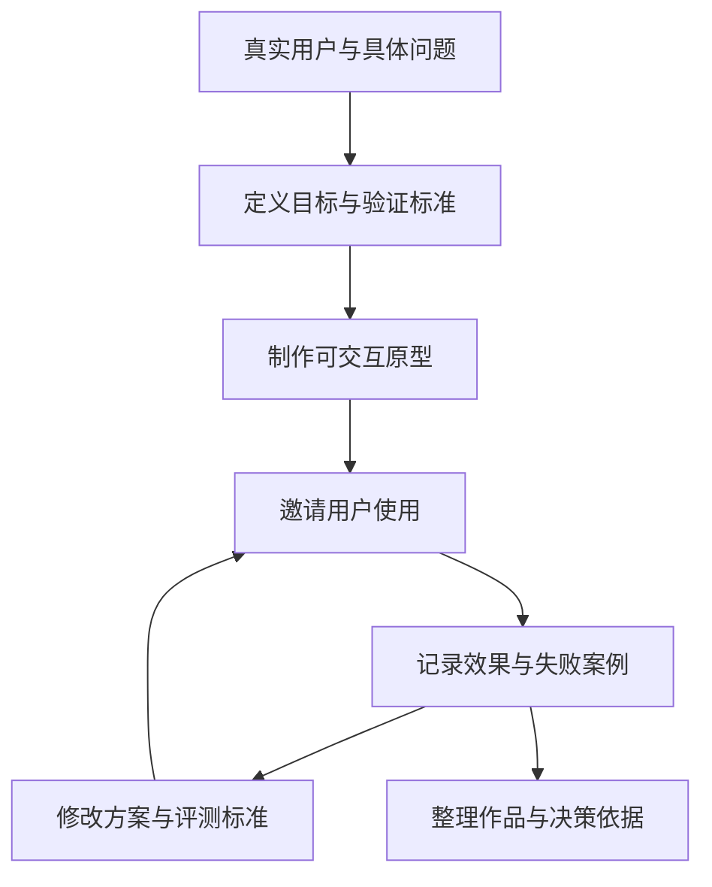

## 字节跳动 2027 校招空宣：AI 产品岗位与求职准备

2026 年 9 月 22 日，字节跳动举办 2027 校园招聘产研专场空中宣讲会。AI 产品专场由两位业务负责人和三位校招生分享，讨论产品经理的工作变化、团队选择、人才标准，以及从个人项目到简历和面试的准备方法。

!!! info "资料范围与时效"
    本文依据用户提供的观看笔记与机器转写稿整理，重点覆盖 AI 产品专场，并补充研发专场的求职经验。

    研发专场的录像缺少前半部分；机器转写未经人工逐句校对，本文采用转述，业务负责人按团队职责标识。

    招聘信息记录宣讲当日口径，岗位要求、投递次数与内推码有效性以官方页面为准。整理日期：2026-10-05。

### 宣讲时间索引

本文时间戳均对应主录像文件内的播放位置。主录像时长为 `03:01:39`，从录制当日 `19:27:04` 开始。

| 播放位置 | 内容 |
| --- | --- |
| `00:00:00`—`00:46:21` | 研发专场已录制部分：业务问答、校招生分享、简历与面试建议 |
| `00:50:45`—`00:55:14` | AI 产品专场开场与招聘信息 |
| `00:55:14`—`01:38:15` | AI 产品岗位变化、业务案例与团队选择 |
| `01:38:15`—`02:22:01` | 面试官人才标准、简历判断与求职答疑 |
| `02:22:01`—`02:56:00` | 三位校招生的项目、简历、作品集与面试经验 |
| `02:56:00`—`02:59:18` | 收尾与后续宣讲预告 |

## AI 产品经理的工作变化

抖音电商业务负责人将产品经理的核心职责概括为：理解用户和客户的问题，做出价值判断，并对最终结果负责。AI 降低了资料整理、初稿撰写、原型制作和基础分析的成本，也提高了对问题定义、质量判断和结果验证的要求。[^work]

### 围绕任务、评测和人机分工设计产品

AI 产品面对概率系统，同样的输入可能产生不同输出。产品经理需要同时定义任务目标、上下文、可用工具、操作权限和成功标准。

| 工作维度 | 具体要求 |
| --- | --- |
| 任务定义 | 明确用户要完成什么、模型需要哪些信息、哪些操作超出权限 |
| 方案验证 | 制作可交互原型，用真实案例、数据和实验验证方案，持续收集反馈 |
| 人机分工 | 确定自动执行、人工确认与人工接管的范围，设计错误处理和撤销操作 |
| 团队协作 | 产品、算法与工程共同讨论目标、能力边界和评测标准 |
| 结果责任 | 判断方案是否改善用户体验或业务结果，解释效果、成本与可靠性的取舍 |

企业数字员工团队负责人进一步提出，产品经理的工作范围正在扩大：分析客户反馈、制作 Demo、验证技术方案、搭建 Agent 工作流，都进入了产品探索过程。设计数字员工时，还需要理解岗位技能、知识来源、权限、人类协作方式与价值衡量标准。[^work]

### 商家经营 Agent：每个建议都关联经营结果

抖音电商团队分享的商家 Agent 场景覆盖营销计划、账户问答、经营分析、异常诊断和执行操作。产品目标是降低商家的经营负担并改善经营结果。[^cases]

-   **制定策略**：结合商家账户与业务情况，提供投放和营销建议。
-   **解释数据**：回答账户相关问题，分析资金使用与经营表现。
-   **诊断异常**：识别数据变化，说明原因与后续行动。
-   **执行操作**：商家确认方案后，协助完成创意制作或账户调整。
-   **持续监测**：跟踪账户状态，及时提醒异常。

这类产品的质量标准包括四个方面：**稳定、专业、可信、有效**。建议应符合行业规律与客户事实，重要操作需要让客户理解、确认和撤销，最终效果通过经营结果检验。工具、数据、知识、策略、评测和权限共同支撑这些要求。[^cases]

### 企业数字员工：把岗位职责转成任务系统

企业数字员工团队分享了内容审核场景。数字员工需要学习审核规则、配置工具与权限，再领取任务、识别风险、给出判断及依据。规则明确且置信度高的任务自动完成，规则边界不清晰或风险较高的任务交给人工处理。[^cases]

产品经理需要定义整个工作过程：数字员工如何获得任务，依据什么判断，何时交给人类，以及如何记录和衡量工作质量。

## 选择 AI 产品团队

抖音电商业务负责人按照技术与业务对象，将 AI 团队分为三个方向。候选人需要结合自己的兴趣、已有能力与希望积累的经验选择。[^teams]

| 方向 | 工作对象 | 主要挑战 | 适合积累的能力 |
| --- | --- | --- | --- |
| 模型与基础设施 | 模型能力、平台与基础技术 | 技术深度与长期探索 | 技术理解、能力评估、基础平台设计 |
| 通用 AI 原生产品 | 广泛用户与新使用场景 | 在分散需求中识别高价值场景，形成持续使用习惯 | 用户洞察、体验设计、场景探索 |
| 行业与业务流程重构 | 特定行业、客户与经营流程 | 理解行业规则、客户利益与错误成本 | 行业判断、业务分析、结果验证 |

业务流程中的 AI 产品尤其依赖行业理解。候选人需要解释一个策略对哪些客户有效、为什么有效、执行错误的代价是什么。持续接触客户与结果反馈，有助于形成这类判断。[^teams]

### 面试中确认团队的实际工作

两位负责人建议关注真实用户、结果反馈、团队投入和个人职责。业务方向之外，还需要了解进入团队后每天具体做什么。[^teams]

1.  **用户与场景**：团队服务哪些用户，正在解决什么问题？
2.  **效果反馈**：产品如何获得使用数据与业务结果，迭代周期如何？
3.  **团队投入**：算法、工程、产品分别如何参与，当前探索进展如何？
4.  **个人职责**：入职后负责哪个场景，是否参与从问题定义到结果验证的全过程？
5.  **日常安排**：团队产品经理一周主要花时间处理哪些任务？

企业数字员工团队负责人还讨论了 AI 原生探索与已有业务重构的工作差异。前者需要持续寻找产品形态和用户需求，后者有明确流程与业务反馈，需要深入理解复杂流程。两类工作都应结合候选人的兴趣和能力判断。[^teams]

### 负责人介绍的团队环境

抖音电商负责人强调复杂业务场景与快速结果反馈：商家、达人、平台和服务商参与同一经营过程，AI 建议对交易与经营的影响会进入后续验证。

企业数字员工团队负责人强调模型、开发平台与应用之间的协作，以及持续探索新产品形态的投入。两位负责人都提到新人承担完整任务的机会。求职时，可以通过具体项目、团队配置和职责范围了解这些工作条件。[^environment]

## 面试官关注的能力与经历

面试官反复提到好奇心、学习能力、结构化思考、用户同理心、Owner 意识与面对失败的韧性。他们通过具体经历和连续追问了解这些能力。[^interviewer]

### 五项 AI 产品基本功

| 能力 | 面试中需要说明的内容 |
| --- | --- |
| 概率系统设计 | 人与 AI 如何分工；哪些操作需要确认；权限、错误处理与人工接管如何设计 |
| 评测 | 场景中什么结果算好；评测基线是什么；如何收集 bad case 并更新标准 |
| 技术理解 | 模型擅长与不擅长什么；方案的成本、延迟与可靠性如何影响产品设计 |
| 执行与验证 | 如何完成项目、获取真实使用反馈、验证效果并持续改进 |
| 业务理解与审美 | 客户在意什么；行业流程如何运行；内容或体验的质量标准是什么 |

对内容生成产品，审美与内容判断直接影响产品质量；对经营类产品，客户理解与业务流程分析进入策略设计。专业背景中的知识，需要通过具体项目说明其作用。[^interviewer]

### 有实习经历：解释判断、贡献与结果

抖音电商负责人介绍，他会沿着三类问题追问实习项目。[^experience]

-   **问题与判断**：当时面对什么问题，如何定义问题，为什么选择这个方案？
-   **行动与贡献**：具体完成了哪些工作，如何推动协作，困难如何解决？
-   **结果与反思**：最后效果如何，哪些因素来自个人决策，哪些来自外部环境？

项目规模与成功结果之外，失败经历也提供判断依据。候选人需要说明当时的决策、未考虑的变量、后来修改的判断，以及换一个环境后方案是否仍然成立。[^experience]

### 没有实习经历：用完整项目展示能力

该负责人表示，他会通过个人项目了解候选人的观察、研究深度和动手过程。问题可以来自兴趣、学习或日常生活，重点是明确用户、完成方案并持续获取反馈。[^experience]

他分享过一个拼豆项目：候选人观察到颜色选择在屏幕与线下体验中的差异，查找论文和解决方法，制作产品供同好使用，继续收集反馈，并思考商业化。这段经历展示了行业理解、问题研究、执行与迭代。

企业数字员工团队负责人关注的追问还包括：近期主动研究了什么、为什么研究、如何学习、是否应用，以及最近一次失败后改变了什么判断。面对不同观点，候选人需要解释依据，并根据新信息调整方案。[^experience]

## 三位校招生的项目与入行经验

三位分享者来自计算机、马克思主义理论与新闻传播学背景，分别进入抖音电商、支付业务与即梦产品团队。他们的经历提供了不同的准备路径。[^graduates]

| 分享者 | 背景与方向 | 分享的入行路径 |
| --- | --- | --- |
| Pisa | 东南大学网络空间安全；抖音电商内容生态，参与带货达人 Agent | 4 月进入实习，8 月完成转正 |
| 小鱼 | 武汉大学马克思主义理论；支付业务 | 3 月投递用户产品岗位，实习期间随团队开展 AI 产品探索 |
| 小瓜 | 清华大学新闻传播学；即梦 Web 端画布工具与 Agent | 8 月参加 AI 产品早鸟通道面试，获得校招 Offer |

### 求职教练：从个人需求设计多 Agent 协作

Pisa 分享了个人求职教练系统，将资料整理、简历分析与模拟面试交给不同 Agent，让个人信息在任务之间流转。他还尝试通过 AI 编程处理旅游资料整理和租房信息比较。[^projects]

这类作品可以围绕任务分工与信息流转讲述：各个 Agent 接收什么信息、产出什么结果，协作过程如何改善个人求职体验。

### AI 桌宠与内容生产平台：结合已有兴趣准备作品

小瓜分享过 AI 桌宠、飞书聊天 Bot，以及通过工作流编排搭建内容生产平台的经历。内容生产平台将分散的 AI 内容制作环节放到同一流程中，从想法推进到影视片段生成。[^projects]

她在求职时明确选择 AIGC 内容产品，结合自己的内容经验、产品使用体验和个人作品准备材料。面试前研究目标产品、行业与竞品，提出改进想法，并通过个人网页展示作品。[^preparation]

### 外卖攒钱产品：从消费行为形成可验证的方案

小鱼介绍了一款模拟点外卖、将对应资金存入个人攒钱账户的产品。项目关注用户想点外卖的心理体验和储蓄行为，用正向反馈帮助用户管理消费。[^projects]

她在 AI 协助下一天制作出可交互原型，获得团队认可后，一周内推进到上线。她的分享重点是产品经理参与产品、设计、部分前端与运营的全过程，通过原型和真实反馈推动资源投入。

这段经历适合围绕需求观察、行为设计、原型验证、团队沟通与上线反馈组织项目材料。具体效果需要使用自己的实际数据说明。

## 准备个人项目与作品集

业务负责人和校招生共同强调真实问题、动手过程与反馈。个人项目需要明确用户、使用场景、方案取舍和验证方法。[^practice]

作品材料应保留问题、方案、使用反馈与迭代之间的联系，让面试官追问每项决策的依据。

### 项目准备的具体要求

-   **问题来源**：选择自己熟悉且有实际需求的场景，说明用户现有做法与困难。
-   **功能取舍**：记录为什么选择这些功能，开发期间修改了什么，修改依据是什么。
-   **技术选择**：解释模型、工具和工作流的选择，说明效果、成本与可靠性的权衡。
-   **真实使用**：负责人建议邀请五六位真实用户试用，记录使用前后变化和失败案例。
-   **持续反馈**：解释用户反馈的原因，判断哪些问题需要继续处理，如何验证改进效果。

这些内容可以结合[评估与评测](../ai/evaluation.md)中的方法组织。项目中的数字来自实际记录，结果范围与样本情况需要讲清楚。

### 作品集的展示方式

小瓜建议优先展示近期、成熟、可以直接交互的产品。尚未上线的作品提供完整录屏，展示任务过程和结果。个人网页的布局、交互与内容选择，也体现产品判断和审美。[^resume]

小鱼提出，作品需要解决自己理解的真实问题，展示功能取舍，并有用户反馈。运营实习、学生组织等经历也可以提供项目素材：明确哪些环节使用 AI、使用方式是什么、前后效果有什么变化。[^resume]

## 简历与面试准备

### 简历围绕目标岗位组织经历

Pisa 建议按 STAR 组织经历：背景、任务、行动与结果。小瓜强调根据岗位选择相关经历和作品。小鱼强调项目的业务目标、问题原因和方案判断，让简洁表达包含充分的有效信息。[^resume]

一段项目经历需要让面试官理解：

1.  **背景与目标**：服务谁，用户或团队面临什么问题，为什么值得处理？
2.  **个人职责**：自己负责什么，与团队其他成员如何协作？
3.  **关键判断**：为什么选择这个方向、模型和功能，考虑了哪些限制？
4.  **执行与结果**：具体做了什么，通过什么方法验证，结果如何？
5.  **后续改进**：收到哪些反馈，后来修改了哪些设计？

完整材料的组织方法见[简历与作品集](resume-portfolio.md)。

### 面试前研究业务与产品

三位校招生建议了解目标岗位的业务、能力要求和相关产品，体验竞品，并思考 AI 在业务流程中的应用空间。小鱼投递用户产品岗位时，多轮面试都讨论了 AI 产品体验与动手经历。[^interview]

准备材料可以围绕目标用户、业务流程、当前问题和改进机会展开。介绍 AI 项目时，讲清需求与产品判断，再解释模型、工具和工作流如何支持方案。

### 用具体经历回答追问

回答时说明情境、问题、决策依据、行动、结果与反思。自我介绍选择与岗位相关的经历，面试中结合问题展开自己的判断。

反问环节可以继续讨论面试官提到的业务问题，了解团队的实际做法与未来方向。将对方提供的信息与自己的项目经验连接，有助于双方判断岗位匹配程度。[^interview]

### 使用 AI 进行模拟面试

企业数字员工团队负责人建议将简历、目标岗位与项目材料交给 AI，要求它扮演严格的面试官，持续追问决策依据、AI 的作用、效果验证与失败处理。每轮练习后记录回答缺口，补充项目事实并再次练习。[^practice]

抖音电商负责人还介绍，有时会在一轮面试结束时留下待研究的问题，后续面试关注候选人是否继续思考和改进。每场面试后的反馈需要进入下一轮准备，具体方法见[面试复盘方法论](interviews/review-methodology.md)。

## 宣讲当日的招聘答疑

以下信息记录于 2026 年 9 月 22 日。实际投递前，需在[字节跳动校园招聘官网](https://jobs.bytedance.com/campus/)核对对应岗位与批次，以官方页面为准。

| 问题 | 宣讲当日的回答 | 录像位置 |
| --- | --- | --- |
| 校招面向哪届毕业生 | 面向 2027 届；2028 届及以后关注日常实习 | `01:12:14` |
| AI 产品岗位分布在哪些业务 | 开场列举抖音、TikTok、抖音电商、抖音生活服务、TikTok Shop、Data、剪映等业务；产品类招聘需求中超过一半为 AI 产品岗位 | `00:51:26` |
| AI 产品有哪些方向 | 主持人列举 AI 创作、社交、搜索、导购、经营与智能客服等方向 | `01:14:12` |
| 文科、艺术和其他专业是否可以申请 | 嘉宾欢迎不同专业背景申请，并讨论内容判断、审美与用户理解的价值；具体要求需逐份核对 JD | `01:23:15`、`02:02:36` |
| AI 产品是否集中在中台 | 中台和具体业务团队都有 AI 探索 | `01:24:12` |
| 过往实习与目标方向不匹配怎么办 | 分析目标岗位需要的能力，整理已有经历中的相关能力，并思考如何用 AI 改进原有业务 | `02:15:56` |
| AI 产品实习关注什么技能 | 快速制作 Demo、理解模型能力边界、定义评测标准 | `02:03:02` |
| 有几次投递机会 | 主持人在研发场问答中提到：2026 年底前 2 次，2027 年刷新 2 次，每次相对独立 | `00:00:00` |
| 如何寻找岗位 | 官网搜索 AI 产品经理；地区和方向按实际需求筛选 | `00:51:26`、`01:27:13` |
| 本场内推信息 | 原笔记记录 AI 产品场招聘君专属内推码为 `322Y5CX`，有效性以投递页面为准 | `02:23:10`、`02:58:30` |

上述招聘答疑来自本场笔记与转写稿，投递次数的适用范围需要结合个人账号及批次确认。内推流程见[内推机制](referral.md)。

## 研发专场的补充经验

研发专场已录制部分同样强调技术基础、好奇心、自主验证与 Owner 意识。参与开源、课程、科研或竞赛项目的候选人，需要解释项目整体逻辑、个人贡献和具体成果。[^rd]

### 使用 AI 后仍需判断代码与系统质量

研发嘉宾提出，使用 AI 编程后，候选人仍需理解代码质量、稳定性和性能影响。AI 使用深度通过实际项目与验证过程展示。

校招生分享的实践包括维护团队记忆、复用数据处理工作流，以及让产品和运营同学通过自然语言制作评测页面。这些经验体现了技术工作与业务协作的联系。[^rd]

### 用反问了解团队方向

一位研发校招生曾询问团队未来的 AI 规划，得到的回答涉及个人使用 AI、产品自身引入 AI，以及多个产品通过 AI 连接。该经历说明，反问可以帮助候选人了解团队的工作方向和参与范围。[^rd]

## 相关阅读

-   [字节跳动](companies/bytedance.md)：公司业务与 AI 产品岗位分布。
-   [选择方向与阅读 JD](product-manager-types/selection-and-jd.md)：结合用户、任务、职责与指标判断岗位。
-   [简历与作品集](resume-portfolio.md)：整理项目结果、决策依据和展示材料。
-   [AI 产品经理面试指南](interviews/interview-guide.md)：产品设计、案例与行为面试的准备方法。
-   [评估与评测](../ai/evaluation.md)：定义质量标准、记录失败案例与验证迭代。

## 来源说明

-   **原始活动**：字节跳动招聘官方直播，2026 年 9 月 22 日，2027 校园招聘空中宣讲会产研专场。
-   **主要材料**：用户提供的《字节跳动 2027 校招空中宣讲会·产研专场·观看笔记》、全片带时间戳转写稿与素材说明。主录像录制起点为当日 `19:27:04`，时长 `03:01:39`。
-   **整理方式**：按求职主题组织内容，案例与观点均采用转述；校招生路径属于个人经历，面试官观点属于本场分享。
-   **资料范围**：AI 产品专场覆盖开场至结束，研发专场缺少前半部分。机器转写中的人名、专有名词与数字存在识别误差，正式引用原话需要核对录像。
-   **时效口径**：招聘信息截至宣讲当日，整理日期为 2026-10-05；岗位与投递规则以官方页面为准。校园招聘官网访问日期：2026-10-05。

[^work]: 主录像 `00:59:41`—`01:06:47`：产品经理职责、任务设计、原型验证与协作方式。
[^cases]: 主录像 `01:06:47`—`01:12:14`：抖音电商商家 Agent 与企业数字员工案例。
[^teams]: 主录像 `01:17:23`—`01:27:41`：AI 团队方向与选择建议。
[^environment]: 主录像 `01:27:41`—`01:36:45`：两位业务负责人对业务场景、团队协作与投入的介绍。
[^interviewer]: 主录像 `01:38:15`—`01:47:29`：人才标准与五项 AI 产品基本功。
[^experience]: 主录像 `01:47:29`—`01:59:00`：实习经历、个人项目与面试追问。
[^graduates]: 主录像 `02:22:01`—`02:28:00`：三位校招生的背景、工作方向与求职路径。
[^projects]: 主录像 `02:28:00`—`02:34:44`：个人求职教练、内容生产平台与外卖攒钱项目。
[^preparation]: 主录像 `02:34:44`—`02:42:01`：没有 AI 产品实习经历时的准备方法。
[^resume]: 主录像 `02:42:01`—`02:50:10`：简历与作品集的组织和展示。
[^practice]: 主录像 `02:06:10`—`02:15:01`：个人项目验证、求职迭代与 AI 模拟面试建议。
[^interview]: 主录像 `02:50:10`—`02:56:00`：岗位调研、面试表达与反问。
[^rd]: 主录像 `00:01:27`—`00:06:19`、`00:14:17`—`00:33:54`：研发专场的人才标准、项目实践与面试经验。
