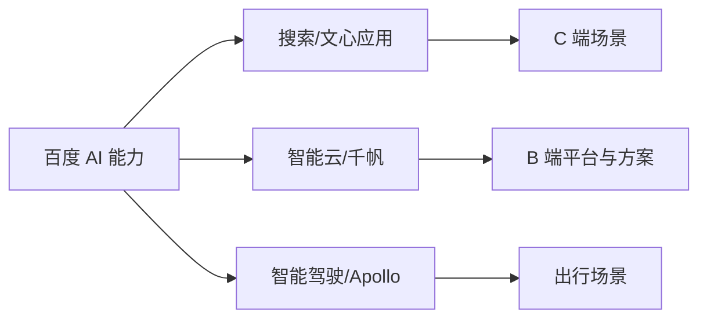

## 百度与美团：AI 产品组织与架构观察

???+ note "信息时效"
    信息截至 2026-08，以官方招聘与最新公开信息为准。

## 百度：公司概况与 AI 战略

百度是国内最早公开 **「All in AI」** 的大厂之一，AI 布局横跨模型、云与智能驾驶：

-   **文心大模型**：2023 年 3 月率先公开发布文心一言（对话产品），C 端产品经历文心一言 → 文小言（2024 年）→ 文心 App（2025 年 11 月 5.0 版起）多次更名，是国内发布最早的对话式大模型产品之一（[财中社](https://finance.eastmoney.com/a/202511203569923022.html)、[界面新闻](https://m.jiemian.com/article/13679643.html)）
-   **智能云**：千帆等平台向企业提供模型 API 与 AI 开发能力
-   **搜索 AI 化**：搜索是百度的基本盘，AI 生成式回答已公开进入搜索结果
-   **智能驾驶**：Apollo 与萝卜快跑（自动驾驶出行服务）是长期投入方向

### 百度：AI 相关组织架构与产品线

百度的 AI 业务分散在**搜索、智能云、智能驾驶**三大板块：

核心关系是：百度以统一 AI 能力支撑搜索、云和智能驾驶三条产品线，岗位选择取决于目标场景与客户类型。

-   搜索：文心 App（原文心一言/文小言）、百度 App 内 AI 功能，离 C 端用户最近
-   智能云：千帆模型平台、行业解决方案，面向 B 端
-   智能驾驶：Apollo/萝卜快跑团队，与产品经理关系相对独立

代表性产品线：文心 App（C 端对话，原文心一言/文小言）、千帆（B 端平台）、萝卜快跑（自动驾驶出行）。

### 百度：AI 产品经理岗位分布与求职观察

-   **岗位分布**：智能云千帆平台产品岗、搜索/百度 App 的 AI 产品岗、智能驾驶相关产品岗
-   **求职特点**：官网招聘为主；流程含在线测评/笔试，部分岗位考察逻辑与算法基础；面试重视逻辑严谨度与搜索/知识类产品的理解
-   **可泛化经验**：百度面试常考信息检索与知识类产品的认知，可用 [RAG](../../ai/rag.md) 等概念组织回答框架

## 美团：公司概况与 AI 战略

美团的业务以**本地生活（到店、到家）**为核心，AI 战略强调**场景落地与降本增效**：

-   **自研 + 引入**：公开报道显示美团组建自研大模型团队，同时结合外部模型能力做场景落地
-   **业务场景 AI 化**：AI 能力主要服务于 App 内智能助手、客服、商家经营工具、配送调度等具体场景
-   **长期投入**：无人机配送、自动配送车是持续公开投入的方向

### 美团：AI 相关组织架构与产品线

美团组织以**业务线主导**著称，AI 也呈现平台能力 + 业务线落地的形态：

-   **平台 AI 团队**：负责大模型能力建设与公共 AI 基础设施
-   **各业务线 AI 团队**：到店、到家、配送等业务内的 AI 产品与算法团队

代表性产品线：App 内智能助手/客服、商家 AI 经营工具、自动配送。

### 美团：AI 产品经理岗位分布与求职观察

-   **岗位分布**：各业务线内嵌 AI 产品岗、平台 AI 团队产品岗
-   **求职特点**：流程以业务面为主，节奏视部门而定；面试极看重**落地与成本意识**：本地生活毛利薄，AI 功能带来的成本与收益是高频问题
-   **可泛化经验**：面试前算清楚一个 AI 功能的 token 成本、节省的人力、带来的转化，这种成本账在美团系面试中是显著加分项

## 相关阅读

-   [华为](huawei.md)：同为「场景落地 + 平台能力」路线的对比
-   [大模型创业公司](ai-startups.md)：创业公司与大厂的岗位差异
-   [AI 产品经理面试](../interviews/interview-guide.md)：题型结构与答题框架
-   [求职专题简介](../index.md)
