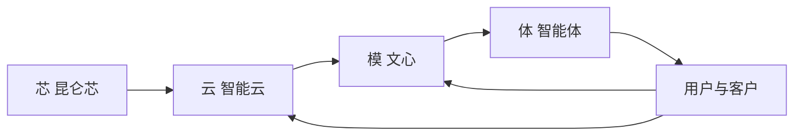
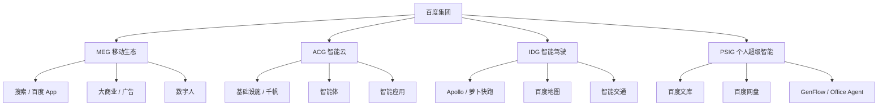
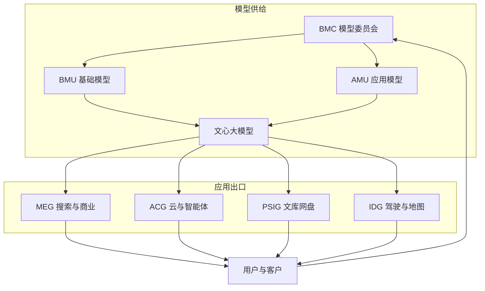
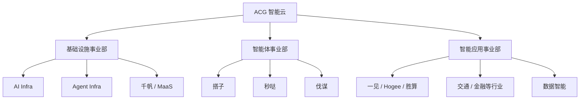
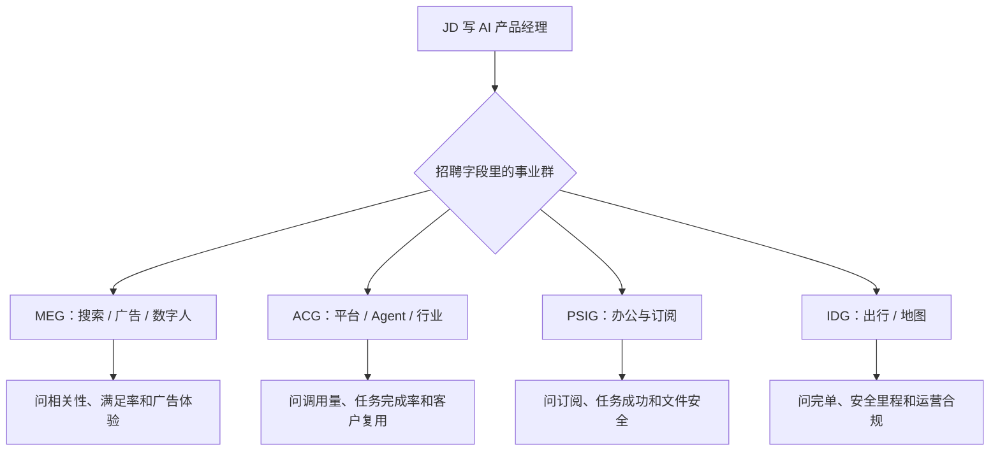

## 百度：AI 产品组织与架构观察

???+ note "信息时效"
    信息截至 2026-09，以官方招聘与最新公开信息为准。

    事业群职责和产品归属会调整，看 JD 时以招聘部门字段为准。

## 公司概况与 AI 战略

百度的业务以**搜索与在线营销**为基本盘，同时覆盖智能云、智能驾驶与 AI 应用。公司较早把 AI 提升为集团主战略，公开叙事从做模型转向做应用与智能体。

AI 方向采取**自研文心 + 云平台分发 + 事业群场景落地**的组合：

-   **文心大模型**：2019 年起持续迭代；2023 年 3 月发布对话产品文心一言，C 端经历文心一言 → 文小言 → 文心 App / 文心助手多次整合。2025 年 11 月文心 5.0 以原生全模态发布，2026 年 5 月再发 5.1 并上线千帆（[人民网](http://finance.people.com.cn/n1/2026/0227/c1004-40671507.html)、[百度校招](https://talent.baidu.com/jobs/campus)）
-   **芯云模体**：2026 年 Create 大会把昆仑芯、智能云、文心与智能体收成一条全栈链路，强调基础设施要为 Agent 重新搭建
-   **搜索与商业 AI 化**：搜索仍是流量与广告基本盘，生成式回答、智能体分发和数字人进入营销链路
-   **智能驾驶**：Apollo 与萝卜快跑是长期投入方向，服务规模已按全球城市与订单披露

2025 年全年营收 1291 亿元；当年四季度 AI 相关收入占比约 43%。李彦宏把 2025 年概括为 AI 成为新核心的一年（[人民网](http://finance.people.com.cn/n1/2026/0227/c1004-40671507.html)）。

芯片、云、模型和智能体按同一条链路配置；用户与客户反馈再回到模型与云平台。

## 集团组织：四大事业群组

2026 年起，公开报道与招聘信息中的经营单元常见为四个事业群组。岗位落点先看事业群，再看产品线。

四个事业群分别经营搜索商业、云与智能体、驾驶与地图、文库网盘。模型研发由委员会统筹，经营单元仍是这四个事业群。

| 事业群 | 全称 | 主责 | 代表产品与单元 | AI 岗位常见方向 |
| --- | --- | --- | --- | --- |
| MEG | Mobile Ecosystem Group | 搜索、百度 App 与商业化 | 搜索、百度 App、大商业、数字人 | 搜索 AI、Feed、广告与数字人营销 |
| ACG | AI Cloud Group | 云、模型服务与企业智能体 | 千帆、搭子、秒哒、伐谋、行业应用 | 云平台、Agent 产品、行业方案 |
| IDG | Intelligent Driving Group | 自动驾驶、地图与智能交通 | 萝卜快跑、Apollo、百度地图 | 出行服务、地图、车路协同 |
| PSIG | Personal Super Intelligence Group | 个人内容与存储的 AI 应用 | 文库、网盘、GenFlow | 办公智能体、订阅与创作工具 |

**MEG**：由搜索公司演化而来，承担百度 App、搜索与在线营销。2026 年 6 月商业部与电商事业部合并为**大商业事业部**，数字人创新业务部升为独立部门（[TechWeb](https://finance.sina.com.cn/tech/roll/2026-06-07/doc-iniapwhs1117010.shtml)）。文库与网盘已划出本群。

**ACG**：百度智能云事业群，由沈抖负责。2026 年 8 月把原平台产品事业部拆开，形成基础设施、智能体、智能应用三个平级事业部（[北京商报](https://www.163.com/dy/article/L5K377RA0519DFFO.html)）。

**IDG**：自动驾驶与智能交通。百度地图自 2022 年起划入本群，与高精地图、出行服务协同（[财新](https://m.caixin.com/m/2022-05-25/101889890.html)）。萝卜快跑是对外公开的 Robotaxi 品牌。

**PSIG**：2026 年 1 月由文库与网盘重组，王颖负责并直接向李彦宏汇报，主打订阅型 AI 应用（[《财经》](https://news.caijingmobile.com/article/detail/562942)）。

## AI 相关组织架构

百度的 AI 组织是**模型集中供给、事业群分场景经营**：

文心由 BMC 统筹，MEG、ACG、PSIG、IDG 各自做成搜索、云、办公和出行产品；使用数据再回到模型侧。

智能云内部再拆一层，让 MaaS、通用 Agent 和行业交付各自对应不同优先级：

基础设施承接成熟的模型托管与分发，智能体事业部追用户与任务完成率，智能应用事业部追行业客户数与方案复用率。

近年与求职直接相关的调整：

-   **2025 年 11 月**：原技术中台群组 TPG 拆为基础模型研发部 BMU、应用模型研发部 AMU
-   **2026 年 1 月**：文库与网盘组成 PSIG，百度进入四个事业群组并行
-   **2026 年 3 月**：公开报道推进大模型与搜索、推荐业务融合
-   **2026 年 5 月**：成立模型委员会 BMC，BMU 与 AMU 向其汇报；Create 大会提出芯云模体与 DAA（日活智能体数）
-   **2026 年 6 月**：MEG 成立大商业事业部；网页端文心一言、文心 App 与文心助手合并为文心助手
-   **2026 年 8 月**：智能云拆出基础设施、智能体、智能应用三个事业部，千帆品牌转入基础设施

百度的 AI 产品经理大多**依托具体事业群场景**工作。纯平台型岗位主要在 ACG 千帆与智能体基础设施；模型评测与平台岗也可能靠近 BMC 体系。看 JD 时先认 MEG / ACG / IDG / PSIG，再认产品名。

## 代表性 AI 产品线

-   **文心助手 / 文心 App**：C 端对话与助手入口；2025 年 12 月文心助手月活约 2.02 亿（[人民网](http://finance.people.com.cn/n1/2026/0227/c1004-40671507.html)）
-   **搜索与百度 App 内 AI**：生成式回答、智能体分发，离广告基本盘最近
-   **千帆**：模型 API、托管与企业开发平台，2026 年 8 月起品牌与 MaaS 产品归基础设施事业部
-   **秒哒、搭子、伐谋**：智能云通用智能体，公开报道中分别偏无代码应用、助手与任务执行
-   **GenFlow / Office Agent**：PSIG 把文库与网盘打通后的办公智能体，可按指令调用文档与办公组件
-   **数字人**：MEG 数字人业务，品牌公开经历慧播星到一镜等调整，服务营销与直播
-   **萝卜快跑**：自动驾驶出行服务。截至 2026 年 8 月，公开披露落地全球 28 座城市、累计订单超 2300 万、自动驾驶里程超 3.5 亿公里（[中青报](https://finance.sina.com.cn/jjxw/2026-08-27/doc-iniptnuz5776631.shtml)）
-   **百度地图**：IDG 内的 C 端入口与高精地图能力，和出行、智能交通共用地理数据

## AI 产品经理岗位分布与团队特点

-   **岗位分布**：MEG（搜索、百度 App、大商业、数字人）、ACG（千帆、智能体、行业应用）、PSIG（文库、网盘、GenFlow）、IDG（萝卜快跑、地图）
-   **团队规模**：搜索与云平台分工细、流程长；PSIG 与智能体事业部 2026 年后迭代更快；IDG 兼有出行运营与硬件协同
-   **协作方式**：与算法一起做检索、生成、智能体编排和评测；MEG 还受广告、内容安全约束，ACG 受客户交付与成本约束，IDG 受牌照与安全运营约束
-   **看 JD 的方法**：先认事业群缩写，再认产品名。ACG 秒哒岗与 MEG 搜索岗都叫 AI 产品经理，服务对象、指标和可调用的数据不同

同一名称在不同事业群对应不同责任：

事业群决定指标，产品名决定场景。两件事同时确认后，再准备案例。

## 求职观察

-   **渠道**：百度招聘官网（[talent.baidu.com](https://talent.baidu.com/)）为主，校招与社招分开；内推在部分团队仍重要
-   **流程**：简历筛选 → 在线测评 / 笔试（部分岗位）→ 业务面 → HR 面；部分岗位会考察逻辑与算法基础
-   **特点**：重视逻辑严谨度和信息检索、知识类产品的理解；平台岗会追问开发者体验与模型成本，搜索岗会追问相关性与满足率
-   **可泛化经验**：用 [RAG](../../ai/rag.md) 和检索质量把搜索、知识库、智能体三件事讲成同一套证据链。策略实习样本见[「实习」百度｜策略产品实习生](../jd-breakdowns/baidu-strategy-product-intern.md)

## 相关阅读

-   [腾讯](tencent.md)、[阿里巴巴](alibaba.md)：同梯队大厂的组织与岗位对比
-   [美团](meituan.md)：业务线主导场景落地、更强调成本账的对照
-   [大模型创业公司](ai-startups.md)：创业公司与大厂的岗位差异
-   [AI 产品经理面试](../interviews/interview-guide.md)：题型结构与答题框架
-   [求职专题简介](../index.md)

## 来源说明

???+ note "来源说明"
    事业群与产品线综合自百度校招、2025 年业绩公开稿，以及 2025-2026 年关于 PSIG、BMC、MEG 与智能云调整的公开报道，正文已就近给出链接。

    智能云三个事业部的拆分来自 2026 年 8 月媒体报道，百度未发完整官方架构图，阅读 JD 时仍以招聘部门字段为准。

    整理日期：2026-09-05。
