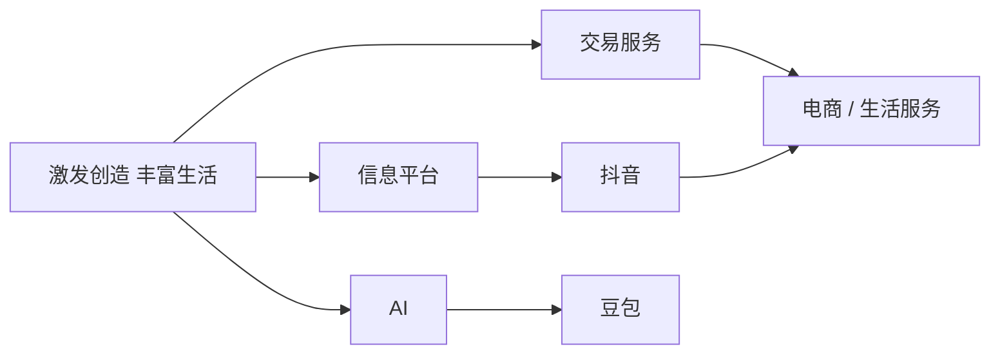
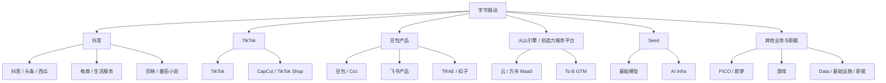
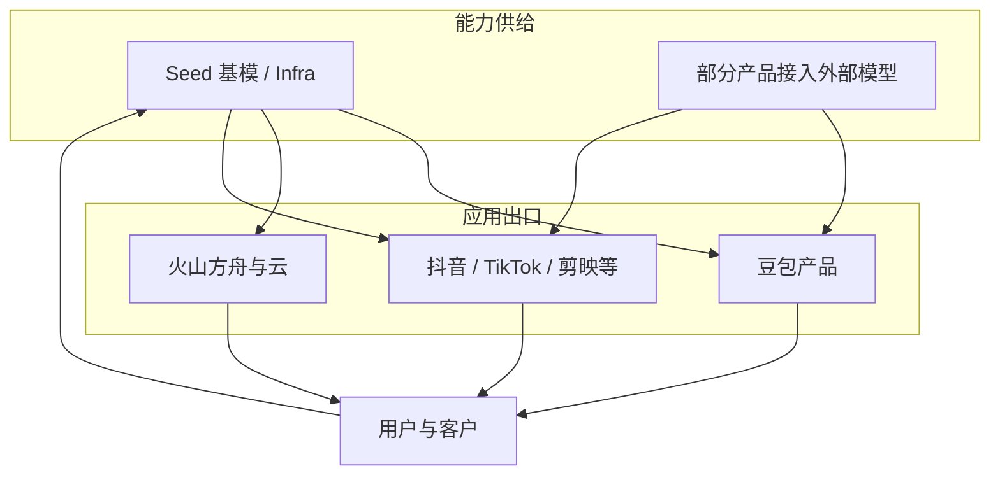

## 字节跳动：AI 产品组织与架构观察

???+ note "信息时效"
    信息截至 2026-09，以官方招聘与最新公开信息为准。

    公司不公布固定的事业群缩写名录。2021 年六大业务单元是最近一次全公司口径的板块宣布；2023 年后 AI 组织与 2026 年 To B 整合来自内部信与公开报道。看 JD 时以招聘部门、产品名和职责字段为准。

## 公司概况与 AI 战略

字节跳动是**抖音、今日头条、TikTok** 等产品的母公司，使命是**激发创造，丰富生活**。官方产品组合覆盖短视频、资讯、办公协作、企业服务、电商与智能硬件，全球员工超过 15 万、办公网络覆盖近 120 座城市（[字节跳动](https://www.bytedance.com/zh/)、[ByteDance About](https://www.bytedance.com/en/)）。

公司按**产品业务单元**经营，招聘字段用产品名定位团队。AI 方向采取**自研基模 + 独立 AI 产品 + 业务线嵌入 + 云出口**的组合：

-   **豆包大模型 / Seed**：2023 年组建 Seed，2024 年公开豆包系列，覆盖文本、图像、视频、语音；对外经火山方舟提供 API（[字节跳动 Seed](https://seed.bytedance.com/zh)、[火山引擎](https://www.volcengine.com/)）
-   **C 端与办公入口**：豆包 App、即梦、扣子、TRAE；2026 年 7 月起飞书产品并入豆包产品团队，办公场景与助手产品同一产品组织
-   **To B 出口**：火山引擎提供云、MaaS 与企业方案；飞书 GTM 并入**创造力服务平台**，统一 MaaS 与 SaaS 的市场、销售和客户服务
-   **业务嵌入**：抖音、TikTok、剪映、番茄小说、PICO 等在各自产品内接入模型，完成推荐、创作、交易与端侧场景

2026 年中全员会把业务战略原则概括为**高度优先，粗主干，优化长期**。核心业务是 **AI、信息平台、交易服务** 三条主干：抖音拉动电商与生活服务，豆包被设定为未来的 AI 主干；大语言模型坚持自研，接受短期落后、优化长期（[澎湃新闻](https://www.thepaper.cn/newsDetail_forward_33730197)）。同年 6 月 FORCE 大会上，梁汝波称攀登 AI 高峰是当下最重要的事，火山引擎 MaaS 正在变成基础业务；截至 2026 年 6 月，豆包大模型日均 Token 调用量突破 180 万亿（[每日经济新闻](https://www.nbd.com.cn/articles/2026-07-30/4526425.html)、[中国基金报](https://www.chnfund.com/article/AR06f805eb-d264-a3ca-81d5-3a2205a8a4e4)）。

信息平台与交易服务以抖音为主干互相拉动；AI 以豆包为入口，经模型、云和办公产品向外输送能力。

## 集团组织：产品业务单元与三条主干

岗位落点先看产品名和业务线，再看它服务 C 端、企业客户还是内部平台。2021 年 11 月梁汝波接任 CEO 时宣布业务线 BU 化，成立抖音、大力教育、飞书、火山引擎、朝夕光年、TikTok 六个板块，负责人均向 CEO 汇报；今日头条、西瓜视频、搜索、百科及国内垂直服务并入抖音（[21 世纪经济报道](https://m.21jingji.com/article/20211102/herald/12b150d9aa2ac14f2c5e8a520973894c.html)、[钛媒体](https://www.tmtpost.com/5831445.html)）。此后教育与游戏板块收缩，Seed 与豆包上升为一级 AI 组织，飞书在 2026 年 7 月拆成产品与 GTM 两条线。

现行公开产品与招聘字段可以收成下面这张图，用来对照 JD 里的产品名和部门字段。

抖音和 TikTok 经营信息与交易；豆包产品经营助手、办公与开发者应用；火山引擎经营云与企业销售；Seed 经营基模。全员会点名的主干是 AI、信息平台与交易服务；PICO、即梦、游戏、数据与基础设施仍出现在产品列表或招聘字段里。

| 业务单元 | 主责 | 代表产品与单元 | AI 岗位常见方向 |
| --- | --- | --- | --- |
| 抖音 | 国内信息平台，并拉动交易服务 | 抖音、今日头条、西瓜视频、搜索、抖音电商、生活服务、剪映、番茄小说 | 推荐与搜索、内容创作、电商与本地生活、短剧与创作者工具 |
| TikTok | 海外短视频与延伸交易 | TikTok、CapCut、TikTok Shop | 搜索、Agent 评测、出海内容与交易 |
| 豆包产品 | C 端助手、办公产品与开发者应用 | 豆包、Cici、飞书产品、TRAE、扣子 | 对话助手、办公 Agent、IDE 与 Bot 平台 |
| 火山引擎 / 创造力服务平台 | 云、模型服务与 To B 销售 | 火山方舟、公有云、企业方案、原飞书 GTM | 模型 API、云产品、定价与解决方案 |
| Seed | 基础模型与研究 | 豆包大模型、Seedance、Seedream、语音与世界模型 | 模型产品、评测、数据与 Infra |
| 其他 | 硬件、创作应用、游戏、数据与职能 | PICO、即梦、游戏、Data、基础设施 | 端侧 AI、图像视频生成、数据语义层、异构计算 |

**抖音**：2021 年起负责国内信息和服务业务的整体发展。公开报道中，抖音电商、生活服务与广告在抖音主干下协同；番茄小说于 2021 年并入抖音事业部，短剧与创作者服务岗位仍出现在招聘页。剪映是国内视频编辑工具，海外对应 CapCut。

**TikTok**：2021 年板块定位为 TikTok 平台，并支持海外电商等延伸业务。招聘页可见搜索产品经理、AI Agent 评测等岗位，服务对象和合规约束与国内抖音不同。

**豆包产品**：2026 年 7 月 30 日内部信宣布，飞书产品团队与豆包产品团队整合为新的豆包产品团队，飞书负责人向豆包负责人汇报；飞书现有产品与服务保持不变，重点在办公生产力场景融合。公开报道称 TRAE、扣子的产品侧靠近豆包，企业版销售走火山引擎（[每日经济新闻](https://www.nbd.com.cn/articles/2026-07-30/4526425.html)、[钛媒体](https://www.tmtpost.com/8088903.html)、[虎嗅](https://www.huxiu.com/article/4886127.html)）。

**火山引擎 / 创造力服务平台**：火山引擎板块自 2021 年起做企业级技术服务云平台。2026 年 7 月，飞书 GTM 与火山引擎整合为 To B GTM 组织**创造力服务平台**（Creativity Service Platform），整体负责 MaaS 和 SaaS 等云服务的市场、销售和客户服务，由火山引擎负责人负责。豆包企业版已在部分飞书客户中内测，接入文档、表格、会议、群聊与企业知识库。

**Seed**：公开报道中为与抖音、TikTok、火山引擎并列的一级部门，直接向 CEO 汇报，负责豆包大模型训练与迭代（[凤凰网科技 / 腾讯新闻](https://news.qq.com/rain/a/20260730A043ER00)）。校招官网单独列出 Seed 团队入口。

**其他**：PICO 在官方产品列表和社招 JD 中仍在。即梦是图片与视频生成产品，公开报道中由独立创作团队经营，看 JD 时认产品名。游戏业务在 2021 年以朝夕光年为一级板块，之后规模收缩，招聘字段仍可能出现游戏相关岗位。Data、基础设施、技术中台出现在 2026-09 的公开 JD 样本中，服务对象是内部业务线或云上的企业客户。

## AI 相关组织架构

字节的 AI 组织是**基模集中供给、产品入口收拢、业务线各自落地**：

Seed 产出模型，豆包产品做成 C 端助手和办公入口，火山引擎做成 API 与企业销售，抖音和 TikTok 把能力嵌进已有流量场景。用户与调用数据再回到模型和评测。

2026 年 7 月的 To B 调整把产品和销售拆开：产品定义归豆包产品团队，客户获取与交付归创造力服务平台。

```mermaid
flowchart LR
    subgraph Product[产品]
        FeishuP[飞书产品]
        DoubaoP[原豆包产品]
        FeishuP --> NewP[豆包产品团队]
        DoubaoP --> NewP
    end
    subgraph GTM[商业]
        FeishuG[飞书 GTM]
        VolcG[火山引擎]
        FeishuG --> CSP[创造力服务平台]
        VolcG --> CSP
    end
    NewP --> Office[办公与助手体验]
    CSP --> Account[企业客户]
    Office --> Account
```

飞书品牌继续面向用户；组织上产品进入豆包，销售进入火山引擎。同一家企业客户可以一次对接办公、云和模型服务。

近年与求职直接相关的调整：

-   **2021 年 11 月**：六大业务单元成型，头条系并入抖音，飞书与火山引擎并列做 To B
-   **2023 年**：组建 Seed，从搜索、AML、AI Lab 等抽调力量做大模型
-   **2024 年**：豆包、即梦、扣子等 AI 应用公开；Seed 与 AI 产品组织在报道中上升为一级部门
-   **2025 年**：吴永辉加入并执掌 Seed；公开报道称 AI Lab 并入 Seed，内部用 Edge / Focus / Base 等虚拟组织减少重复研发（[36 氪](https://www.36kr.com/p/3936334794636420)、[晚点 / 网易](https://www.163.com/dy/article/L4NIALBP0531M1CO.html)）
-   **2026 年 6 月**：FORCE 大会发布豆包 2.1 等模型，MaaS 被定义为公司基础业务
-   **2026 年 7 月 30 日**：飞书产品并入豆包产品团队，飞书 GTM 并入创造力服务平台
-   **2026 年 8 月**：年中全员会确认三条主干；Seed Foundation Model 按公开报道新设 Pretrain Data、Horizon RL、Product Posttrain-Work、Product Posttrain-Chat 四个一级部门，后训练按办公任务与 C 端对话拆分（[澎湃新闻](https://www.thepaper.cn/newsDetail_forward_33730197)、[雷峰网](https://www.leiphone.com/category/industrynews/75DZ3yfWSLnIppDb.html)）

字节的 AI 产品经理大多**嵌入具体产品**工作，离用户和指标近。平台型岗位主要在火山引擎、Seed 周边与 Data / 基础设施。

## 代表性 AI 产品线

-   **豆包 App**：国内规模领先的 C 端 AI 助手；QuestMobile 口径下 2026 年第一季度月活 3.45 亿，6 月月活 3.82 亿；2026 年 6 月上线专业版订阅。详见[豆包拆解](../../practice/case-analysis/doubao.md)
-   **即梦 AI**：图片与视频生成的创作产品，底层接 Seedream、Seedance 等模型
-   **扣子（Coze）**：低代码 Agent / 机器人搭建平台，国内站与全球站数据隔离、可用模型不同，以[官方文档](https://www.coze.com/docs/)为准
-   **TRAE**：AI 原生 IDE，校招与社招均持续放出开发者 AI 产品经理；模型可接豆包与方舟 Coding Plan
-   **飞书 AI / 豆包企业版**：飞书内的文档、会议、多维表格等 AI 能力；企业版把助手嵌进飞书工作流，强调权限、隔离与审计
-   **火山方舟**：豆包系列模型的企业级 API、Agent 开发与行业方案；FORCE 2026 披露方舟服务超过 110 万企业和个人
-   **抖音与剪映内 AI**：推荐、广告、商家创作（如即创）和视频编辑中的生成能力
-   **TikTok 内 AI**：搜索、Agent 评测等岗位出现在社招样本中，面向海外用户与合规环境
-   **PICO**：可穿戴与 XR 上的端侧 AI，招聘页仍有硬件向产品经理
-   **番茄小说 / Story Global**：短剧生产、多语言配音等创作与出海工具，模型边界由内容业务定义

## AI 产品经理岗位分布与团队特点

-   **岗位分布**：豆包产品（助手、飞书、TRAE、扣子）、火山引擎（方舟、云、商业化）、Seed 周边（模型产品与评测）、抖音（推荐、电商、创作、番茄）、TikTok（搜索与 Agent）、PICO、Data 与基础设施
-   **团队规模**：AI 应用普遍小团队、节奏快；抖音、TikTok 等成熟业务线沉淀深，豆包与火山引擎 2024 年后扩得快
-   **协作方式**：与算法、研发共用评测集和 A/B；平台岗还要处理调用量、时延、单位成本和客户交付。Seed 后训练已按 Chat / Work 拆分，C 端对话岗与办公 Agent 岗看的指标不同
-   **看 JD 的方法**：先认产品名，再认业务线。职位标题里的 AI 产品经理，在 TRAE、PICO、番茄小说和火山引擎商业化上的服务对象、指标和可调用模型都不同。公开样本见[选择方向与阅读 JD](../product-manager-types/selection-and-jd.md)

## 求职观察

-   **渠道**：[字节跳动招聘官网](https://jobs.bytedance.com/) 为主，校招入口为 [jobs.bytedance.com/campus](https://jobs.bytedance.com/campus)；Seed 在校招页有独立入口。内推比例高
-   **流程**：简历筛选 → 在线测评 / 笔试（部分岗位）→ 多轮业务面 → HR 面，整体节奏通常较快
-   **特点**：看重数据思维、快速学习与抗压；面试常见「拆解一个 AI 产品」和「用什么指标做取舍」。职级为 1-2 / 2-1 / 2-2 / 3-1 数字字母序列，3-1 起带团队渐多，见[CXO 与职级](../positions/cxo-roles.md)
-   **可泛化经验**：准备一组「指标 → 评测 → 决策」的证据，说明岗位落在豆包产品、火山引擎、Seed 还是抖音 / TikTok，并讲清用户任务、效果门槛和成本约束。题型框架见 [AI 产品经理面试](../interviews/interview-guide.md)

## 相关阅读

-   [阿里巴巴](alibaba.md)、[腾讯](tencent.md)：同梯队大厂的组织与岗位对比
-   [大模型创业公司](ai-startups.md)：创业公司与大厂的岗位差异
-   [「校招」字节跳动｜开发者 AI 产品经理](../jd-breakdowns/bytedance-developer-ai-pm.md)：TRAE / 豆包编程产品岗的 JD 拆解
-   [「校招」字节跳动｜产品经理 - 业务中台](../jd-breakdowns/bytedance-business-platform-pm.md)：地图数据与地理位置中台服务多条产品线的 JD 拆解
-   [豆包拆解](../../practice/case-analysis/doubao.md)：C 端助手的定位、能力与商业化
-   [AI 产品经理面试](../interviews/interview-guide.md)：题型结构与答题框架
-   [求职专题简介](../index.md)

## 来源说明

???+ note "来源说明"
    使命、产品清单与员工规模以 [字节跳动官网](https://www.bytedance.com/zh/) 与 [ByteDance About](https://www.bytedance.com/en/) 为准。招聘入口以 [jobs.bytedance.com](https://jobs.bytedance.com/) 为准。

    2021 年六大业务单元来自当时公开报道的全员邮件。2026 年飞书、豆包、火山引擎整合与年中全员会口径，来自《每日经济新闻》、钛媒体、澎湃新闻等对内部信和会议的报道，正文已就近给出链接。Seed 内部部门调整来自晚点、雷峰网等独家报道，入职前以团队当面说明为准。

    整理日期：2026-09-05。
